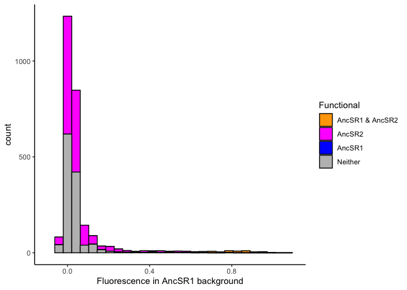
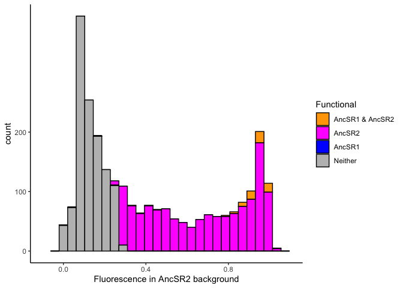
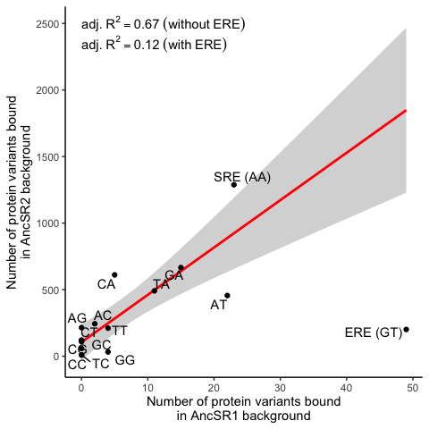

Background substitutions
================
Jaeda Patton
2024-06-18

This notebook analyzes the effect of the 31 background substitutions on
fluorescence, used to produce Figure 7.

### Load data and functions

``` r
# load general functions
source(file.path(basedir, "scripts", "general_functions.R"))
source(file.path(basedir, "scripts", "background_substitutions_functions.R"))

# reading in complete fluorescence data with functional classification
meanF_data <- read.csv(
  file.path(basedir, "results", "classifying_functional_variants", 
            "meanF_data_fxnal.csv.gz")
)

AncSR1WT_ERE_data <- meanF_data %>% 
  filter(bg == "AncSR1", AA_var == "EGKA", RE == "ERE (GT)")
AncSR2WT_SRE_data <- meanF_data %>% 
  filter(bg == "AncSR2", AA_var == "GSKV", RE == "SRE (AA)")
```

## Analysis

We consider a model where the background substitutions have a
nonspecific effect on the affinity of each RH-RE complex. We model a
complex’s fluorescence as proportional to the fraction of protein bound
to DNA. If the affinity of an RH-RE genotype in the AncSR1 background is
$K_d$, then its fluorescence $F_1^*$ can be expressed as

$$
F_1^* = \frac{1}{1 + K_d}
$$

where fluorescence is scaled between 0 and 1. If the background
substitutions modify the affinity of a complex by a factor $\alpha$,
then fluorescence in the AncSR2 background can be expressed as

$$
F_2^* = \frac{1}{1 + \alpha K_d}.
$$

Rearranging to express $F_2^*$ in terms of $F_1^*$ gives

$$
F_2^* = \frac{1}{1 + \alpha \left(\frac{1-F_1^*}{F_1^*}\right)}
$$

We will use orthogonal regression to estimate $\alpha$ from the
fluorescence data. We will fit the model using only complexes whose
fluorescence is significantly greater than that of nonsense variants
(active), and whose fluorescence was estimated from the binned sort
data. We will use the lower and upper bounds of fluorescence inferred
from the RFA models to scale the fluorescence values.

First format and scale the data.

``` r
# get lower and upper bounds for each background inferred from RFA models
load(file.path(basedir, "results", "missing_variants", "AncSR1_UL_fit.rda"))
load(file.path(basedir, "results", "missing_variants", "AncSR2_UL_fit.rda"))
AncSR1_UL <- AncSR1_UL_fit$par[(length(AncSR1_UL_fit$par)-1):length(AncSR1_UL_fit$par)]
AncSR2_UL <- AncSR2_UL_fit$par[(length(AncSR2_UL_fit$par)-1):length(AncSR2_UL_fit$par)]
rm(AncSR1_UL_fit, AncSR2_UL_fit)

# Get training data for model;
# only use RH-RE complexes that are active in either background or both
# and which have fluorescence estimates from the binned sort in both backgrounds.
# Also normalize fluorescence to scale between the lower and upper bound of fluorescence,
# inferred from the RFA models

bgepistasismodeldata <-  meanF_data %>%
  select(bg:avg_meanF, type, meanF_REP1:meanF_REP4, sd_meanF, active, functional) %>%
  pivot_wider(names_from = bg, values_from = avg_meanF:functional) %>%
  filter(active_AncSR1 | active_AncSR2) %>%
  filter(type_AncSR1 == "binned", type_AncSR2 == "binned") %>%
  rowwise() %>%
  mutate(se_meanF_AncSR1 = sd_meanF_AncSR1 / sqrt(sum(!is.na(c_across(c(
    meanF_REP1_AncSR1, meanF_REP2_AncSR1, meanF_REP3_AncSR1, meanF_REP4_AncSR1))))),
         se_meanF_AncSR2 = sd_meanF_AncSR2 / sqrt(sum(!is.na(c_across(c(
           meanF_REP1_AncSR2, meanF_REP2_AncSR2, meanF_REP3_AncSR2, meanF_REP4_AncSR2))))),
    pupper_AncSR1 = t.test(c_across(c(
      meanF_REP1_AncSR1, meanF_REP2_AncSR1, meanF_REP3_AncSR1, meanF_REP4_AncSR1)),
      mu = AncSR1_UL[2], alternative = "less", na.action = na.omit)$p.value,
    pupper_AncSR2 = t.test(c_across(c(
      meanF_REP1_AncSR2, meanF_REP2_AncSR2, meanF_REP3_AncSR2, meanF_REP4_AncSR2)),
      mu = AncSR2_UL[2], alternative = "less", na.action = na.omit)$p.value) %>%
  ungroup() %>%
  mutate(F1_norm = (avg_meanF_AncSR1 - AncSR1_UL[1]) / (AncSR1_UL[2] - AncSR1_UL[1]),
         F2_norm = (avg_meanF_AncSR2 - AncSR2_UL[1]) / (AncSR2_UL[2] - AncSR2_UL[1]),
         se1_norm = se_meanF_AncSR1 / (AncSR1_UL[2] - AncSR1_UL[1]),
         se2_norm = se_meanF_AncSR2 / (AncSR2_UL[2] - AncSR2_UL[1]),
         UB_AncSR1 = p.adjust(pupper_AncSR1, method = "fdr") >= 0.1,
         UB_AncSR2 = p.adjust(pupper_AncSR2, method = "fdr") >= 0.1,
         ERE = RE == "ERE (GT)") %>% 
  select(AA_var, RE, F1_norm, F2_norm, se1_norm, se2_norm, ERE, 
         active_AncSR1, active_AncSR2, UB_AncSR1, UB_AncSR2)
```

Fitting the model. Confidence intervals will be obtained by
bootstrapping the data and refitting the model.

``` r
# fit the nonspecific affinity effect model
bgepistasismodel <- onlsmod(F2_norm ~ 1 / (1 + alpha * (1-F1_norm)/F1_norm),
                            bgepistasismodeldata, start = list(alpha = 1), 
                            domain = c(0, 1))
```

    ## Obtaining starting parameters from ordinary NLS...
    ##   Passed...
    ##  Relative error in the sum of squares is at most `ftol'. 
    ## Optimizing orthogonal NLS...
    ##   Passed... Relative error in the sum of squares is at most `ftol'.

``` r
print(bgepistasismodel)
```

    ## Nonlinear orthogonal regression model
    ##   model: F2_norm ~ 1/(1 + alpha * (1 - F1_norm)/F1_norm)
    ##    data: bgepistasismodeldata
    ##   alpha 
    ## 0.01428 
    ##  vertical residual sum-of-squares: 1756594
    ##  orthogonal residual sum-of-squares: 21.24
    ##  FAILED: Only 2618 out of 2627 fitted points are orthogonal.
    ## 
    ## Number of iterations to convergence: 15 
    ## Achieved convergence tolerance: 1.49e-08

``` r
plot(bgepistasismodel, segments = T, fitted.nls = F)
```

<!-- -->

``` r
# get r^2 of model
cor(bgepistasismodel$y0, bgepistasismodel$resp)^2
```

    ## [1] 0.9502574

``` r
# bootstrapping fits (1000 reps)
if(!file.exists(file.path(results_dir, "allREs_bootstrap.rda"))) {
  # number of variants
  n <- bgepistasismodeldata %>% nrow()
  
  # parallel processing
  cores <- 20
  cl <- parallel::makeCluster(cores, "FORK", outfile = "")
  registerDoParallel(cl)
  
  allREs_bootstrap <- foreach(i = 1:cores, .combine = 'c') %dopar% {
    # data frame to store bootstrapped parameter estimates
    bsvec <- numeric(length = 50)
    
    for(i in 1:50) {
      # sample non-ERE binding variants
      bs <- sample(n, n, replace = T)
      bs_data <- bgepistasismodeldata %>% slice(bs)
      # fit model
      bsvec[i] <- coef(
        onlsmod(F2_norm ~ 1 / (1 + alpha * (1-F1_norm)/F1_norm),
                bs_data, start = list(alpha = 1),
                domain = c(0, 1), verbose = F))
    }
    
    bsvec
  }
  stopCluster(cl)
  save(allREs_bootstrap, 
       file = file.path(results_dir, "allREs_bootstrap.rda"))
} else load(file.path(results_dir, "allREs_bootstrap.rda"))

# get 95% confidence intervals
allREs_95ci <- sort(allREs_bootstrap)[c(25, 976)]

# how many complexes in the dynamic range in AncSR1 are at the upper bound in
# AncSR2, and how many at the lower bound in AncSR1 are in the dynamic range or
# upper bound in AncSR2?
bgepistasismodeldata <- bgepistasismodeldata %>%
  mutate(colors = as.numeric(1*(!active_AncSR1 & active_AncSR2) +
                               2*(active_AncSR1 & !UB_AncSR1 & UB_AncSR2) +
                               3*(UB_AncSR1 & UB_AncSR2)))
bgepistasismodeldata %>%
  filter(active_AncSR1 & !UB_AncSR1) %>%
  count(colors)
```

    ## # A tibble: 2 × 2
    ##   colors     n
    ##    <dbl> <int>
    ## 1      0   277
    ## 2      2    63

``` r
bgepistasismodeldata %>%
  filter(!active_AncSR1) %>%
  count(colors)
```

    ## # A tibble: 1 × 2
    ##   colors     n
    ##    <dbl> <int>
    ## 1      1  2281

``` r
# plot inferred model
bgepistasismodeldata %>%
  arrange(colors) %>%
  ggplot(aes(x = F1_norm)) +
  geom_point(aes(y = F2_norm, color = factor(colors, levels = 3:0)), size = 2) +
  # 95% confidence intervals
  geom_ribbon(data = data.frame(
    x = seq(0, 1, 0.01),
    lower = bgepistasisfn(seq(0, 1, 0.01), allREs_95ci[1]),
    upper = bgepistasisfn(seq(0, 1, 0.01), allREs_95ci[2])),
    aes(x = x, ymin = lower, ymax = upper),
    fill = "black", alpha = 0.5) +
  scale_color_manual(values = c("3" = "orange", "2" = "magenta", 
                                "1" = "blue", "0" = "gray"),
                     labels = c("UB both", "DR AncSR1, UB AncSR2", 
                                "LB AncSR1, DR/UB AncSR2", "other"),
                     name = "") +
  # plot best fit from data
  geom_function(fun = bgepistasisfn,
                args = list(alpha = coef(bgepistasismodel)),
                color = "black", xlim = c(0, 1), linewidth = 1) +
  # plot functional cutoffs
  geom_vline(xintercept = (AncSR1WT_ERE_data$avg_meanF - AncSR1_UL[1]) / 
               (AncSR1_UL[2] - AncSR1_UL[1]),
             color = "gray40", linetype = "dashed", linewidth = 1)  +
  geom_hline(yintercept = (AncSR2WT_SRE_data$avg_meanF - AncSR2_UL[1]) / 
               (AncSR2_UL[2] - AncSR2_UL[1]),
             color = "gray40", linetype = "dashed", linewidth = 1)  +
  labs(x = "Fluorescence in AncSR1 background",
       y = "Fluorescence in AncSR2 background") +
  xlim(-0.1, 1.1) + ylim(-0.1, 1.1) +
  theme(text = element_text(size = fontsize)) +
  theme_classic()
```

<!-- -->

``` r
# fluorescence histograms
bgepistasismodeldata %>%
  mutate(bounds = as.numeric(!active_AncSR1) + as.numeric(2*UB_AncSR1)) %>%
  mutate(bounds = factor(bounds, levels = c(2, 0, 1))) %>%
  ggplot(aes(x = F1_norm, fill = bounds)) +
  geom_histogram(color = "black") +
  scale_fill_manual(values = c("0" = "gray", "1" = "red", "2" = "cyan"),
                    labels = c("DR", "LB", "UB"),
                    name = "") +
  scale_y_continuous(breaks = c(0, 500, 1000)) +
  labs(x = "Fluorescence in AncSR1 background") +
  xlim(-0.1, 1.1) +
  theme(text = element_text(size = fontsize)) +
  theme_classic()
```

<!-- -->

``` r
bgepistasismodeldata %>%
  mutate(bounds = as.numeric(!active_AncSR2) + as.numeric(2*UB_AncSR2)) %>%
  mutate(bounds = factor(bounds, levels = c(2, 0, 1))) %>%
  ggplot(aes(x = F2_norm, fill = bounds)) +
  geom_histogram(color = "black") +
  scale_fill_manual(values = c("0" = "gray", "1" = "red", "2" = "cyan"),
                    labels = c("DR", "LB", "UB"),
                    name = "") +
  scale_y_continuous(breaks = c(0, 100, 200)) +
  labs(x = "Fluorescence in AncSR2 background") +
  xlim(-0.1, 1.1) +
  theme(text = element_text(size = fontsize)) +
  theme_classic()
```

<!-- -->

The model appears to fit the data well.

What is the relationship between the number of functional RH genotypes
per RE in the AncSR1 vs. AncSR2 background?

``` r
# count the number of functional variants on each RE
nboundRE <- meanF_data %>%
  group_by(bg, RE) %>%
  summarize(n = sum(functional)) %>%
  ungroup() %>%
  complete(bg, RE, fill = list(n = 0))

# scatter plot
fxnalREscatterplot <- nboundRE %>%
  pivot_wider(names_from = bg, values_from = n) %>%
  ggplot(aes(x = AncSR1, y = AncSR2)) +
  geom_smooth(method = "lm", color = "red") +
  geom_point() +
  geom_text_repel(aes(label = RE), box.padding = 0.15) +
  labs(x = "Number of protein variants bound in AncSR1 background",
       y = "Number of protein variants bound in AncSR2 background") +
  theme(text = element_text(size = fontsize)) +
  theme_classic()
fxnalREscatterplot
```

<!-- -->

``` r
# fitting linear model to number of protein variants bound per RE in each bg
nfxnalbglm <- nboundRE %>%
  pivot_wider(names_from = bg, values_from = n) %>%
  column_to_rownames("RE") %>%
  lm(formula = AncSR2 ~ AncSR1, data = .)
summary(nfxnalbglm)
```

    ## 
    ## Call:
    ## lm(formula = AncSR2 ~ AncSR1, data = .)
    ## 
    ## Residuals:
    ##     Min      1Q  Median      3Q     Max 
    ## -533.65 -166.61  -67.91   47.86  830.35 
    ## 
    ## Coefficients:
    ##             Estimate Std. Error t value Pr(>|t|)  
    ## (Intercept)  212.606     94.094    2.26   0.0403 *
    ## AncSR1        10.654      6.089    1.75   0.1020  
    ## ---
    ## Signif. codes:  0 '***' 0.001 '**' 0.01 '*' 0.05 '.' 0.1 ' ' 1
    ## 
    ## Residual standard error: 315.3 on 14 degrees of freedom
    ## Multiple R-squared:  0.1794, Adjusted R-squared:  0.1208 
    ## F-statistic: 3.062 on 1 and 14 DF,  p-value: 0.102

``` r
# outlier detection
par(mfrow = c(2,2))
plot(nfxnalbglm)  # ERE is likely an extreme outlier, and SRE a moderate outlier
```

<!-- -->

``` r
cooksD <- cooks.distance(nfxnalbglm)
print(cooksD)
```

    ##           AC           AG           AT           CA           CC           CG 
    ## 4.689931e-05 3.091416e-06 7.078915e-05 4.602748e-02 2.236929e-02 5.792189e-03 
    ##           CT     ERE (GT)           GA           GC           GG     SRE (AA) 
    ## 4.528155e-03 9.220786e+00 4.010238e-02 4.829594e-03 2.022722e-02 6.661126e-01 
    ##           TA           TC           TG           TT 
    ## 9.706814e-03 2.215010e-02 1.289806e-02 7.938698e-04

``` r
outliers <- cooksD[cooksD > (3 * mean(cooksD, na.rm = TRUE))]
print(outliers)
```

    ## ERE (GT) 
    ## 9.220786

``` r
# refit model with outlier removed
nfxnalbglmnooutliers <- nboundRE %>%
  pivot_wider(names_from = bg, values_from = n) %>%
  filter(!RE %in% names(outliers)) %>%
  column_to_rownames("RE") %>%
  lm(formula = AncSR2 ~ AncSR1, data = .)
summary(nfxnalbglmnooutliers)
```

    ## 
    ## Call:
    ## lm(formula = AncSR2 ~ AncSR1, data = .)
    ## 
    ## Residuals:
    ##     Min      1Q  Median      3Q     Max 
    ## -431.77  -71.37    3.63   47.34  364.67 
    ## 
    ## Coefficients:
    ##             Estimate Std. Error t value Pr(>|t|)    
    ## (Intercept)  105.369     63.489    1.66 0.120905    
    ## AncSR1        35.564      6.525    5.45 0.000111 ***
    ## ---
    ## Signif. codes:  0 '***' 0.001 '**' 0.01 '*' 0.05 '.' 0.1 ' ' 1
    ## 
    ## Residual standard error: 198.7 on 13 degrees of freedom
    ## Multiple R-squared:  0.6956, Adjusted R-squared:  0.6722 
    ## F-statistic:  29.7 on 1 and 13 DF,  p-value: 0.0001112

``` r
# prediction interval
nfxnalbgprednooutliers <- predict(
  nfxnalbglmnooutliers, pivot_wider(nboundRE, names_from = bg, values_from = n),
  interval = "prediction")
nfxnalbgprednooutliers <- cbind(
  nfxnalbgprednooutliers, AncSR1 = nboundRE %>% filter(bg == "AncSR1") %>% pull(n))

# replot, show linear fit with outlier removed
nboundRE %>%
  pivot_wider(names_from = bg, values_from = n) %>%
  ggplot(aes(x = AncSR1)) +
  geom_smooth(data = . %>% filter(!RE %in% names(outliers)),
              aes(y = AncSR2),
              method = "lm", color = "red", fullrange = TRUE, se = TRUE) +
  geom_point(aes(y = AncSR2)) +
  geom_text_repel(aes(y = AncSR2, label = RE), box.padding = 0.15) +
  annotate(geom = "text", x = 0, y = 2500, label = paste(
    "adj.~R ^ 2 ==", round(summary(nfxnalbglmnooutliers)$adj.r.squared, 2),
    "~(without~ERE)"),
    parse = TRUE, hjust = 0) +
  annotate(geom = "text", x = 0, y = 2350, label = paste(
    "adj.~R ^ 2 ==", round(summary(nfxnalbglm)$adj.r.squared, 2),
    "~(with~ERE)"),
    parse = TRUE, hjust = 0) +
  labs(x = "Number of protein variants bound\nin AncSR1 background",
       y = "Number of protein variants bound\nin AncSR2 background") +
  theme(text = element_text(size = fontsize)) +
  theme_classic()
```

<!-- -->

A linear model fits well for almost all of the REs except for ERE, which
is a clear outlier.

Since there is evidence of a specific negative effect of the background
substitutions on ERE binding, let’s now fit separate background-affinity
models for ERE and non-ERE variants. The ratio of $\alpha$ between these
two models corresponds to the ERE-specific effect of the background
substitutions.

``` r
# fit a model for only non-ERE complexes
bgepistasismodelnonERE <- 
  onlsmod(F2_norm ~ 1 / (1 + alpha * (1-F1_norm)/F1_norm),
          filter(bgepistasismodeldata, !ERE), start = list(alpha = 1),
          domain = c(0, 1))
```

    ## Obtaining starting parameters from ordinary NLS...
    ##   Passed...
    ##  Relative error in the sum of squares is at most `ftol'. 
    ## Optimizing orthogonal NLS...
    ##   Passed... Relative error in the sum of squares is at most `ftol'.

``` r
print(bgepistasismodelnonERE)
```

    ## Nonlinear orthogonal regression model
    ##   model: F2_norm ~ 1/(1 + alpha * (1 - F1_norm)/F1_norm)
    ##    data: filter(bgepistasismodeldata, !ERE)
    ##   alpha 
    ## 0.01011 
    ##  vertical residual sum-of-squares: 3200764
    ##  orthogonal residual sum-of-squares: 8.625
    ##  FAILED: Only 2485 out of 2491 fitted points are orthogonal.
    ## 
    ## Number of iterations to convergence: 22 
    ## Achieved convergence tolerance: 1.49e-08

``` r
plot(bgepistasismodelnonERE, segments = F, fitted.nls = F)
```

<!-- -->

``` r
cor(bgepistasismodelnonERE$y0, bgepistasismodelnonERE$resp)^2
```

    ## [1] 0.9806436

``` r
# fit a model for only ERE complexes
bgepistasismodelERE <- 
  onlsmod(F2_norm ~ 1 / (1 + alpha * (1-F1_norm)/F1_norm),
          filter(bgepistasismodeldata, ERE), start = list(alpha = 1), 
          domain = c(0, 1))
```

    ## Obtaining starting parameters from ordinary NLS...
    ##   Passed...
    ##  Relative error in the sum of squares is at most `ftol'. 
    ## Optimizing orthogonal NLS...
    ##   Passed... Relative error in the sum of squares is at most `ftol'.

``` r
print(bgepistasismodelERE)
```

    ## Nonlinear orthogonal regression model
    ##   model: F2_norm ~ 1/(1 + alpha * (1 - F1_norm)/F1_norm)
    ##    data: filter(bgepistasismodeldata, ERE)
    ##  alpha 
    ## 0.4328 
    ##  vertical residual sum-of-squares: 31.43
    ##  orthogonal residual sum-of-squares: 5.639
    ##  PASSED: 136 out of 136 fitted points are orthogonal.
    ## 
    ## Number of iterations to convergence: 10 
    ## Achieved convergence tolerance: 1.49e-08

``` r
plot(bgepistasismodelERE, segments = F, fitted.nls = F)
```

<!-- -->

``` r
cor(bgepistasismodelERE$y0, bgepistasismodelERE$resp)^2
```

    ## [1] 0.8593386

``` r
# r^2 for both datasets combined
cor(c(bgepistasismodelnonERE$y0, bgepistasismodelERE$y0),
    c(bgepistasismodelnonERE$resp, bgepistasismodelERE$resp))^2
```

    ## [1] 0.9748151

``` r
# bootstrapping fits (1000 reps)
if(!file.exists(file.path(results_dir, "nonERE_ERE_bootstrap.rda"))) {
  # number of ERE/non-ERE binding variants
  n_nonERE <- bgepistasismodeldata %>% filter(!ERE) %>% nrow()
  n_ERE <- bgepistasismodeldata %>% filter(ERE) %>% nrow()
  
  # parallel processing
  cores <- 20
  cl <- parallel::makeCluster(cores, "FORK", outfile = "")
  registerDoParallel(cl)
  
  nonERE_ERE_bootstrap <- foreach(i = 1:cores, .combine = 'rbind') %dopar% {
    # data frame to store bootstrapped parameter estimates
    bsdf <- data.frame(nonEREalpha = rep(0, 50), EREalpha = rep(0, 50))
    
    for(i in 1:50) {
      # sample non-ERE binding variants
      bs_nonERE <- sample(n_nonERE, n_nonERE, replace = T)
      bs_nonERE_data <- bgepistasismodeldata %>% filter(!ERE) %>% slice(bs_nonERE)
      # fit model
      bsdf[i,1] <- coef(
        onlsmod(F2_norm ~ 1 / (1 + alpha * (1-F1_norm)/F1_norm),
                bs_nonERE_data, start = list(alpha = 1),
                domain = c(0, 1), verbose = F))
      
      # sample ERE-binding variants
      bs_ERE <- sample(n_ERE, n_ERE, replace = T)
      bs_ERE_data <- bgepistasismodeldata %>% filter(ERE) %>% slice(bs_ERE)
      # fit model
      bsdf[i,2] <- coef(
        onlsmod(F2_norm ~ 1 / (1 + alpha * (1-F1_norm)/F1_norm),
                bs_ERE_data, start = list(alpha = 1),
                domain = c(0, 1), verbose = F))
    }
    
    bsdf
  }
  stopCluster(cl)
  save(nonERE_ERE_bootstrap, file = file.path(results_dir, "nonERE_ERE_bootstrap.rda"))
} else load(file.path(results_dir, "nonERE_ERE_bootstrap.rda"))

# get 95% confidence intervals
nonERE_95ci <- nonERE_ERE_bootstrap[order(nonERE_ERE_bootstrap[,1]),1][c(25, 976)]
ERE_95ci <- nonERE_ERE_bootstrap[order(nonERE_ERE_bootstrap[,2]),2][c(25, 976)]

# plot inferred models for ERE and non-ERE variants
bgepistasismodeldata %>%
  arrange(ERE) %>%
  ggplot(aes(x = F1_norm)) +
  geom_point(aes(y = F2_norm, color = ERE), size = 2) +
  geom_ribbon(data = data.frame(
    x = seq(0, 1, 0.01),
    lower = bgepistasisfn(seq(0, 1, 0.01), nonERE_95ci[1]),
    upper = bgepistasisfn(seq(0, 1, 0.01), nonERE_95ci[2])),
    aes(x = x, ymin = lower, ymax = upper),
    fill = "black", alpha = 0.3) +
  geom_ribbon(data = data.frame(
    x = seq(0, 1, 0.01),
    lower = bgepistasisfn(seq(0, 1, 0.01), ERE_95ci[1]),
    upper = bgepistasisfn(seq(0, 1, 0.01), ERE_95ci[2])),
    aes(x = x, ymin = lower, ymax = upper),
    fill = "purple2", alpha = 0.3) +
  scale_color_manual(labels = c("FALSE" = "No", "TRUE" = "Yes"), 
                     values = c("gray", "purple2"), name = "ERE") +
  # best fit function non-ERE
  geom_function(fun = bgepistasisfn,
                args = list(alpha = coef(bgepistasismodelnonERE)),
                color = "black", xlim = c(0, 1), linewidth = 1) +
  # best fit function ERE
  geom_function(fun = bgepistasisfn,
                args = list(alpha = coef(bgepistasismodelERE)),
                color = "purple2", xlim = c(0, 1), linewidth = 1) +
  labs(x = "Fluorescence in AncSR1 background",
       y = "Fluorescence in AncSR2 background") +
  xlim(-0.1, 1.1) + ylim(-0.1, 1.1) +
  theme(text = element_text(size = fontsize)) +
  theme_classic()
```

<!-- -->

Which ERE variants are significantly different from the model prediction
for both the non-ERE-specific and ERE-specific models? Look for variants
for which 2\*SE of measurement is outside of the 95% confidence
intervals of the model.

``` r
# Which ERE variants are significantly outside of the 95% confidence interval 
# of the non-RE-specific model or ERE-specific model?
# Look for variants for which 2*SE of fluorescence in both backgrounds is 
# outside of the bounds of the confidence interval.
bgepistasismodeldataERE <- bgepistasismodeldata %>%
  filter(ERE) %>%
  mutate(allREslower95ciF1 = bgepistasisfninv(F2_norm, allREs_95ci[2]),
         allREsupper95ciF1 = bgepistasisfninv(F2_norm, allREs_95ci[1]),
         allREslower95ciF2 = bgepistasisfn(F1_norm, allREs_95ci[2]),
         allREsupper95ciF2 = bgepistasisfn(F1_norm, allREs_95ci[1]),
         allREssiglower = (F1_norm - 2*se1_norm > allREslower95ciF1) & 
           (F2_norm + 2*se2_norm < allREslower95ciF2),
         allREssighigher = (F1_norm + 2*se1_norm < allREsupper95ciF1) & 
           (F2_norm - 2*se2_norm > allREslower95ciF2),
         ERElower95ciF1 = bgepistasisfninv(F2_norm, ERE_95ci[2]),
         EREupper95ciF1 = bgepistasisfninv(F2_norm, ERE_95ci[1]),
         ERElower95ciF2 = bgepistasisfn(F1_norm, ERE_95ci[2]),
         EREupper95ciF2 = bgepistasisfn(F1_norm, ERE_95ci[1]),
         EREsiglower = (F1_norm - 2*se1_norm > ERElower95ciF1) & 
           (F2_norm + 2*se2_norm < ERElower95ciF2),
         EREsighigher = (F1_norm + 2*se1_norm < EREupper95ciF1) & 
           (F2_norm - 2*se2_norm > EREupper95ciF2))

# What fraction of ERE complexes are significantly below the prediction from the
# non-ERE-specific model?
bgepistasismodeldataERE %>% 
  count(allREssiglower) %>%
  mutate(frac = n / sum(n))
```

    ## # A tibble: 2 × 3
    ##   allREssiglower     n  frac
    ##   <lgl>          <int> <dbl>
    ## 1 FALSE             49 0.360
    ## 2 TRUE              87 0.640

``` r
# What fraction of ERE complexes are significantly different from the ERE-
# specific model prediction?
bgepistasismodeldataERE %>%
  mutate(sig = EREsiglower | EREsighigher) %>%
  count(sig)
```

    ## # A tibble: 2 × 2
    ##   sig       n
    ##   <lgl> <int>
    ## 1 FALSE    65
    ## 2 TRUE     71

``` r
# plot inferred models for ERE and non-ERE variants
bgepistasismodeldata %>%
  left_join(select(bgepistasismodeldataERE, AA_var, RE, EREsiglower, EREsighigher)) %>% 
  replace_na(list(EREsiglower = FALSE, EREsighigher = FALSE)) %>%
  mutate(sig = EREsiglower | EREsighigher) %>%
  arrange(ERE) %>%
  ggplot(aes(x = F1_norm)) +
  geom_point(aes(y = F2_norm, color = ERE, shape = sig), size = 2) +
  # 95% confidence intervals
  geom_ribbon(data = data.frame(
    x = seq(0, 1, 0.01),
    lower = bgepistasisfn(seq(0, 1, 0.01), nonERE_95ci[1]),
    upper = bgepistasisfn(seq(0, 1, 0.01), nonERE_95ci[2])),
    aes(x = x, ymin = lower, ymax = upper),
    fill = "black", alpha = 0.3) +
  geom_ribbon(data = data.frame(
    x = seq(0, 1, 0.01),
    lower = bgepistasisfn(seq(0, 1, 0.01), ERE_95ci[1]),
    upper = bgepistasisfn(seq(0, 1, 0.01), ERE_95ci[2])),
    aes(x = x, ymin = lower, ymax = upper),
    fill = "purple2", alpha = 0.3) +
  scale_color_manual(labels = c("FALSE" = "No", "TRUE" = "Yes"), 
                     values = c("gray", "purple2"), name = "ERE") +
  scale_shape_discrete(labels = c("FALSE" = "No",
                                  "TRUE" = "Yes"),
                       name = "Specific epistasis") +
  geom_function(fun = bgepistasisfn,
                args = list(alpha = coef(bgepistasismodelnonERE)),
                color = "black", xlim = c(0, 1), linewidth = 1) +
  geom_function(fun = bgepistasisfn,
                args = list(alpha = coef(bgepistasismodelERE)),
                color = "purple2", xlim = c(0, 1), linewidth = 1) +
  labs(x = "Fluorescence in AncSR1 background",
       y = "Fluorescence in AncSR2 background") +
  xlim(-0.1, 1.1) + ylim(-0.1, 1.1) +
  theme(text = element_text(size = fontsize)) +
  theme_classic()
```

<!-- -->

``` r
# logo plots of ERE-binders with significantly different than predicted 
# fluorescence in AncSR2 from the ERE-specific model
EREepistasislogo <- list("ERE binders with specific\nnegative interactions\nwith background substitutions" = 
                          bgepistasismodeldataERE %>%
                          filter(EREsiglower) %>%
                          pull(AA_var) %>% as.character(),
                        "ERE binders with specific\npositive interactions\nwith background substitutions" = 
                          bgepistasismodeldataERE %>%
                          filter(EREsighigher) %>%
                          pull(AA_var) %>% as.character()) %>%
  ggseqlogo(method = "probability") +
  xlab("RH site") +
  theme(legend.position = "none")
EREepistasislogo
```

<!-- -->
