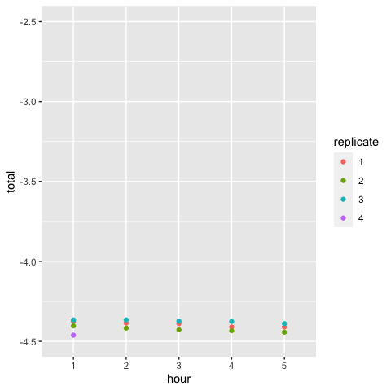

Calculate bin fluorescence
================
Jaeda Patton
12/8/2022

This notebook reads in flow cytometry data from the binned sorting
experiments and calculates the mean fluorescence for each bin, sample,
and replicate, for both libraries and isogenic control samples. It also
calculates the overall mean fluorescence for each sample from flow
cytometry data.

FCS files for each sample (libraries and isogenic strains) were exported
from FACSDiva after sorting. Gates were drawn in FlowJo based on bin
boundary coordinates recorded during sorting. These coordinates were
identical across sorting replicates. In addition to the sort gates, we
included upstream gates selecting for homogenous cell populations,
single cells, and DBD plasmid retention, as shown in the gating plots.
Sort bin populations were then exported as FCS files for analysis here.

## Setup

``` r
require("knitr")
knitr::opts_chunk$set(echo = TRUE)
knitr::opts_chunk$set(fig.width=5, fig.height=5)

# check for packages and install any that are missing
packages <- c("flowCore", "dplyr", "ggplot2")
installed_packages <- packages %in% rownames(installed.packages())
if(any(installed_packages == F)) {
  install.packages(packages[!installed_packages])
}
# load packages
invisible(lapply(packages, library, character.only=TRUE))

# make output directory
if(!dir.exists(file.path("..", "results", "sort_bin_fluorescence"))) {
  dir.create(file.path("..", "results", "sort_bin_fluorescence"))
}
```

## Functions

First, we create a function to extract normalized GFP fluorescence
values from FCS files. GFP fluorescence is recorded in the FITC channel.
We assume FSC-A to be proportional to the area of the cross section of a
cell. We normalize GFP by cell volume by taking
.
The log-10 of this value our measure of fluorescence.

``` r
extract_GFP <- function(fcs_dir, GFPfluor = 'FITC', norm_method = 1.5) {
  
  # extract FCS data
  fcs <- flowCore::read.FCS(fcs_dir)
  data <- flowCore::exprs(fcs)
  
  # extract GFP fluroescence from the FITC-A channel
  GFP <- data[, grepl(GFPfluor, colnames(data)) & grepl('-A', colnames(data))]
  FSC_A <- data[, 'FSC-A']
  
  # remove cells that are at the upper and lower bounds of the FSC-A range
  filter_out <- (FSC_A == 2 ^ 18 - 1) | (GFP <= 0)
  GFP <- GFP[!filter_out]
  FSC_A <- FSC_A[!filter_out]
  
  # normalize by FSC_A^norm_method
  # norm_method=1.5 normalizes GFP to cell volume (default)
  # norm_method=1 normalizes GFP to cell surface area
  norm_GFP <- log(GFP / FSC_A^norm_method, 10)
  
  return(norm_GFP)
}
```

## Calculating mean fluorescence

For each replicate, we calculate the mean fluorescence for each sort bin
and sample, as well as the mean fluorescence across all sort bins for
each sample. These are written to a file.

``` r
fcs_files <- list()  # to store file names for each replicate

for(i in 1:4) {  # for each sorting replicate
  #list fcs files
  dir <- paste0(file.path("..", "data", "flow_cytometry", "binned_sort_rep"), i)
  fcs_files[[i]] <- list.files(dir, full.names = TRUE)
  
  # sample names
  names(fcs_files[[i]]) <- gsub(dir, "", fcs_files[[i]])
  names(fcs_files[[i]]) <- gsub("[/\\\\]export_Sample_", "", 
                                names(fcs_files[[i]]))
  names(fcs_files[[i]]) <- gsub("_[[:digit:]]+", "", 
                                names(fcs_files[[i]]))
  names(fcs_files[[i]]) <- gsub("\\.fcs", "", 
                                names(fcs_files[[i]]))
}

# calculate mean fluorescence for each sample, bin, and replicate
meanF <- list()
for(i in 1:4) {
  
  # sample names
  samples <- sapply(names(fcs_files[[i]]), strsplit, "_bin ")
  samples <- sapply(samples, `[`, 1)
  samples <- unique(samples)
  
  # create data frame to store values
  meanF[[i]] <- data.frame(sample = samples,
                           bin1 = NA,
                           bin2 = NA,
                           bin3 = NA,
                           bin4 = NA, 
                           total = NA)
  
  # calculate meanF from each fcs file
  for(j in 1:length(fcs_files[[i]])) {
    
    # extract sample name and bin for fcs file
    sample_bin <- unlist(strsplit(names(fcs_files[[i]])[j], "_bin "))
    
    # extract normalized GFP values
    GFP <- extract_GFP(fcs_files[[i]][j])
    
    # concatenate GFP values for current sample
    if(sample_bin[2] == "1") GFP_total <- GFP
    else GFP_total <- c(GFP_total, GFP)
    
    # add mean bin GFP to data frame
    meanF[[i]][meanF[[i]]$sample == sample_bin[1], 
               paste0("bin", sample_bin[2])] <- mean(GFP)
    
    # add mean GFP across bins to data frame
    if(sample_bin[2] == 4) meanF[[i]][meanF[[i]]$sample == sample_bin[1], 
                                      "total"] <- mean(GFP_total)
  }
}

# create data frame from list with column for replicate
meanF <- bind_rows(meanF, .id = "replicate")


# write results to a table
write.table(meanF, file.path("..", "results", "sort_bin_fluorescence", 
                             "binned_sort_FACS_fluorescence.txt"), 
            sep='\t', row.names = FALSE)
```

## QC checks

Let’s plot the mean library fluorescence over the course of the sorting
experiment to check for fluorescence drift.

``` r
full_lib_meanF <- meanF %>% filter(grepl("full_lib", sample))
full_lib_meanF <- full_lib_meanF %>% 
  mutate(hour = sub("full_lib_hr", "", sample))

# use GFP-null and GFP-saturated isogenic strains to bound the y-axis of the plot
null_meanF <- meanF %>% filter(grepl("null", sample)) %>% pull(total)
sat_meanF <- meanF %>% filter(grepl("sat", sample)) %>% pull(total) %>% mean()

ggplot(full_lib_meanF, aes(x = hour, y = total, color = replicate)) + 
  geom_point() +
  ylim(null_meanF, sat_meanF)
```

<!-- -->

Looks like library fluorescence decreased slightly over the course of
sorting, but very little compared to the dynamic range.
