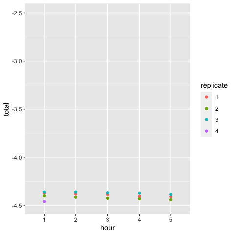

Calculate bin fluorescence
================
Jaeda Patton
12/8/2022

This notebook reads in flow cytometry data from the binned sort
experiments and calculates the mean fluorescence for each bin, sample,
and replicate, for both libraries and spiked in isogenic control
strains. These values are then used to calculate the mean fluorescence
per complex from the binned sort sequencing data (see Methods, Mean
fluorescence estimation).

FCS files for each sample (libraries and isogenic strains) were exported
from FACSDiva after sorting. Gates were drawn in FlowJo based on bin
boundary coordinates recorded during sorting. These coordinates were
identical across sorting replicates. In addition to the sort gates, we
included upstream gates selecting for homogenous cell populations,
single cells, and DBD plasmid retention, as shown in the gating plots.
Sort bin populations were exported as FCS files for analysis.

    ## Warning: package 'flowCore' was built under R version 4.2.1

## Functions

Reading in functions for extracting flow cytometry data from FCS files
and normalizing GFP fluorescence to cell volume. We assume that for each
cell, forward scatter area (FSC-A) is proportional to the area of the
cell’s cross-section. Since $V \propto A^{1.5}$, we normalize GFP to
cell volume by taking $\textrm{GFP} / \textrm{FSC-A}^{1.5}$. We then
take the $\log_{10}$ of this value to be a cell’s fluorescence.

``` r
source(file.path(basedir, "scripts", "FACS_functions.R"))
```

## Calculating mean fluorescence

For each binned sort replicate, we calculate the mean fluorescence for
each sort bin and sample, as well as the mean fluorescence across all
sort bins for each sample. These are written to a file.

``` r
fcs_files <- list()  # to store file names for each replicate

for(i in 1:4) {  # for each sorting replicate
  #list fcs files
  dir <- paste0(file.path(basedir, "data", "flow_cytometry", "binned_sort_rep"), i)
  fcs_files[[i]] <- list.files(dir, full.names = TRUE, pattern = ".+fcs$")
  
  # sample names
  names(fcs_files[[i]]) <- gsub(dir, "", fcs_files[[i]])
  names(fcs_files[[i]]) <- gsub("[/\\\\]export_Sample_", "",  names(fcs_files[[i]]))
  names(fcs_files[[i]]) <- gsub("_[[:digit:]]+", "", names(fcs_files[[i]]))
  names(fcs_files[[i]]) <- gsub("\\.fcs", "", names(fcs_files[[i]]))
}

# calculate mean fluorescence for each sample, bin, and replicate
meanF <- list()
for(i in 1:4) {
  
  # sample names
  samples <- sapply(names(fcs_files[[i]]), strsplit, "_bin ")
  samples <- sapply(samples, `[`, 1)
  samples <- unique(samples)
  
  # create data frame to store values
  meanF[[i]] <- data.frame(sample = samples, 
                           bin1 = NA, bin2 = NA, bin3 = NA, bin4 = NA, 
                           total = NA)
  
  # calculate meanF from each fcs file
  for(j in 1:length(fcs_files[[i]])) {
    
    # extract sample name and bin for fcs file
    sample_bin <- unlist(strsplit(names(fcs_files[[i]])[j], "_bin "))
    
    # extract normalized GFP values
    GFP <- extract_GFP(fcs_files[[i]][j], mCherryfluor = NULL)
    
    # concatenate GFP values for current sample
    if(sample_bin[2] == "1") GFP_total <- GFP
    else GFP_total <- c(GFP_total, GFP)
    
    # add mean bin GFP to data frame
    meanF[[i]][meanF[[i]]$sample == sample_bin[1], 
               paste0("bin", sample_bin[2])] <- mean(GFP)
    
    # add mean GFP across bins to data frame
    if(sample_bin[2] == 4) 
      meanF[[i]][meanF[[i]]$sample == sample_bin[1], "total"] <- mean(GFP_total)
  }
}

# create data frame from list with column for replicate
meanF <- bind_rows(meanF, .id = "replicate")

# write results to a table
write.table(meanF, file.path(basedir, "results", "sort_bin_fluorescence", 
                             "binned_sort_FACS_fluorescence.txt"), 
            sep='\t', row.names = FALSE)
```

## QC checks

Let’s plot the mean library fluorescence over the course of the sorting
experiment to check for fluorescence drift.

``` r
full_lib_meanF <- meanF %>% filter(grepl("full_lib", sample))
full_lib_meanF <- full_lib_meanF %>% 
  mutate(hour = sub("full_lib_hr", "", sample))

# use GFP-null and GFP-saturated isogenic strains to bound the y-axis of the plot
null_meanF <- meanF %>% filter(grepl("null", sample)) %>% pull(total)
sat_meanF <- meanF %>% filter(grepl("sat", sample)) %>% pull(total) %>% mean()

ggplot(full_lib_meanF, aes(x = hour, y = total, color = replicate)) + 
  geom_point() + 
  ylim(null_meanF, sat_meanF)
```

<!-- -->

Looks like library fluorescence decreased slightly over the course of
sorting, but very little compared to the dynamic range.
