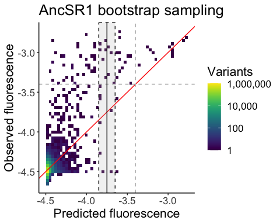
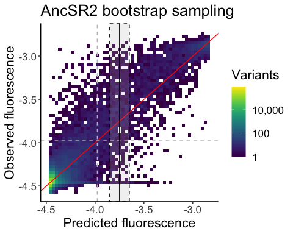
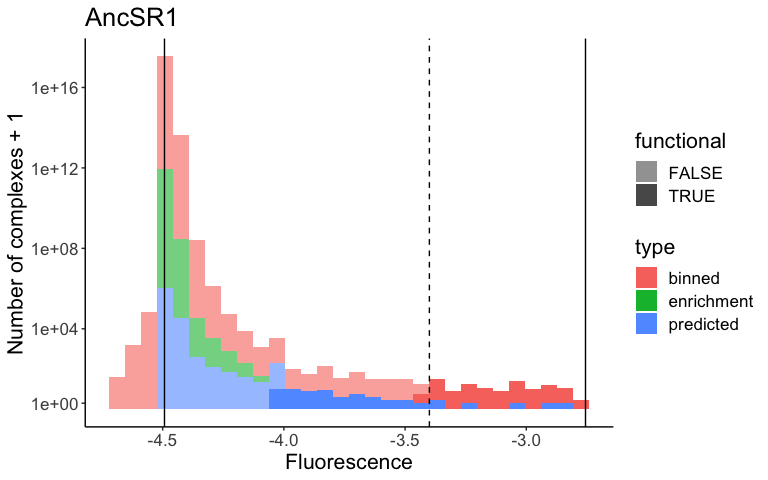
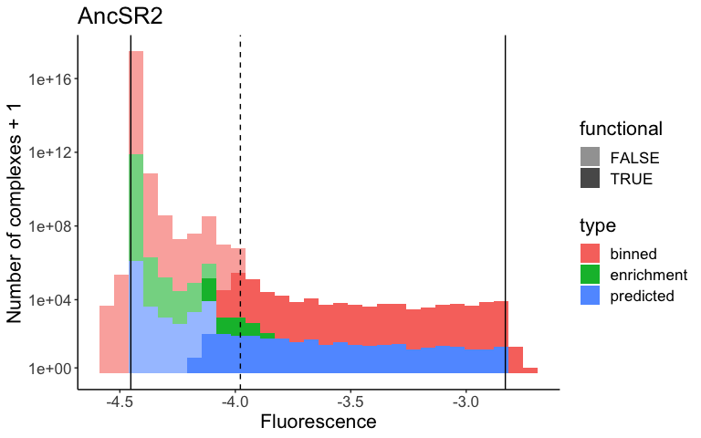
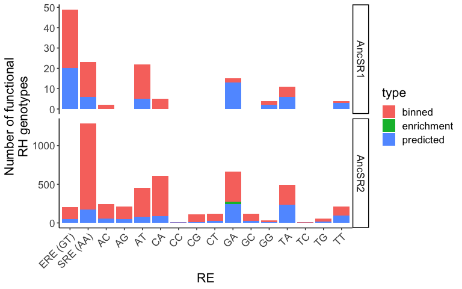

Classifying functional variants
================
Jaeda Patton
2024-06-17

This notebook classifies variants as functional vs. nonfunctional based
on their estimated mean fluorescence and analyzes the distribution of
phenotypes in each ancestral sequence space (AncSR1 and AncSR2). The
mean fluorescence data is generated by the
`mutation_effects_model_fitting.Rmd` notebook, with fluorescence
estimates coming from four sources:

1.  “Binned” variants are those for which we have replicate measurements
    of fluorescence from the second-round (binned) sort experiment
    (`data_cleaning.Rmd`).

2.  “Enrichment” variants are those whose fluorescence is inferred null
    due to being observed at high frequency in the first-round
    (enrichment) sort experiment and absent in the binned sort
    experiment (`data_cleaning.Rmd`).

3.  “Predicted” variants are those which not observed in either the
    binned or enrichment datasets, whose fluorescence is inferred from
    the genetic effects model (`mutation_effects_model_fitting.Rmd`).

4.  GARE variants, whose original fluorescence came from any of the
    three sources above. These original fluorescence values have been
    corrected to account for a general affinity-decreasing effect of the
    GARE background, which is different from that of the other 15
    strains (`mutation_effects_model_fitting.Rmd`). (The CCRE strain has
    yet a different background which likely also has an effect on
    affinity, but we are unable to estimate the size of this effect. The
    unmodified fluorescence values are thus used for this strain.)

## Loading data and functions

``` r
# load general functions
source(file.path(basedir, "scripts", "general_functions.R"))
source(file.path(basedir, "scripts", "onlsmod.R"))

# reading in complete fluorescence data
AncSR1_meanF_data <- read.csv(file.path(basedir, "results", 
                                        "mutation_effects_model",
                                        "AncSR1_complete_data_corrected.csv.gz"), 
                              stringsAsFactors = TRUE)
AncSR2_meanF_data <- read.csv(file.path(basedir, "results", 
                                        "mutation_effects_model",
                                        "AncSR2_complete_data_corrected.csv.gz"), 
                              stringsAsFactors = TRUE)
meanF_data <- bind_rows(AncSR1 = AncSR1_meanF_data, AncSR2 = AncSR2_meanF_data, 
                        .id = "bg") %>%
  mutate(RE = factor(RE, levels = levels(REs[[1]]))) %>%
  arrange(bg, AA_var, RE)
rm(AncSR1_meanF_data, AncSR2_meanF_data)
```

## How many functional variants are there in each ancestral background?

We define “functional” variants as those with fluorescence at least as
high as that of the wild type complex for the respective background
(*i.e.* EGKA:ERE for the AncSR1 background and GKSV:SRE for the AncSR2
background).

``` r
# defining minimum fluorescence cutoffs for functional variants
AncSR1WT_ERE_data <- meanF_data %>% 
  filter(AA_var == "EGKA", bg == "AncSR1", RE == "ERE (GT)")
AncSR2WT_SRE_data <- meanF_data %>% 
  filter(AA_var == "GSKV", bg == "AncSR2", RE == "SRE1 (AA)")
```

To classify variants as functional or nonfunctional, we test whether
their fluorescence is significantly lower than that of the reference
variant. If it is, then variants are classified as nonfunctional;
otherwise they are considered functional.

Since our fluorescence estimates come from different sources (observed
vs. inferred), we use different tests to classify the variants whose
fluorescence is estimated from the binned sort data, the enrichment sort
data, and the mutation effects models:

1.  Enrichment variants are automatically considered nonfunctional
    (except for GARE variants whose original fluorescence estimates were
    from the enrichment sort; these are classified using the method for
    predicted variants described below).

2.  Binned variants are classified using a two sample t-test, with the
    null hypothesis that their fluorescence is greater than or equal to
    that of the reference variant. GARE variants whose fluorescence was
    originally measured in the binned sort experiment are also
    classified this way, but using the corrected mean fluorescence. The
    deviations from the mean observed in the original binned sort
    measurements are taken as the error around the corrected mean.

3.  Predicted variants are classified using a nonparametric bootstrap
    test, with the same null hypothesis as above. This approach takes
    advantage of the fact that we can use the prediction error observed
    during cross-validation of the genetic effects models as an estimate
    of the error associated with each predicted variant’s fluorescence.
    For each variant with predicted fluorescence $F_{\text{test}}$, we
    take the distribution of cross-validation residuals in the interval
    $F_{\text{test}} \pm 0.1$ as an estimate of the prediction error
    distribution for that variant. We then create bootstrap fluorescence
    samples from this distribution and compute the p-value as the
    fraction of the bootstrap sample with fluorescence greater than or
    equal to the reference variant. This is done separately for AncSR1
    vs. AncSR2 variants, since the models were fit separately for each
    protein background and thus have different error distributions.

After computing p-values, we use a false-discovery rate of 0.25 for
multiple testing correction. Since we are testing whether variants are
significantly less fluorescent than the reference variant, this means
that we expect 25% of variants called nonfunctional to actually be
functional (*i.e.* not significantly less fluorescent than the reference
variant). While this may seem like a high FDR rate, this helps us to
control the rate at which variants are erroneously classified as
functional, which is likely to be high for predicted variants. This is
due to the low prediction accuracy of the genetic effects models in the
dynamic range of fluorescence, especially for the AncSR1 dataset (see
below).

``` r
# Compute p-value for calling variants functional that were observed in the 
# binned sort experiment.
#
# H0: Variant is at least as fluorescent as reference variant.
# HA: Variant is less fluorescent than reference variant.
# Use a t-test and FDR-adjusted p-value. Variants with padj < 0.25 are called 
# nonfunctional.

# First, adjust measurement error to be centered around predicted meanF for GA
# predicted variants
meanF_data <- meanF_data %>%
  mutate(orig_meanF = rowMeans(select(., meanF_REP1:meanF_REP4), na.rm = TRUE),
         meanF_REP1 = avg_meanF + (meanF_REP1 - orig_meanF),
         meanF_REP2 = avg_meanF + (meanF_REP2 - orig_meanF),
         meanF_REP3 = avg_meanF + (meanF_REP3 - orig_meanF),
         meanF_REP4 = avg_meanF + (meanF_REP4 - orig_meanF)) %>%
  select(-orig_meanF)

if(!file.exists(file.path(results_dir, "pbinned.rda"))) {
  # parallel processing
  cores <- 2
  cl <- parallel::makeCluster(cores, "FORK", outfile = "")
  registerDoParallel(cl)
  pbinned <- foreach(i = c("AncSR1", "AncSR2"), .combine = 'c') %dopar% {
    ref <- ifelse(i == "AncSR1", AncSR1WT_RE_data, AncSR2WT_SRE_data)
    apply(select(filter(meanF_data, bg == i), meanF_REP1:meanF_REP4), 
          1, function(x)
      t.test(as.numeric(x), 
             as.numeric(select(ref, meanF_REP1:meanF_REP4)),
             "less", na.action = "na.omit")$p.value)
  }
  stopCluster(cl)
  
  save(pbinned, file = file.path(results_dir, "pbinned.rda"))
} else load(file.path(results_dir, "pbinned.rda"))
```

``` r
# For variants with predicted fluorescence from reference-free model, test for
# fluorescence less than the reference with a nonparametric bootstrap test,
# where bootstrapped fluorescence samples are taken from the cross-validation
# error distribution for variants with fluorescence similar to that of the test
# variant. This method helps to account for the non-normal error distributions
# observed for high predicted fluorescence values.
#
# H0: Variant is at least as fluorescent as reference variant.
# HA: Variant is less fluorescent than reference variant.
# Adjust p-value using FDR correction. Variants with padj < 0.1 are called 
# nonfunctional.

# First test AncSR1 predicted variants

# first load the cross-validation fits from the model fitting
load(file.path(basedir, "results", "mutation_effects_model", 
               "AncSR1.cv.pred.fine.rda"))
load(file.path(basedir, "results", "mutation_effects_model", "AncSR1_foldid.rda"))
load(file.path(basedir, "results", "mutation_effects_model", 
               "AncSR1_model_data.rda"))
AncSR1.cv.pred <- lapply(AncSR1.cv.pred.fine, function(x) as.numeric(x[,10]))

AncSR1.cv.obs <- lapply(1:10, function(x) 
  AncSR1_model_data$avg_meanF[AncSR1_foldid == x])

rm(AncSR1.cv.pred.fine, AncSR1_foldid, AncSR1_model_data)

# concatenate fits across all 10 cross-validation folds
AncSR1.cv <- data.frame(pred = unlist(AncSR1.cv.pred, use.names = FALSE),
                        obs = unlist(AncSR1.cv.obs, use.names = FALSE))

# plot concatentated predicted vs. observed fluorescence
ggplot(AncSR1.cv) +
  geom_bin2d(aes(x = pred, y = obs), bins = 50) +
  scale_fill_viridis(trans = "log10", name = "Variants",
                     labels = label_comma()) +
  geom_abline(intercept = 0, slope = 1, color = "red") +
  labs(x = "Predicted fluorescence", y = "Observed fluorescence", 
       title = "AncSR1 bootstrap sampling") +
  geom_hline(yintercept = AncSR1WT_ERE_data$avg_meanF, color = "gray", 
             linetype = "dashed")  +
  geom_vline(xintercept = AncSR1WT_ERE_data$avg_meanF, color = "gray", 
             linetype = "dashed")  +
  geom_rect(data = data.frame(xmin = -3.85, xmax = -3.65, ymin = -Inf, ymax = Inf),
            aes(xmin = xmin, xmax = xmax, ymin = ymin, ymax = ymax),
            fill = "gray", alpha = 0.2, color = "black", linetype = "dashed") +
  geom_vline(xintercept = -3.75, color = "black") +
  theme_classic() +
  theme(text = element_text(size = fontsize))
```

<!-- -->

``` r
# compute residuals
AncSR1.cv$res <- AncSR1.cv$obs - AncSR1.cv$pred

# Bootstrap predicted fluorescence based on CV error distributions. For each
# predicted variant, sample from the distribution of CV residuals concatenated
# across all 10 CV folds, within a range of +/- 0.1 of the predicted
# fluorescence. Sample 250 bootstrap samples per replicate.

if(!file.exists(file.path(results_dir, "bspred.AncSR1.rda"))) {
  # parallel processing
  cores <- 24
  cl <- parallel::makeCluster(cores, "FORK", outfile = "")
  registerDoParallel(cl)
  bspred.AncSR1 <- foreach(i = 1:cores, .combine = 'cbind') %dopar% {
    data <- meanF_data %>% 
      filter((type == "predicted" | (type == "debulk" & RE == "SRE2 (GA)")), 
             bg == "AncSR1")
    
    # split data into chunks
    size <- nrow(data)
    chunksize <- ceiling(size / cores)
    chunk <- data[((i - 1) * chunksize + 1):min(i * chunksize, size),]
    
    # create bootstrap reps
    sapply(chunk$avg_meanF, function(x) {
      # residual distribution centered around meanF of test variant
      res <- AncSR1.cv %>% filter(pred > x - 0.1 & pred < x + 0.1) %>% pull(res)
      # bootstrap
      sample(x + res, 250, replace = TRUE)
    })
  }
  stopCluster(cl)
  colnames(bspred.AncSR1) <- meanF_data %>% 
    filter((type == "predicted" | (type == "debulk" & RE == "SRE2 (GA)")), 
             bg == "AncSR1") %>% 
    select(AA_var, RE) %>%
    unite(AA_var, RE, col = "var") %>% pull(var)
  save(bspred.AncSR1, file = file.path(results_dir, "bspred.AncSR1.rda"))
} else load(file.path(results_dir, "bspred.AncSR1.rda"))

# Compute p-value for functional variants as fraction of bootstrap replicates
# that are greater than or equal to that of the mean AncSR2:SRE1 WT variant.
if(!file.exists(file.path(results_dir, "ppredicted.AncSR1.rda"))) {
  ppredicted.AncSR1 <- apply(bspred.AncSR1, 2, function(x) 
    sum(x >= AncSR1WT_ERE_data$avg_meanF) / 250)
  save(ppredicted.AncSR1, file = file.path(results_dir, "ppredicted.AncSR1.rda"))
} else load(file.path(results_dir, "ppredicted.AncSR1.rda"))

rm(bspred.AncSR1)
```

``` r
# Repeat for AncSR2 predicted variants

# first load the cross-validation fits from the model fitting
load(file.path(basedir, "results", "mutation_effects_model", 
               "AncSR2.cv.pred.fine.rda"))
load(file.path(basedir, "results", "mutation_effects_model", "AncSR2_foldid.rda"))
load(file.path(basedir, "results", "mutation_effects_model", 
               "AncSR2_model_data.rda"))
AncSR2.cv.pred <- lapply(AncSR2.cv.pred.fine, function(x) as.numeric(x[,13]))

AncSR2.cv.obs <- lapply(1:10, function(x)
  AncSR2_model_data$avg_meanF[AncSR2_foldid == x])

rm(AncSR2.cv.pred.fine, AncSR2_foldid, AncSR2_model_data)

# concatenate fits across all 10 cross-validation folds
AncSR2.cv <- data.frame(pred = unlist(AncSR2.cv.pred, use.names = FALSE),
                        obs = unlist(AncSR2.cv.obs, use.names = FALSE))

# plot concatentated predicted vs. observed fluorescence
ggplot(AncSR2.cv) +
  geom_bin2d(aes(x = pred, y = obs), bins = 50) +
  scale_fill_viridis(trans = "log10", name = "Variants",
                     labels = label_comma()) +
  geom_abline(intercept = 0, slope = 1, color = "red") +
  labs(x = "Predicted fluorescence", y = "Observed fluorescence", 
       title = "AncSR2 bootstrap sampling") +
  geom_hline(yintercept = AncSR2WT_SRE_data$avg_meanF, color = "gray", 
             linetype = "dashed")  +
  geom_vline(xintercept = AncSR2WT_SRE_data$avg_meanF, color = "gray", 
             linetype = "dashed")  +
  geom_rect(data = data.frame(xmin = -3.85, xmax = -3.65, ymin = -Inf, ymax = Inf),
            aes(xmin = xmin, xmax = xmax, ymin = ymin, ymax = ymax),
            fill = "gray", alpha = 0.2, color = "black", linetype = "dashed") +
  geom_vline(xintercept = -3.75, color = "black") +
  theme_classic() +
  theme(text = element_text(size = fontsize))
```

<!-- -->

``` r
# compute residuals
AncSR2.cv$res <- AncSR2.cv$obs - AncSR2.cv$pred

# Bootstrap predicted fluorescence based on CV error distributions. For each
# predicted variant, sample from the distribution of CV residuals concatenated
# across all 10 CV folds, within a range of +/- 0.1 of the predicted
# fluorescence. Sample 250 bootstrap samples per replicate.

if(!file.exists(file.path(results_dir, "bspred.AncSR2.rda"))) {
  # parallel processing
  cores <- 24
  cl <- parallel::makeCluster(cores, "FORK", outfile = "")
  registerDoParallel(cl)
  bspred.AncSR2 <- foreach(i = 1:cores, .combine = 'cbind') %dopar% {
    data <- meanF_data %>% 
      filter((type == "predicted" | (type == "debulk" & RE == "SRE2 (GA)")), 
             bg == "AncSR2")
    
    # split data into chunks
    size <- nrow(data)
    chunksize <- ceiling(size / cores)
    chunk <- data[((i - 1) * chunksize + 1):min(i * chunksize, size),]
    
    # create bootstrap reps
    sapply(chunk$avg_meanF, function(x) {
      # residual distribution centered around meanF of test variant
      res <- AncSR2.cv %>% filter(pred > x - 0.1 & pred < x + 0.1) %>% pull(res)
      # bootstrap
      sample(x + res, 250, replace = TRUE)
    })
  }
  stopCluster(cl)
  colnames(bspred.AncSR2) <- meanF_data %>% 
    filter((type == "predicted" | (type == "debulk" & RE == "SRE2 (GA)")), 
           bg == "AncSR2") %>% 
    select(AA_var, RE) %>%
    unite(AA_var, RE, col = "var") %>% pull(var)
  save(bspred.AncSR2, file = file.path(results_dir, "bspred.AncSR2.rda"))
} else load(file.path(results_dir, "bspred.AncSR2.rda"))

# Compute p-value for functional variants as fraction of bootstrap replicates
# that are greater than or equal to that of the mean AncSR2:SRE1 WT variant.
if(!file.exists(file.path(results_dir, "ppredicted.AncSR2.rda"))) {
  ppredicted.AncSR2 <- apply(bspred.AncSR2, 2, function(x) 
    sum(x >= AncSR2WT_SRE_data$avg_meanF) / 250)
  save(ppredicted.AncSR2, file = file.path(results_dir, "ppredicted.AncSR2.rda"))
} else load(file.path(results_dir, "ppredicted.AncSR2.rda"))

rm(bspred.AncSR2)
```

``` r
# classify variants as functional if padj >= 0.25 (not significantly less 
# fluorescent than AncSR2:SRE1 WT)
meanF_data <- rbind(meanF_data %>% filter(type == "binned") %>%
                      mutate(p = pbinned),
                    meanF_data %>%
                      filter(type == "predicted" | 
                               (type == "debulk" & RE == "SRE2 (GA)"), 
                             bg == "AncSR1") %>%
                      mutate(p = ppredicted.AncSR1),
                    meanF_data %>%
                      filter(type == "predicted" | 
                               (type == "debulk" & RE == "SRE2 (GA)"), 
                             bg == "AncSR2") %>%
                      mutate(p = ppredicted.AncSR2),
                    meanF_data %>%
                      filter(type == "debulk" & RE != "SRE2 (GA)") %>%
                      mutate(p = 0)) %>%
  mutate(padj = p.adjust(p, "fdr"), functional = padj >= 0.25) %>%
  # rename SRE1 to SRE and SRE2 to GA
  mutate(RE = replace(as.character(RE), RE == "SRE1 (AA)", "SRE (AA)"),
         RE = replace(as.character(RE), RE == "SRE2 (GA)", "GA"),
         RE = factor(RE, levels = levels(REs[[6]]))) %>%
  arrange(bg, AA_var, RE)

# export data
write.csv(meanF_data %>% filter(functional) %>% select(bg:meanF_REP4), 
          file = gzfile(file.path(results_dir, "meanF_data_fxnal.csv.gz"), 
                        compression = 9),
          row.names = FALSE)

# plot histogram of fluorescence colored by functional vs. not functional, as
# as well as source of fluorescence estimate (binned sort, enrichment sort, or 
# predicted)

# get lower and upper bounds for each background inferred from RFA models
load(file.path(basedir, "results", "mutation_effects_model", "AncSR1_UL_fit.rda"))
load(file.path(basedir, "results", "mutation_effects_model", "AncSR2_UL_fit.rda"))
AncSR1_UL <- AncSR1_UL_fit$par[(length(AncSR1_UL_fit$par)-1):length(AncSR1_UL_fit$par)]
AncSR2_UL <- AncSR2_UL_fit$par[(length(AncSR2_UL_fit$par)-1):length(AncSR2_UL_fit$par)]
rm(AncSR1_UL_fit, AncSR2_UL_fit)

meanF_data %>%
  filter(bg == "AncSR1") %>%
  mutate(type = replace(as.character(type), type == "debulk", "enrichment")) %>%
  ggplot(aes(x = avg_meanF, fill = type, alpha = functional)) +
  geom_histogram(position = "stack") +
  scale_y_continuous(trans = log10plus1) +
  scale_alpha_manual(values = c(0.6, 1)) +
  geom_vline(xintercept = AncSR1WT_ERE_data$avg_meanF, 
            linetype = 2) +
  geom_vline(xintercept = AncSR1_UL[1]) +
  geom_vline(xintercept = AncSR1_UL[2]) +
  theme_classic() +
  labs(title = "AncSR1", x = "Fluorescence", y = "Number of complexes + 1") +
  theme(text = element_text(size = fontsize))
```

<!-- -->

``` r
meanF_data %>%
  filter(bg == "AncSR2") %>%
  mutate(type = replace(as.character(type), type == "debulk", "enrichment")) %>%
  ggplot(aes(x = avg_meanF, fill = type, alpha = functional)) +
  geom_histogram(position = "stack") +
  scale_y_continuous(trans = log10plus1) +
  scale_alpha_manual(values = c(0.6, 1)) +
  geom_vline(xintercept = AncSR2WT_SRE_data$avg_meanF, 
             linetype = 2) +
  geom_vline(xintercept = AncSR2_UL[1]) +
  geom_vline(xintercept = AncSR2_UL[2]) +
  theme_classic() +
  labs(title = "AncSR2", x = "Fluorescence", y = "Number of complexes + 1") +
  theme(text = element_text(size = fontsize))
```

<!-- -->

``` r
# How many RH variants for each RE come from each data source 
# (binned, enrichment, or model)?
meanF_data %>%
  filter(functional) %>%
  mutate(type = replace(as.character(type), type == "debulk", "enrichment")) %>%
  group_by(bg, RE) %>%
  count(type) %>%
  mutate(proportion = n / sum(n))
```

    ## # A tibble: 49 × 5
    ## # Groups:   bg, RE [25]
    ##    bg     RE       type          n proportion
    ##    <chr>  <fct>    <chr>     <int>      <dbl>
    ##  1 AncSR1 ERE (GT) binned       29      0.592
    ##  2 AncSR1 ERE (GT) predicted    20      0.408
    ##  3 AncSR1 SRE (AA) binned       17      0.739
    ##  4 AncSR1 SRE (AA) predicted     6      0.261
    ##  5 AncSR1 AC       binned        2      1    
    ##  6 AncSR1 AT       binned       17      0.773
    ##  7 AncSR1 AT       predicted     5      0.227
    ##  8 AncSR1 CA       binned        5      1    
    ##  9 AncSR1 GA       binned        2      0.133
    ## 10 AncSR1 GA       predicted    13      0.867
    ## # ℹ 39 more rows

``` r
meanF_data %>%
  filter(functional) %>%
  mutate(type = replace(as.character(type), type == "debulk", "enrichment")) %>%
  group_by(bg) %>%
  count(type) %>%
  mutate(proportion = n / sum(n))
```

    ## # A tibble: 5 × 4
    ## # Groups:   bg [2]
    ##   bg     type           n proportion
    ##   <chr>  <chr>      <int>      <dbl>
    ## 1 AncSR1 binned        80    0.593  
    ## 2 AncSR1 predicted     55    0.407  
    ## 3 AncSR2 binned      3647    0.754  
    ## 4 AncSR2 enrichment    37    0.00764
    ## 5 AncSR2 predicted   1156    0.239

``` r
# plot fluorescence estimate source by RE for functional variants
meanF_data %>%
  filter(functional) %>%
  mutate(type = replace(as.character(type), type == "debulk", "enrichment")) %>%
  ggplot(aes(x = RE, fill = type)) +
  geom_bar() +
  facet_grid(rows = vars(bg), scales = "free_y") +
  theme_classic() +
  ylab("Number of functional\nRH genotypes") +
  theme(axis.text.x = element_text(angle = 45, vjust = 1, hjust = 1),
        text = element_text(size = fontsize))
```

<!-- -->

The histograms above show the distribution of fluorescence for variants
classified as functional vs. nonfunctional. The vertical dashed line
shows the fluorescence of the reference variant; the solid lines show
the upper and lower bounds of fluorescence inferred from the RFA models.
We can see that in the AncSR1 background, the fluorescence range for
functional “predicted” variants extends much lower than the fluorescence
of the reference variant. This is because the genetic effects model for
the AncSR1 dataset exhibits a negative prediction bias as well as high
error in the range of the reference variant (see cross-validation error
plots, above). This means that AncSR1 variants with predicted
fluorescence down to $\sim-4.0$ cannot be confidently inferred to have
fluorescence significantly lower than that of the reference
($\sim-3.4$), and are classified as functional. Despite this, the
majority of functional variants are binned variants, and the addition of
the predicted variants does not have a qualitative impact on the
distribution of functional variants per RE (except for GA-RE which has
been corrected up; see above bar plots). The fluorescence range for
functional binned and predicted variants in the AncSR2 dataset is more
similar because there is less bias and less prediction error in the
AncSR2 model.
