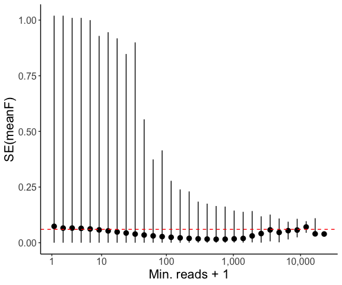
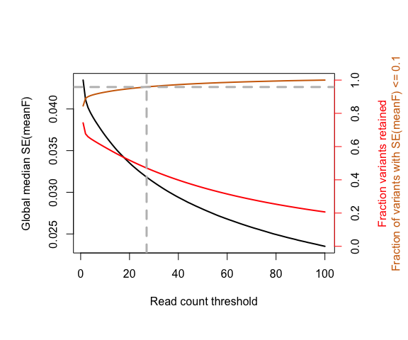
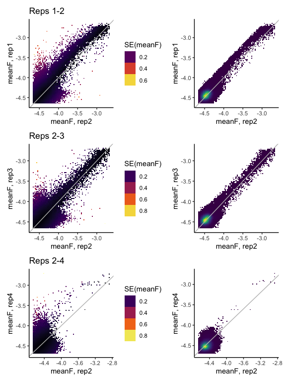
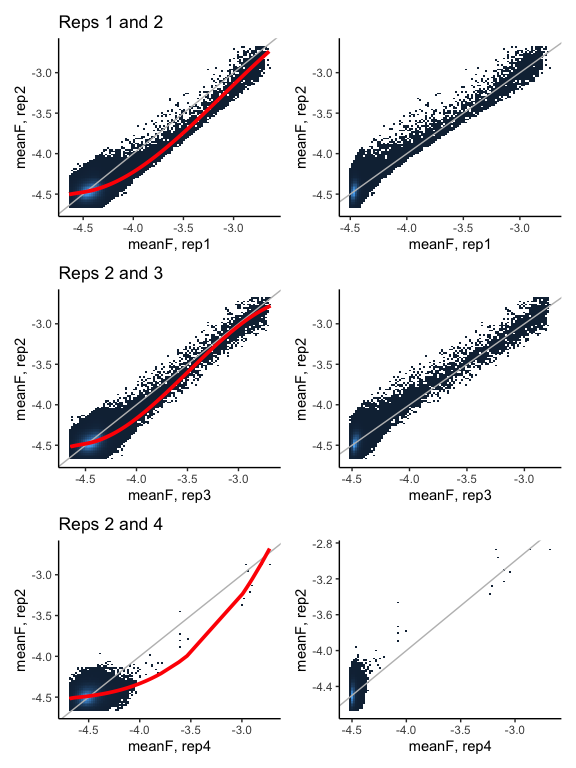
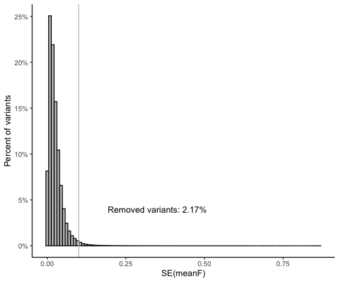
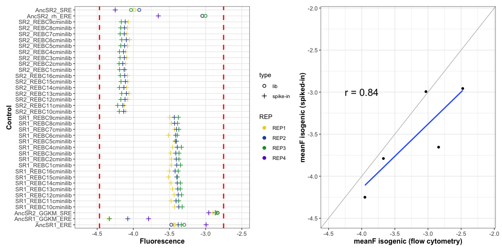
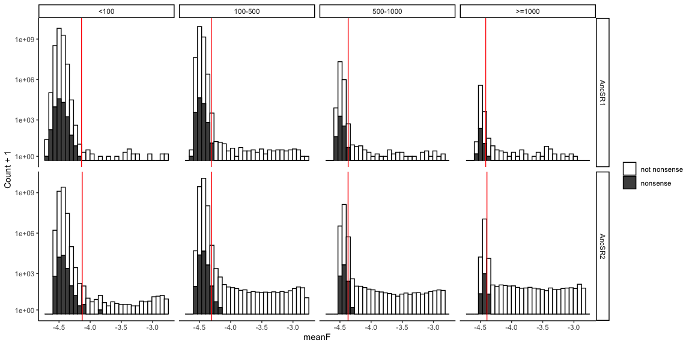
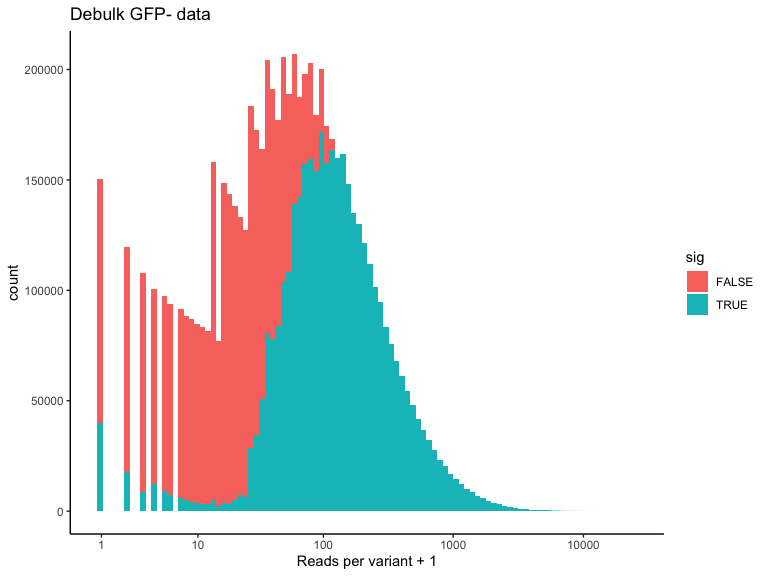

Data cleaning
================
Jaeda Patton and Santiago Herrera
2023-03-14

## Functions

``` r
# make factors with different levels for ordering of REs in plotting
REs <- list()
REs[[1]] <- factor(c("SRE1 (AA)", "SRE2 (GA)", "ERE (GT)", "AC", 
                     "AG", "AT", "CA", "CC", 
                     "CG", "CT", "GC", "GG", 
                     "TA", "TC", "TG", "TT"), 
                   levels=c("ERE (GT)", "SRE1 (AA)", "SRE2 (GA)", "AC", 
                            "AG", "AT", "CA", "CC", 
                            "CG", "CT","GC", "GG", 
                            "TA", "TC", "TG", "TT"))

# convert REBC (RE barcode) to RE variant
REBC_to_RE <- function(REBC, levels=1) {
  if(is.character(REBC)) {
    bc <- str_extract(REBC, "\\d+")
    bc <- as.integer(bc)
  }
  RE <- REs[[levels]][bc]
  return(RE)
}
```

## Reading in data

``` r
if(!file.exists(file.path("..", "data", "meanF", "meanF_data.rda"))) {
  #### TODO: update file paths once we find a permanent place to store the data
  untar(file.path("..", "data", "meanF", "NovaSeq_DMS_datasets.tar.gz"), 
        exdir = file.path("..", "data", "meanF"))
  datafiles <- untar(file.path("..", "data", "meanF", "NovaSeq_DMS_datasets.tar.gz"), list = TRUE)
  meanF_data <- list()
  
  for(i in 1:length(datafiles)) {
    # read mean fluorescence data for variants detected in binned sort experiment
    if(grepl("DMS_meanF", datafiles[i])) {
      rep <- str_extract(datafiles[i], "rep.")
      meanF_data[[rep]] <- read.csv(file.path("..", "data", "meanF", datafiles[i]), 
                                    stringsAsFactors = TRUE)
      # add column for total cell count
      meanF_data[[rep]] <- meanF_data[[rep]] %>%
        mutate(cellCount_total = cellCount_b1 + cellCount_b2 + cellCount_b3 + cellCount_b4)
      # add columns for protein background and RE
      meanF_data[[rep]] <- meanF_data[[rep]] %>%
        separate(REBC, into = c("bg", "RE"), sep = "_", remove = F, extra = "merge") %>%
        mutate(bg = str_replace(factor(bg), "^SR", "AncSR"),
               RE = str_replace(RE, "REBC\\d+", as.character(REBC_to_RE(RE))))
      # sort rows by REBC and AA_var
      #meanF_data[[rep]] <- meanF_data[[rep]] %>% arrange(REBC, AA_var)
    } 
    
    # read in data from debulk sort experiment
    else if(grepl("Debulk", datafiles[i])) {
      debulk_data <- read.csv(file.path("..", "data", "meanF", datafiles[i]), 
                              stringsAsFactors = TRUE)
    }
  }
  
  # unlist meanF data and calculate current SE(meanF) per variant and REBC
  meanF_data <- rbind(meanF_data$rep1, meanF_data$rep2, meanF_data$rep3, meanF_data$rep4) %>% 
    select(AA_var,REBC,bg,RE,REP,meanF,Count_total,cellCount_total,cellCount_b1,cellCount_b2,cellCount_b3,cellCount_b4) %>% 
    # Re-organize the dataframe: each row is a variant-REBC combo
    pivot_wider(names_from = REP, values_from = c(meanF,Count_total,cellCount_total,cellCount_b1,cellCount_b2,cellCount_b3,cellCount_b4)) %>%
    # Add summary statistics per varianr-REBC
    mutate(avg_meanF = rowMeans(.[5:8], na.rm = TRUE), # meanF per var-REBC across replicates
            n_reps = rowSums(!is.na(.[5:8])), # number of replicates in which var-REBC is found
            sd_meanF = rowSds(as.matrix(.[5:8]),na.rm=TRUE),
            se_meanF = sd_meanF / sqrt(n_reps), # standard error of average meanF
            mean_read_count = rowMeans(.[9:12], na.rm = TRUE), # mean read count
            min_read_count = rowMins(as.matrix(.[9:12]),na.rm=TRUE), #minmum read count across reps
            type = ifelse(grepl(paste(c("minilib","SRE","ERE"),collapse = "|"),REBC), "control","exp")) # mark rows as "controls" or "experiments"
    
  # save data files for faster loading
  save(meanF_data, file = file.path("..", "data", "meanF", "meanF_data.rda"))
  save(debulk_data, file = file.path("..", "data", "meanF", "debulk_data.rda"))
} else {
  # load R data frames if already created
  load(file.path("..", "data", "meanF", "meanF_data.rda"))
  load(file.path("..", "data", "meanF", "debulk_data.rda"))
}
```

## Filtering binned sort data

These plots show some general features of the dataset. 1) SE(meanF)
decays with read depth, as expected, because variants with more reads
have more precise estimates of meanF. 2) Variants with a minimum read
count of \~15 have a SE(meanF) \< 0.1, regardless of the number of
replicates.

``` r
# SE(meanF) as a function of minimum read depth per variant
meanF_data %>% filter(!is.na(se_meanF)) %>% filter(.,type != "control") %>%
  ggplot(aes(x=min_read_count,y=se_meanF)) +
  stat_bin2d(bins = 75) +
  theme_bw() + xlim(0,2000) +
  theme(axis.title.x = element_text(size=12,face="bold"), 
        axis.text.x = element_text(size=10),
        axis.text.y = element_text(size = 10),
        axis.title=element_text(size=12,face="bold")) +
  geom_hline(aes(yintercept = mean(se_meanF)),color="red",linetype="dashed") +
  xlab("Min. read count") + ylab("SE(meanF)")
```

    ## Warning: Removed 492 rows containing non-finite values (`stat_bin2d()`).

    ## Warning: Removed 84 rows containing missing values (`geom_tile()`).

<!-- -->

``` r
# Gruop variants by Avg. Min Read Depth (RC) and plot SE(meanF) by n_reps. This shows that variants with a minimum read count of ~15
# have a SE(meanF) < 0.1, regardless of the number of replicates. 
meanF_data %>% filter(!(n_reps==1)) %>% 
  mutate(RC = case_when(min_read_count >= 150 ~ ">150",
                        min_read_count >= 50 & min_read_count < 150 ~ "50-150",
                        min_read_count >= 20 & min_read_count < 50 ~  "20-50",
                        min_read_count >= 10 & min_read_count < 20 ~  "10-20",
                        min_read_count < 10 ~ "<10"),
         Nreps = as_factor(n_reps),
         RC = factor(RC,levels=c("<10", "10-20", "20-50", "50-150",">150"))) %>% 
  ggline(., x = "RC", y = "se_meanF", color = "Nreps",
         add = c("mean_ci",  error.plot = "pointrange"),
         palette = c("#9d3dba","#00AFBB","#E7B800"),title="",xlab="Min Read Depth", ylab="SE (meanF)") +
  geom_hline(yintercept = 0.1,color="gray",linetype="dashed",size=1.5)
```

    ## Warning: Using `size` aesthetic for lines was deprecated in ggplot2 3.4.0.
    ## ℹ Please use `linewidth` instead.
    ## This warning is displayed once every 8 hours.
    ## Call `lifecycle::last_lifecycle_warnings()` to see where this warning was
    ## generated.

<!-- -->

### Filtering data

DMS binned sort data is filtered based on two approaches. First, we
filter out variants with low read count (across replicates) to reduce
the global standard error; second, we correct use an I-spline to correct
the nonlnearity between replicates, and remove variants with high
SE(meanF). These two procedures ensure that we keep variants for which
we have high confidence in their meanF estimates.

``` r
### First strategy: Choose a read count for which we maximize the fraction of retained variants, maximize the 
### fraction of retained variants with SE(meanF) <= 0.1, and minimize the global SE(meanF).

median_se <- median(meanF_data$se_meanF, na.rm = T) # global median SE(meanF)
n_var <- dim(meanF_data)[1] # number of total variants
choose_read_count <- function(r){
  # r: is the read count (rc) threshold 
  median_se_r <- meanF_data %>% filter(min_read_count >= r) %>% with(median(se_meanF,na.rm = T)) # global median SE(meanF) after rc filter
  n_var_r <-  dim(meanF_data %>% filter(min_read_count >= r))[1] # variants retained after rc filtering
  n_var_01_r <- dim(meanF_data %>% filter(min_read_count >= r & se_meanF <= 0.1))[1] # variants eith SE <= 0.1 retained after rc filtering
  p <- n_var_r / n_var # fraction of variants retained
  se <- ((median_se_r-median_se)/median_se)*100 # % change in global SE(meanF)
  var_01 <- n_var_01_r /n_var_r # fraction of retained variants with SE(meanF) <= 0.1
  return(data.frame(p=p,abs_se=median_se_r,se=se,var_01=var_01))
}

# parallel processing:
cores=detectCores()
cl <- parallel::makeCluster(cores[1]-2,"FORK",outfile="")
doParallel::registerDoParallel(cl)
outliers <- foreach(i = seq(0,100,1), .combine = 'rbind') %dopar% choose_read_count(i)
stopCluster(cl)

# print table of results
outliers$r <- seq(0,100,1)
print(outliers)
```

    ##              p     abs_se         se    var_01   r
    ## 1   1.00000000 0.04346306   0.000000 0.6399054   0
    ## 2   1.00000000 0.04346306   0.000000 0.6399054   1
    ## 3   0.69645397 0.04051773  -6.776646 0.8096667   2
    ## 4   0.62205119 0.03937616  -9.403173 0.8600814   3
    ## 5   0.58459301 0.03857669 -11.242582 0.8820466   4
    ## 6   0.55802790 0.03788335 -12.837834 0.8944884   5
    ## 7   0.53597220 0.03722614 -14.349942 0.9031423   6
    ## 8   0.51673928 0.03663046 -15.720483 0.9097150   7
    ## 9   0.49905702 0.03607790 -16.991822 0.9153643   8
    ## 10  0.48288341 0.03556304 -18.176408 0.9201984   9
    ## 11  0.46759258 0.03507155 -19.307221 0.9244357  10
    ## 12  0.45314373 0.03461168 -20.365310 0.9282655  11
    ## 13  0.43957016 0.03417626 -21.367112 0.9317408  12
    ## 14  0.42668097 0.03375031 -22.347151 0.9349430  13
    ## 15  0.41443955 0.03334779 -23.273254 0.9379385  14
    ## 16  0.40306051 0.03297048 -24.141388 0.9405706  15
    ## 17  0.39219625 0.03261102 -24.968435 0.9429355  16
    ## 18  0.38177294 0.03226745 -25.758904 0.9451877  17
    ## 19  0.37175395 0.03193744 -26.518203 0.9472171  18
    ## 20  0.36213239 0.03162069 -27.246980 0.9490946  19
    ## 21  0.35286652 0.03131466 -27.951103 0.9508313  20
    ## 22  0.34407132 0.03102297 -28.622227 0.9525380  21
    ## 23  0.33573387 0.03074312 -29.266090 0.9540568  22
    ## 24  0.32762635 0.03047149 -29.891078 0.9555163  23
    ## 25  0.31981810 0.03021324 -30.485251 0.9568564  24
    ## 26  0.31239856 0.02997930 -31.023489 0.9580850  25
    ## 27  0.30517774 0.02974043 -31.573093 0.9592649  26
    ## 28  0.29814331 0.02950425 -32.116492 0.9603174  27
    ## 29  0.29143157 0.02927718 -32.638948 0.9612626  28
    ## 30  0.28497527 0.02905765 -33.144036 0.9621904  29
    ## 31  0.27875641 0.02885024 -33.621246 0.9630601  30
    ## 32  0.27266841 0.02864849 -34.085440 0.9639449  31
    ## 33  0.26690370 0.02845522 -34.530100 0.9646777  32
    ## 34  0.26120862 0.02826591 -34.965673 0.9653992  33
    ## 35  0.25580171 0.02807736 -35.399501 0.9660583  34
    ## 36  0.25045753 0.02788847 -35.834102 0.9666656  35
    ## 37  0.24524933 0.02770856 -36.248021 0.9672404  36
    ## 38  0.24024494 0.02753697 -36.642829 0.9677599  37
    ## 39  0.23537262 0.02737302 -37.020040 0.9682900  38
    ## 40  0.23067500 0.02720811 -37.399474 0.9687087  39
    ## 41  0.22608544 0.02706031 -37.739525 0.9691396  40
    ## 42  0.22164267 0.02690339 -38.100555 0.9695354  41
    ## 43  0.21734487 0.02675567 -38.440446 0.9698652  42
    ## 44  0.21314313 0.02660864 -38.778724 0.9702287  43
    ## 45  0.20904975 0.02646375 -39.112089 0.9705906  44
    ## 46  0.20509384 0.02631679 -39.450215 0.9709176  45
    ## 47  0.20124119 0.02618004 -39.764851 0.9711782  46
    ## 48  0.19746329 0.02605048 -40.062939 0.9714340  47
    ## 49  0.19378744 0.02592007 -40.362988 0.9717007  48
    ## 50  0.19018483 0.02579979 -40.639736 0.9718796  49
    ## 51  0.18666567 0.02568271 -40.909118 0.9720827  50
    ## 52  0.18321764 0.02555878 -41.194260 0.9722470  51
    ## 53  0.17985967 0.02542883 -41.493240 0.9724064  52
    ## 54  0.17659955 0.02531553 -41.753918 0.9725124  53
    ## 55  0.17338596 0.02519876 -42.022597 0.9726227  54
    ## 56  0.17027413 0.02507916 -42.297756 0.9727146  55
    ## 57  0.16725294 0.02496551 -42.559246 0.9728625  56
    ## 58  0.16427979 0.02485991 -42.802216 0.9729030  57
    ## 59  0.16142579 0.02475253 -43.049285 0.9729744  58
    ## 60  0.15862523 0.02464700 -43.292089 0.9730706  59
    ## 61  0.15586369 0.02454142 -43.534987 0.9731115  60
    ## 62  0.15321142 0.02443761 -43.773848 0.9731006  61
    ## 63  0.15057505 0.02434141 -43.995184 0.9731300  62
    ## 64  0.14802753 0.02423973 -44.229132 0.9731948  63
    ## 65  0.14549231 0.02414922 -44.437374 0.9731981  64
    ## 66  0.14304205 0.02405849 -44.646115 0.9732237  65
    ## 67  0.14065091 0.02396653 -44.857706 0.9731996  66
    ## 68  0.13831201 0.02388038 -45.055910 0.9732108  67
    ## 69  0.13600222 0.02379451 -45.253489 0.9731906  68
    ## 70  0.13375097 0.02370089 -45.468890 0.9731344  69
    ## 71  0.13155914 0.02360813 -45.682326 0.9730747  70
    ## 72  0.12937603 0.02352066 -45.883560 0.9729823  71
    ## 73  0.12728116 0.02343521 -46.080164 0.9729361  72
    ## 74  0.12522291 0.02336258 -46.247283 0.9728413  73
    ## 75  0.12323190 0.02327779 -46.442367 0.9727069  74
    ## 76  0.12125740 0.02319205 -46.639638 0.9726215  75
    ## 77  0.11933813 0.02311189 -46.824073 0.9724905  76
    ## 78  0.11747409 0.02303969 -46.990186 0.9724015  77
    ## 79  0.11560375 0.02295995 -47.173644 0.9722951  78
    ## 80  0.11376703 0.02288542 -47.345127 0.9721803  79
    ## 81  0.11203926 0.02281335 -47.510951 0.9720406  80
    ## 82  0.11032861 0.02274884 -47.659362 0.9719363  81
    ## 83  0.10861195 0.02268013 -47.817467 0.9717830  82
    ## 84  0.10694902 0.02260813 -47.983111 0.9716642  83
    ## 85  0.10528219 0.02253196 -48.158378 0.9715064  84
    ## 86  0.10365018 0.02245490 -48.335674 0.9713473  85
    ## 87  0.10209412 0.02239024 -48.484438 0.9711958  86
    ## 88  0.10053925 0.02232283 -48.639529 0.9710101  87
    ## 89  0.09900690 0.02224865 -48.810210 0.9708221  88
    ## 90  0.09750606 0.02217559 -48.978310 0.9706593  89
    ## 91  0.09602293 0.02210428 -49.142369 0.9704750  90
    ## 92  0.09460314 0.02203827 -49.294251 0.9702889  91
    ## 93  0.09320406 0.02197391 -49.442343 0.9701070  92
    ## 94  0.09181909 0.02189731 -49.618577 0.9699241  93
    ## 95  0.09045753 0.02183440 -49.763317 0.9697634  94
    ## 96  0.08908697 0.02176450 -49.924152 0.9696150  95
    ## 97  0.08774222 0.02170625 -50.058163 0.9693956  96
    ## 98  0.08644789 0.02164595 -50.196902 0.9692221  97
    ## 99  0.08517699 0.02158823 -50.329717 0.9690060  98
    ## 100 0.08393790 0.02153080 -50.461837 0.9687273  99
    ## 101 0.08273152 0.02147868 -50.581773 0.9684781 100

``` r
# plot results: A read count threshold of ~24 ensures that 95% of variants have SE <= 0.1, decreasing the global SE by ~30%, and we still retain a good fraction of variants.
par(mar = c(5, 4, 4, 4) + 1.4)
plot(outliers$r, outliers$abs_se, type="l", col = "black",xlab="Read count threshold",ylab="Global median SE(meanF)",lwd=2)             
par(new = TRUE) 
plot(outliers$r, outliers$p, type="l", col = "red",axes = FALSE, xlab = "", ylab = "",lwd=2)
axis(side = 4, at = pretty(range(c(outliers$p,outliers$var_01))),col="red",col.ticks="red")
mtext("Fraction variants retained", side = 4, line = 3,col="red")
par(new = TRUE)
plot(outliers$r, outliers$var_01, type="l", col = "#cf6b08",axes = FALSE, xlab = "", ylab = "",lwd=2,ylim=range(c(outliers$p,outliers$var_01)))
mtext("Fraction of variants with SE(meanF) <= 0.1", side = 4, line = 4,col="#cf6b08")
abline(v=24,lty=2,col="gray",lwd=3)
```

<!-- -->

After having identified the read threshold, we will perform a second
filter removing variants with SE(meanF) \> 0.1. This is not the final
filter based on standard error, we do this to remove noisy variants and
will help to fit the splines in order to capture the *global*
relationships between replicates (compare the plots in the left column
with those in the right column).

``` r
# Filter variants per replicate based on a read threshold. Then filter out variants by SE(meanF) > 0.1

rc <- 24 # read count threshold

## REP1-2
a <- meanF_data %>% filter(Count_total_REP1 >= rc & Count_total_REP2 >= rc) %>% ggplot(aes(x=meanF_REP2,y=meanF_REP1,z=se_meanF)) +
  stat_summary_2d(bins = 90) + theme_classic() + xlab("meanF, rep2") + ylab("meanF, rep1") +
  geom_abline(slope = 1,intercept = 0,col="gray") + viridis::scale_fill_viridis(option = "B",begin=0,end=1) + 
  guides(fill=guide_legend(title="SE(meanF)")) + ggtitle("Reps 1-2") # points colored by SE(meanF)

# How much data is retained after filtering by standard error
meanF_data %>% filter(Count_total_REP1 >= rc & Count_total_REP2 >= rc) %>% mutate(included = ifelse(se_meanF>0.1,"out","in")) %>% 
  group_by(included) %>% summarise(n=n(),mean_se = mean(se_meanF)) %>% mutate(prop=n/sum(n)) 
```

    ## # A tibble: 2 × 4
    ##   included      n mean_se   prop
    ##   <chr>     <int>   <dbl>  <dbl>
    ## 1 in       924702  0.0331 0.983 
    ## 2 out       16325  0.131  0.0173

``` r
b <- meanF_data %>% filter(Count_total_REP1 >= rc & Count_total_REP2 >= rc) %>% ggplot(aes(x = se_meanF)) + 
  geom_histogram(aes(y=..count../sum(..count..)),bins = 100,color="black",fill="gray") +
  theme_classic() + xlab("SE(meanF)") + ylab("Percent of variants") +
  geom_vline(xintercept = 0.1,col="gray") + scale_y_continuous(labels = scales::percent) +
  annotate(geom = "text", x = 0.35, y = 0.04, label="Removed variants: 1.73%") # histogram of SE(meanF)

c <- meanF_data %>% filter(Count_total_REP1 >= rc & Count_total_REP2 >= rc & se_meanF <= 0.1) %>% ggplot(aes(x=meanF_REP2,y=meanF_REP1)) +
  stat_bin2d(bins = 90) + theme_classic() + xlab("meanF, rep2") + ylab("meanF, rep1") +
  geom_abline(slope = 1,intercept = 0,col="gray") + viridis::scale_fill_viridis() + theme(legend.position = "none")


## REP2-3
d <- meanF_data %>% filter(Count_total_REP2 >= rc & Count_total_REP3 >= rc) %>% ggplot(aes(x=meanF_REP2,y=meanF_REP3,z=se_meanF)) +
  stat_summary_2d(bins = 90) + theme_classic() + xlab("meanF, rep2") + ylab("meanF, rep3") +
  geom_abline(slope = 1,intercept = 0,col="gray") + viridis::scale_fill_viridis(option = "B",begin=0,end=1) + 
  guides(fill=guide_legend(title="SE(meanF)")) + ggtitle("Reps 2-3")

  # How much data is retained after filtering by standard error
meanF_data %>% filter(Count_total_REP2 >= rc & Count_total_REP3 >= rc) %>% mutate(included = ifelse(se_meanF>0.1,"out","in")) %>% 
  group_by(included) %>% summarise(n=n(),mean_se = mean(se_meanF)) %>% mutate(prop=n/sum(n))
```

    ## # A tibble: 2 × 4
    ##   included       n mean_se   prop
    ##   <chr>      <int>   <dbl>  <dbl>
    ## 1 in       1169707  0.0351 0.978 
    ## 2 out        26470  0.141  0.0221

``` r
e <- meanF_data %>% filter(Count_total_REP2 >= rc & Count_total_REP3 >= rc) %>% ggplot(aes(x = se_meanF)) + 
  geom_histogram(aes(y=..count../sum(..count..)),bins = 100,color="black",fill="gray") +
  theme_classic() + xlab("SE(meanF)") + ylab("Percent of variants") + 
  geom_vline(xintercept = 0.1,col="gray") + scale_y_continuous(labels = scales::percent) +
  annotate(geom = "text", x = 0.35, y = 0.04, label="Removed variants: 2.21%") # histogram of SE(meanF)

f <- meanF_data %>% filter(Count_total_REP2 >= rc & Count_total_REP3 >= rc & se_meanF <= 0.1) %>% ggplot(aes(x=meanF_REP2,y=meanF_REP3)) +
  stat_bin2d(bins = 90) + theme_classic() + xlab("meanF, rep2") + ylab("meanF, rep3") +
  geom_abline(slope = 1,intercept = 0,col="gray") + viridis::scale_fill_viridis() + theme(legend.position = "none")


## REP2-4
g <- meanF_data %>% filter(Count_total_REP2 >= rc & Count_total_REP4 >= rc) %>% ggplot(aes(x=meanF_REP2,y=meanF_REP4,z=se_meanF)) +
  stat_summary_2d(bins = 90) + theme_classic() + xlab("meanF, rep2") + ylab("meanF, rep4") +
  geom_abline(slope = 1,intercept = 0,col="gray") + viridis::scale_fill_viridis(option = "B",begin=0,end=1) + 
  guides(fill=guide_legend(title="SE(meanF)")) + ggtitle("Reps 2-4")

  # How much data is retained after filtering by standard error
meanF_data %>% filter(Count_total_REP2 >= rc & Count_total_REP4 >= rc) %>% mutate(included = ifelse(se_meanF>0.1,"out","in")) %>% 
  group_by(included) %>% summarise(n=n(),mean_se = mean(se_meanF)) %>% mutate(prop=n/sum(n))
```

    ## # A tibble: 2 × 4
    ##   included      n mean_se   prop
    ##   <chr>     <int>   <dbl>  <dbl>
    ## 1 in       233804  0.0388 0.974 
    ## 2 out        6360  0.166  0.0265

``` r
h <- meanF_data %>% filter(Count_total_REP2 >= rc & Count_total_REP4 >= rc) %>% ggplot(aes(x = se_meanF)) + 
  geom_histogram(aes(y=..count../sum(..count..)),bins = 100,color="black",fill="gray") +
  theme_classic() + xlab("SE(meanF)") + ylab("Percent of variants") + 
  geom_vline(xintercept = 0.1,col="gray") + scale_y_continuous(labels = scales::percent) +
  annotate(geom = "text", x = 0.35, y = 0.04, label="Removed variants: 2.65%") # histogram of SE(meanF)

i <- meanF_data %>% filter(Count_total_REP2 >= rc & Count_total_REP4 >= rc & se_meanF <= 0.1) %>% ggplot(aes(x=meanF_REP2,y=meanF_REP4)) +
  stat_bin2d(bins = 90) + theme_classic() + xlab("meanF, rep2") + ylab("meanF, rep4") +
  geom_abline(slope = 1,intercept = 0,col="gray") + viridis::scale_fill_viridis() + theme(legend.position = "none")
```

    ## Warning: The dot-dot notation (`..count..`) was deprecated in ggplot2 3.4.0.
    ## ℹ Please use `after_stat(count)` instead.
    ## This warning is displayed once every 8 hours.
    ## Call `lifecycle::last_lifecycle_warnings()` to see where this warning was
    ## generated.

<!-- -->

## Correcting nonlinearity between replicates

Here we will correct for the remaining nonlinearity between replicates
in order to adjust all measurements to be on the same scale (the
reference scale being replicate 2).

``` r
# Datasets:
r12 <- meanF_data %>% filter(Count_total_REP1 >= rc & Count_total_REP2 >= rc & se_meanF <= 0.1) %>%
  select(AA_var,REBC,avg_meanF,meanF_REP1,meanF_REP2)
r23 <- meanF_data %>% filter(Count_total_REP2 >= rc & Count_total_REP3 >= rc  & se_meanF <= 0.1) %>%
  select(AA_var,REBC,avg_meanF,meanF_REP2,meanF_REP3)
r24 <- meanF_data %>% filter(Count_total_REP2 >= rc & Count_total_REP4 >= rc & se_meanF <= 0.1) %>%
  select(AA_var,REBC,avg_meanF,meanF_REP2,meanF_REP4) 

# Correct for nonlinearity between replicates using I-splines.
# Correction with respect to Rep2

# Rationale:
# Use an I-spline to capture the nonlinearity between replicates. Then use the fitted spline model to correct
# the values of the other replicate, by predicting their new values on the rep2 scale.

#################

# REP1 vs REP2
knots_r12 <- summary(r12$meanF_REP1)[3] #using the median meanF of rep1 as internal knot
bound_knots_r12 <- c(min(c(meanF_data$meanF_REP1,meanF_data$meanF_REP2),na.rm = T), max(c(meanF_data$meanF_REP1,meanF_data$meanF_REP2),na.rm = T)) # boundary knots
degree <- 2 # degree of piecewise polynomials

# Create the basis matrix for the I-spline:
basis_mat12 <- iSpline(r12$meanF_REP1, knots = knots_r12, Boundary.knots = bound_knots_r12, degree = degree)
# Fit a linear regression model to the second replicate using the basis matrix as predictors:
spline_r12 <- lm(r12$meanF_REP2 ~ basis_mat12)
# Correct rep1 values using I-Spline models: Predict the values of the rep1 using the fitted model and the basis matrix.
# The 'predict' function generates a new basis matrix based on the fitted basis matrix and the new data. 
# The new basis matrix is multiplied by the spline coefficients to get the new X's (and then add the intercept)
r12$meanF_REP1_c <- (predict(basis_mat12, newx = r12$meanF_REP1) %*% coef(spline_r12)[-1]) + coef(spline_r12)[1]

print("REPS: 1 and 2")
```

    ## [1] "REPS: 1 and 2"

``` r
print(paste("Correlation before correction:", cor(r12$meanF_REP1,r12$meanF_REP2)))
```

    ## [1] "Correlation before correction: 0.589950390760159"

``` r
print(paste("Correlation of the 'active' region before correction:", cor(r12[r12$avg_meanF>=-4,]$meanF_REP1,r12[r12$avg_meanF>=-4,]$meanF_REP2)))
```

    ## [1] "Correlation of the 'active' region before correction: 0.964969280057666"

``` r
print(paste("Correlation after correction:", cor(r12$meanF_REP1_c,r12$meanF_REP2)))
```

    ## [1] "Correlation after correction: 0.671004015234327"

``` r
print(paste("Correlation of the 'active' region after correction:", cor(r12[r12$avg_meanF>=-4,]$meanF_REP1_c,r12[r12$avg_meanF>=-4,]$meanF_REP2))) 
```

    ## [1] "Correlation of the 'active' region after correction: 0.968151140682067"

``` r
# plot results:
r12_before <- r12 %>% ggplot(aes(x=meanF_REP1,y=meanF_REP2)) + stat_bin2d(bins = 100) + theme_classic() + 
  xlab("meanF, rep1") + ylab("meanF, rep2") + geom_abline(intercept = 0, slope = 1,col="gray") + theme(legend.position = "none") +
  geom_line(data=data.frame(meanF_REP1 = r12$meanF_REP1, meanF_REP2 = spline_r12$fitted.values), size=1.3,col="red") + ggtitle("Reps 1 and 2")

r12_after <- r12 %>% ggplot(aes(x=meanF_REP1_c,meanF_REP2)) + stat_bin2d(bins = 100) + theme_classic() + 
  xlab("meanF, rep1") + ylab("meanF, rep2") + geom_abline(intercept = 0, slope = 1,col="gray") + theme(legend.position = "none")


#################
# REP2 vs REP3
knots_r23 <- summary(r23$meanF_REP3)[3] #using the median meanF of rep3 as internal knot
bound_knots_r23 <- c(min(c(meanF_data$meanF_REP2,meanF_data$meanF_REP3),na.rm = T), max(c(meanF_data$meanF_REP2,meanF_data$meanF_REP3),na.rm = T)) # boundary knots
degree <- 2 # degree of piecewise polynomials

basis_mat23 <- iSpline(r23$meanF_REP3, knots = knots_r23, Boundary.knots = bound_knots_r23, degree = degree)
spline_r23 <- lm(r23$meanF_REP2 ~ basis_mat23)
r23$meanF_REP3_c <- (predict(basis_mat23, newx = r23$meanF_REP3) %*% coef(spline_r23)[-1]) + coef(spline_r23)[1]

print("REPS: 2 and 3")
```

    ## [1] "REPS: 2 and 3"

``` r
print(paste("Correlation before correction:", cor(r23$meanF_REP2,r23$meanF_REP3)))
```

    ## [1] "Correlation before correction: 0.552252805067856"

``` r
print(paste("Correlation of the 'active' region before correction:", cor(r23[r23$avg_meanF>=-4,]$meanF_REP2,r23[r23$avg_meanF>=-4,]$meanF_REP3))) 
```

    ## [1] "Correlation of the 'active' region before correction: 0.972785761851384"

``` r
print(paste("Correlation after correction:", cor(r23$meanF_REP2,r23$meanF_REP3_c)))
```

    ## [1] "Correlation after correction: 0.632102875756304"

``` r
print(paste("Correlation of the 'active' region after correction:", cor(r23[r23$avg_meanF>=-4,]$meanF_REP2,r23[r23$avg_meanF>=-4,]$meanF_REP3_c))) 
```

    ## [1] "Correlation of the 'active' region after correction: 0.973518343985917"

``` r
# plot results:
r23_before <- r23 %>% ggplot(aes(x=meanF_REP3,y=meanF_REP2)) + stat_bin2d(bins = 100) + theme_classic() + 
  xlab("meanF, rep3") + ylab("meanF, rep2") + geom_abline(intercept = 0, slope = 1,col="gray") + theme(legend.position = "none") +
  geom_line(data=data.frame(meanF_REP3 = r23$meanF_REP3, meanF_REP2 = spline_r23$fitted.values), size=1.3,col="red") + ggtitle("Reps 2 and 3")

r23_after <- r23 %>% ggplot(aes(x=meanF_REP3_c,y=meanF_REP2)) + stat_bin2d(bins = 100) + theme_classic() + 
  xlab("meanF, rep3") + ylab("meanF, rep2") + geom_abline(intercept = 0, slope = 1,col="gray") + theme(legend.position = "none")


#################
# REP2 vs REP4
knots_r24 <- -4.6#summary(r24$meanF_REP4)[1] #using the median meanF of rep4 as internal knot
bound_knots_r24 <- c(min(c(meanF_data$meanF_REP2,meanF_data$meanF_REP4),na.rm = T), max(c(meanF_data$meanF_REP2,meanF_data$meanF_REP4),na.rm = T)) # boundary knots
degree <- 2 # degree of piecewise polynomials

basis_mat24 <- iSpline(r24$meanF_REP4, knots = knots_r24, Boundary.knots = bound_knots_r24, degree = degree)
spline_r24 <- lm(r24$meanF_REP2 ~ basis_mat24)
r24$meanF_REP4_c <- (predict(basis_mat24, newx = r24$meanF_REP4) %*% coef(spline_r24)[-1]) + coef(spline_r24)[1]

print("REPS: 2 and 4")
```

    ## [1] "REPS: 2 and 4"

``` r
print(paste("Correlation before correction:", cor(r24$meanF_REP2,r24$meanF_REP4)))
```

    ## [1] "Correlation before correction: 0.176043084142645"

``` r
print(paste("Correlation of the 'active' region before correction:", cor(r24[r24$avg_meanF>=-4,]$meanF_REP2,r24[r24$avg_meanF>=-4,]$meanF_REP4)))
```

    ## [1] "Correlation of the 'active' region before correction: 0.932302437058972"

``` r
print(paste("Correlation after correction:", cor(r24$meanF_REP2,r24$meanF_REP4_c)))
```

    ## [1] "Correlation after correction: 0.192289120829296"

``` r
print(paste("Correlation of the 'active' region after correction:", cor(r24[r24$avg_meanF>=-4,]$meanF_REP2,r24[r24$avg_meanF>=-4,]$meanF_REP4_c)))
```

    ## [1] "Correlation of the 'active' region after correction: 0.943927038214214"

``` r
# plot results:
r24_before <- r24 %>% ggplot(aes(x=meanF_REP4,y=meanF_REP2)) + stat_bin2d(bins = 100) + theme_classic() + 
  xlab("meanF, rep4") + ylab("meanF, rep2") + geom_abline(intercept = 0, slope = 1,col="gray") + theme(legend.position = "none") +
  geom_line(data=data.frame(meanF_REP4 = r24$meanF_REP4, meanF_REP2 = spline_r24$fitted.values), size=1.3,col="red") + ggtitle("Reps 2 and 4")

r24_after <- r24 %>% ggplot(aes(x=meanF_REP4_c,meanF_REP2)) + stat_bin2d(bins = 100) + theme_classic() + 
  xlab("meanF, rep4") + ylab("meanF, rep2") + geom_abline(intercept = 0, slope = 1,col="gray") + theme(legend.position = "none")

## *Note: Spline for rep2-4 seems to overshoot the fit. It does reduce the SE(meanF) for isogenic controls but predicts some functional controls as null (see below)
```

Plot the spline fits. The plots on the left column show the fitted
I-spline, and the plots in the right column show the corrected values
for replicates 1, 3, and 4.

<!-- -->

The splines were fitted with those variants that are present in
replicate 2 and the other replicate. We’ll use the fitted splines to
correct *all* variants that passed the previous read count filter - not
only the ones that are shared with rep2 and the other replicates. This
will also reduce the SE(meanF) of the noisy variants that were filtered
out before.

``` r
# Variants per replicate that passed initial read count QC filter
rep2 <- meanF_data %>% filter(Count_total_REP2 >= rc) %>% 
  select(AA_var,REBC,bg,RE,meanF_REP2,Count_total_REP2,cellCount_total_REP2,cellCount_b1_REP2,cellCount_b2_REP2,cellCount_b3_REP2,cellCount_b4_REP2,type) %>% 
  dplyr::rename(meanF = meanF_REP2, Count_total = Count_total_REP2, cellCount_total = cellCount_total_REP2, cellCount_b1 =  cellCount_b1_REP2,
                cellCount_b2 = cellCount_b2_REP2, cellCount_b3 = cellCount_b3_REP2, cellCount_b4 = cellCount_b4_REP2) %>% mutate(REP = "REP2") # all rep2 variants

rep1 <- meanF_data %>% filter(Count_total_REP1 >= rc) %>%
  select(AA_var,REBC,bg,RE,meanF_REP1,Count_total_REP1,cellCount_total_REP1,cellCount_b1_REP1,cellCount_b2_REP1,cellCount_b3_REP1,cellCount_b4_REP1,type) %>% 
  dplyr::rename(meanF = meanF_REP1, Count_total = Count_total_REP1, cellCount_total = cellCount_total_REP1, cellCount_b1 =  cellCount_b1_REP1,
                cellCount_b2 = cellCount_b2_REP1, cellCount_b3 = cellCount_b3_REP1, cellCount_b4 = cellCount_b4_REP1) %>%  mutate(REP = "REP1") # all rep1 variants

rep3 <- meanF_data %>% filter(Count_total_REP3 >= rc) %>%
  select(AA_var,REBC,bg,RE,meanF_REP3,Count_total_REP3,cellCount_total_REP3,cellCount_b1_REP3,cellCount_b2_REP3,cellCount_b3_REP3,cellCount_b4_REP3,type) %>% 
  dplyr::rename(meanF = meanF_REP3, Count_total = Count_total_REP3, cellCount_total = cellCount_total_REP3, cellCount_b1 =  cellCount_b1_REP3,
                cellCount_b2 = cellCount_b2_REP3, cellCount_b3 = cellCount_b3_REP3, cellCount_b4 = cellCount_b4_REP3) %>%  mutate(REP = "REP3") # all rep3 variants

rep4 <- meanF_data %>% filter(Count_total_REP4 >= rc) %>%
  select(AA_var,REBC,bg,RE,meanF_REP4,Count_total_REP4,cellCount_total_REP4,cellCount_b1_REP4,cellCount_b2_REP4,cellCount_b3_REP4,cellCount_b4_REP4,type) %>% 
  dplyr::rename(meanF = meanF_REP4, Count_total = Count_total_REP4, cellCount_total = cellCount_total_REP4, cellCount_b1 =  cellCount_b1_REP4,
                cellCount_b2 = cellCount_b2_REP4, cellCount_b3 = cellCount_b3_REP4, cellCount_b4 = cellCount_b4_REP4) %>% mutate(REP = "REP4") # all rep4 variants

rep4_ctls <- meanF_data %>% filter(Count_total_REP4 >= rc & type== "control") %>%
  filter(AA_var %in% c("GSKV","EGKA","GGKM")) %>%
  select(AA_var,REBC,bg,RE,meanF_REP4,Count_total_REP4,cellCount_total_REP4,cellCount_b1_REP4,cellCount_b2_REP4,cellCount_b3_REP4,cellCount_b4_REP4,type) %>% 
  dplyr::rename(meanF = meanF_REP4, Count_total = Count_total_REP4, cellCount_total = cellCount_total_REP4, cellCount_b1 =  cellCount_b1_REP4,
                cellCount_b2 = cellCount_b2_REP4, cellCount_b3 = cellCount_b3_REP4, cellCount_b4 = cellCount_b4_REP4) %>% mutate(REP = "REP4")
rep4 <- unique(rbind(rep4,rep4_ctls)) # manually include isogenic controls (make sure they're not discarded)

# Correct values to be on the same scale as rep2: This assumes that the relationship found between the shared variants holds for the other variants, which should be the case (Don't correct Rep4).

rep1 <- rep1 %>% mutate(meanF_REP1_c = ((predict(basis_mat12, newx = rep1$meanF) %*% coef(spline_r12)[-1]) + coef(spline_r12)[1])[,1]) %>% 
  select(-c(meanF)) %>% dplyr::rename(meanF = meanF_REP1_c) %>% relocate(meanF,.after = RE)

rep3 <- rep3 %>% mutate(meanF_REP3_c = ((predict(basis_mat23, newx = rep3$meanF) %*% coef(spline_r23)[-1]) + coef(spline_r23)[1])[,1]) %>% 
  select(-c(meanF)) %>% dplyr::rename(meanF = meanF_REP3_c) %>% relocate(meanF,.after = RE)

# Comparison of uncorrected vs corrected meanF values for isogenic controls in Rep4:
# Given the overshoot of the I-spline, all estimated values are pulled towards lower predicted values of meanF (compare 'meanF' vs 'meanF_c' columns). The effect is especially severe for AncSR2_SRE and AncSR1_GGKM_ERE. These variants are active based on cytometry data from isogenic strains, but are predicted as null variants (see plot below showing the lower and upper bounds of detection).  
rep4_ctls %>% mutate(meanF_c = ((predict(basis_mat24, newx = rep4_ctls$meanF) %*% coef(spline_r24)[-1]) + coef(spline_r24)[1])[,1]) %>% select(AA_var,REBC,bg,RE,type,REP,meanF,meanF_c)
```

    ## # A tibble: 5 × 8
    ##   AA_var REBC            bg     RE       type    REP   meanF meanF_c
    ##   <fct>  <fct>           <chr>  <chr>    <chr>   <chr> <dbl>   <dbl>
    ## 1 EGKA   AncSR1_ERE      AncSR1 ERE      control REP4  -2.99   -3.20
    ## 2 GGKM   AncSR1_GGKM_ERE AncSR1 GGKM_ERE control REP4  -3.79   -4.25
    ## 3 GGKM   AncSR2_GGKM_SRE AncSR2 GGKM_SRE control REP4  -2.96   -3.12
    ## 4 EGKA   AncSR2_rh_ERE   AncSR2 rh_ERE   control REP4  -3.65   -4.15
    ## 5 GSKV   AncSR2_SRE      AncSR2 SRE      control REP4  -4.25   -4.44

``` r
# Re-calculate SE(meanF) of variants after correction.
meanF_data_corrected <- rbind(rep1,rep2,rep3,rep4) %>%
  pivot_wider(names_from = REP, values_from = c(meanF,Count_total,cellCount_total,cellCount_b1,cellCount_b2,cellCount_b3,cellCount_b4)) %>%
  mutate(avg_meanF = rowMeans(.[6:9],na.rm = T), # meanF per var-REBC across replicates
         n_reps = rowSums(!is.na(.[6:9])), # number of replicates in which var-REBC is found
         sd_meanF = rowSds(as.matrix(.[6:9]),na.rm=TRUE),
         se_meanF = sd_meanF / sqrt(n_reps)) # standard error of average meanF
            
# Proportions of variants kept and discarded based on SE(meanF) cutoff
meanF_data_corrected %>% filter(n_reps != 1) %>% mutate(included = ifelse(se_meanF>0.1,"out","in")) %>% 
  group_by(included) %>% summarise(n=n(),mean_se = mean(se_meanF)) %>% mutate(prop=n/sum(n))
```

    ## # A tibble: 2 × 4
    ##   included       n mean_se   prop
    ##   <chr>      <int>   <dbl>  <dbl>
    ## 1 in       1606036  0.0244 0.983 
    ## 2 out        27450  0.144  0.0168

``` r
# plot histogram of SE(meanF) 
meanF_data_corrected %>% filter(n_reps != 1) %>% 
  ggplot(aes(x=se_meanF)) + geom_histogram(aes(y=..count../sum(..count..)),bins = 100,color="black",fill="gray") +
  theme_classic() + xlab("SE(meanF)") + ylab("Percent of variants") + 
  geom_vline(xintercept = 0.1,col="gray") + scale_y_continuous(labels = scales::percent) +
  annotate(geom = "text", x = 0.35, y = 0.04, label="Removed variants: 2.17%") # histogram of SE(meanF)
```

<!-- -->

``` r
# New corrected dataset
ctls <- meanF_data_corrected %>% filter(type=="control") %>% 
  filter(grepl(paste(c("GSKV","EGKA","GGKM"),collapse = "|"),AA_var)) # Extract control variants, and filter out sequencing errors in controls
meanF_data_corrected <- meanF_data_corrected %>% filter(se_meanF <= 0.1) 
meanF_data_corrected <- unique(rbind(meanF_data_corrected,ctls)) # Manually add controls to new dataset
```

## Checking correlations with isogenic and REBC controls

We used two kinds of control variants. First, we spiked into our DMS
library several isogenic controls of reference DBD variants for which we
have estimates of meanF based on flow cytometry data; this will allow us
to validate our estmates of meanF from the sort-seq data. Second, we
used RE-barcode (REBC) controls. We measured each DBD library (AncSR1
and AncSR2) on 16 yeast strains, each containing an RE sequence, and all
32 libraries were assayed together in a single sort-seq experiment. To
distinguish the RE in which a given DBD variant was assayed in, we
assigned an REBC to each DBD library using synonymous codon variants in
the RH region. Thus, the REBC controls correspond to the RH genotype of
AncSR1 or AncSR2 on the background of each of the REBC sequences,
assayed in ERE and SRE, respectively; all AncSR1-REBCs on ERE and
AncSR2-REBCs on SRE should have the same meanF estimate as the wild type
AncSR1/ERE and AncSR2/SRE genotypes. In total, we have 5 isogenic
controls and 32 REBC controls (16 per DBD library).

``` r
# Plot meanF of control variants
bounds <- meanF_data_corrected %>% mutate(group=ifelse(grepl("[*]",AA_var),"null","other")) %>%
  group_by(group) %>% summarise(min = min(avg_meanF), mean = mean(avg_meanF), max= max(avg_meanF))

ctl_rep1 <- ctls %>% filter(!is.na(meanF_REP1)) %>% select(AA_var,REBC,meanF_REP1) %>% mutate(REP = "REP1") %>% dplyr::rename(meanF = meanF_REP1)
ctl_rep2 <- ctls %>% filter(!is.na(meanF_REP2)) %>% select(AA_var,REBC,meanF_REP2) %>% mutate(REP = "REP2") %>% dplyr::rename(meanF = meanF_REP2)
ctl_rep3 <- ctls %>% filter(!is.na(meanF_REP3)) %>% select(AA_var,REBC,meanF_REP3) %>% mutate(REP = "REP3") %>% dplyr::rename(meanF = meanF_REP3)
ctl_rep4 <- ctls %>% filter(!is.na(meanF_REP4)) %>% select(AA_var,REBC,meanF_REP4) %>% mutate(REP = "REP4") %>% dplyr::rename(meanF = meanF_REP4)

# Extract genotypes of isogenic controls from the DMS library mutants.
ctls_in_lib <- meanF_data_corrected %>% mutate(v = paste(AA_var,REBC,sep = "_")) %>% 
  filter(v %in% c("EGKA_AncSR1_REBC3","EGKA_AncSR2_REBC3","GGKM_AncSR1_REBC3","GGKM_AncSR2_REBC1","GSKV_AncSR2_REBC1")) %>% 
  mutate(REP = "Library",
         Variant = case_when(v == "EGKA_AncSR1_REBC3" ~ "AncSR1_ERE",
                         v == "EGKA_AncSR2_REBC3" ~ "AncSR2_rh_ERE",
                         v == "GGKM_AncSR1_REBC3" ~ "AncSR1_GGKM_ERE",
                         v == "GGKM_AncSR2_REBC1" ~ "AncSR2_GGKM_SRE",
                         v == "GSKV_AncSR2_REBC1" ~ "AncSR2_SRE")) %>% 
  select(AA_var,Variant,avg_meanF,REP) %>% dplyr::rename(meanF = avg_meanF, REBC = Variant)

c1 <- rbind(ctl_rep1,ctl_rep2,ctl_rep3,ctl_rep4,ctls_in_lib) %>%
  ggplot(aes(x=REBC,y=meanF)) +
  geom_point(color="black",pch = 21,size=2.5, aes(fill=REP)) +
  scale_fill_manual(values = c("black","#edd221","#2651a6","#0b9e32","#631cc7")) +
  ylim(c(-4.7,-2.5)) +
  theme_bw() + coord_flip() +
  theme(axis.title.x = element_text(size=12,face="bold"), 
        axis.text.x = element_text(size=10),
        axis.text.y = element_text(size = 10),
        axis.title=element_text(size=12,face="bold")) +
  geom_hline(yintercept = bounds$mean[1], size=1, linetype="dashed",col="red") +
  geom_hline(yintercept = bounds$max[2], size=1, linetype="dashed",col="red") +
  ylab("Fluorescence") + xlab("Control")

# Check correlations in meanF between measured isogenics and DMS spiked-in isogenics
iso_file = file.path("..", "data", "meanF", "rep4_isogenic_controls_FlowJo_bin.csv")
isogenics <- read.csv(iso_file,header=T) %>% rowwise() %>%
  mutate(meanF_iso = sum(c(fbin1*cell_countb1,fbin2*cell_countb2,fbin3*cell_countb3,fbin4*cell_countb4))/sum(c(cell_countb1,cell_countb2,cell_countb3,cell_countb4)))
  
c2 <- inner_join(isogenics,ctl_rep4,by="REBC") %>% ggplot(aes(x=meanF_iso,y=meanF)) +
  geom_point() + theme_bw() + xlim(-4.5,-2.1) + ylim(-4.5,-2.1) +
  theme(axis.title.x = element_text(size=12,face="bold"), 
        axis.text.x = element_text(size=10),
        axis.text.y = element_text(size = 10),
        axis.title=element_text(size=12,face="bold")) +
  geom_abline(slope = 1,intercept = 0,color="gray") +
  geom_smooth(method="lm",se=F) +
  ylab("meanF isogenic (spiked-in)") + xlab("meanF isogenic (flow cytometry)") +
  annotate(geom = "text",label="r = 0.84", x= -4,y=-3,size=6)
```

    ## `geom_smooth()` using formula = 'y ~ x'

<!-- -->

## Testing for fluorescence significance

We will now determine a significance threshold for calling a variant
active vs. null in the binned (2nd round) sort data. We will use the
fluorescence distribution of nonsense variants as a null distribution to
compute a nonparametric p-value for each variant, and perform multiple
testing correction using a Benjamini-Hochberg false discovery rate.

We observed during the sorting experiment that the fluorescence
distribution of null variants in the AncSR2 protein background is
systematically higher than in the AncSR1 protein background. We will
therefore test each variant using the fluorescence distribution of
nonsense variants from the same protein background. We will also bin
variants by mean read count across sorting replicates for testing, since
we observe that the null fluorescence distribution also depends on this
variable. Below we plot the distribution of mean fluorescence for
nonsense variants splitting by protein background and mean read count.

``` r
# Add columns for mean read count across reps and logical for whether a variant is nonsense.
# Then assign variants to mean read count bins
meanF_data_corrected <- meanF_data_corrected %>%
  mutate(avg_Count_total = rowMeans(select(., Count_total_REP1:Count_total_REP4), na.rm = T), 
         stop = grepl("\\*", AA_var)) %>%
  mutate(rcbin = case_when(avg_Count_total < 100 ~ "<100",
                           avg_Count_total >= 100 & avg_Count_total < 500 ~ "100-500",
                           avg_Count_total >= 500 & avg_Count_total < 1000 ~ "500-1000",
                           avg_Count_total >= 1000 ~ ">=1000") %>% 
           factor(levels = c("<100", "100-500", "500-1000", ">=1000")))
  
# plot meanF histograms for nonsense variants separated by mean read count bin and background
meanF_data_corrected %>%
  filter(stop == T) %>%
  ggplot(aes(x = avg_meanF, fill = rcbin)) +
  geom_histogram(bins = 50) +
  facet_grid(rows = vars(bg)) +
  theme_classic() +
  labs(x = "meanF", title = "Nonsense variants", fill = "mean read count")
```

<!-- -->

Now let’s compute the p-values as the fraction of nonsense variants in
the same protein background and mean read count bin that have meanF
greater than that of the test variant. Also compute an FDR-corrected
p-value.

``` r
if(!file.exists(file.path("..", "results", "cleaned_data", "meanF_p.rda"))) {
  # split data by background and mean read count bin
  meanF_p <- meanF_data_corrected %>%
    select(AA_var:type, avg_meanF, avg_Count_total, stop, rcbin)
  meanF_p <- list(filter(meanF_p, rcbin == "<100", bg == "AncSR1"),
                  filter(meanF_p, rcbin == "100-500", bg == "AncSR1"),
                  filter(meanF_p, rcbin == "500-1000", bg == "AncSR1"),
                  filter(meanF_p, rcbin == ">=1000", bg == "AncSR1"), 
                  filter(meanF_p, rcbin == "<100", bg == "AncSR2"),
                  filter(meanF_p, rcbin == "100-500", bg == "AncSR2"),
                  filter(meanF_p, rcbin == "500-1000", bg == "AncSR2"),
                  filter(meanF_p, rcbin == ">=1000", bg == "AncSR2"))
  
  # compute p-values
  
  for(i in 1:length(meanF_p)) {
    fstop <- meanF_p[[i]] %>% filter(stop == T) %>% pull(avg_meanF)
    nstop <- length(fstop)
    
    # parallel computing
    cl <- parallel::makeCluster(cores-4, "FORK", outfile="")
    doParallel::registerDoParallel(cl)
    p <- foreach(j = 1:(cores-4), .combine = "c") %dopar% {
      size <- meanF_p[[i]] %>% filter(stop == F) %>% nrow()
      chunk <- ceiling(size / (cores - 4))
      
      # compute fraction of nonsense variants whose meanF is above that of the test variant;
      # perform test for all non-nonsense variants
      meanF_p[[i]] %>% filter(stop == F) %>% 
        slice(((j-1)*chunk+1):min(j*chunk, size)) %>%
        pull(avg_meanF) %>%
        sapply(function(x) sum(fstop > x) / nstop)
    }
    stopCluster(cl)
    
    # FDR correction
    padj <- p.adjust(p, method = "fdr")
    
    meanF_p[[i]] <- meanF_p[[i]] %>%
      filter(stop == F) %>%
      mutate(p = p, padj = padj)
  }
  
  # re-merge with all variants for plotting
  meanF_p <- do.call(rbind, meanF_p)
  meanF_p <- meanF_data_corrected %>%
    select(AA_var:type, avg_meanF, avg_Count_total, stop, rcbin) %>%
    left_join(meanF_p %>% select(AA_var:type, p, padj), 
              by = c("AA_var", "REBC", "bg", "RE", "type"))
  
  # save data for faster loading later
  save(meanF_p, file = file.path("..", "results", "cleaned_data", "meanF_p.rda"))
} else {
  load(file.path("..", "results", "cleaned_data", "meanF_p.rda"))
}


# call variants significant if they fall below the false discovery rate
fdr.thresh <- 0.1
meanF_p <- mutate(meanF_p, 
                  sig = case_when(padj <= fdr.thresh ~ "significant", 
                                  padj > fdr.thresh ~ "not significant",
                                  stop == TRUE ~ "nonsense") %>%
                    factor(levels = c("not significant", "significant", "nonsense")))

# plot distribution of meanF coloring variants by significant, nonsignificant, or nonsense
meanF_p %>%
  ggplot(aes(x = avg_meanF, fill = sig)) +
  geom_histogram(position = "stack", bins = 50) +
  scale_y_log10() +
  theme_classic() +
  labs(x = "meanF", fill = "")
```

    ## Warning: Transformation introduced infinite values in continuous y-axis

    ## Warning: Removed 75 rows containing missing values (`geom_bar()`).

<!-- -->

``` r
# same plot but split by protein background and mean read count bin
meanF_p %>%
  ggplot(aes(x = avg_meanF, fill = sig)) +
  geom_histogram(bins = 50) +
  facet_grid(rows = vars(bg), cols = vars(rcbin)) +
  scale_y_log10() +
  theme_classic() +
  labs(x = "meanF", fill = "")
```

    ## Warning: Transformation introduced infinite values in continuous y-axis

    ## Warning: Removed 801 rows containing missing values (`geom_bar()`).

<!-- -->

``` r
# get meanF cutoffs for each protein background and read count bin
meanF_cutoffs <- meanF_p %>%
  filter(sig == "significant") %>%
  group_by(bg, rcbin) %>%
  summarize(minF = min(avg_meanF))
```

    ## `summarise()` has grouped output by 'bg'. You can override using the `.groups`
    ## argument.

``` r
# Save dataset of corrected mean fluorescence values with p-values.
meanF_data_corrected <- meanF_data_corrected %>%
  left_join(meanF_p %>% select(AA_var:type, p:sig), by = c("AA_var", "REBC", "bg", "RE", "type"))
write.csv(meanF_data_corrected,
          file=gzfile(file.path("..", "results", "cleaned_data", "meanF_data_corrected_NovaSeq.csv.gz"))) 
```

## Filtering debulk sort data

Now let’s turn to filtering the data from the debulk sort (first round
of sorting to enrich for GFP+ variants). For this experiment, we had two
sort bins: GFP- and GFP+. We sequenced cells collected in the GFP- bin
to determine the set of variants that were present in the unsorted
library. Variants that are seen in the debulk GFP- dataset but not in
the binned (round 2) sort dataset may be null variants that have a very
low proportion of GFP+ cells, and therefore were not collected in the
debulk GFP+ bin. Alternatively, they may be variants that are active
(i.e. have a significant proportion of GFP+ cells), but by chance were
not sorted at high enough frequency to be detected in the binned sort
dataset.

We want to have some criterion to call variants null if they are
detected in the debulk GFP- dataset but not the binned sort dataset. We
can do this using a read count threshold on the debulk GFP- dataset.
Variants that are detected at high frequency in the debulk GPF- dataset
but not at all in the filtered binned sort dataset are likely to be
null, whereas variants that are not at high frequency in either dataset
do not have enough information to be called either null or active.

How can we determine a good threshold? First, we can calculate the
binomial sampling probability of a variant being sorted into the debulk
GFP+ bin given a total number of cells sorted for that variant and the
proportion of cells in the GFP+ bin. If we know the number and
proportion of cells that a variant must have in the debulk GFP+ bin to
be called active in the binned sort data, then we can then find a read
count threshold for the debulk GFP- data that ensures that variants that
are truly active would have a high probability of being classified as
such. Conversely, if they are not detected in the binned sort data given
that debulk threshold then they are likely to be null.

We first need to know how many cells must be sorted for a variant into
the debulk GFP+ bin to be detected in the filtered binned sort dataset.
To do this, we can estimate the average number of cells that were sorted
into the debulk GFP+ bin, given that they are present in the filtered
binned sort dataset. We will assume that the total proportion of cells
for a variant in the binned sort data is the same as the proportion of
cells for that same variant in the debulk sort GFP+ bin, given a
particular RE/protein background. We can then multiply this by the total
number of GFP+ cells sorted per RE/protein library in the debulk sort to
estimate the number of GFP+ cells sorted per binned sort variant.

``` r
# data frame of number of GFP+ cells sorted per RE library in debulk sort
debulkposcells <- data.frame(bg = c(rep(rep(c("AncSR1", "AncSR2"), each = 16), 3), rep("AncSR1", 8)),
                             RE = c(rep(REs[[1]], 2*3), REs[[1]][9:16]),
                             REP = c(rep(c("1", "2", "3"), each = 32), rep("4", 8)),
                             GFPposcellslib = c(c(625635, 435760, 405514, 528709 ,408313, 472083, 726379, 448824,
                                                  858760, 379479, 744771, 285197, 329854, 587774, 348916, 437954,
                                                  847039, 391276, 425418, 533981, 434945, 421661, 777213, 409661,
                                                  903819, 796209, 940935, 679816, 673875, 1105703, 617178, 854539),
                                                rep(c(625635, 435760, 405514, 528709 ,408313, 472083, 726379, 448824,
                                                      342425, 705351, 239443, 360510, 377694, 439835, 410126, 380658,
                                                      847039, 391276, 425418, 533981, 434945, 421661, 777213, 409661,
                                                      903819, 796209, 940935, 679816, 673875, 1105703, 617178, 854539), 2),
                                                c(342425, 705351, 239443, 360510, 377694, 439835, 410126, 380658)))

meanF_data_corrected_long <- meanF_data_corrected %>%
  select(AA_var:cellCount_b4_REP4, avg_meanF, avg_Count_total) %>%
  pivot_longer(cols = meanF_REP1:cellCount_b4_REP4,
               names_to = c(".value", "REP"),
               names_sep = "_REP",
               values_drop_na = TRUE)

meanF_data_corrected_long <- meanF_data_corrected_long %>%
  left_join(debulkposcells, by = c("bg", "RE", "REP"))

# estimate number of GFP+ cells sorted per variant per rep
meanF_data_corrected_long <- meanF_data_corrected_long %>%
  filter(type == "exp") %>%
  group_by(REP, REBC) %>%
  mutate(estGFPposcells = cellCount_total / sum(cellCount_total) * GFPposcellslib)

# check correlations in estimates between replicates
print(cor.test(~ REP1 + REP2,
               data = meanF_data_corrected_long %>%
                 # filter out libraries for which we re-did the debulk sort between rep1 and the others
                 filter(!REBC %in% c("AncSR1_REBC9", "AncSR1_REBC10", "AncSR1_REBC11", "AncSR1_REBC12", 
                                     "AncSR1_REBC13", "AncSR1_REBC14", "AncSR1_REBC15", "AncSR1_REBC16")) %>%
                 select(AA_var:REP, estGFPposcells) %>%
                 pivot_wider(names_from = REP, values_from = estGFPposcells, names_prefix = "REP"),
               na.action = "na.omit"))
```

    ## 
    ##  Pearson's product-moment correlation
    ## 
    ## data:  REP1 and REP2
    ## t = 2561.6, df = 895585, p-value < 2.2e-16
    ## alternative hypothesis: true correlation is not equal to 0
    ## 95 percent confidence interval:
    ##  0.9377839 0.9382813
    ## sample estimates:
    ##       cor 
    ## 0.9380331

``` r
print(cor.test(~ REP3 + REP2,
               data = meanF_data_corrected_long %>%
                 select(AA_var:REP, estGFPposcells) %>%
                 pivot_wider(names_from = REP, values_from = estGFPposcells, names_prefix = "REP"),
               na.action = "na.omit"))
```

    ## 
    ##  Pearson's product-moment correlation
    ## 
    ## data:  REP3 and REP2
    ## t = 3008.4, df = 1183362, p-value < 2.2e-16
    ## alternative hypothesis: true correlation is not equal to 0
    ## 95 percent confidence interval:
    ##  0.9401994 0.9406160
    ## sample estimates:
    ##       cor 
    ## 0.9404081

``` r
print(cor.test(~ REP4 + REP2,
               data = meanF_data_corrected_long %>%
                 select(AA_var:REP, estGFPposcells) %>%
                 pivot_wider(names_from = REP, values_from = estGFPposcells, names_prefix = "REP"),
               na.action = "na.omit"))
```

    ## 
    ##  Pearson's product-moment correlation
    ## 
    ## data:  REP4 and REP2
    ## t = 860.65, df = 235777, p-value < 2.2e-16
    ## alternative hypothesis: true correlation is not equal to 0
    ## 95 percent confidence interval:
    ##  0.8699693 0.8719186
    ## sample estimates:
    ##       cor 
    ## 0.8709474

``` r
# average estimates of GFP+ cells across binned sort replicates, but not for the libraries
# in rep 1 that were from a different debulk sorting experiment than the other replicates
estGFPpos <- meanF_data_corrected_long %>%
  ungroup() %>%
  filter(REBC %in% c("AncSR1_REBC9", "AncSR1_REBC10", "AncSR1_REBC11", "AncSR1_REBC12",
                     "AncSR1_REBC13", "AncSR1_REBC14", "AncSR1_REBC15", "AncSR1_REBC16"), REP == "1") %>%
  select(AA_var:RE, avg_meanF, avg_Count_total, estGFPposcells) %>%
  mutate(BinBC = "GFPneg")
estGFPpos <- rbind(estGFPpos, meanF_data_corrected_long %>%
                     filter(REBC %in% c("AncSR1_REBC9", "AncSR1_REBC10", "AncSR1_REBC11", "AncSR1_REBC12",
                                        "AncSR1_REBC13", "AncSR1_REBC14", "AncSR1_REBC15", "AncSR1_REBC16"), 
                            REP != "1") %>%
                     group_by(AA_var, REBC, bg, RE) %>%
                     summarize(avg_meanF = mean(avg_meanF), 
                               avg_Count_total = mean(avg_Count_total), 
                               estGFPposcells = mean(estGFPposcells)) %>%
                     mutate(BinBC = "GFPneg2"))
```

    ## `summarise()` has grouped output by 'AA_var', 'REBC', 'bg'. You can override
    ## using the `.groups` argument.

``` r
estGFPpos <- rbind(estGFPpos, meanF_data_corrected_long %>%
                     filter(!REBC %in% c("AncSR1_REBC9", "AncSR1_REBC10", "AncSR1_REBC11", "AncSR1_REBC12",
                                         "AncSR1_REBC13", "AncSR1_REBC14", "AncSR1_REBC15", "AncSR1_REBC16")) %>%
                     group_by(AA_var, REBC, bg, RE) %>%
                     summarize(avg_meanF = mean(avg_meanF), 
                               avg_Count_total = mean(avg_Count_total), 
                               estGFPposcells = mean(estGFPposcells)) %>%
                     mutate(BinBC = "GFPneg"))
```

    ## `summarise()` has grouped output by 'AA_var', 'REBC', 'bg'. You can override
    ## using the `.groups` argument.

``` r
# now for libraries that underwent two different debulk sorts, average GFP+ cell count
# estimates across the two debulk sorts
estGFPposave <- estGFPpos %>%
  group_by(AA_var, REBC, bg, RE, avg_meanF, avg_Count_total) %>%
  summarize(estGFPposcells = mean(estGFPposcells))
```

    ## `summarise()` has grouped output by 'AA_var', 'REBC', 'bg', 'RE', 'avg_meanF'.
    ## You can override using the `.groups` argument.

``` r
estGFPposave <- estGFPposave %>%
  ungroup() %>%
  mutate(rcbin = case_when(avg_Count_total < 100 ~ "<100",
                           avg_Count_total >= 100 & avg_Count_total < 500 ~ "100-500",
                           avg_Count_total >= 500 & avg_Count_total < 1000 ~ "500-1000",
                           avg_Count_total >= 1000 ~ ">=1000") %>% 
           factor(levels = c("<100", "100-500", "500-1000", ">=1000"))) %>%
  left_join(meanF_cutoffs, by = c("bg", "rcbin"))

# plot meanF vs. estimated GFP+ cells sorted (median, 2.5%, and 97.5% quantiles)
mean_meanF_se <- meanF_data_corrected %>% filter(type == "exp") %>% pull(se_meanF) %>% mean(na.rm = T)
estGFPposave %>%
  ggplot(aes(x = avg_meanF, y = estGFPposcells)) +
  stat_summary_bin(geom = "line", fun = "median", size = 1.5) +
  stat_summary_bin(geom = "line", linetype = "dashed", fun = function(x) quantile(x, 0.025)) +
  stat_summary_bin(geom = "line", linetype = "dashed", fun = function(x) quantile(x, 0.975)) +
  facet_grid(rows = vars(bg), cols = vars(rcbin)) +
  geom_vline(aes(xintercept = minF), color = "red") +
  # geom_vline(aes(xintercept = minF + 2*mean_meanF_se), color = "red", linetype = "dashed") +
  # geom_vline(aes(xintercept = minF - 2*mean_meanF_se), color = "red", linetype = "dashed") +
  scale_y_log10() +
  theme_classic() +
  labs(x = "meanF", y = "estimated debulk GFP+ cells sorted")
```

<!-- -->

``` r
# get median # of GFP+ cells sorted for variants at the fluorescence significance
# threshold, according to the protein background and read count bin
GFPpluscellssig <- estGFPposave %>%
  group_by(bg, rcbin) %>%
  filter(avg_meanF >= minF - 2*mean_meanF_se & avg_meanF <= minF + 2*mean_meanF_se) %>%
  summarize(GFPpluscellssig = median(estGFPposcells))
```

    ## `summarise()` has grouped output by 'bg'. You can override using the `.groups`
    ## argument.

``` r
# get estimated # of GFP+ cells for variants at fluorescence significance threshold
# across backgrounds and mean read count bins by computing a weighted average based on the
# number of variants in each background/read count category
GFPpluscellssig <- estGFPposave %>%
  group_by(bg, rcbin) %>%
  count() %>%
  right_join(GFPpluscellssig, by = c("bg", "rcbin"))

GFPpluscellssig <- GFPpluscellssig %>%
  ungroup() %>%
  summarize(GFPpluscellssig = weighted.mean(GFPpluscellssig, n/sum(n))) %>%
  as.numeric()
print(GFPpluscellssig)
```

    ## [1] 8.15256

Our estimated number of cells in the GFP+ bin for variants at the
fluorescence significance threshold is 8.15.

Now let’s estimate the proportion of cells that fall into the GFP+ bin
for variants at the fluorescence significance threshold. Because the
fluorescence boundary between the GFP- and GFP+ debulk sort bins
corresponds roughly to the boundary between bins 2 and 3 in the binned
sort, we can use the fraction of cells per variant that are in the upper
two binned sort bins (bins 3 and 4) as an estimate of the fraction of
cells per variant in the GFP+ debulk sort bin.

``` r
# calculate proportion of cells in bins 3 and 4 for each variant and replicate,
# then average across replicates
proppos <- meanF_data_corrected_long %>% 
  mutate(propb34 = (cellCount_b3 + cellCount_b4) / cellCount_total) %>%
  group_by(AA_var, REBC, bg, avg_meanF, avg_Count_total) %>%
  summarize(propb34 = mean(propb34)) %>%
  ungroup() %>%
  mutate(rcbin = case_when(avg_Count_total < 100 ~ "<100",
                           avg_Count_total >= 100 & avg_Count_total < 500 ~ "100-500",
                           avg_Count_total >= 500 & avg_Count_total < 1000 ~ "500-1000",
                           avg_Count_total >= 1000 ~ ">=1000") %>% 
           factor(levels = c("<100", "100-500", "500-1000", ">=1000"))) %>%
  left_join(meanF_cutoffs, by = c("bg", "rcbin"))
```

    ## `summarise()` has grouped output by 'AA_var', 'REBC', 'bg', 'avg_meanF'. You
    ## can override using the `.groups` argument.

``` r
# plot meanF vs. proportion of cells in bins 3 and 4
proppos %>%
  ggplot(aes(x = avg_meanF, y = propb34)) +
  stat_summary_bin(geom = "line", fun = "median") +
  stat_summary_bin(geom = "line", linetype = "dashed", fun = function(x) quantile(x, 0.05)) +
  stat_summary_bin(geom = "line", linetype = "dashed", fun = function(x) quantile(x, 0.95)) +
  facet_grid(rows = vars(bg), cols = vars(rcbin)) +
  geom_vline(aes(xintercept = minF), color = "red") +
  theme_classic() +
  labs(x = "meanF", y = "proportion of cells in bins 3 and 4")
```

<!-- -->

``` r
# get median proportion of cells in bins 3 and 4 for variants at the fluorescence significance
# threshold, according to the protein background and read count bin
proppossig <- proppos %>%
  group_by(bg, rcbin) %>%
  filter(avg_meanF >= minF - 2*mean_meanF_se & avg_meanF <= minF + 2*mean_meanF_se) %>%
  summarize(proppossig = median(propb34))
```

    ## `summarise()` has grouped output by 'bg'. You can override using the `.groups`
    ## argument.

``` r
# get estimated proportion of cells in bins 3 and 4 for variants at fluorescence significance threshold
# across backgrounds and read count bins by computing a weighted average based on the
# number of variants in each background/read count bin.
proppossig <- estGFPposave %>%
  group_by(bg, rcbin) %>%
  count() %>%
  right_join(proppossig, by = c("bg", "rcbin"))

proppossig <- proppossig %>%
  ungroup() %>%
  summarize(proppossig = weighted.mean(proppossig, n/sum(n))) %>%
  as.numeric()
print(proppossig)
```

    ## [1] 0.2284693

Our estimated proportion of cells in the GFP+ debulk sort bin for
variants at the fluorescence significance threshold is 0.23.

Now let’s use our estimates for number and proportion of cells in the
GFP+ bin for variants at the significance threshold to calculate the
probability of not seeing such a variant in the binned sort dataset,
given an estimated total number of cells sorted per variant in the
debulk sort. I.e.,

$$\text{Pr}(X\text{ not in binned sort} | \text{Pr}(X = \text{null}) = \alpha_{FDR}) = F_{\text{Binom}}(p;t,f)$$

where $X$ is a variant detected in the debulk GFP- dataset,
$\alpha_{FDR}$ is the significance threshold for a variant being called
null in the binned sort, $p$ and $f$ are the estimated number and
fraction of GFP+ cells for a minimally active variant, respectively, and
$t$ is the estimated total number of cells sorted for $X$ in the debulk
sort. This gives us a p-value for the null hypothesis that a variant has
too few reads in the debulk GFP- bin to be able to detect it as
minimally fluorescent in the binned sort experiment. We can therefore
infer that variants with low p-value were sorted to high enough
frequency in the debulk experiment to be detectable as minimally
fluorescent in the binned sort experiment; if we do not detect them in
the binned sort dataset, it is probably because they are null variants
and had very few cells that made it into the debulk GFP+ bin. We can
then filter out variants with non-significant p-value, and call
remaining variants null if they are present in the debulk GFP- dataset
but not in the binned sort dataset. We’ll then use a Benjamini-Hochberg
FDR correction with threshold of 0.1 for multiple testing correction.

``` r
# data frame of number of GFP- cells sorted per RE library in debulk sort
debulknegcells <- data.frame(REBC = c(sapply(1:16, function(x) paste0("AncSR1_REBC", x)),
                                      sapply(1:16, function(x) paste0("AncSR2_REBC", x)),
                                      sapply(9:16, function(x) paste0("AncSR1_REBC", x))),
                             BinBC = c(rep("GFPneg", 32), rep("GFPneg2", 8)),
                             GFPnegcellslib = c(24375871, 24800681, 24681039, 24592905, 24662980, 24806774, 24352862, 24658946,
                                                24326839, 24736293, 24336612, 24841745, 24748789, 24558731, 24945619, 25226917,
                                                24220370, 24825719 ,24694083, 24602087, 24690832, 24686331, 24407887, 24637616,
                                                24399903, 24518676, 24214644, 24511230, 24606769, 24040623, 24441448, 24619287,
                                                24750095, 24422603, 24826229, 24622262, 24870439, 24586253, 24629933, 24685092))

# calculate total number of reads per debulk library
debulknegcells <- debulk_data %>%
  group_by(REBC, BinBC) %>%
  summarize(total_reads = sum(Count)) %>%
  right_join(debulknegcells, by = c("REBC", "BinBC")) %>%
  mutate(readspercell = total_reads/GFPnegcellslib)
```

    ## `summarise()` has grouped output by 'REBC'. You can override using the
    ## `.groups` argument.

``` r
# estimate number of GFP- cells sorted per variant in the debulk sort,
# as well as number of total cells sorted per variant by summing with estimated GFP+ cells
debulk_data <- debulk_data %>%
  left_join(debulknegcells %>% select(REBC, BinBC, readspercell), by = c("REBC", "BinBC")) %>%
  mutate(cells_GFPneg = Count * 1/readspercell)  %>%
  left_join(estGFPpos %>% select(AA_var, REBC, BinBC, estGFPposcells),
            by = c("AA_var", "REBC", "BinBC")) %>%
  mutate(total_cells = cells_GFPneg + estGFPposcells) %>%
  mutate(total_cells = ifelse(is.na(total_cells), cells_GFPneg, total_cells))

# compute p-values as the probability of sampling at least 8 cells in the GFP+ bin
# given the fraction of cells per variant in the GFP+ bin is 0.23 (similarly to
# a minimally significant variant)
debulk_data <- debulk_data %>%
  mutate(p = pbinom(round(GFPpluscellssig) - 1, round(cells_GFPneg), proppossig))

# compute FDR-adjusted p-values using Benjamini-Hochberg correction
debulk_data$padj <- p.adjust(debulk_data$p, method = "fdr")

# filter debulk data with an FDR cutoff of 0.1
debulk.fdrthresh <- 0.1

debulk_data %>%
  mutate(sig = padj <= debulk.fdrthresh) %>%
  ggplot(aes(x = Count, fill = sig)) +
  geom_histogram(bins = 100, position = "stack") +
  scale_x_log10() +
  labs(x = "reads per variant", title = "Debulk GFP- data") +
  theme_classic()
```

<!-- -->

``` r
debulk_data_filter <- debulk_data %>%
  filter(padj <= debulk.fdrthresh)

# fraction of variants in binned sort data out of all possible variants
meanF_data_corrected %>% filter(type == "exp") %>% summarize(n_distinct(AA_var, REBC)) / (21^4*32)
```

    ##   n_distinct(AA_var, REBC)
    ## 1                0.2580548

``` r
# fraction of variants in library out of all possible variants before filtering
# (including variants in the debulk GFP- dataset and the filtered binned sort dataset)
debulk_data %>%
  select(AA_var, REBC) %>%
  full_join(meanF_data_corrected %>% filter(type == "exp") %>% select(AA_var, REBC)) %>%
  summarize(n_distinct(AA_var, REBC) / (21^4*32)) %>%
  pull() %>%
  round(3) %>%
  paste("fraction of all possible variants before filtering:", .)
```

    ## Joining, by = c("AA_var", "REBC")

    ## [1] "fraction of all possible variants before filtering: 0.906"

``` r
# fraction of variants in the debulk GFP- data remaining after filtering
debulk_data_filter %>% summarize(n_distinct(AA_var, REBC) /
  debulk_data %>% summarize(n_distinct(AA_var, REBC))) %>%
  pull() %>% round(3) %>%
  paste("fraction of debulk GFP- variants retained:", .)
```

    ## [1] "fraction of debulk GFP- variants retained: 0.591"

``` r
# number of variants remaining (including those in binned sort data)
debulk_data_filter %>% 
  select(AA_var, REBC) %>%
  full_join(meanF_data_corrected %>% filter(type == "exp") %>% select(AA_var, REBC)) %>%
  summarize(n_distinct(AA_var, REBC)) %>%
  pull %>%
  paste("number of debulk GFP- variants retained:", .)
```

    ## Joining, by = c("AA_var", "REBC")

    ## [1] "number of debulk GFP- variants retained: 3563944"

``` r
# fraction of variants in debulk GFP- and binned sort datasets after filtering,
# out of all possible variants
debulk_data_filter %>% 
  select(AA_var, REBC) %>%
  full_join(meanF_data_corrected %>% filter(type == "exp") %>% select(AA_var, REBC)) %>%
  summarize(n_distinct(AA_var, REBC) / (21^4*32)) %>%
  pull() %>% round(3) %>%
  paste("fraction of all possible variants after filtering:", .)
```

    ## Joining, by = c("AA_var", "REBC")

    ## [1] "fraction of all possible variants after filtering: 0.573"

``` r
# number of variants in debulk GFP- and binned sort datasets after filtering,
# out of all possible variants
debulk_data_filter %>% 
  select(AA_var, REBC) %>%
  full_join(meanF_data_corrected %>% filter(type == "exp") %>% select(AA_var, REBC)) %>%
  summarize(n_distinct(AA_var, REBC)) %>%
  pull() %>% 
  paste("number of variants after filtering:", .)
```

    ## Joining, by = c("AA_var", "REBC")

    ## [1] "number of variants after filtering: 3563944"

``` r
# export filtered data
write.csv(debulk_data_filter,
          file = gzfile(file.path("..", "results", "cleaned_data", "debulk_data_filtered.csv.gz")))
```
