Data cleaning
================
Jaeda Patton and Santiago Herrera
2023-03-14

## Loading data and functions

``` r
# load general functions
source(file.path(basedir, "scripts", "general_functions.R"))

# read in data from binned sort and debulk sort experiments
if(!file.exists(file.path(basedir, "data", "meanF", "meanF_data.rda"))) {
  #### TODO: update file paths once we find a permanent place to store the data
  untar(file.path(basedir, "data", "meanF", "NovaSeq_DMS_datasets.tar.gz"), 
        exdir = file.path(basedir, "data", "meanF"))
  datafiles <- untar(file.path(basedir, "data", "meanF", "NovaSeq_DMS_datasets.tar.gz"), list = TRUE)
  meanF_data <- list()
  
  for(i in 1:length(datafiles)) {
    # read mean fluorescence data for variants detected in binned sort experiment
    if(grepl("DMS_meanF", datafiles[i])) {
      rep <- str_extract(datafiles[i], "rep.")
      meanF_data[[rep]] <- read.csv(file.path("..", "data", "meanF", datafiles[i]), 
                                    stringsAsFactors = TRUE)
      # add column for total cell count
      meanF_data[[rep]] <- meanF_data[[rep]] %>%
        mutate(cellCount_total = cellCount_b1 + cellCount_b2 + cellCount_b3 + cellCount_b4)
      # add columns for protein background and RE
      meanF_data[[rep]] <- meanF_data[[rep]] %>%
        separate(REBC, into = c("bg", "RE"), sep = "_", remove = F, extra = "merge") %>%
        mutate(bg = str_replace(factor(bg), "^SR", "AncSR"),
               RE = str_replace(RE, "REBC\\d+", as.character(REBC_to_RE(RE))))
      # sort rows by REBC and AA_var
      #meanF_data[[rep]] <- meanF_data[[rep]] %>% arrange(REBC, AA_var)
    } 
    
    # read in data from debulk sort experiment
    else if(grepl("Debulk", datafiles[i])) {
      debulk_data <- read.csv(file.path(basedir, "data", "meanF", datafiles[i]), 
                              stringsAsFactors = TRUE)
    }
  }
  
  # unlist meanF data and calculate current SE(meanF) per variant and REBC
  meanF_data <- rbind(meanF_data$rep1, meanF_data$rep2, 
                      meanF_data$rep3, meanF_data$rep4) %>% 
    select(AA_var, REBC, bg, RE, REP, meanF, Count_total, cellCount_total,cellCount_b1,cellCount_b2,cellCount_b3,cellCount_b4) %>% 
    # Re-organize the dataframe: each row is a variant-REBC combo
    pivot_wider(names_from = REP, values_from = c(meanF,Count_total,cellCount_total,cellCount_b1,cellCount_b2,cellCount_b3,cellCount_b4)) %>%
    # Add summary statistics per varianr-REBC
    mutate(avg_meanF = rowMeans(.[5:8], na.rm = TRUE), # meanF per var-REBC across replicates
            n_reps = rowSums(!is.na(.[5:8])), # number of replicates in which var-REBC is found
            sd_meanF = rowSds(as.matrix(.[5:8]),na.rm=TRUE),
            se_meanF = sd_meanF / sqrt(n_reps), # standard error of average meanF
            mean_read_count = rowMeans(.[9:12], na.rm = TRUE), # mean read count
            min_read_count = rowMins(as.matrix(.[9:12]),na.rm=TRUE), #minmum read count across reps
            type = ifelse(grepl(paste(c("minilib","SRE","ERE"),collapse = "|"),REBC), "control","exp")) # mark rows as "controls" or "experiments"
    
  # save data files for faster loading
  save(meanF_data, file = file.path(basedir, "data", "meanF", "meanF_data.rda"))
  save(debulk_data, file = file.path(basedir, "data", "meanF", "debulk_data.rda"))
} else {
  # load R data frames if already created
  load(file.path(basedir, "data", "meanF", "meanF_data.rda"))
  load(file.path(basedir, "data", "meanF", "debulk_data.rda"))
}
```

## Filtering binned sort data

These plots show some general features of the dataset. 1) SE(meanF)
decays with read depth, as expected, because complexes with more reads
have more precise estimates of meanF. 2) Complexes with a minimum read
count of \~15 have a SE(meanF) \< 0.1, regardless of the number of
replicates.

``` r
# histogram of read counts for binned sort data, separated by replicate
meanF_data %>%
  filter(type != "control") %>%
  select(AA_var:REBC, Count_total_REP1:Count_total_REP4) %>%
  pivot_longer(cols = Count_total_REP1:Count_total_REP4,
               names_to = c(".value", "REP"),
               names_sep = "_REP",
               values_drop_na = TRUE) %>%
  ggplot(aes(x = Count_total, color = REP)) +
  geom_freqpoly() +
  theme_classic() +
  scale_x_continuous(trans = log10plus1, name = "Reads + 1",
                     labels = label_comma()) +
  theme(axis.title.x = element_text(size = 16), 
        axis.text.x = element_text(size = 14),
        axis.text.y = element_text(size = 14),
        axis.title=element_text(size = 16),
        legend.title = element_text(size = 14),
        legend.text = element_text(size = 14)) +
  labs(color = "replicate")
```

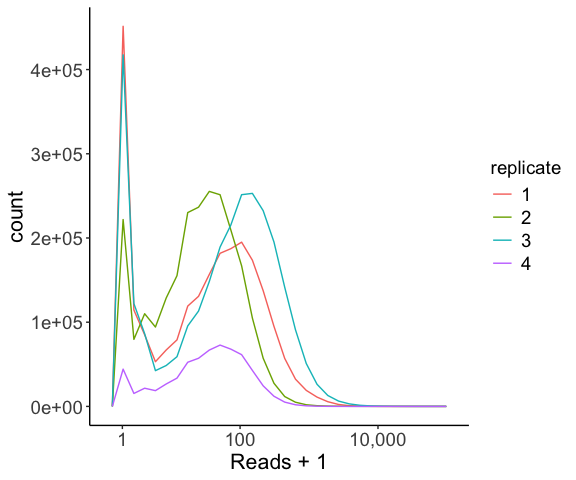<!-- -->

``` r
# same plot but showing median and range for complexes binned by mean read count
meanF_data %>% filter(!is.na(se_meanF)) %>% filter(type != "control") %>%
  ggplot(aes(x=min_read_count,y=se_meanF)) +
  stat_summary_bin(fun = "median", fun.min = "min", fun.max = "max") +
  theme_classic() + 
  scale_x_continuous(trans = log10plus1, name = "Min. reads + 1",
                     labels = label_comma()) +
  theme(axis.title.x = element_text(size = 16), 
        axis.text.x = element_text(size = 12),
        axis.text.y = element_text(size = 12),
        axis.title=element_text(size = 16)) +
  geom_hline(aes(yintercept = mean(se_meanF)), color="red", linetype="dashed") +
  ylab("SE(meanF)")
```

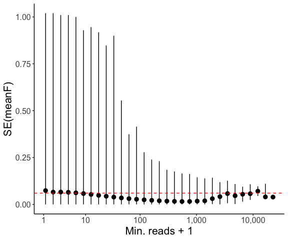<!-- -->

``` r
# Group complexes by Avg. Min Read Depth (RC) and plot SE(meanF) by n_reps. 
# This shows that complexes with a minimum read count of ~15
# have a SE(meanF) < 0.1, regardless of the number of replicates. 
meanF_data %>% filter(!(n_reps==1)) %>% 
  mutate(RC = case_when(min_read_count >= 150 ~ ">150",
                        min_read_count >= 50 & min_read_count < 150 ~ "50-150",
                        min_read_count >= 20 & min_read_count < 50 ~  "20-50",
                        min_read_count >= 10 & min_read_count < 20 ~  "10-20",
                        min_read_count < 10 ~ "<10"),
         Nreps = as_factor(n_reps),
         RC = factor(RC,levels=c("<10", "10-20", "20-50", "50-150",">150"))) %>% 
  ggline(., x = "RC", y = "se_meanF", color = "Nreps",
         add = c("mean_ci",  error.plot = "pointrange"),
         palette = c("#9d3dba","#00AFBB","#E7B800"),title="",xlab="Min Read Depth", ylab="SE (meanF)") +
  geom_hline(yintercept = 0.1,color="gray",linetype="dashed",size=1.5)
```

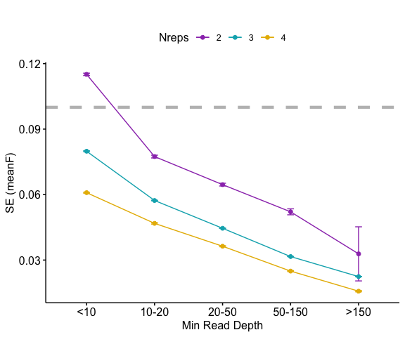<!-- -->

### Filtering data

The DMS binned sort data is filtered based on two approaches. First, we
filter out complexes with low read count (across replicates) to reduce
the global standard error; second, we correct use an I-spline to correct
the nonlinearity between replicates, and remove complexes with high
SE(meanF). These two procedures ensure that we keep complexes for which
we have high confidence in their meanF estimates.

``` r
# First strategy: Choose a read count for which we maximize the fraction of 
# retained complexes, maximize the fraction of retained complexes with 
# SE(meanF) <= 0.1, and minimize the global SE(meanF).

median_se <- median(meanF_data$se_meanF, na.rm = T) # global median SE(meanF)
n_var <- dim(meanF_data)[1] # number of total complexes

choose_read_count <- function(r) {
  # remove measurements (complex*replicate) with read count < r;
  # remove complexes with fewer than 2 replicate measurements remaining;
  # re-calculate SE
  meanF_data_filter <- meanF_data %>%
    select(AA_var:Count_total_REP4) %>%
    pivot_longer(cols = meanF_REP1:Count_total_REP4,
               names_to = c(".value", "REP"),
               names_sep = "_REP",
               values_drop_na = TRUE) %>%
    filter(Count_total >= r) %>%
    pivot_wider(names_from = REP, values_from = c(meanF, Count_total), names_prefix = "REP") %>%
    filter(is.na(Count_total_REP1) + 
             is.na(Count_total_REP2) + 
             is.na(Count_total_REP3) + 
             is.na(Count_total_REP4) < 3) %>%
    mutate(n_reps = rowSums(!is.na(.[5:8])), # number of replicates in which var-REBC is found
            sd_meanF = rowSds(as.matrix(.[5:8]), na.rm=TRUE),
            se_meanF = sd_meanF / sqrt(n_reps)) # standard error of average meanF)
  
  # global median SE(meanF) after rc filter
  median_se_r <- median(meanF_data_filter$se_meanF, na.rm = T)  
  # complexes retained after rc filtering
  n_var_r <-  nrow(meanF_data_filter)  
  # complexes eith SE <= 0.1 retained after rc filtering
  n_var_01_r <- meanF_data_filter %>% filter(se_meanF <= 0.1) %>% nrow() 
  # fraction of complexes retained
  p <- n_var_r / n_var 
  # % change in global SE(meanF)
  se <- ((median_se_r-median_se)/median_se)*100 
  # fraction of retained complexes with SE(meanF) <= 0.1
  var_01 <- n_var_01_r /n_var_r 
  return(data.frame(p=p,abs_se=median_se_r,se=se,var_01=var_01))
}

# parallel processing:
cores <- 4
if(!file.exists(file.path(results_dir, "outliers.rda"))) {
  cl <- parallel::makeCluster(cores, "FORK", outfile = "")
  doParallel::registerDoParallel(cl)
  outliers <- foreach(i = seq(1,100,1), .combine = 'rbind') %dopar% choose_read_count(i)
  stopCluster(cl)
  save(outliers, file = file.path(results_dir, "outliers.rda"))
} else {
  # the above takes a long time to run, so load the saved file if already created
  load(file.path(results_dir, "outliers.rda"))
}


# get read count threshold where >= 95% complexes passing the threshold have SE <= 0.1
outliers$r <- seq(1,100,1)
rc <- outliers %>% filter(var_01 >= 0.95) %>% slice_head() %>% pull(r)
paste("read count threshold:", rc)
```

    ## [1] "read count threshold: 27"

``` r
paste("variants retained:", outliers %>% 
        filter(r == rc) %>% pull(p) * nrow(meanF_data))
```

    ## [1] "variants retained: 1569125"

``` r
# plot results: A read count threshold of 27 ensures that 95% of complexes have 
# SE <= 0.1, decreasing the global SE by 27%
par(mar = c(5, 4, 4, 4) + 1.4)
plot(outliers$r, outliers$abs_se, type="l", col = "black",
     xlab="Read count threshold",ylab="Global median SE(meanF)",lwd=2)             
par(new = TRUE) 
plot(outliers$r, outliers$p, type="l", ylim = c(0,1), 
     col = "red",axes = FALSE, xlab = "", ylab = "",lwd=2)
axis(side = 4, at = pretty(range(c(0,1))),col="red",col.ticks="red")
mtext("Fraction variants retained", side = 4, line = 3,col="red")
par(new = TRUE)
plot(outliers$r, outliers$var_01, type="l", 
     col = "#cf6b08",axes = FALSE, xlab = "", 
     ylab = "", lwd=2, ylim=range(c(outliers$p,outliers$var_01)))
mtext("Fraction of variants with SE(meanF) <= 0.1", 
      side = 4, line = 4,col="#cf6b08")
abline(v = rc, lty=2,col="gray",lwd=3)
abline(h = 0.95, lty = 2, col = "gray", lwd = 3)
```

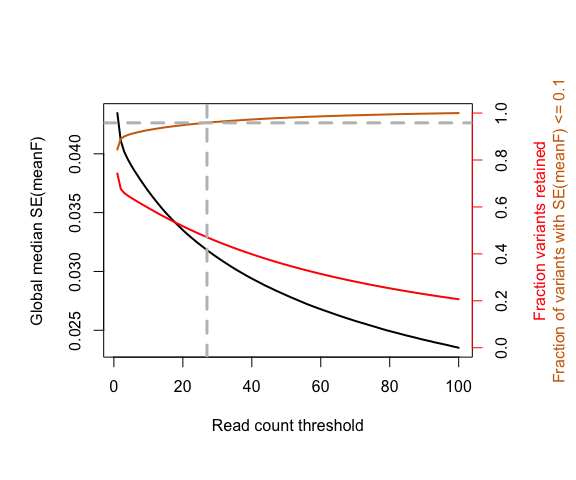<!-- -->

After having identified the read threshold, we will perform a second
filter removing complexes with SE(meanF) \> 0.1. This is not the final
filter based on standard error, we do this to remove noisy variants and
will help to fit the splines in order to capture the *global*
relationships between replicates (compare the plots in the left column
with those in the right column).

``` r
# Filter complexes per replicate based on a read threshold and recalculate SE. 
# Then filter out complexes by SE(meanF) > 0.1
meanF_data_filter <- meanF_data %>%
    select(AA_var:Count_total_REP4) %>%
    pivot_longer(cols = meanF_REP1:Count_total_REP4,
               names_to = c(".value", "REP"),
               names_sep = "_REP",
               values_drop_na = TRUE) %>%
    filter(Count_total >= rc) %>%
    pivot_wider(names_from = REP, values_from = c(meanF, Count_total), names_prefix = "REP") %>%
    filter(is.na(Count_total_REP1) + 
             is.na(Count_total_REP2) + 
             is.na(Count_total_REP3) + 
             is.na(Count_total_REP4) < 3) %>%
    mutate(n_reps = rowSums(!is.na(.[5:8])), # number of replicates in which var-REBC is found
            sd_meanF = rowSds(as.matrix(.[5:8]), na.rm=TRUE),
            se_meanF = sd_meanF / sqrt(n_reps),
           avg_meanF = rowMeans(.[5:8], na.rm = TRUE)) # standard error of average meanF

## REP1-2
a <- meanF_data_filter %>% ggplot(aes(x=meanF_REP2,y=meanF_REP1,z=se_meanF)) +
  stat_summary_2d(bins = 90) + theme_classic() + xlab("meanF, rep2") + 
  ylab("meanF, rep1") + geom_abline(slope = 1,intercept = 0,col="gray") + 
  viridis::scale_fill_viridis(option = "B",begin=0,end=1) + 
  guides(fill=guide_legend(title="SE(meanF)")) + 
  ggtitle("Reps 1-2") # points colored by SE(meanF)

b <- meanF_data_filter %>% filter(se_meanF <= 0.1) %>% 
  ggplot(aes(x=meanF_REP2,y=meanF_REP1)) +
  stat_bin2d(bins = 90) + theme_classic() + xlab("meanF, rep2") + 
  ylab("meanF, rep1") + geom_abline(slope = 1,intercept = 0,col="gray") + 
  viridis::scale_fill_viridis() + theme(legend.position = "none")


## REP2-3
c <- meanF_data_filter %>% ggplot(aes(x=meanF_REP2,y=meanF_REP3,z=se_meanF)) +
  stat_summary_2d(bins = 90) + theme_classic() + xlab("meanF, rep2") + 
  ylab("meanF, rep3") + geom_abline(slope = 1,intercept = 0,col="gray") + 
  viridis::scale_fill_viridis(option = "B",begin=0,end=1) + 
  guides(fill=guide_legend(title="SE(meanF)")) + ggtitle("Reps 2-3")

d <- meanF_data_filter %>% filter(se_meanF <= 0.1) %>% 
  ggplot(aes(x=meanF_REP2,y=meanF_REP3)) +
  stat_bin2d(bins = 90) + theme_classic() + xlab("meanF, rep2") + 
  ylab("meanF, rep3") + geom_abline(slope = 1,intercept = 0,col="gray") + 
  viridis::scale_fill_viridis() + theme(legend.position = "none")


## REP2-4
e <- meanF_data_filter %>% ggplot(aes(x=meanF_REP2,y=meanF_REP4,z=se_meanF)) +
  stat_summary_2d(bins = 90) + theme_classic() + xlab("meanF, rep2") + 
  ylab("meanF, rep4") + geom_abline(slope = 1,intercept = 0,col="gray") + 
  viridis::scale_fill_viridis(option = "B",begin=0,end=1) + 
  guides(fill=guide_legend(title="SE(meanF)")) + ggtitle("Reps 2-4")

f <- meanF_data_filter %>% filter(se_meanF <= 0.1) %>% 
  ggplot(aes(x=meanF_REP2,y=meanF_REP4)) + stat_bin2d(bins = 90) + 
  theme_classic() + xlab("meanF, rep2") + ylab("meanF, rep4") +
  geom_abline(slope = 1,intercept = 0,col="gray") + 
  viridis::scale_fill_viridis() + theme(legend.position = "none")

# How much data is retained after filtering by standard error?
meanF_data_filter %>% mutate(included = ifelse(se_meanF>0.1,"out","in")) %>% 
  group_by(included) %>% summarise(n=n(),mean_se = mean(se_meanF)) %>% 
  mutate(prop=n/sum(n))
```

    ## # A tibble: 2 × 4
    ##   included       n mean_se   prop
    ##   <chr>      <int>   <dbl>  <dbl>
    ## 1 in       1491573  0.0346 0.951 
    ## 2 out        77552  0.139  0.0494

``` r
# histogram of SE(meanF)
g <- meanF_data_filter %>% 
  ggplot(aes(x = se_meanF)) +
  geom_histogram(aes(y=..count../sum(..count..)),
                 bins = 100,color="black",fill="gray") +
  theme_classic() + xlab("SE(meanF)") + ylab("Percent of variants") +
  geom_vline(xintercept = 0.1, col="gray") + 
  scale_y_continuous(labels = scales::percent) +
  annotate(geom = "text", x = 0.35, y = 0.04, label="Removed variants: 4.94%")
```

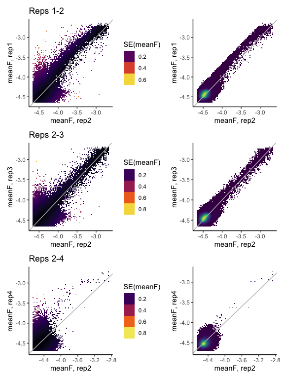<!-- -->

<!-- -->

## Correcting nonlinearity between replicates

Here we will correct for the remaining nonlinearity between replicates
in order to adjust all measurements to be on the same scale (the
reference scale being replicate 2).

``` r
# Datasets:
r12 <- meanF_data_filter %>% filter(!is.na(meanF_REP1), 
                                    !is.na(meanF_REP2), se_meanF <= 0.1) %>%
  select(AA_var,REBC,avg_meanF,meanF_REP1,meanF_REP2)
r23 <- meanF_data_filter %>% filter(!is.na(meanF_REP3), 
                                    !is.na(meanF_REP2), se_meanF <= 0.1) %>%
  select(AA_var,REBC,avg_meanF,meanF_REP2,meanF_REP3)
r24 <- meanF_data_filter %>% filter(!is.na(meanF_REP4), 
                                    !is.na(meanF_REP2), se_meanF <= 0.1) %>%
  select(AA_var,REBC,avg_meanF,meanF_REP2,meanF_REP4) 

# Correct for nonlinearity between replicates using I-splines.
# Correction with respect to Rep2

# Rationale:
# Use an I-spline to capture the nonlinearity between replicates. 
# Then use the fitted spline model to correct the values of the other replicate, 
# by predicting their new values on the rep2 scale.

#################

# REP1 vs REP2
knots_r12 <- summary(r12$meanF_REP1)[3] #using the median meanF of rep1 as internal knot
bound_knots_r12 <- c(min(c(meanF_data$meanF_REP1,meanF_data$meanF_REP2),na.rm = T), max(c(meanF_data$meanF_REP1,meanF_data$meanF_REP2),na.rm = T)) # boundary knots
degree <- 2 # degree of piecewise polynomials

# Create the basis matrix for the I-spline:
basis_mat12 <- iSpline(r12$meanF_REP1, knots = knots_r12, 
                       Boundary.knots = bound_knots_r12, degree = degree)
# Fit a linear regression model to the second replicate using the basis matrix 
# as predictors:
spline_r12 <- lm(r12$meanF_REP2 ~ basis_mat12)
# Correct rep1 values using I-Spline models: 
# Predict the values of the rep1 using the fitted model and the basis matrix.
# The 'predict' function generates a new basis matrix based on the fitted basis 
# matrix and the new data. 
# The new basis matrix is multiplied by the spline coefficients to get the new 
# X's (and then add the intercept)
r12$meanF_REP1_c <- (predict(basis_mat12, newx = r12$meanF_REP1) %*% 
                       coef(spline_r12)[-1])[,1] + coef(spline_r12)[1]

# plot results:
r12_before <- r12 %>% ggplot(aes(x=meanF_REP1,y=meanF_REP2)) + 
  stat_bin2d(bins = 100) + theme_classic() + 
  xlab("meanF, rep1") + ylab("meanF, rep2") + 
  geom_abline(intercept = 0, slope = 1,col="gray") + 
  theme(legend.position = "none") +
  geom_line(data=data.frame(meanF_REP1 = r12$meanF_REP1, 
                            meanF_REP2 = spline_r12$fitted.values), 
            size=1.3,col="red") + 
  ggtitle("Reps 1 and 2")

r12_after <- r12 %>% ggplot(aes(x=meanF_REP1_c,y=meanF_REP2)) + 
  stat_bin2d(bins = 100) + theme_classic() + 
  xlab("meanF, rep1") + ylab("meanF, rep2") + 
  geom_abline(intercept = 0, slope = 1,col="gray") + 
  theme(legend.position = "none")


#################
# REP2 vs REP3
knots_r23 <- summary(r23$meanF_REP3)[3] #using the median meanF of rep3 as internal knot
bound_knots_r23 <- c(min(c(meanF_data$meanF_REP2,meanF_data$meanF_REP3),na.rm = T), max(c(meanF_data$meanF_REP2,meanF_data$meanF_REP3),na.rm = T)) # boundary knots
degree <- 2 # degree of piecewise polynomials

basis_mat23 <- iSpline(r23$meanF_REP3, knots = knots_r23, 
                       Boundary.knots = bound_knots_r23, degree = degree)
spline_r23 <- lm(r23$meanF_REP2 ~ basis_mat23)
r23$meanF_REP3_c <- (predict(basis_mat23, newx = r23$meanF_REP3) %*% 
                       coef(spline_r23)[-1])[,1] + coef(spline_r23)[1]

# plot results:
r23_before <- r23 %>% ggplot(aes(x=meanF_REP3,y=meanF_REP2)) + 
  stat_bin2d(bins = 100) + theme_classic() + 
  xlab("meanF, rep3") + ylab("meanF, rep2") + 
  geom_abline(intercept = 0, slope = 1,col="gray") + 
  theme(legend.position = "none") +
  geom_line(data=data.frame(meanF_REP3 = r23$meanF_REP3, 
                            meanF_REP2 = spline_r23$fitted.values), 
            size=1.3,col="red") + 
  ggtitle("Reps 2 and 3")

r23_after <- r23 %>% ggplot(aes(x=meanF_REP3_c,y=meanF_REP2)) + 
  stat_bin2d(bins = 100) + theme_classic() + 
  xlab("meanF, rep3") + ylab("meanF, rep2") + 
  geom_abline(intercept = 0, slope = 1,col="gray") + 
  theme(legend.position = "none")


#################
# REP2 vs REP4
knots_r24 <- -4.6#summary(r24$meanF_REP4)[1] #using the median meanF of rep4 as internal knot
bound_knots_r24 <- c(min(c(meanF_data$meanF_REP2,meanF_data$meanF_REP4),na.rm = T), max(c(meanF_data$meanF_REP2,meanF_data$meanF_REP4),na.rm = T)) # boundary knots
degree <- 2 # degree of piecewise polynomials

basis_mat24 <- iSpline(r24$meanF_REP4, knots = knots_r24, 
                       Boundary.knots = bound_knots_r24, degree = degree)
spline_r24 <- lm(r24$meanF_REP2 ~ basis_mat24)
r24$meanF_REP4_c <- (predict(basis_mat24, newx = r24$meanF_REP4) %*% 
                       coef(spline_r24)[-1])[,1] + coef(spline_r24)[1]

# plot results:
r24_before <- r24 %>% ggplot(aes(x=meanF_REP4,y=meanF_REP2)) + 
  stat_bin2d(bins = 100) + theme_classic() + 
  xlab("meanF, rep4") + ylab("meanF, rep2") + 
  geom_abline(intercept = 0, slope = 1,col="gray") + 
  theme(legend.position = "none") +
  geom_line(data=data.frame(meanF_REP4 = r24$meanF_REP4, 
                            meanF_REP2 = spline_r24$fitted.values), 
            size=1.3,col="red") + 
  ggtitle("Reps 2 and 4")

r24_after <- r24 %>% ggplot(aes(x=meanF_REP4_c,meanF_REP2)) + 
  stat_bin2d(bins = 100) + theme_classic() + 
  xlab("meanF, rep4") + ylab("meanF, rep2") + 
  geom_abline(intercept = 0, slope = 1,col="gray") + 
  theme(legend.position = "none")

## *Note: Spline for rep2-4 seems to overshoot the fit. It does reduce the 
# SE(meanF) for isogenic controls but predicts some functional controls as 
# null (see below)
```

Plot the spline fits. The plots on the left column show the fitted
I-spline, and the plots in the right column show the corrected values
for replicates 1, 3, and 4.

<!-- -->

The splines were fitted with those complexes that are present in
replicate 2 and the other replicate. We’ll use the fitted splines to
correct *all* complexes that passed the previous read count filter - not
only the ones that are shared with rep2 and the other replicates. This
will also reduce the SE(meanF) of the noisy complexes that were filtered
out before.

``` r
# Complexes per replicate that passed initial read count QC filter
rep2 <- meanF_data %>% filter(Count_total_REP2 >= rc) %>% 
  select(AA_var,REBC,bg,RE,meanF_REP2,Count_total_REP2,cellCount_total_REP2,
         cellCount_b1_REP2,cellCount_b2_REP2,cellCount_b3_REP2,
         cellCount_b4_REP2,type) %>% 
  dplyr::rename(meanF = meanF_REP2, Count_total = Count_total_REP2, 
                cellCount_total = cellCount_total_REP2, 
                cellCount_b1 = cellCount_b1_REP2,
                cellCount_b2 = cellCount_b2_REP2, 
                cellCount_b3 = cellCount_b3_REP2, 
                cellCount_b4 = cellCount_b4_REP2) %>% 
  mutate(REP = "REP2") # all rep2 complexes

rep1 <- meanF_data %>% filter(Count_total_REP1 >= rc) %>%
  select(AA_var,REBC,bg,RE,meanF_REP1,Count_total_REP1,cellCount_total_REP1,
         cellCount_b1_REP1,cellCount_b2_REP1,cellCount_b3_REP1,
         cellCount_b4_REP1,type) %>% 
  dplyr::rename(meanF = meanF_REP1, Count_total = Count_total_REP1, 
                cellCount_total = cellCount_total_REP1, 
                cellCount_b1 =  cellCount_b1_REP1,
                cellCount_b2 = cellCount_b2_REP1, 
                cellCount_b3 = cellCount_b3_REP1, 
                cellCount_b4 = cellCount_b4_REP1) %>%  
  mutate(REP = "REP1") # all rep1 complexes

rep3 <- meanF_data %>% filter(Count_total_REP3 >= rc) %>%
  select(AA_var,REBC,bg,RE,meanF_REP3,Count_total_REP3,cellCount_total_REP3,
         cellCount_b1_REP3,cellCount_b2_REP3,cellCount_b3_REP3,
         cellCount_b4_REP3,type) %>% 
  dplyr::rename(meanF = meanF_REP3, Count_total = Count_total_REP3, 
                cellCount_total = cellCount_total_REP3, 
                cellCount_b1 =  cellCount_b1_REP3,
                cellCount_b2 = cellCount_b2_REP3, 
                cellCount_b3 = cellCount_b3_REP3, 
                cellCount_b4 = cellCount_b4_REP3) %>%  
  mutate(REP = "REP3") # all rep3 complexes

rep4 <- meanF_data %>% filter(Count_total_REP4 >= rc) %>%
  select(AA_var,REBC,bg,RE,meanF_REP4,Count_total_REP4,cellCount_total_REP4,
         cellCount_b1_REP4,cellCount_b2_REP4,cellCount_b3_REP4,
         cellCount_b4_REP4,type) %>% 
  dplyr::rename(meanF = meanF_REP4, Count_total = Count_total_REP4, 
                cellCount_total = cellCount_total_REP4, 
                cellCount_b1 = cellCount_b1_REP4,
                cellCount_b2 = cellCount_b2_REP4, 
                cellCount_b3 = cellCount_b3_REP4, 
                cellCount_b4 = cellCount_b4_REP4) %>% 
  mutate(REP = "REP4") # all rep4 complexes

rep4_ctls <- meanF_data %>% filter(Count_total_REP4 >= rc & type== "control") %>%
  filter(AA_var %in% c("GSKV","EGKA","GGKM")) %>%
  select(AA_var,REBC,bg,RE,meanF_REP4,Count_total_REP4,cellCount_total_REP4,
         cellCount_b1_REP4,cellCount_b2_REP4,cellCount_b3_REP4,
         cellCount_b4_REP4,type) %>% 
  dplyr::rename(meanF = meanF_REP4, Count_total = Count_total_REP4, 
                cellCount_total = cellCount_total_REP4, 
                cellCount_b1 = cellCount_b1_REP4,
                cellCount_b2 = cellCount_b2_REP4, 
                cellCount_b3 = cellCount_b3_REP4, 
                cellCount_b4 = cellCount_b4_REP4) %>% 
  mutate(REP = "REP4")
# manually include isogenic controls (make sure they're not discarded)
rep4 <- unique(rbind(rep4,rep4_ctls)) 

# Correct values to be on the same scale as rep2: This assumes that the 
# relationship found between the shared complexes holds for the other complexes, 
# which should be the case (Don't correct Rep4).

rep1 <- rep1 %>% 
  mutate(meanF_REP1_c = ((predict(basis_mat12, newx = rep1$meanF) %*% 
                            coef(spline_r12)[-1]) + coef(spline_r12)[1])[,1]) %>% 
  select(-c(meanF)) %>% dplyr::rename(meanF = meanF_REP1_c) %>% 
  relocate(meanF,.after = RE)

rep3 <- rep3 %>% 
  mutate(meanF_REP3_c = ((predict(basis_mat23, newx = rep3$meanF) %*% 
                            coef(spline_r23)[-1]) + coef(spline_r23)[1])[,1]) %>% 
  select(-c(meanF)) %>% dplyr::rename(meanF = meanF_REP3_c) %>% 
  relocate(meanF,.after = RE)

# Comparison of uncorrected vs corrected meanF values for isogenic controls in Rep4:
# Given the overshoot of the I-spline, all estimated values are pulled towards 
# lower predicted values of meanF (compare 'meanF' vs 'meanF_c' columns). 
# The effect is especially severe for AncSR2_SRE and AncSR1_GGKM_ERE. 
# These complexes are active based on cytometry data from isogenic strains, 
# but are predicted as null complexes (see plot below showing the lower and upper 
# bounds of detection).  
rep4_ctls %>% 
  mutate(meanF_c = ((predict(basis_mat24, newx = rep4_ctls$meanF) %*% 
                       coef(spline_r24)[-1]) + coef(spline_r24)[1])[,1]) %>%
  select(AA_var,REBC,bg,RE,type,REP,meanF,meanF_c)
```

    ## # A tibble: 5 × 8
    ##   AA_var REBC            bg     RE       type    REP   meanF meanF_c
    ##   <fct>  <fct>           <chr>  <chr>    <chr>   <chr> <dbl>   <dbl>
    ## 1 EGKA   AncSR1_ERE      AncSR1 ERE      control REP4  -2.99   -3.23
    ## 2 GGKM   AncSR1_GGKM_ERE AncSR1 GGKM_ERE control REP4  -3.79   -4.21
    ## 3 GGKM   AncSR2_GGKM_SRE AncSR2 GGKM_SRE control REP4  -2.96   -3.17
    ## 4 EGKA   AncSR2_rh_ERE   AncSR2 rh_ERE   control REP4  -3.65   -4.10
    ## 5 GSKV   AncSR2_SRE      AncSR2 SRE      control REP4  -4.25   -4.43

``` r
# Re-calculate SE(meanF) of complexes after correction.
meanF_data_corrected <- rbind(rep1,rep2,rep3,rep4) %>%
  pivot_wider(names_from = REP, 
              values_from = c(meanF,Count_total,cellCount_total,cellCount_b1,
                              cellCount_b2,cellCount_b3,cellCount_b4)) %>%
  mutate(avg_meanF = rowMeans(.[6:9],na.rm = T), # meanF per var-REBC across replicates
         n_reps = rowSums(!is.na(.[6:9])), # number of replicates in which var-REBC is found
         sd_meanF = rowSds(as.matrix(.[6:9]),na.rm=TRUE),
         se_meanF = sd_meanF / sqrt(n_reps)) # standard error of average meanF
            
# Proportions of complexes kept and discarded based on SE(meanF) cutoff
meanF_data_corrected %>% filter(n_reps != 1) %>% 
  mutate(included = ifelse(se_meanF>0.1,"out","in")) %>% 
  group_by(included) %>% 
  summarise(n=n(),mean_se = mean(se_meanF)) %>% mutate(prop=n/sum(n))
```

    ## # A tibble: 2 × 4
    ##   included       n mean_se   prop
    ##   <chr>      <int>   <dbl>  <dbl>
    ## 1 in       1544619  0.0240 0.984 
    ## 2 out        24506  0.144  0.0156

``` r
# plot histogram of SE(meanF) 
meanF_data_corrected %>% filter(n_reps != 1) %>% 
  ggplot(aes(x=se_meanF)) + 
  geom_histogram(aes(y=..count../sum(..count..)),binwidth = 0.01,
                 color="black",fill="gray") +
  theme_classic() + xlab("SE(fluorescence)") + ylab("% variants") + 
  geom_vline(xintercept = 0.1,col="gray") + 
  scale_y_continuous(labels = scales::percent) +
  annotate(geom = "text", x = 0.15, y = 0.04, size = 6, hjust = 0,
           label = as.expression(bquote(
             Removed~variants~":"~.(round(sum(meanF_data_corrected$n_reps != 1 & 
                                                meanF_data_corrected$se_meanF > 0.1) / 
                                            sum(meanF_data_corrected$n_reps != 1)*100, 2))~"%")
           ), parse = TRUE) + # histogram of SE(meanF)
  theme(text = element_text(size = fontsize))
```

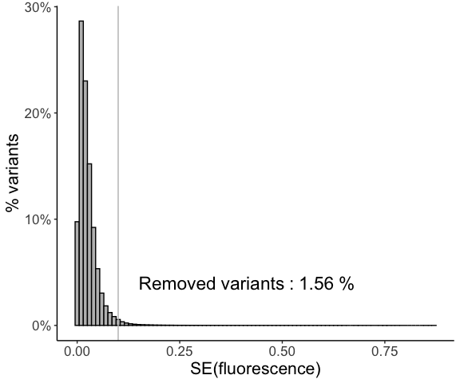<!-- -->

``` r
# compute pairwise correlations between replicates before/after correction
# Pairwise Pearson correlation between all replicates before spline correction
beforesplinecormat <- meanF_data_filter %>%
  filter(RE %in% REs[[1]]) %>%
  select(meanF_REP1, meanF_REP2, meanF_REP3, meanF_REP4) %>%
  cor(use = "pairwise.complete.obs")
paste("Before correction Pearson's R")
```

    ## [1] "Before correction Pearson's R"

``` r
print(beforesplinecormat)
```

    ##            meanF_REP1 meanF_REP2 meanF_REP3 meanF_REP4
    ## meanF_REP1  1.0000000  0.6051106  0.5645891  0.1003437
    ## meanF_REP2  0.6051106  1.0000000  0.5639949  0.1821658
    ## meanF_REP3  0.5645891  0.5639949  1.0000000  0.1489191
    ## meanF_REP4  0.1003437  0.1821658  0.1489191  1.0000000

``` r
paste("Mean pairwise R^2:",
      round(mean(beforesplinecormat[upper.tri(beforesplinecormat)]^2), 2))
```

    ## [1] "Mean pairwise R^2: 0.18"

``` r
paste("Mean pairwise R^2 no rep 4:",
      round(mean(beforesplinecormat[1:3, 1:3][
        upper.tri(beforesplinecormat[1:3,1:3])]^2), 2))
```

    ## [1] "Mean pairwise R^2 no rep 4: 0.33"

``` r
# Excluding inactive complexes
beforesplinecormatactive <- meanF_data_filter %>%
  filter(RE %in% REs[[1]]) %>%
  filter(avg_meanF >= -4) %>%
  select(meanF_REP1, meanF_REP2, meanF_REP3, meanF_REP4) %>%
  cor(use = "pairwise.complete.obs")
paste("Before correction Pearson's R (active variants)")
```

    ## [1] "Before correction Pearson's R (active variants)"

``` r
print(beforesplinecormatactive)
```

    ##             meanF_REP1 meanF_REP2 meanF_REP3  meanF_REP4
    ## meanF_REP1  1.00000000  0.9027010  0.8444019 -0.08233697
    ## meanF_REP2  0.90270096  1.0000000  0.9273321  0.66898097
    ## meanF_REP3  0.84440192  0.9273321  1.0000000  0.24625146
    ## meanF_REP4 -0.08233697  0.6689810  0.2462515  1.00000000

``` r
paste("Mean pairwise R^2:",
      round(mean(beforesplinecormatactive[
        upper.tri(beforesplinecormatactive)]^2), 2))
```

    ## [1] "Mean pairwise R^2: 0.48"

``` r
paste("Mean pairwise R^2 no rep 4:",
      round(mean(beforesplinecormatactive[1:3, 1:3][
        upper.tri(beforesplinecormatactive[1:3,1:3])]^2), 2))
```

    ## [1] "Mean pairwise R^2 no rep 4: 0.8"

``` r
# Pairwise Pearson correlation between all replicates after spline correction
aftersplinecormat <- meanF_data_corrected %>%
  filter(RE %in% REs[[1]], n_reps > 1) %>%
  select(meanF_REP1, meanF_REP2, meanF_REP3, meanF_REP4) %>%
  cor(use = "pairwise.complete.obs")
paste("After correction Pearson's R")
```

    ## [1] "After correction Pearson's R"

``` r
print(aftersplinecormat)
```

    ##            meanF_REP1 meanF_REP2 meanF_REP3 meanF_REP4
    ## meanF_REP1  1.0000000  0.6786308  0.8232551  0.1404591
    ## meanF_REP2  0.6786308  1.0000000  0.6379270  0.1821658
    ## meanF_REP3  0.8232551  0.6379270  1.0000000  0.1590745
    ## meanF_REP4  0.1404591  0.1821658  0.1590745  1.0000000

``` r
paste("Mean pairwise R^2:",
      round(mean(aftersplinecormat[upper.tri(aftersplinecormat)]^2), 2))
```

    ## [1] "Mean pairwise R^2: 0.27"

``` r
paste("Mean pairwise R^2 no rep 4:",
      round(mean(aftersplinecormat[1:3, 1:3][
        upper.tri(aftersplinecormat[1:3,1:3])]^2), 2))
```

    ## [1] "Mean pairwise R^2 no rep 4: 0.52"

``` r
# Excluding inactive complexes
aftersplinecormatactive <- meanF_data_corrected %>%
  filter(RE %in% REs[[1]], n_reps > 1) %>%
  filter(avg_meanF >= -4) %>%
  select(meanF_REP1, meanF_REP2, meanF_REP3, meanF_REP4) %>%
  cor(use = "pairwise.complete.obs")
paste("After correction Pearson's R (active variants)")
```

    ## [1] "After correction Pearson's R (active variants)"

``` r
print(aftersplinecormatactive)
```

    ##            meanF_REP1 meanF_REP2 meanF_REP3 meanF_REP4
    ## meanF_REP1 1.00000000  0.8890092  0.8532599 0.02971534
    ## meanF_REP2 0.88900921  1.0000000  0.9157872 0.64463761
    ## meanF_REP3 0.85325992  0.9157872  1.0000000 0.27809757
    ## meanF_REP4 0.02971534  0.6446376  0.2780976 1.00000000

``` r
paste("Mean pairwise R^2:",
      round(mean(aftersplinecormatactive[
        upper.tri(aftersplinecormatactive)]^2), 2))
```

    ## [1] "Mean pairwise R^2: 0.48"

``` r
paste("Mean pairwise R^2 no rep 4:",
      round(mean(aftersplinecormatactive[1:3, 1:3][upper.tri(aftersplinecormatactive[1:3,1:3])]^2), 2))
```

    ## [1] "Mean pairwise R^2 no rep 4: 0.79"

``` r
# Pairwise Pearson correlation between all replicates after spline correction 
# and filtering SE <= 0.1
aftersplinefiltercormat <- meanF_data_corrected %>%
  filter(se_meanF <= 0.1) %>%
  filter(RE %in% REs[[1]]) %>%
  select(meanF_REP1, meanF_REP2, meanF_REP3, meanF_REP4) %>%
  cor(use = "pairwise.complete.obs")
paste("After correction and filtering Pearson's R")
```

    ## [1] "After correction and filtering Pearson's R"

``` r
print(aftersplinecormat)
```

    ##            meanF_REP1 meanF_REP2 meanF_REP3 meanF_REP4
    ## meanF_REP1  1.0000000  0.6786308  0.8232551  0.1404591
    ## meanF_REP2  0.6786308  1.0000000  0.6379270  0.1821658
    ## meanF_REP3  0.8232551  0.6379270  1.0000000  0.1590745
    ## meanF_REP4  0.1404591  0.1821658  0.1590745  1.0000000

``` r
paste("Mean pairwise R^2:",
      round(mean(aftersplinecormat[upper.tri(aftersplinecormat)]^2), 2))
```

    ## [1] "Mean pairwise R^2: 0.27"

``` r
paste("Mean pairwise R^2 no rep 4:",
      round(mean(aftersplinecormat[1:3, 1:3][
        upper.tri(aftersplinecormat[1:3,1:3])]^2), 2))
```

    ## [1] "Mean pairwise R^2 no rep 4: 0.52"

``` r
# Excluding inactive complexes
aftersplinefiltercormatactive <- meanF_data_corrected %>%
  filter(se_meanF <= 0.1) %>%
  filter(RE %in% REs[[1]]) %>%
  filter(avg_meanF >= -4) %>%
  select(meanF_REP1, meanF_REP2, meanF_REP3, meanF_REP4) %>%
  cor(use = "pairwise.complete.obs")
paste("After correction and filtering Pearson's R (active variants)")
```

    ## [1] "After correction and filtering Pearson's R (active variants)"

``` r
print(aftersplinecormatactive)
```

    ##            meanF_REP1 meanF_REP2 meanF_REP3 meanF_REP4
    ## meanF_REP1 1.00000000  0.8890092  0.8532599 0.02971534
    ## meanF_REP2 0.88900921  1.0000000  0.9157872 0.64463761
    ## meanF_REP3 0.85325992  0.9157872  1.0000000 0.27809757
    ## meanF_REP4 0.02971534  0.6446376  0.2780976 1.00000000

``` r
paste("Mean pairwise R^2:",
      round(mean(aftersplinecormatactive[
        upper.tri(aftersplinecormatactive)]^2), 2))
```

    ## [1] "Mean pairwise R^2: 0.48"

``` r
paste("Mean pairwise R^2 no rep 4:",
      round(mean(aftersplinecormatactive[1:3, 1:3][
        upper.tri(aftersplinecormatactive[1:3,1:3])]^2), 2))
```

    ## [1] "Mean pairwise R^2 no rep 4: 0.79"

``` r
# Plot uncorrected vs. corrected fluorescence between replicates with spline 
# fits for all complexes (not just those used in fitting).
r12_before_all <- meanF_data_filter %>%
  ggplot(aes(x = meanF_REP1, y = meanF_REP2)) +
  geom_bin2d(bins = 100) +
  scale_fill_viridis(trans = log10plus1, labels = label_comma(), 
                     name = "Number of\nvariants", limits = c(1, 45000)) +
  geom_abline(intercept = 0, slope = 1,col="gray") +
  geom_hline(yintercept = -4, color = "gray", linetype = "dashed") +
  geom_vline(xintercept = -4, color = "gray", linetype = "dashed") +
  geom_line(data=data.frame(meanF_REP1 = r12$meanF_REP1, 
                            meanF_REP2 = spline_r12$fitted.values), 
            size=1.3,col="red") +
  labs(x = "Replicate 1 fluorescence", y = "Replicate 2 fluorescence",
       title = "Uncorrected") +
  annotate(geom = "text", x = -4.6, y = -2.5, size = 6/1.5,
           parse = T,
           label = as.expression(bquote(
             {italic(r)^2==.(format(round(
               beforesplinecormat[1,2]^2, 2), nsmall = 2))} * ", " * 
               {{italic(r)^2}["">-4]==.(format(round(
                 beforesplinecormatactive[1,2]^2, 2), nsmall = 2))}
           )),
           vjust = 1, hjust = 0) +
  theme_classic() +
  theme(text = element_text(size = fontsize/1.5))

r12_after_all <- meanF_data_corrected %>%
  ggplot(aes(x = meanF_REP1, y = meanF_REP2)) +
  geom_bin2d(bins = 100) +
  scale_fill_viridis(trans = log10plus1, labels = label_comma(), 
                     name = "Number of\nvariants", limits = c(1, 45000)) +
  geom_abline(intercept = 0, slope = 1,col="gray") +
  geom_hline(yintercept = -4, color = "gray", linetype = "dashed") +
  geom_vline(xintercept = -4, color = "gray", linetype = "dashed") +
  labs(x = "Replicate 1 fluorescence", y = "Replicate 2 fluorescence",
       title = "Corrected") +
  annotate(geom = "text", x = -4.6, y = -2.5, size = 6/1.5,
           parse = T,
           label = as.expression(bquote(
             {italic(r)^2==.(format(round(
               aftersplinecormat[1,2]^2, 2), nsmall = 2))} * ", " * 
               {{italic(r)^2}["">-4]==.(format(round(
                 aftersplinecormatactive[1,2]^2, 2), nsmall = 2))}
           )),
           vjust = 1, hjust = 0) +
  theme_classic() +
  theme(text = element_text(size = fontsize/1.5))

r12_after_filtered <- meanF_data_corrected %>%
  filter(se_meanF <= 0.1) %>%
  ggplot(aes(x = meanF_REP1, y = meanF_REP2)) +
  geom_bin2d(bins = 100) +
  scale_fill_viridis(trans = log10plus1, labels = label_comma(), 
                     name = "Number of\nvariants", limits = c(1, 45000)) +
  geom_abline(intercept = 0, slope = 1,col="gray") +
  geom_hline(yintercept = -4, color = "gray", linetype = "dashed") +
  geom_vline(xintercept = -4, color = "gray", linetype = "dashed") +
  labs(x = "Replicate 1 fluorescence", y = "Replicate 2 fluorescence",
       title = "Corrected and filtered") +
  annotate(geom = "text", x = -4.6, y = -2.5, size = 6/1.5,
           parse = T,
           label = as.expression(bquote(
             {italic(r)^2==.(format(round(
               aftersplinefiltercormat[1,2]^2, 2), nsmall = 2))} * ", " * 
               {{italic(r)^2}["">-4]==.(format(round(
                 aftersplinefiltercormatactive[1,2]^2, 2), nsmall = 2))}
           )),
           vjust = 1, hjust = 0) +
  theme_classic() +
  theme(text = element_text(size = fontsize/1.5))

r23_before_all <- meanF_data_filter %>%
  ggplot(aes(x = meanF_REP3, y = meanF_REP2)) +
  geom_bin2d(bins = 100) +
  scale_fill_viridis(trans = log10plus1, labels = label_comma(), 
                     name = "Number of\nvariants", limits = c(1, 45000)) +
  geom_abline(intercept = 0, slope = 1,col="gray") +
  geom_hline(yintercept = -4, color = "gray", linetype = "dashed") +
  geom_vline(xintercept = -4, color = "gray", linetype = "dashed") +
  geom_line(data=data.frame(meanF_REP3 = r23$meanF_REP3, 
                            meanF_REP2 = spline_r23$fitted.values), 
            size=1.3,col="red") +
  labs(x = "Replicate 3 fluorescence", y = "Replicate 2 fluorescence",
       title = "Uncorrected") +
  annotate(geom = "text", x = -4.6, y = -2.5, size = 6/1.5,
           parse = T,
           label = as.expression(bquote(
             {italic(r)^2==.(format(round(
               beforesplinecormat[3,2]^2, 2), nsmall = 2))} * ", " * 
               {{italic(r)^2}["">-4]==.(format(round(
                 beforesplinecormatactive[3,2]^2, 2), nsmall = 2))}
           )),
           vjust = 1, hjust = 0) +
  theme_classic() +
  theme(text = element_text(size = fontsize/1.5))

r23_after_all <- meanF_data_corrected %>%
  ggplot(aes(x = meanF_REP3, y = meanF_REP2)) +
  geom_bin2d(bins = 100) +
  scale_fill_viridis(trans = log10plus1, labels = label_comma(), 
                     name = "Number of\nvariants", limits = c(1, 45000)) +
  geom_abline(intercept = 0, slope = 1,col="gray") +
  geom_hline(yintercept = -4, color = "gray", linetype = "dashed") +
  geom_vline(xintercept = -4, color = "gray", linetype = "dashed") +
  labs(x = "Replicate 3 fluorescence", y = "Replicate 2 fluorescence",
       title = "Corrected") +
  annotate(geom = "text", x = -4.6, y = -2.5, size = 6/1.5,
           parse = T,
           label = as.expression(bquote(
             {italic(r)^2==.(format(round(
               aftersplinecormat[3,2]^2, 2), nsmall = 2))} * ", " * 
               {{italic(r)^2}["">-4]==.(format(round(
                 aftersplinecormatactive[3,2]^2, 2), nsmall = 2))}
           )),
           vjust = 1, hjust = 0) +
  theme_classic() +
  theme(text = element_text(size = fontsize/1.5))

r23_after_filtered <- meanF_data_corrected %>%
  filter(se_meanF <= 0.1) %>%
  ggplot(aes(x = meanF_REP3, y = meanF_REP2)) +
  geom_bin2d(bins = 100) +
  scale_fill_viridis(trans = log10plus1, labels = label_comma(), 
                     name = "Number of\nvariants", limits = c(1, 45000)) +
  geom_abline(intercept = 0, slope = 1,col="gray") +
  geom_hline(yintercept = -4, color = "gray", linetype = "dashed") +
  geom_vline(xintercept = -4, color = "gray", linetype = "dashed") +
  labs(x = "Replicate 3 fluorescence", y = "Replicate 2 fluorescence",
       title = "Corrected and filtered") +
  annotate(geom = "text", x = -4.6, y = -2.5, size = 6/1.5,
           parse = T,
           label = as.expression(bquote(
             {italic(r)^2==.(format(round(
               aftersplinefiltercormat[3,2]^2, 2), nsmall = 2))} * ", " * 
               {{italic(r)^2}["">-4]==.(format(round(
                 aftersplinefiltercormatactive[3,2]^2, 2), nsmall = 2))}
           )),
           vjust = 1, hjust = 0) +
  theme_classic() +
  theme(text = element_text(size = fontsize/1.5))

(r12_before_all + r12_after_all + r12_after_filtered) / 
  (r23_before_all + r23_after_all + r23_after_filtered) + 
  plot_layout(guides = "collect")
```

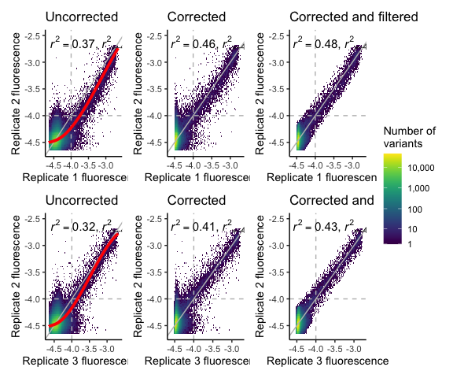<!-- -->

``` r
# New corrected dataset
ctls <- meanF_data_corrected %>% filter(type=="control") %>% 
  # Extract control complexes, and filter out sequencing errors in controls
  filter(grepl(paste(c("GSKV","EGKA","GGKM"),collapse = "|"),AA_var)) 
meanF_data_corrected <- meanF_data_corrected %>% filter(se_meanF <= 0.1) 
# Manually add controls to new dataset
meanF_data_corrected <- unique(rbind(meanF_data_corrected,ctls)) 
```

## Checking correlations with isogenic and REBC controls

We used two kinds of control variants. First, we spiked into our DMS
library several isogenic controls of reference DBD variants for which we
have estimates of meanF based on flow cytometry data; this will allow us
to validate our estmates of meanF from the sort-seq data. Second, we
used RE-barcode (REBC) controls. We measured each DBD library (AncSR1
and AncSR2) on 16 yeast strains, each containing an RE sequence, and all
32 libraries were assayed together in a single sort-seq experiment. To
distinguish the RE in which a given DBD variant was assayed in, we
assigned an REBC to each DBD library using synonymous codon variants in
the RH region. Thus, the REBC controls correspond to the RH genotype of
AncSR1 or AncSR2 on the background of each of the REBC sequences,
assayed in ERE and SRE, respectively; all AncSR1-REBCs on ERE and
AncSR2-REBCs on SRE should have the same meanF estimate as the wild type
AncSR1/ERE and AncSR2/SRE genotypes. In total, we have 5 isogenic
controls and 32 REBC controls (16 per DBD library).

``` r
# Plot meanF of control variants
bounds <- meanF_data_corrected %>% 
  mutate(group=ifelse(grepl("[*]",AA_var),"null","other")) %>%
  group_by(group) %>% 
  summarise(min = min(avg_meanF), mean = mean(avg_meanF), max= max(avg_meanF))

ctl_rep1 <- ctls %>% filter(!is.na(meanF_REP1)) %>% 
  select(AA_var,REBC,meanF_REP1) %>% mutate(REP = "REP1") %>% 
  rename(meanF = meanF_REP1)
ctl_rep2 <- ctls %>% filter(!is.na(meanF_REP2)) %>% 
  select(AA_var,REBC,meanF_REP2) %>% mutate(REP = "REP2") %>% 
  rename(meanF = meanF_REP2)
ctl_rep3 <- ctls %>% filter(!is.na(meanF_REP3)) %>% 
  select(AA_var,REBC,meanF_REP3) %>% mutate(REP = "REP3") %>% 
  rename(meanF = meanF_REP3)
ctl_rep4 <- ctls %>% filter(!is.na(meanF_REP4)) %>% 
  select(AA_var,REBC,meanF_REP4) %>% mutate(REP = "REP4") %>% 
  rename(meanF = meanF_REP4)

# test whether REBC has fluorescence effect (one-way ANOVA)
# AncSR1
summary(aov(meanF ~ REBC, 
            filter(rbind(ctl_rep1,ctl_rep2,ctl_rep3,ctl_rep4), 
                   AA_var == "EGKA", grepl("minilib", REBC))))
```

    ##             Df  Sum Sq  Mean Sq F value Pr(>F)
    ## REBC        15 0.01745 0.001164   0.382  0.975
    ## Residuals   32 0.09753 0.003048

``` r
# AncSR2
summary(aov(meanF ~ REBC, 
            filter(rbind(ctl_rep1,ctl_rep2,ctl_rep3,ctl_rep4), 
                   AA_var == "GSKV", grepl("minilib", REBC))))
```

    ##             Df  Sum Sq   Mean Sq F value Pr(>F)
    ## REBC        15 0.01124 0.0007494   0.329  0.987
    ## Residuals   32 0.07288 0.0022774

``` r
# Extract genotypes of isogenic controls from the DMS library mutants.
ctls_in_lib <- meanF_data_corrected %>% mutate(v = paste(AA_var,REBC,sep = "_")) %>% 
  filter(v %in% c("EGKA_AncSR1_REBC3","EGKA_AncSR2_REBC3",
                  "GGKM_AncSR1_REBC3","GGKM_AncSR2_REBC1","GSKV_AncSR2_REBC1")) %>% 
  mutate(REP = "Library",
         Variant = case_when(v == "EGKA_AncSR1_REBC3" ~ "AncSR1_ERE",
                         v == "EGKA_AncSR2_REBC3" ~ "AncSR2_rh_ERE",
                         v == "GGKM_AncSR1_REBC3" ~ "AncSR1_GGKM_ERE",
                         v == "GGKM_AncSR2_REBC1" ~ "AncSR2_GGKM_SRE",
                         v == "GSKV_AncSR2_REBC1" ~ "AncSR2_SRE")) %>% 
  select(AA_var,Variant,meanF_REP1:meanF_REP4) %>% 
  pivot_longer(cols = meanF_REP1:meanF_REP4,
               names_to = c(".value", "REP"),
               names_sep = "_REP",
               values_drop_na = TRUE) %>%
  rename(REBC = Variant) %>% mutate(type = "lib", REP = paste0("REP", REP))

c1 <- rbind(ctl_rep1,ctl_rep2,ctl_rep3,ctl_rep4) %>% mutate(type = "spike-in") %>%
  rbind(ctls_in_lib) %>%
  ggplot(aes(x=REBC,y=meanF)) +
  geom_point(size=2, stroke = 0.75, aes(color=REP, pch = type)) +
  scale_color_manual(values = c("#edd221","#2651a6","#0b9e32","#631cc7")) +
  scale_shape_manual(values = c(1, 3)) +
  ylim(c(-4.7,-2.5)) +
  theme_bw() + coord_flip() +
  theme(axis.title.x = element_text(size=12,face="bold"), 
        axis.text.x = element_text(size=10),
        axis.text.y = element_text(size = 10),
        axis.title=element_text(size=12,face="bold")) +
  geom_hline(yintercept = bounds$mean[1], size=1, linetype="dashed",col="red") +
  geom_hline(yintercept = bounds$max[2], size=1, linetype="dashed",col="red") +
  ylab("Fluorescence") + xlab("Control")

# Check correlations in meanF between measured isogenics and DMS spiked-in isogenics
iso_file = file.path(basedir, "data", "meanF", "rep4_isogenic_controls_FlowJo_bin.csv")
isogenics <- read.csv(iso_file,header=T) %>% rowwise() %>%
  mutate(meanF_iso = sum(c(fbin1*cell_countb1,fbin2*cell_countb2,
                           fbin3*cell_countb3,fbin4*cell_countb4))/
           sum(c(cell_countb1,cell_countb2,cell_countb3,cell_countb4)))
  
ctls_in_lib <- pivot_wider(ctls_in_lib, names_from = REP, values_from = meanF) %>%
  mutate(avg_meanF = rowMeans(select(., REP1:REP3)))

c2 <- inner_join(select(isogenics, c(REBC, meanF_iso)), 
                 select(ctls, c(REBC, avg_meanF)),by="REBC") %>% 
  left_join(ctls_in_lib, by = "REBC", suffix = c("_spikein", "_lib")) %>%
  ggplot(aes(x=meanF_iso)) +
  geom_abline(slope = 1,intercept = 0,color="gray") +
  geom_smooth(aes(y = avg_meanF_spikein), color = "black", method="lm", se=F, fullrange = TRUE) +
  geom_smooth(aes(y = avg_meanF_lib), color = "red", method="lm", se=F, fullrange = TRUE) +
  geom_point(aes(y = avg_meanF_spikein), color = "black", size = 2) +
  geom_point(aes(y = avg_meanF_lib), color = "red", size = 2) +
  theme_classic() + 
  xlim(-4.5,-2.1) + ylim(-4.5,-2.1) +
  scale_y_continuous(name = "Spike-in fluorescence",
                     sec.axis = sec_axis(~., name = "Library fluorescence")) +
  xlab("Flow cytometry fluorescence") +
  annotate(geom = "text", x = -4.5, y = -2.1, hjust = 0, vjust = 1, size = 6, parse = TRUE,
           label=as.expression(bquote(italic(r)^2==.(
             round(cor(isogenics$meanF_iso, 
                       ctls[match(isogenics$REBC, ctls$REBC), 
                            "avg_meanF"])^2, 2))))) +
  annotate(geom = "text", x = -4.5, y = -2.4, hjust = 0, vjust = 1, size = 6, 
           parse = TRUE, color = "red",
           label=as.expression(bquote(italic(r)^2==.(
             round(cor(isogenics$meanF_iso, 
                       ctls_in_lib[match(isogenics$REBC, ctls_in_lib$REBC), "avg_meanF"], 
                       use = "complete.obs")^2, 2))))) +
  theme(text = element_text(size = fontsize),
        plot.margin = unit(c(10,15,10,10), "pt"),
        axis.title.y.right = element_text(color = "red"))
```

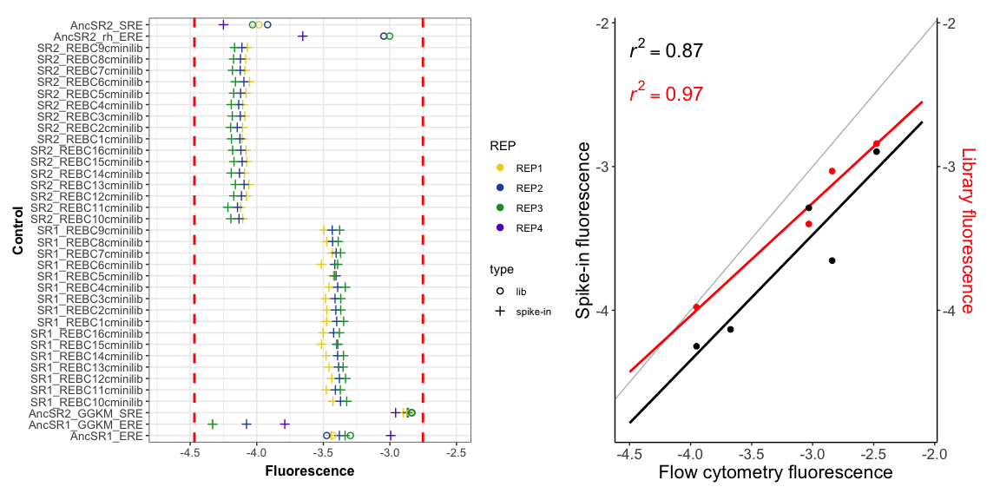<!-- -->

## Testing for fluorescence significance

We will now determine a significance threshold for calling a complexe
active vs. null in the binned sort data. We will use the fluorescence
distribution of nonsense variants as a null distribution to compute a
nonparametric p-value for each variant, and perform multiple testing
correction using a Benjamini-Hochberg false discovery rate.

We observed during the sorting experiment that the fluorescence
distribution of null variants in the AncSR2 protein background is
systematically higher than in the AncSR1 protein background. We will
therefore test each variant using the fluorescence distribution of
nonsense variants from the same protein background. We will also bin
variants by mean read count across sorting replicates for testing, since
we observe that the null fluorescence distribution also depends on this
variable. Below we plot the distribution of mean fluorescence for
nonsense variants splitting by protein background and mean read count.

``` r
# Add columns for mean read count across reps and logical for whether a variant is nonsense.
# Then assign variants to mean read count bins
meanF_data_corrected <- meanF_data_corrected %>%
  mutate(avg_Count_total = rowMeans(select(., Count_total_REP1:Count_total_REP4), na.rm = T), 
         stop = grepl("\\*", AA_var)) %>%
  mutate(rcbin = case_when(avg_Count_total < 100 ~ "<100",
                           avg_Count_total >= 100 & avg_Count_total < 500 ~ "100-500",
                           avg_Count_total >= 500 & avg_Count_total < 1000 ~ "500-1000",
                           avg_Count_total >= 1000 ~ ">=1000") %>% 
           factor(levels = c("<100", "100-500", "500-1000", ">=1000")))
  
# plot meanF histograms for nonsense variants separated by mean read count bin and background
meanF_data_corrected %>%
  filter(stop == T) %>%
  ggplot(aes(x = avg_meanF, color = rcbin)) +
  geom_freqpoly(bins = 50) +
  facet_grid(rows = vars(bg)) +
  theme_classic() +
  labs(x = "meanF", title = "Nonsense variants", fill = "mean read count")
```

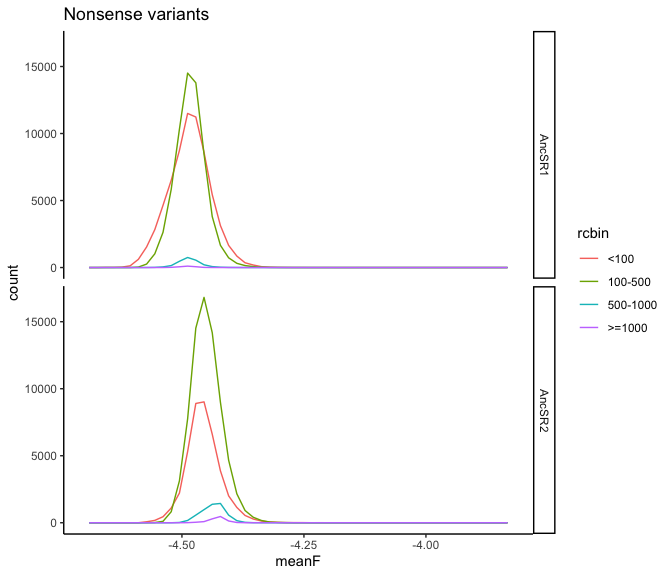<!-- -->

Now let’s compute the p-values as the fraction of nonsense variants in
the same protein background and mean read count bin that have meanF
greater than that of the test variant. Also compute an FDR-corrected
p-value.

``` r
if(!file.exists(file.path(results_dir, "meanF_p.rda"))) {
  # split data by background and mean read count bin
  meanF_p <- meanF_data_corrected %>%
    select(AA_var:type, avg_meanF, avg_Count_total, stop, rcbin)
  meanF_p <- list(filter(meanF_p, rcbin == "<100", bg == "AncSR1"),
                  filter(meanF_p, rcbin == "100-500", bg == "AncSR1"),
                  filter(meanF_p, rcbin == "500-1000", bg == "AncSR1"),
                  filter(meanF_p, rcbin == ">=1000", bg == "AncSR1"), 
                  filter(meanF_p, rcbin == "<100", bg == "AncSR2"),
                  filter(meanF_p, rcbin == "100-500", bg == "AncSR2"),
                  filter(meanF_p, rcbin == "500-1000", bg == "AncSR2"),
                  filter(meanF_p, rcbin == ">=1000", bg == "AncSR2"))
  
  # compute p-values
  
  for(i in 1:length(meanF_p)) {
    fstop <- meanF_p[[i]] %>% filter(stop == T) %>% pull(avg_meanF)
    nstop <- length(fstop)
    
    # parallel computing
    cl <- parallel::makeCluster(cores, "FORK", outfile="")
    doParallel::registerDoParallel(cl)
    p <- foreach(j = 1:cores, .combine = "c") %dopar% {
      size <- meanF_p[[i]] %>% filter(stop == F) %>% nrow()
      chunk <- ceiling(size / cores)
      
      # compute fraction of nonsense variants whose meanF is above that of the test variant;
      # perform test for all non-nonsense variants
      meanF_p[[i]] %>% filter(stop == F) %>% 
        slice(((j-1)*chunk+1):min(j*chunk, size)) %>%
        pull(avg_meanF) %>%
        sapply(function(x) sum(fstop > x) / nstop)
    }
    stopCluster(cl)
    
    # FDR correction
    padj <- p.adjust(p, method = "fdr")
    
    meanF_p[[i]] <- meanF_p[[i]] %>%
      filter(stop == F) %>%
      mutate(p = p, padj = padj)
  }
  
  # re-merge with all variants for plotting
  meanF_p <- do.call(rbind, meanF_p)
  meanF_p <- meanF_data_corrected %>%
    select(AA_var:type, avg_meanF, avg_Count_total, stop, rcbin) %>%
    left_join(meanF_p %>% select(AA_var:type, p, padj), 
              by = c("AA_var", "REBC", "bg", "RE", "type"))
  
  # save data for faster loading later
  save(meanF_p, file = file.path(results_dir, "meanF_p.rda"))
} else {
  load(file.path(results_dir, "meanF_p.rda"))
}


# call variants significant if they fall below the false discovery rate
fdr.thresh <- 0.1
meanF_p <- mutate(meanF_p, 
                  sig = case_when(padj <= fdr.thresh ~ "significant", 
                                  padj > fdr.thresh ~ "not significant",
                                  stop == TRUE ~ "nonsense") %>%
                    factor(levels = c("not significant", "significant", "nonsense")))

# get meanF cutoffs for each protein background and read count bin
meanF_cutoffs <- meanF_p %>%
  filter(sig == "significant") %>%
  group_by(bg, rcbin) %>%
  summarize(minF = min(avg_meanF))

# plot distribution of meanF coloring variants by significant, nonsignificant, or nonsense
meanF_p %>%
  ggplot(aes(x = avg_meanF, fill = sig)) +
  geom_histogram(position = "stack", bins = 50) +
  scale_y_continuous(trans = log10plus1, name = "Count + 1") +
  theme_classic() +
  labs(x = "meanF", fill = "")
```

<!-- -->

``` r
# same plot but split by protein background and mean read count bin
meanF_p %>%
  left_join(meanF_cutoffs) %>%
  ggplot(aes(x = avg_meanF, fill = sig)) +
  geom_histogram(binwidth = 0.05, position = "stack") +
  facet_grid(bg ~ rcbin, labeller = label_bquote(cols = .(as.character(rcbin))~reads)) +
  scale_fill_manual(values = c("gray50", "turquoise", "red"), 
                    labels = c("Inactive", "Active", "Nonsense")) +
  scale_y_continuous(trans = log10plus1, 
                     name = "Number of variants + 1", labels = label_log()) +
  geom_vline(aes(xintercept = minF + 0.05), color = "black", linetype = "dashed") +
  geom_vline(aes(xintercept = minF - 0.05), color = "black", linetype = "dashed") +
  geom_vline(aes(xintercept = minF), color = "black") +
  theme_classic() +
  labs(x = "Fluorescence", fill = "") +
  theme(text = element_text(size = fontsize))
```

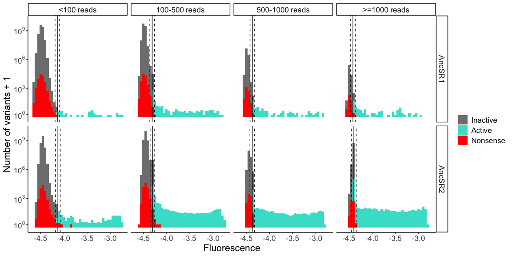<!-- -->

``` r
# Save dataset of corrected mean fluorescence values with fluorescence p-values
meanF_data_corrected <- meanF_data_corrected %>%
  left_join(meanF_p %>% select(AA_var:type, p:sig), 
            by = c("AA_var", "REBC", "bg", "RE", "type"))
write.csv(meanF_data_corrected,
          file = gzfile(file.path(results_dir, 
                                  "meanF_data_corrected_NovaSeq.csv.gz"))) 
```

## Filtering enrichment sort data

Now let’s turn to filtering the data from the enrichment sort. For this
experiment, we had two sort bins: GFP- and GFP+. We sequenced cells
collected in the GFP- bin to determine the set of complexes that were
present in the unsorted library. Complexes that are seen in the
enrichment sort GFP- dataset but not in the binned (round 2) sort
dataset may be null complexes that have a very low proportion of GFP+
cells, and therefore were not collected in the enrichment sort GFP+ bin.
Alternatively, they may be complexes that are active (i.e. have a
significant proportion of GFP+ cells), but by chance were not sorted at
high enough frequency to be detected in the binned sort dataset.

We want to have some criterion to call complexes null if they are
detected in the enrichment sort GFP- dataset but not the binned sort
dataset. We can do this using a read count threshold on the enrichment
sort GFP- dataset. Complexes that are detected at high frequency in the
enrichment sort GPF- dataset but not at all in the filtered binned sort
dataset are likely to be null, whereas complexes that are not at high
frequency in either dataset do not have enough information to be called
either null or active.

How can we determine a good threshold? First, we can calculate the
binomial sampling probability of a complex being sorted into the
enrichment sort GFP+ bin given a total number of cells sorted for that
complex and the proportion of cells in the GFP+ bin. If we know the
number and proportion of cells that a complex must have in the
enrichment sort GFP+ bin to be called active in the binned sort data,
then we can then find a read count threshold for the enrichment sort
GFP- data that ensures that complexes that are truly active would have a
high probability of being classified as such. Conversely, if they are
not detected in the binned sort data given that enrichment sort
threshold then they are likely to be null.

We first need to know how many cells must be sorted for a complex into
the enrichment sort GFP+ bin to be detected in the filtered binned sort
dataset. To do this, we can estimate the average number of cells that
were sorted into the enrichment sort GFP+ bin, given that they are
present in the filtered binned sort dataset. We will assume that the
total proportion of cells for a complex in the binned sort data is the
same as the proportion of cells for that same variant in the enrichment
sort GFP+ bin, given a particular RE/protein background. We can then
multiply this by the total number of GFP+ cells sorted per RE/protein
library in the enrichment sort to estimate the number of GFP+ cells
sorted per binned sort variant.

``` r
# data frame of number of GFP+ cells sorted per RE library in enrichment sort
debulkposcells <- data.frame(
  bg = c(rep(rep(c("AncSR1", "AncSR2"), each = 16), 3), rep("AncSR1", 8)),
  RE = c(rep(REs[[1]], 2*3), REs[[1]][9:16]),
  REP = c(rep(c("1", "2", "3"), each = 32), rep("4", 8)),
  GFPposcellslib = c(c(625635, 435760, 405514, 528709 ,408313, 472083, 726379, 448824,
                       858760, 379479, 744771, 285197, 329854, 587774, 348916, 437954,
                       847039, 391276, 425418, 533981, 434945, 421661, 777213, 409661,
                       903819, 796209, 940935, 679816, 673875, 1105703, 617178, 854539),
                     rep(c(625635, 435760, 405514, 528709 ,408313, 472083, 726379, 448824,
                           342425, 705351, 239443, 360510, 377694, 439835, 410126, 380658,
                           847039, 391276, 425418, 533981, 434945, 421661, 777213, 409661,
                           903819, 796209, 940935, 679816, 673875, 1105703, 617178, 854539), 2),
                     c(342425, 705351, 239443, 360510, 377694, 439835, 410126, 380658)))

meanF_data_corrected_long <- meanF_data_corrected %>%
  select(AA_var:cellCount_b4_REP4, avg_meanF, avg_Count_total) %>%
  pivot_longer(cols = meanF_REP1:cellCount_b4_REP4,
               names_to = c(".value", "REP"),
               names_sep = "_REP",
               values_drop_na = TRUE)

meanF_data_corrected_long <- meanF_data_corrected_long %>%
  left_join(debulkposcells, by = c("bg", "RE", "REP"))

# estimate number of GFP+ cells sorted per complex per rep
meanF_data_corrected_long <- meanF_data_corrected_long %>%
  filter(type == "exp") %>%
  group_by(REP, REBC) %>%
  mutate(estGFPposcells = cellCount_total / sum(cellCount_total) * GFPposcellslib)

# check correlations in estimates between replicates
print(cor.test(
  ~ REP1 + REP2,
  data = meanF_data_corrected_long %>%
    # filter out libraries for which we re-did the enrichment sort between rep1 and the others
    filter(!REBC %in% c("AncSR1_REBC9", "AncSR1_REBC10", "AncSR1_REBC11", "AncSR1_REBC12", 
                        "AncSR1_REBC13", "AncSR1_REBC14", "AncSR1_REBC15", "AncSR1_REBC16")) %>%
    select(AA_var:REP, estGFPposcells) %>%
    pivot_wider(names_from = REP, values_from = estGFPposcells, names_prefix = "REP"),
               na.action = "na.omit"))
```

    ## 
    ##  Pearson's product-moment correlation
    ## 
    ## data:  REP1 and REP2
    ## t = 2503.1, df = 844629, p-value < 2.2e-16
    ## alternative hypothesis: true correlation is not equal to 0
    ## 95 percent confidence interval:
    ##  0.9384723 0.9389789
    ## sample estimates:
    ##       cor 
    ## 0.9387261

``` r
print(cor.test(
  ~ REP3 + REP2,
  data = meanF_data_corrected_long %>%
    select(AA_var:REP, estGFPposcells) %>%
    pivot_wider(names_from = REP, values_from = estGFPposcells, names_prefix = "REP"),
  na.action = "na.omit"))
```

    ## 
    ##  Pearson's product-moment correlation
    ## 
    ## data:  REP3 and REP2
    ## t = 2925.8, df = 1110815, p-value < 2.2e-16
    ## alternative hypothesis: true correlation is not equal to 0
    ## 95 percent confidence interval:
    ##  0.9406069 0.9410341
    ## sample estimates:
    ##       cor 
    ## 0.9408209

``` r
print(cor.test(
  ~ REP4 + REP2,
  data = meanF_data_corrected_long %>%
    select(AA_var:REP, estGFPposcells) %>%
    pivot_wider(names_from = REP, values_from = estGFPposcells, names_prefix = "REP"),
  na.action = "na.omit"))
```

    ## 
    ##  Pearson's product-moment correlation
    ## 
    ## data:  REP4 and REP2
    ## t = 823.29, df = 216004, p-value < 2.2e-16
    ## alternative hypothesis: true correlation is not equal to 0
    ## 95 percent confidence interval:
    ##  0.8698005 0.8718388
    ## sample estimates:
    ##       cor 
    ## 0.8708234

``` r
# average estimates of GFP+ cells across binned sort replicates, but not for the libraries
# in rep 1 that were from a different enrichment sorting experiment than the other replicates
if(!file.exists(file.path("..", "results", "cleaned_data", "estGFPpos.rda"))) {
  estGFPpos <- meanF_data_corrected_long %>%
    ungroup() %>%
    filter(REBC %in% c("AncSR1_REBC9", "AncSR1_REBC10", "AncSR1_REBC11", "AncSR1_REBC12",
                       "AncSR1_REBC13", "AncSR1_REBC14", "AncSR1_REBC15", "AncSR1_REBC16"), 
           REP == "1") %>%
    select(AA_var:RE, avg_meanF, avg_Count_total, estGFPposcells) %>%
    mutate(BinBC = "GFPneg")
  estGFPpos <- rbind(
    estGFPpos, meanF_data_corrected_long %>%
      filter(REBC %in% c("AncSR1_REBC9", "AncSR1_REBC10", "AncSR1_REBC11", "AncSR1_REBC12",
                         "AncSR1_REBC13", "AncSR1_REBC14", "AncSR1_REBC15", "AncSR1_REBC16"), 
             REP != "1") %>%
      group_by(AA_var, REBC, bg, RE) %>%
      summarize(avg_meanF = mean(avg_meanF), 
                avg_Count_total = mean(avg_Count_total), 
                estGFPposcells = mean(estGFPposcells)) %>%
      mutate(BinBC = "GFPneg2"))
  estGFPpos <- rbind(
    estGFPpos, meanF_data_corrected_long %>%
      filter(!REBC %in% c("AncSR1_REBC9", "AncSR1_REBC10", "AncSR1_REBC11", "AncSR1_REBC12",
                          "AncSR1_REBC13", "AncSR1_REBC14", "AncSR1_REBC15", "AncSR1_REBC16")) %>%
      group_by(AA_var, REBC, bg, RE) %>%
      summarize(avg_meanF = mean(avg_meanF), 
                avg_Count_total = mean(avg_Count_total), 
                estGFPposcells = mean(estGFPposcells)) %>%
      mutate(BinBC = "GFPneg"))
  
  save(estGFPpos, file = file.path(results_dir, "estGFPpos.rda"))
} else load(file.path(results_dir, "estGFPpos.rda"))


# now for libraries that underwent two different enrichment sorts, average GFP+ cell count
# estimates across the two enrichment sorts
if(!file.exists(file.path(results_dir, "estGFPposave.rda"))) {
  estGFPposave <- estGFPpos %>%
    group_by(AA_var, REBC, bg, RE, avg_meanF, avg_Count_total) %>%
    summarize(estGFPposcells = mean(estGFPposcells))
  
  estGFPposave <- estGFPposave %>%
    ungroup() %>%
    mutate(rcbin = case_when(avg_Count_total < 100 ~ "<100",
                             avg_Count_total >= 100 & avg_Count_total < 500 ~ "100-500",
                             avg_Count_total >= 500 & avg_Count_total < 1000 ~ "500-1000",
                             avg_Count_total >= 1000 ~ ">=1000") %>% 
             factor(levels = c("<100", "100-500", "500-1000", ">=1000"))) %>%
    left_join(meanF_cutoffs, by = c("bg", "rcbin"))
  
  save(estGFPposave, file = file.path(results_dir, "estGFPposave.rda"))
} else load(file.path(results_dir, "estGFPposave.rda"))

estGFPposave <- estGFPpos %>%
  group_by(AA_var, REBC, bg, RE, avg_meanF, avg_Count_total) %>%
  summarize(estGFPposcells = mean(estGFPposcells))

estGFPposave <- estGFPposave %>%
  ungroup() %>%
  mutate(rcbin = case_when(avg_Count_total < 100 ~ "<100",
                           avg_Count_total >= 100 & avg_Count_total < 500 ~ "100-500",
                           avg_Count_total >= 500 & avg_Count_total < 1000 ~ "500-1000",
                           avg_Count_total >= 1000 ~ ">=1000") %>% 
           factor(levels = c("<100", "100-500", "500-1000", ">=1000"))) %>%
  left_join(meanF_cutoffs, by = c("bg", "rcbin"))

# plot meanF vs. estimated GFP+ cells sorted (median, 2.5%, and 97.5% quantiles)
mean_meanF_se <- meanF_data_corrected %>% filter(type == "exp") %>% 
  pull(se_meanF) %>% mean(na.rm = T)
estGFPposave %>%
  ggplot(aes(x = avg_meanF, y = estGFPposcells)) +
  stat_summary_bin(geom = "line", fun = "median", size = 1.5) +
  stat_summary_bin(geom = "line", linetype = "dashed", fun = function(x) quantile(x, 0.025)) +
  stat_summary_bin(geom = "line", linetype = "dashed", fun = function(x) quantile(x, 0.975)) +
  facet_grid(rows = vars(bg), cols = vars(rcbin)) +
  geom_vline(aes(xintercept = minF), color = "red") +
  geom_vline(aes(xintercept = minF + 2*mean_meanF_se), color = "red", linetype = "dashed") +
  geom_vline(aes(xintercept = minF - 2*mean_meanF_se), color = "red", linetype = "dashed") +
  scale_y_log10() +
  theme_classic() +
  labs(x = "meanF", y = "estimated debulk GFP+ cells sorted")
```

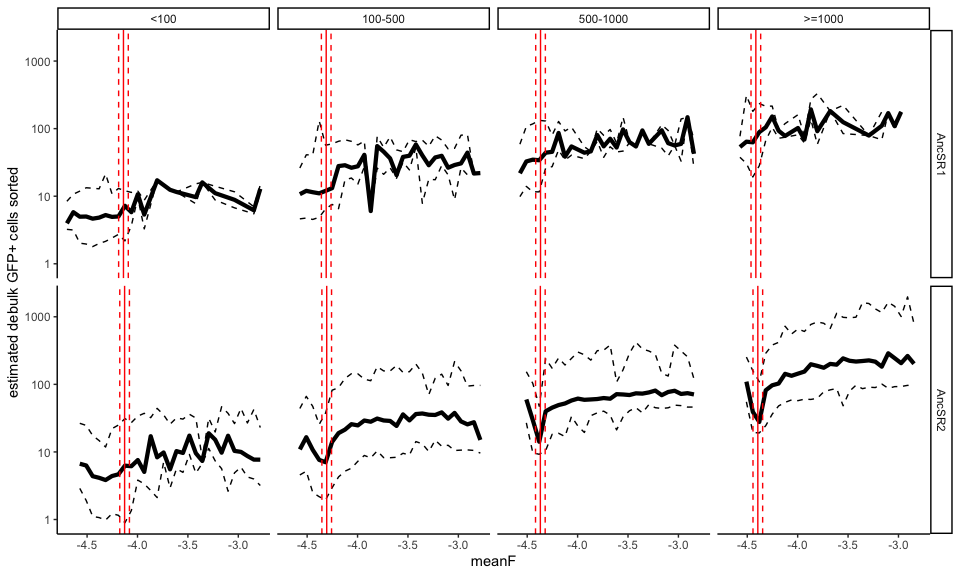<!-- -->

``` r
# get median # of GFP+ cells sorted for complexes at the fluorescence significance
# threshold, according to the protein background and read count bin
GFPpluscellssig <- estGFPposave %>%
  group_by(bg, rcbin) %>%
  filter(avg_meanF >= minF - 2*mean_meanF_se & avg_meanF <= minF + 2*mean_meanF_se) %>%
  summarize(GFPpluscellssig = median(estGFPposcells))

# get estimated # of GFP+ cells for complexes at fluorescence significance threshold
# across backgrounds and mean read count bins by computing a weighted average based on the
# number of complexes in each background/read count category
GFPpluscellssig <- estGFPposave %>%
  group_by(bg, rcbin) %>%
  count() %>%
  right_join(GFPpluscellssig, by = c("bg", "rcbin"))

GFPpluscellssig <- GFPpluscellssig %>%
  ungroup() %>%
  summarize(GFPpluscellssig = weighted.mean(GFPpluscellssig, n/sum(n))) %>%
  as.numeric()
print(GFPpluscellssig)
```

    ## [1] 8.744825

Our estimated number of cells in the GFP+ bin for complexes at the
fluorescence significance threshold is 8.74.

Now let’s estimate the proportion of cells that fall into the GFP+ bin
for complexes at the fluorescence significance threshold. Because the
fluorescence boundary between the GFP- and GFP+ enrichment sort bins
corresponds roughly to the boundary between bins 2 and 3 in the binned
sort, we can use the fraction of cells per complex that are in the upper
two binned sort bins (bins 3 and 4) as an estimate of the fraction of
cells per complex in the GFP+ enrichment sort bin.

``` r
# calculate proportion of cells in bins 3 and 4 for each complex and replicate,
# then average across replicates
proppos <- meanF_data_corrected_long %>% 
  mutate(propb34 = (cellCount_b3 + cellCount_b4) / cellCount_total) %>%
  group_by(AA_var, REBC, bg, avg_meanF, avg_Count_total) %>%
  summarize(propb34 = mean(propb34)) %>%
  ungroup() %>%
  mutate(rcbin = case_when(avg_Count_total < 100 ~ "<100",
                           avg_Count_total >= 100 & avg_Count_total < 500 ~ "100-500",
                           avg_Count_total >= 500 & avg_Count_total < 1000 ~ "500-1000",
                           avg_Count_total >= 1000 ~ ">=1000") %>% 
           factor(levels = c("<100", "100-500", "500-1000", ">=1000"))) %>%
  left_join(meanF_cutoffs, by = c("bg", "rcbin"))

# plot meanF vs. proportion of cells in bins 3 and 4
proppos %>%
  ggplot(aes(x = avg_meanF, y = propb34)) +
  stat_summary_bin(geom = "line", fun = "median") +
  stat_summary_bin(geom = "line", linetype = "dashed", fun = function(x) quantile(x, 0.05)) +
  stat_summary_bin(geom = "line", linetype = "dashed", fun = function(x) quantile(x, 0.95)) +
  facet_grid(rows = vars(bg), cols = vars(rcbin)) +
  geom_vline(aes(xintercept = minF), color = "red") +
  theme_classic() +
  labs(x = "meanF", y = "proportion of cells in bins 3 and 4")
```

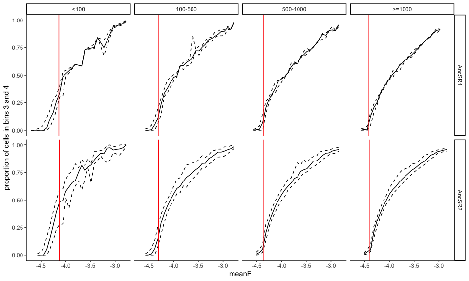<!-- -->

``` r
# get median proportion of cells in bins 3 and 4 for complexes at the fluorescence significance
# threshold, according to the protein background and read count bin
proppossig <- proppos %>%
  group_by(bg, rcbin) %>%
  filter(avg_meanF >= minF - 2*mean_meanF_se & avg_meanF <= minF + 2*mean_meanF_se) %>%
  summarize(proppossig = median(propb34))

# get estimated proportion of cells in bins 3 and 4 for complexes at fluorescence 
# significance threshold across backgrounds and read count bins by computing a 
# weighted average based on the number of complexes in each background/read count bin.
proppossig <- estGFPposave %>%
  group_by(bg, rcbin) %>%
  count() %>%
  right_join(proppossig, by = c("bg", "rcbin"))

proppossig <- proppossig %>%
  ungroup() %>%
  summarize(proppossig = weighted.mean(proppossig, n/sum(n))) %>%
  as.numeric()
print(proppossig)
```

    ## [1] 0.2277239

Our estimated proportion of cells in the GFP+ enrichment sort bin for
complexes at the fluorescence significance threshold is 0.23.

Now let’s use our estimates for number and proportion of cells in the
GFP+ bin for complexes at the significance threshold to calculate the
probability of not seeing such a complex in the binned sort dataset,
given an estimated total number of cells sorted per complex in the
enrichment sort. I.e.,

$$\text{Pr}(X\text{ not in binned sort} | \text{Pr}(X = \text{null}) = \alpha_{FDR}) = F_{\text{Binom}}(p;t,f)$$

where $X$ is a complex detected in the enrichment GFP- dataset,
$\alpha_{FDR}$ is the significance threshold for a complex being called
null in the binned sort, $p$ and $f$ are the estimated number and
fraction of GFP+ cells for a minimally active complex, respectively, and
$t$ is the estimated total number of cells sorted for $X$ in the
enrichment sort. This gives us a p-value for the null hypothesis that a
complex has too few reads in the enrichment sort GFP- bin to be able to
detect it as minimally fluorescent in the binned sort experiment. We can
therefore infer that complexes with low p-value were sorted to high
enough frequency in the enrichment sort to be detectable as minimally
fluorescent in the binned sort; if we do not detect them in the binned
sort dataset, it is probably because they are null complexes and had
very few cells that made it into the enrichment sort GFP+ bin. We can
then filter out variants with non-significant p-value, and call
remaining complexes null if they are present in the enrichment sort GFP-
dataset but not in the binned sort dataset. We’ll then use a
Benjamini-Hochberg FDR correction with threshold of 0.1 for multiple
testing correction.

``` r
# data frame of number of GFP- cells sorted per RE library in enrichment sort
debulknegcells <- data.frame(
  REBC = c(sapply(1:16, function(x) paste0("AncSR1_REBC", x)),
           sapply(1:16, function(x) paste0("AncSR2_REBC", x)),
           sapply(9:16, function(x) paste0("AncSR1_REBC", x))),
  BinBC = c(rep("GFPneg", 32), rep("GFPneg2", 8)),
  GFPnegcellslib = c(24375871, 24800681, 24681039, 24592905, 24662980, 24806774, 24352862, 24658946,
                     24326839, 24736293, 24336612, 24841745, 24748789, 24558731, 24945619, 25226917,
                     24220370, 24825719 ,24694083, 24602087, 24690832, 24686331, 24407887, 24637616,
                     24399903, 24518676, 24214644, 24511230, 24606769, 24040623, 24441448, 24619287,
                     24750095, 24422603, 24826229, 24622262, 24870439, 24586253, 24629933, 24685092))

# calculate total number of reads per enrichment sort library
debulknegcells <- debulk_data %>%
  group_by(REBC, BinBC) %>%
  summarize(total_reads = sum(Count)) %>%
  right_join(debulknegcells, by = c("REBC", "BinBC")) %>%
  mutate(readspercell = total_reads/GFPnegcellslib)

# estimate number of GFP- cells sorted per complex in the enrichment sort,
# as well as number of total cells sorted per complex by summing with 
# estimated GFP+ cells
debulk_data <- debulk_data %>%
  left_join(debulknegcells %>% select(REBC, BinBC, readspercell), 
            by = c("REBC", "BinBC")) %>%
  mutate(cells_GFPneg = Count * 1/readspercell)  %>%
  left_join(estGFPpos %>% select(AA_var, REBC, BinBC, estGFPposcells),
            by = c("AA_var", "REBC", "BinBC")) %>%
  mutate(total_cells = cells_GFPneg + estGFPposcells) %>%
  mutate(total_cells = ifelse(is.na(total_cells), cells_GFPneg, total_cells))

# compute p-values as the probability of sampling at least 8 cells in the GFP+ bin
# given the fraction of cells per complex in the GFP+ bin is 0.23 (similarly to
# a minimally significant complex)
debulk_data <- debulk_data %>%
  mutate(p = pbinom(round(GFPpluscellssig) - 1, round(cells_GFPneg), proppossig))

# compute FDR-adjusted p-values using Benjamini-Hochberg correction
debulk_data$padj <- p.adjust(debulk_data$p, method = "fdr")

# filter enrichment sort data with an FDR cutoff of 0.1
debulk.fdrthresh <- 0.1

debulk_data %>%
  mutate(sig = padj <= debulk.fdrthresh) %>%
  ggplot(aes(x = Count, fill = sig)) +
  geom_histogram(bins = 50, position = "stack", color = "black") +
  scale_x_continuous(trans = log10plus1, name = "Reads per variant + 1") +
  scale_y_continuous(label = label_number(big.mark = "")) +
  scale_fill_manual(values = c("white", "gray30"), labels = c("Undetermined", "Null")) +
  labs(title = "Debulk GFP- variants", y = "Number of variants", fill = "") +
  theme_classic() +
  theme(text = element_text(size = fontsize))
```

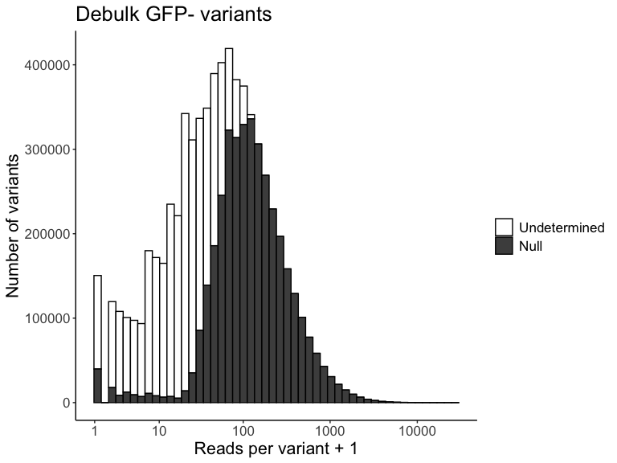<!-- -->

``` r
debulk_data_filter <- debulk_data %>%
  filter(padj <= debulk.fdrthresh)

# number of total (non-nonsense) complexes classified as null from the 
# enrichment sort GFP- data
debulk_data_filter %>%
  filter(!grepl("\\*", AA_var)) %>%
  distinct(AA_var, REBC) %>%
  anti_join(filter(meanF_data_corrected, type == "exp"), by = c("AA_var", "REBC")) %>%
  mutate(bg = sub("_REBC.+", "", REBC)) %>%
  count(bg) %>%
  mutate(frac = n / 2560000)
```

    ##       bg      n      frac
    ## 1 AncSR1 859171 0.3356137
    ## 2 AncSR2 638762 0.2495164

``` r
# total number of phenotyped complexes
debulk_data_filter %>%
  distinct(AA_var, REBC) %>%
  mutate(bg = sub("_REBC.+", "", REBC)) %>%
  full_join(filter(meanF_data_corrected, type == "exp"), by = c("AA_var", "REBC", "bg")) %>%
  filter(!grepl("\\*", AA_var)) %>%
  count(bg) %>%
  mutate(frac = n / 2560000)
```

    ##       bg       n      frac
    ## 1 AncSR1 1487903 0.5812121
    ## 2 AncSR2 1297237 0.5067332

``` r
# export filtered data
write.csv(debulk_data_filter,
          file = gzfile(file.path(results_dir, "debulk_data_filtered.csv.gz")))
```
