Evolutionary simulations on empirical GP maps
================
Santiago Herrera
2023-08-23

## Reading in data

*Note:* The transition matrices and genotype networks contained in the `MutSel_matrices_complete_data.RData` file were generated in the Midway3 cluster using the R script `MutSel_matrices_complete_data.R`.

``` r
# Check whether the matrices have been created already
if(!file.exists(file.path(".", "MutSel_matrices_complete_data.RData"))) {
  # Load complete data from mutation effects model
  data_sr1 <- readr::read_csv(file.path("..","mutation_effects_model","AncSR1_complete_data.csv.gz")) %>%
    mutate(bg = "AncSR1")
  data_sr2 <- readr::read_csv(file.path("..","mutation_effects_model","AncSR2_complete_data.csv.gz")) %>%
    mutate(bg = "AncSR2")

  meanF_data <- rbind(data_sr1,data_sr2)
  
  # Reference wild-type ancestral genotypes:
  AncSR1_ERE_ref <- meanF_data %>% filter(AA_var == "EGKA" & bg == "AncSR1" & RE == "ERE (GT)") %>% pull(avg_meanF)
  AncSR2_SRE_ref <- meanF_data %>% filter(AA_var == "GSKV" & bg == "AncSR2" & RE == "SRE1 (AA)") %>% pull(avg_meanF)
  
  # BUILD PHENOTYPE TABLE #
  # For each *functional* variant (those with meanF >= AncSR2_SRE_ref):
  phenotypes_tbl <- meanF_data %>% filter(avg_meanF >= AncSR2_SRE_ref) %>%
    group_by(AA_var, bg) %>%
    summarise(n_bound_REs = n(), # how many DNA elements can bind
              meanF_bREs = mean(avg_meanF), # the average meanF across all DNA elements bound
              max_meanF_bREs = max(avg_meanF), # the max meanF across all DNA elements bound
              min_meanF_bREs = min(avg_meanF), # the min meanF across all DNA elements bound 
              specific = ifelse(n_bound_REs == 1, "YES","NO"), # functional binding to only one DNA element?
              specificity = ifelse(n_bound_REs == 1, RE, "Promiscuous"), # Determine the type of specificity
              bound_REs = list(RE)) # assign DNA elements bound

} else {
  # load matrices if already created
  load("./MutSel_matrices_complete_data.RData")
}

# load functions
source("../../scripts/MC_MutSel_functions.R")
```

## Modeling walks on an empirical GP map

### Strong Selection-Weak Mutation (SSWM) regime

Under the SSWM regime, the mutation rate is low enough such that the time to fixation of a mutation is much lower than the time between subsequent mutations (Gillespie, 1984). Thus, trajectories on a genotype landscape can be modeled as an stepwise, origin-fixation process. Specifically, the rate of fixation from allele *i* to *j* is a product of the rate of introduction of allele *j* in the population and the probability that it goes to fixation, like so

*Q*(*i*, *j*)=2*N*<sub>*e*</sub>*μ*<sub>*i**j*</sub> × *P*<sub>fix</sub>(*j*; *s*<sub>*i**j*</sub>, *N*<sub>*e*</sub>),

where *μ*<sub>*i**j*</sub> is the mutation rate from allele *i* to *j*, *s*<sub>*i**j*</sub> is the selection coefficient, and *N*<sub>*e*</sub> is the effective population size. When *s*<sub>*i**j*</sub> ≠ 0, the fixation probability, *P*<sub>fix</sub>(*j*; *s*<sub>*i**j*</sub>, *N*<sub>*e*</sub>) is given by the Kimura equation (Kimura, 1962):

$$
P\_{\\text{fix}}(j) = \\begin{cases}
\\frac{1-e^{-2s\_{ij}}}{1-e^{-4Ns\_{ij}}} & \\text{when } s\_{ij} \\neq 0 \\\\
\\frac{1}{2N\_e} & \\text{when } s\_{ij} = 0
\\end{cases}
$$

To precisely model an origin-fixation walk on an empirical genotype-phenotype (GP) map, we need to compute *P*(*i*, *j*), the probability that the *next* mutation will be *j*. That is, we need to account for the local structure of the network around the focal node *i*. Thus,

$$
P(i,j) = \\frac{Q(i,j)}{ \\sum\_{k \\neq i} Q(i,k)} ,
$$

where *k* are all nodes connected to node *i* (McCandlish and Stoltzfus, 2014).

**Some assumptions:** Assuming a constant population size (*N*<sub>*e*</sub>), and no mutation bias and reversibility ($ *{ij} = *{ji} = \_{ik} $), the probability that the next mutation will be *j* becomes a function of the rescaled fixation probabilities alone, such that

$$
P(i,j) = \\frac{2N\_e\\mu\_{ij} \\times P\_{\\text{fix}}(j)}{\\sum\_{k \\neq i}2N\_e\\mu\_{ik} \\times P\_{\\text{fix}}(k)} \\
= (\\frac{2N\_e\\mu\_{ij}}{2N\_e\\mu\_{ik}}) \\times \\frac{P\_{\\text{fix}}(j)}{\\sum\_{k \\neq i} P\_{\\text{fix}}(k)} \\\\
= \\frac{P\_{\\text{fix}}(j)}{\\sum\_{k \\neq i}P\_{\\text{fix}}(k)}
$$

Although we are assuming no mutation bias and reversibility, we can weight the fixation probablities by a *mutation rate*. The mutation rate aims to capture an important aspect of the mutation process: the mapping from codon-to-amino acid, thus capturing the accessibility of genotype variants through the structure of the genetic code.

Mutation rates (*ρ*<sub>*i**j*</sub>) can be defined in multiple ways, but we use two equivalent definitions: - All single-step amino acid mutations to functional genotypes given the genetic code are accessible, with probability equal to the *fraction of codons* from amino acid *i* that can access amino acid *j* via single nucleotide mutations (i.e., mutational propensity). - All single-step amino acid mutations to functional genotypes given the genetic code are accessible, with probability proportional to the *number of nucleotide changes* that can encode each amino acid change - accounting for all the possible synonymous backgrounds (i.e., codon bias).

A reasonable assumption in both cases is that a population fixed for a given amino acid genotype, may explore all synonymous codons; i.e., the population is *delocalized* at the nucleotide level but fixed at the amino acid level.

Here, we are using the second specification of the mutation rate, but both give equivalent results (for a comparison see the `matrix_comparison.md` github file).

Re-writing the previous equation to include mutational propensities, we have:

$$
P(i,j) = \\frac{\\rho\_{ij} \\times P\_{\\text{fix}}(j)}{\\sum\_{k \\neq i}(\\rho\_{ik} \\times P\_{\\text{fix}}(k))}
$$

This specification of an origin-fixation model allows to model evolution on a genotype network as a discrete Markov process, where each time step consists of a single *amino acid* substitution.

### Molecular evolutionary scenarios

We are interested in characterizing the probability distribution of functional variation (PDFV) accessible around a particular genotype. Two types of PDFV can be distinguished: a *variational PDFV*, which refers to the probability distribution of intrinsic tendency of variation, summarizing how the system can change solely by mutation given the structure of the GP map and the genetic code; and an *evolvable PDFV*, determined by the mutation-only PDFV, which summarizes the probability distribution of variation in response to (purifying, directional or stabilizing) selection and drift.

We will simulate walks on the GP map under three selective regimes: 1) Random walk, 2) Directional selection, and 3) Stabilizing selection. These regimes act on the mean fluorescence estimated for each variant.

-   *Random walk on sequence space* (Maynard-Smith, 1970; King and Jukes, 1969): Under this model, proteins can only traverse the sequence space if they form a continuous network without crossing through nonfunctional intermediate nodes. There exists a minimum level of functionality that protein variants must have, below which variants are removed by purifying selection. Variants with a higher level of function are equivalent and thus their evolution is affected solely by genetic drift. (The other two models are built from the basic assumptions of this model - i.e., continuous network of functional variants, and drift+purifying selection are always present).

-   *Directional selection* (Gillespie, 1984): *P*(*i*, *j*)∝*s*<sub>*i**j*</sub>, the strength of the selection coefficient. There is a positive relationship between phenotype and fitness, thus, selection will act to increase the phenotypic value along the trajectory. However, we won't use a linear fitness function, because it assumes that fitness increases (or decreases) infinitely and linearly with *s*<sub>*i**j*</sub>. In contrast, we will use a logistic fitness function which asumes that after a certain increase (or decrease) in meanF, the fitness is unlikely to change.

-   *Stabilizing selection*: *P*(*i*, *j*)∝*s*<sub>*i**j*</sub>. This model assumes that there is an (static) fitness optimum, thus, selection will act to maintain a given phenotypic value along the trajectory. In this case, a bell-shaped function centered around a reference phenotypic value allows to assign low selection coefficients to mutations that decrease or increase too much meanF.

### Calculating selection coefficients

There are effectively infinite ways of relating a phenotype to fitness. Two key aspects of the phenotype-to-fitness map are 1) the shape of the function and 2) the values of the parameters of the funciton. To find the parameters of the fitness functions, we relied on a previous study that performed ancestral sequence reconstruction on the steroid receptor (SR) phylogeny using experimentally informed models of sequence evolution (Muñiz et al. in prep). Briefly, the study used a DMS library of AncSR1, the ancestor of the SR family, which measured the functional effect of every single amino acid substitution at every site in the protein, and used this information to build a mutation-selection model to optimize branch lengths and reconstruct ancestral sequences on the tree. The method infers the maximum likelihood estimates of the relevant population-level parameters of the model given the experimental data and the tree topology.

We used Muñiz et al.'s dataset to estimate the parameters of two relevant fitness functions: 1) a logistic function (*F*(*g*)<sub>Log</sub>) and 2) a bell-shaped function (*F*(*g*)<sub>Norm</sub>) (see the section below on *Molecular evolutionary scenarios* for details on the selection of these functions). Each function has three parameters that can be estimated via maximum likelihood, and are defined in terms of the effect of mutations on the phenotype relative to the AncSR1 reference, i.e. mean fluorescence (*Δ**F*):

$$
F(g)\_{\\text{Log}} = \\frac{L}{1 + e^{-k(\\Delta F - \\Delta F\_0)}}
$$

where, *L* is the maximum fitness, *k* is the steepness, and *Δ**F*<sub>0</sub> is the midpoint.

$$
F(g)\_{\\text{Norm}} = S .e^{\\frac{1}{2}(\\frac{(\\Delta F - \\bar{\\Delta F}}{\\sigma})^2}
$$

where *S* is a scaling factor that determines the maximum fitness, $\\bar{\\Delta F}$ is the average effect on phenotype, and *σ* is the standard deviation of the effect on phenotype.

The phylogenetic mutation-selection model assumes exponential growth, continuous time, overlapping generations, and no density- or frequency-dependent selection. Under these assumptions the fitness corresponds to the 'normalized' growth rate, *N*<sub>*e*</sub> × *r*<sub>*i*</sub>, where *N*<sub>*e*</sub> is population size and *r*<sub>*i*</sub> is the variant-specific instantaneous growth rate.

We also specified a step function that models the scenario of random walk. In this case, fitness of functional variants are the same:

$$
F(g)\_{\\text{step}} = \\begin{cases}
0 & \\text{when } \\hat F &lt; F\_{\\text{ref. genotype}} \\\\
1 & \\text{when } \\hat F \\geq F\_{\\text{ref. genotype}}
\\end{cases}
$$

For a population with two competing genotypes, *i* and *j*, with respective fitnesses (i.e., growth rates) *N*<sub>*e*</sub>*r*<sub>*i*</sub> and *N*<sub>*e*</sub>*r*<sub>*j*</sub>, we can define the selection coefficient *s*<sub>*i**j*</sub> as:

$$
N\_e \\times s\_{ij} = (N\_e \\times r\_j) - (N\_e \\times r\_i) \\\\ 
= N\_e \\times (r\_j - r\_i)
$$

Let's have a look at the shape of the fitness functions. Note that AncSR2/SRE1 (green dashed line) is the reference genotype for clasifying a genotype as functional (green region):

### Discrete Markov process on a GP map

We are interested in understanding how likely was each of the 16 DNA binding phenotypes to evolve under different biologically relevant evolutionary scenarios. Conceptually, the problem can be stated as follows: Under a given scenario, proteins traverse the sequence space by mutations, the GP map determines the effect of a mutation on phenotype, and the phenotype-fitness map defines its probability of fixation. Thus, the evolution of a DNA binding phenotype can be formulated in terms of its probability of occurring: What is the probability of evolving any given DNA binding phenotype from a specific starting genotype(s) after a number of substitutions, without losing function?

The evolution of a DNA binding phenotype depends on two features of the genotype-phenotype map: 1) the number of accessible neighbors, at each mutation step, with the new function, and 2) the total number of genotypes that encode the function. Let {*G*} be the complete set of genotypes in the network. Thus, the probability of evolving *R**E*<sub>*i*</sub> (*P*(*R**E*<sub>*i*</sub>)) is conditional on the starting set of genotypes {*G*<sub>0</sub>}, the length of the mutational trajectory *S*, and the structure of the genotype-phenotye map.

We need to find the probabilty distribution over the states of {*G*} after N steps of a Markov chain. That is, the probability that the substitution process will result in each genotype given the origin-fixation dynamics given by the transition matrix *P* (where the probability of moving from genotype *i* to genotype *j* is *P*(*i*, *j*)). The row vector *π*<sub>(*S*)</sub> containing the distribution over the states of {*G*} after *S* substitutions is:

*π*<sub>(*S*)</sub> = *π*<sub>(0)</sub> × *P*<sup>*S*</sup>

for *S* &gt; 0, where *π*<sub>(0)</sub> is the vector of state frequencies at time step = 0 for every state in {*G*}. Since the transition matrices *P* can be specified under different selection scenarios, this effectively captures the probabilities of the possible realizations of the process for each biological scenario.

We can use the DMS data to assign a function to each genotype of the vector *π*<sub>(*S*)</sub>. Thus, the conditional probability of evolving any DNA binding funciton expressed in terms of the Markov chain becomes:

$$
P(RE\_i|\\pi\_{(0)},S,P) = \\frac{\\sum\_{j \\in RE\_i} \\pi\_{(S)j}}{\\sum\_{i=1}^{k} (\\sum\_{j \\in RE\_i} \\pi\_{(S)j})\_i}
$$

where the numerator is the sum of the probailities of all the genotypes encoding the DNA binding function *R**E*<sub>*i*</sub> after *S* substitutions, and the denominator is a normalization constant with *k* = 16 such that ∑<sub>*i*</sub>*P*(*R**E*<sub>*i*</sub>|*π*<sub>(0)</sub>, *S*, *P*)=1.

For *k* different DNA binding phenotypes, we obtain a probability distribution of functional variation (PDFV), a multinomial probability distribution, around any set of starting genotypes {*G*<sub>0</sub>} that quantifies the likelihood that evolution will produce a particular phenotypic outcome given a set of conditions.

## Evolutionary simulations using discrete markov chains

``` r
## GLOBAL PARAMETERS FOR MARKOV CHAINS ##
PATH_LENGTH = 3 # path length (neighborhood size) to find mutational trajectoties
REF_GENOTYPE = "EGKA" # EGKA (historical genotype) 
N_CORES=detectCores()-1 # number of cores for parallel processing
cols <- RColorBrewer::brewer.pal(8, name="Dark2") # color palette
```

### Building genotype networks and probability transition matrices

For every evolutionary scenario, we will create a `P` matrix for each background, where each entry *P*\[*i*, *j*\] corresponds to the probability *P*(*i*, *j*) under each model. Initially, we will calculate selection coefficients based on the *maximum meanF* across the DNA elements bound by each variant.

``` r
# Check whether the matrices have been loaded already (above), if not proceed to build the networks and matrices
if(!file.exists(file.path(".", "MutSel_matrices_complete_data.RData"))) {
  # BUILD GENOTYPE NETWORKS #
  sr1_variants <- phenotypes_tbl %>% filter(bg == "AncSR1") %>% pull(AA_var)
  sr2_variants <- phenotypes_tbl %>% filter(bg == "AncSR2") %>% pull(AA_var)
  
  # Regular networks
  adj_mat_sr1 <- build_mutation_matrix(sr1_variants,type=1,N_CORES)
  net_sr1 <- build_genotype_network(build_mat=FALSE,adj_mat=adj_mat_sr1)
  
  adj_mat_sr2 <- build_mutation_matrix(sr2_variants,type=1,N_CORES)
  net_sr2 <- build_genotype_network(build_mat=FALSE,adj_mat=adj_mat_sr2)
  
  #####
  
  # BUILD TRANSITION PROBABILITY MATRICES #
  
  # Generate transition probability matrix under three evolutionary scenarios for AncSR1 and AncSR2 backgrounds (From = rows, to = cols)
  
  # Build model scenarios for each DBD background:
  # AncSR1
  MODEL.PARAM_SR1_drift <- list("AncSR1","drift",Ne,STEP.PARAM,TRUE,"max")
  MODEL.PARAM_SR1_directional <- list("AncSR1","directional",Ne,LOG.PARAM,TRUE,"max")
  #MODEL.PARAM_SR1_stabilizing <- list("AncSR1","stabilizing",Ne,NORM.PARAM,TRUE,"max")
  
  # AncSR2
  MODEL.PARAM_SR2_drift <- list("AncSR2","drift",Ne,STEP.PARAM,TRUE,"max")
  MODEL.PARAM_SR2_directional <- list("AncSR2","directional",Ne,LOG.PARAM,TRUE,"max")
  #MODEL.PARAM_SR2_stabilizing <- list("AncSR2","stabilizing",Ne,NORM.PARAM,TRUE,"max")
  
  # Build matrices
  # AncSR1
  adj_mat_count_sr1 <- build_mutation_matrix(sr1_variants,type=3,N_CORES)
  M_drift_sr1 <- build_transition_matrix_v2(sr1_variants,adj_mat_count_sr1,phenotypes_tbl,MODEL.PARAM_SR1_drift,N_CORES)
  M_dir_sr1 <- build_transition_matrix_v2(sr1_variants,adj_mat_count_sr1,phenotypes_tbl,MODEL.PARAM_SR1_directional,N_CORES)
  
  # AncSR2
  adj_mat_count_sr2 <- build_mutation_matrix(sr2_variants,type=3,N_CORES)
  M_drift_sr2 <- build_transition_matrix_v2(sr2_variants,adj_mat_count_sr2,phenotypes_tbl,MODEL.PARAM_SR2_drift,N_CORES)
  M_dir_sr2 <- build_transition_matrix_v2(sr2_variants,adj_mat_count_sr2,phenotypes_tbl,MODEL.PARAM_SR2_directional,N_CORES)
  
  # convert adjacency matrices of mutation rates to transition probability matrices
  adj_mat_count_sr1 <- t(apply(adj_mat_count_sr1, 1, function(x) x / sum(x)))
  adj_mat_count_sr1 <- replace(adj_mat_count_sr1,is.nan(adj_mat_count_sr1),0)
  adj_mat_count_sr1 <- as(adj_mat_count_sr1, "sparseMatrix")
  
  adj_mat_count_sr2 <- t(apply(adj_mat_count_sr2, 1, function(x) x / sum(x)))
  adj_mat_count_sr2 <- replace(adj_mat_count_sr2,is.nan(adj_mat_count_sr2),0)
  adj_mat_count_sr2 <- as(adj_mat_count_sr2, "sparseMatrix")

}
```

### Global properties of ancestral DBD genotype networks

Before delving into the neighborhoods around a focal node, let's take a look at the global properties of the GP map for each ancestral protein. Specifically, we're interested in three questions: 1) what is the phenotypic variation attainable through random mutation?, 2) what is the stationary distribution of the 16 DNA binding funtions?, and 3) are mutation and selection aligned in the GP map?

Answering the first question allows us to understand what is the variational propensity of each DBD background, that is, how likely is each phenotype to arise by random mutation. Answering the second question allows us to understand how the structure of the GP map determines the probability distribution of phenotypic variation at equilibrium (after suficiently long time has passed). Answering the third question can tell us whether the the mutation process is more likely to produce high fitness genotypes due the structure of the GP map.

To answer these questions, first, we can use the transition probablity (`P`) matrices to determine all the possible single-step probabilities from all the nodes in the GP map and compute the relative probability of evolving each DNA binding funtion. Second, we can use the `P` matrices to compute the stationary distribution of all genotypes (an their phenotypes) in the network. Third, we will use the `M` to ask whether the stationary distributoin of states generated from this matrix correlates with the fitness of those RH variants.

The transition matrices of Markov chains describe the probabilities of change between every state of the system at each step - the probability distribution of the states evolves over time (*X*<sub>*t*</sub>). The stationary distribution of a Markov chain describes the distribution of states after suficiently long time has passed (*t* → ∞) such that *X*<sub>*t*</sub> does noth change any longer (i.e., the system has reached an equilibrium).

Let's extract the square matrices from the main components of the genotype networks (the biggest connected sub-network) and compute the stationary distributions of the genotypes.

``` r
# TRANSITION MATRICES (mut + selection) #
# Drift
P_drift_sr1_ntwrk <- extract_main_ntwrk(net_sr1,M_drift_sr1) # create square matrix of main component of genotype network
P_drift_sr1_ntwrk_statdist <- stationary_dist(P_drift_sr1_ntwrk) # compute stationary distribution of genotypes in the main network component

P_drift_sr2_ntwrk <- extract_main_ntwrk(net_sr2,M_drift_sr2) 
P_drift_sr2_ntwrk_statdist <- stationary_dist(P_drift_sr2_ntwrk)

# Directional selection
P_dir_sr1_ntwrk <- extract_main_ntwrk(net_sr1,M_dir_sr1) 
P_dir_sr1_ntwrk_statdist <- stationary_dist(P_dir_sr1_ntwrk) 

P_dir_sr2_ntwrk <- extract_main_ntwrk(net_sr2,M_dir_sr2) 
P_dir_sr2_ntwrk_statdist <- stationary_dist(P_dir_sr2_ntwrk)

# MUTATION MATRICES #
M_mat_sr1_ntwrk <- extract_main_ntwrk(net_sr1,adj_mat_count_sr1)
M_mat_sr1_ntwrk_statdist <- stationary_dist(M_mat_sr1_ntwrk)

M_mat_sr2_ntwrk <- extract_main_ntwrk(net_sr2,adj_mat_count_sr2)
M_mat_sr2_ntwrk_statdist <- stationary_dist(M_mat_sr2_ntwrk)
```

We can explore how each molecular evolutionary scenario interacts with the structure of the GP map. Specifically, we can compare the `P` matrices to the `M` matrices, the transition matrices estimated only from the mutation rates. The `M` matrices capture how the mutation process alone can explore the network, accounting for the structure of the genetic code and the structure of the genotype network. The `P` matrices include the effect of selection + drift, so they can give us an idea of the interaction of the structure of the GP map and the evolutionary processes. Overall, we can begin to understand the effect of several GP mappings: 1) codon-to-amino acid, 2) amino acid-to-function, and 3) function-to-fitness.

Because the scenario of purifying selection + drift treats all functional variants as equally fit, this scenario is a purely mutation-driven process and we should expect the stationary distributions of genotypes from the `M` and `P` matrices to be the same. In contrast, directional selection can introduce deviations because of fitness differences between variants.

``` r
print("Statonary distribution of genotypes:")
```

    ## [1] "Statonary distribution of genotypes:"

``` r
# AncSR1
print(paste("Correlation between M and P matrices for AncSR1 bg under drift:",cor(M_mat_sr1_ntwrk_statdist,P_drift_sr1_ntwrk_statdist)))
```

    ## [1] "Correlation between M and P matrices for AncSR1 bg under drift: 1"

``` r
print(paste("Correlation between M and P matrices for AncSR1 bg under directional sln:",
            cor(M_mat_sr1_ntwrk_statdist,P_dir_sr1_ntwrk_statdist)))
```

    ## [1] "Correlation between M and P matrices for AncSR1 bg under directional sln: 0.811314422033006"

``` r
a <- data.frame(X=M_mat_sr1_ntwrk_statdist,Y=P_drift_sr1_ntwrk_statdist) %>% ggplot(aes(x=X,y=Y)) + 
  geom_point(fill="black") + geom_abline(slope = 1,intercept = 0,col="red") + theme_classic() + xlab("Genotype prob. (M matrix)") +
  ylab("Genotype prob. (P matrix)") + ggtitle("Drift")

b <- data.frame(X=M_mat_sr1_ntwrk_statdist,Y=P_dir_sr1_ntwrk_statdist) %>% ggplot(aes(x=X,y=Y)) + 
  geom_point(fill="black") + geom_abline(slope = 1,intercept = 0,col="red") + theme_classic() + xlab("Genotype prob. (M matrix)") +
  ylab("Genotype prob. (P matrix)") + ggtitle("Directional sln.")

a+b
```

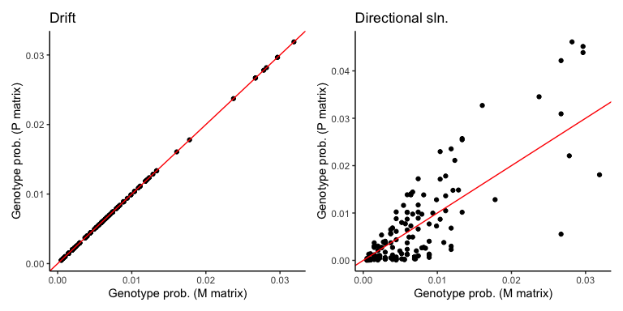

``` r
# AncSR2
print(paste("Correlation between M and P matrices for AncSR2 bg under drift:",cor(M_mat_sr2_ntwrk_statdist,P_drift_sr2_ntwrk_statdist)))
```

    ## [1] "Correlation between M and P matrices for AncSR2 bg under drift: 0.999918991741479"

``` r
print(paste("Correlation between M and P matrices for AncSR2 bg under directional sln:",
            cor(M_mat_sr2_ntwrk_statdist,P_dir_sr2_ntwrk_statdist)))
```

    ## [1] "Correlation between M and P matrices for AncSR2 bg under directional sln: 0.866236719978004"

``` r
c <- data.frame(X=M_mat_sr2_ntwrk_statdist,Y=P_drift_sr2_ntwrk_statdist) %>% ggplot(aes(x=X,y=Y)) + 
  geom_point(fill="black") + geom_abline(slope = 1,intercept = 0,col="red") + theme_classic() + xlab("Genotype prob. (M matrix)") +
  ylab("Genotype prob. (P matrix)") + ggtitle("Drift")

d <- data.frame(X=M_mat_sr2_ntwrk_statdist,Y=P_dir_sr2_ntwrk_statdist) %>% ggplot(aes(x=X,y=Y)) + 
  geom_point(fill="black") + geom_abline(slope = 1,intercept = 0,col="red") + theme_classic() + xlab("Genotype prob. (M matrix)") +
  ylab("Genotype prob. (P matrix)") + ggtitle("Directional sln.")

c+d
```

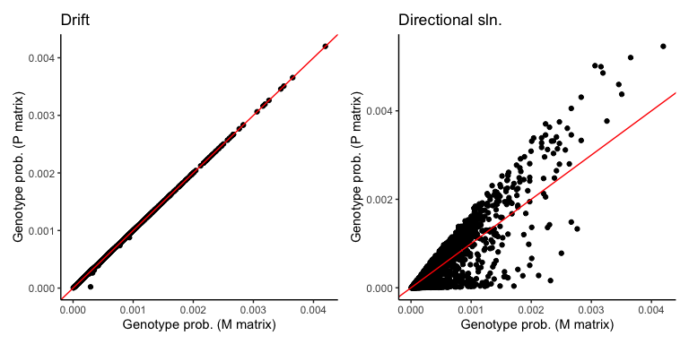

As expected, we see that the stationary distribution of genotypes from `M` and `P` matrices for the random walk scenario are the same. In contrast, directional selection reduces the correlation by ~15-20%.

Let's now explore the questions in more detail. For this, we are interested in characterizing the **Probability Distribution of Functional Variation (PDFV)**, that is, the relative probability of accessing any of the 16 DNA binding elements by single mutations.

For the first question, we are interested in the PDFV that arises through random mutation. That is, the likelihood of a DNA binding phentoype is equal to the proportion of genotypes encoding each function. By including the amino acid-to-function mapping, this can give us an idea of the variational properties of the system.

``` r
# Variational propensities
var.prop_AncSR1_df <- get_PDFV_v2(type="network",Bg="AncSR1",model="Prop.Exp.")
var.prop_AncSR2_df <- get_PDFV_v2(type="network",Bg="AncSR2",model="Prop.Exp.")

# Plot proportional expectations for each DBD
prop_sr1 <- circular_PDFV_v2(var.prop_AncSR1_df,title="AncSR1\nVariational propensity",legend=F)
prop_sr2 <- circular_PDFV_v2(var.prop_AncSR2_df,title="AncSR2\nVariational propensity",legend=F)

prop_sr1 + prop_sr2
```

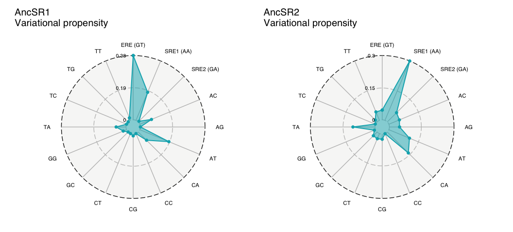

``` r
# Compare the distribution of AncSR2 with the “expected” distribution of AncSR1
exp_sr1 <- phenotypes_tbl %>% filter(specific == "YES" & bg == "AncSR1") %>% ungroup() %>%
  reframe(RE =  REs[[1]],
          count = table(factor(specificity,levels=REs[[1]])),
          prop = count/sum(count))

obs_sr2 <- phenotypes_tbl %>% filter(specific == "YES" & bg == "AncSR2") %>% ungroup() %>%
  reframe(RE =  REs[[1]],
          count = table(factor(specificity,levels=REs[[1]])))

d <- inner_join(exp_sr1,obs_sr2,by="RE") %>% 
  mutate(exp_count = prop * sum(count.y),
         mod_prop = ifelse(prop==0,.Machine$double.xmin,prop), # replace zeroes with .Machine$double.xmin for XNomial test
         mod_exp_count = mod_prop * sum(count.y))

print("P-values from Multinomial Exact test and Chi2 test")
```

    ## [1] "P-values from Multinomial Exact test and Chi2 test"

``` r
xmonte(obs=as.vector(d$count.y),expr = as.vector(d$mod_exp_count))
```

    ## 
    ## P value (LLR) = 0 ± 0

``` r
chisq.test(x=as.vector(d$count.y),p=as.vector(d$mod_prop))
```

    ## 
    ##  Chi-squared test for given probabilities
    ## 
    ## data:  as.vector(d$count.y)
    ## X-squared = 1.1568e+308, df = 15, p-value < 2.2e-16

These figures show the PDFV that arises from random mutation in each DBD background. There are three key results here:

-   The AncSR1 background only produces 10/16 phenotypes upon random mutation, while AncSR2 can produce all 16 phenotypes (Note that this is using AncSR2/SRE1 wt as the functional reference).
-   The PDFV for each DBD background are aligned with the wild-type phenotypes. The most frequently produced phenotype is the wild type-phenotype of each ancestral protein, ERE and SRE1, respectively.
-   The shape of the PDFV changed along the phylogenetic trajectory. The variational properties of AncSR1 and AncSR2 are significantly different (Goodness of fit P-values = 0).

Now let's explore the second question. Since we have already computed the stationary distributions of genotypes for each `P` matrix, we can use these distributions to compute the PDFV at equilibrium.

``` r
##############################
# STATIONARY PDFVs
# AncSR1
stat_pdfv_drift_sr1 <- get_PDFV_v2(P_drift_sr1_ntwrk_statdist,type="simulated mc",Bg="AncSR1",model="Drift")
stat_pdfv_dir_sr1 <- get_PDFV_v2(P_dir_sr1_ntwrk_statdist,type="simulated mc",Bg="AncSR1",model="Dir. sln.")

p1 <- circular_PDFV_v2(list(var.prop_AncSR1_df,stat_pdfv_drift_sr1,stat_pdfv_dir_sr1),cols = c(cols[2:3],"gray60"),title = "AncSR1: Stationary PDFVs")

# AncSR2
stat_pdfv_drift_sr2 <- get_PDFV_v2(P_drift_sr2_ntwrk_statdist,type="simulated mc",Bg="AncSR2",model="Drift")
stat_pdfv_dir_sr2 <- get_PDFV_v2(P_dir_sr2_ntwrk_statdist,type="simulated mc",Bg="AncSR2",model="Dir. sln.")

p2 <- circular_PDFV_v2(list(var.prop_AncSR2_df,stat_pdfv_drift_sr2,stat_pdfv_dir_sr2),cols = c(cols[2:3],"gray60"),title = "AncSR2: Stationary PDFVs",legend = F)

p1+p2
```

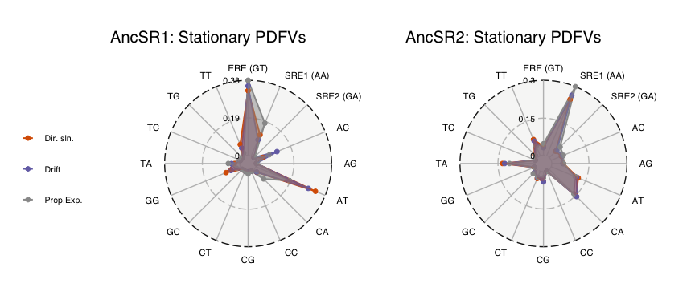

From these figures we can see that the stationary PDFVs in AncSR2 approximates the proportional expectation (variational propensity). In contrast, the stationary PDFVs in AncSR1 deviate from the expected variational propensity. This difference is likely due to the GP map of AncSR2 being more connected, and therefore, evolutionary processes can navigate more efficiently the network and explore the phenotypic space.

Finally, we can use the `M` matrices and their stationary distributions to ask whether the structure of the network is 'aligned' with the selection surface. That is, whether the functional genotypes that are more likely to evolve through random mutation have also higher fitness.

``` r
##############################
# GLOBAL ALIGNMENT OF MUTATION AND SELECTION

# Compute fitness of genotypes variants of main sub-networks and merge with stationary distributions from M-matrices
Aln_matrix_sr1 <- phenotypes_tbl %>% filter(bg == "AncSR1") %>% filter(AA_var %in% names(M_mat_sr1_ntwrk_statdist)) %>% 
  select(AA_var,max_meanF_bREs) %>% mutate(FL = fitness_logistic(max_meanF_bREs,L,k,x_o)) %>%
  inner_join(.,data.frame(AA_var=names(M_mat_sr1_ntwrk_statdist),m_freq=M_mat_sr1_ntwrk_statdist),by="AA_var") 

cor.test(Aln_matrix_sr1$m_freq,Aln_matrix_sr1$FL)
```

    ## 
    ##  Pearson's product-moment correlation
    ## 
    ## data:  Aln_matrix_sr1$m_freq and Aln_matrix_sr1$FL
    ## t = 3.2626, df = 144, p-value = 0.001379
    ## alternative hypothesis: true correlation is not equal to 0
    ## 95 percent confidence interval:
    ##  0.1043587 0.4074426
    ## sample estimates:
    ##       cor 
    ## 0.2623593

``` r
p1 <- Aln_matrix_sr1 %>% pivot_longer(cols=3,names_to="fitness_function",values_to="fitness") %>%
  ggplot(aes(x=m_freq,y=fitness)) + geom_point(shape=21,color="black",fill="gray") +
  geom_smooth(method = "loess",color="black") + theme_classic() + scale_fill_manual(values=c("#b00c59","#219e92")) +
  labs(title = "AncSR1",x="M-matrix stationary distribution of RH genotype",y="Fitness")

Aln_matrix_sr2 <- phenotypes_tbl %>% filter(bg == "AncSR2") %>% filter(AA_var %in% names(M_mat_sr2_ntwrk_statdist)) %>% 
  select(AA_var,max_meanF_bREs) %>% mutate(FL = fitness_logistic(max_meanF_bREs,L,k,x_o)) %>%
  inner_join(.,data.frame(AA_var=names(M_mat_sr2_ntwrk_statdist),m_freq=M_mat_sr2_ntwrk_statdist),by="AA_var")

cor.test(Aln_matrix_sr2$m_freq,Aln_matrix_sr2$FL)
```

    ## 
    ##  Pearson's product-moment correlation
    ## 
    ## data:  Aln_matrix_sr2$m_freq and Aln_matrix_sr2$FL
    ## t = 8.857, df = 2031, p-value < 2.2e-16
    ## alternative hypothesis: true correlation is not equal to 0
    ## 95 percent confidence interval:
    ##  0.1506324 0.2343522
    ## sample estimates:
    ##       cor 
    ## 0.1928433

``` r
p2 <- Aln_matrix_sr2 %>% pivot_longer(cols=3,names_to="fitness_function",values_to="fitness") %>%
  ggplot(aes(x=m_freq,y=fitness)) + geom_point(shape=21,color="black",fill="gray") +
  geom_smooth(method = "loess",color="black") + theme_classic() + scale_fill_manual(values=c("#b00c59","#219e92")) +
  labs(title = "AncSR2",x="M-matrix stationary distribution of RH genotype",y="Fitness")

p1 + p2 
```

    ## `geom_smooth()` using formula = 'y ~ x'
    ## `geom_smooth()` using formula = 'y ~ x'

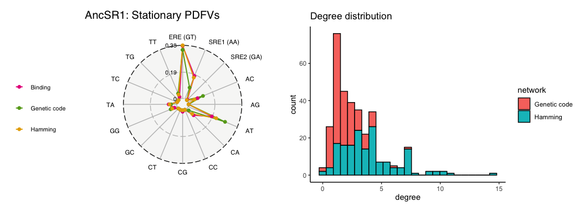

The plots show that mutation and selection are not globally aligned in the GPmaps, that is, the structure of the GPmap do not tend to produce higher fitness genotypes at equilibrium.

### Discrete Markov chains

### Evolution around EGKA on AncSR1 and AncSR2 networks

Let's now focus on the historical trajectory. Based on ASR, we know that the RH genotype on AncSR1 was 'EGKA' - an ERE-specific genotype - and, after 3 amino acid substitutions in the RH, the genotype on AncSR2 was 'GSKV' - an SRE-specific genotype. So we can first ask: What is the phenotypic variation *accessible* to the ancestral EGKA genotype after 3 mutation steps? We can do this on both ancestral DBD backgrounds to further evaluate the effect of the non-RH substitutions that fixed along the phylogenetic interval.

``` r
# run a discrete Markov chain from 'REF_GENOTYPE' of length 'PATH_LENGTH' for different population genetic scenarios
# REF_GENOTYPE' and 'PATH_LENGTH' are global variables
mc_Drift_ref_genotype_sr1 <- simulate_markov_chain(REF_GENOTYPE,P_drift_sr1_ntwrk,n_steps = PATH_LENGTH)
mc_DirSln_ref_genotype_sr1 <- simulate_markov_chain(REF_GENOTYPE,P_dir_sr1_ntwrk,n_steps = PATH_LENGTH)

mc_Drift_ref_genotype_sr2 <- simulate_markov_chain(REF_GENOTYPE,P_drift_sr2_ntwrk,n_steps = PATH_LENGTH)
mc_DirSln_ref_genotype_sr2 <- simulate_markov_chain(REF_GENOTYPE,P_dir_sr2_ntwrk,n_steps = PATH_LENGTH)

# Compute the PDFV from the Markov chains
pdfv_Drift_ref_genotype_sr1 <- get_PDFV_v2(mc_Drift_ref_genotype_sr1,Bg = "AncSR1",model = "Random walk",specific = TRUE,type="simulated mc")
pdfv_DirSln_ref_genotype_sr1 <- get_PDFV_v2(mc_DirSln_ref_genotype_sr1,Bg = "AncSR1",model = "Dir. Sln.",specific = TRUE,type="simulated mc")

pdfv_Drift_ref_genotype_sr2 <- get_PDFV_v2(mc_Drift_ref_genotype_sr2,Bg = "AncSR2",model = "Random walk",specific = TRUE,type="simulated mc")
pdfv_DirSln_ref_genotype_sr2 <- get_PDFV_v2(mc_DirSln_ref_genotype_sr2,Bg = "AncSR2",model = "Dir. Sln.",specific = TRUE,type="simulated mc")

# plots inclusing promiscuous as extra phenotype
p1 <- circular_PDFV_v2(list(pdfv_Drift_ref_genotype_sr1,pdfv_DirSln_ref_genotype_sr1),cols = cols[2:3],title = "AncSR1:EGKA")
p2 <- circular_PDFV_v2(list(pdfv_Drift_ref_genotype_sr2,pdfv_DirSln_ref_genotype_sr2),cols = cols[2:3],title = "AncSR2:EGKA",legend = F)
p1 + p2
```

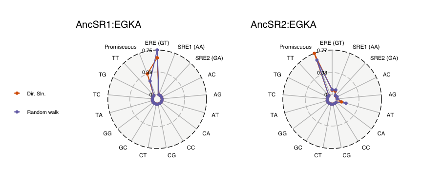

``` r
# plot without promiscuous (re-normalize probs.)
pdfv_Drift_ref_genotype_sr1_b <- pdfv_Drift_ref_genotype_sr1 %>% filter(RE != "Promiscuous") %>% mutate(Norm_F_prob = Norm_F_prob /sum(Norm_F_prob))
pdfv_DirSln_ref_genotype_sr1_b <- pdfv_DirSln_ref_genotype_sr1 %>% filter(RE != "Promiscuous") %>% mutate(Norm_F_prob = Norm_F_prob /sum(Norm_F_prob))

pdfv_Drift_ref_genotype_sr2_b <- pdfv_Drift_ref_genotype_sr2 %>% filter(RE != "Promiscuous") %>% mutate(Norm_F_prob = Norm_F_prob /sum(Norm_F_prob))
pdfv_DirSln_ref_genotype_sr2_b <- pdfv_DirSln_ref_genotype_sr2 %>% filter(RE != "Promiscuous") %>% mutate(Norm_F_prob = Norm_F_prob /sum(Norm_F_prob))

p3 <- circular_PDFV_v2(list(pdfv_Drift_ref_genotype_sr1_b,pdfv_DirSln_ref_genotype_sr1_b),cols = cols[2:3],title = "AncSR1:EGKA")
p4 <- circular_PDFV_v2(list(pdfv_Drift_ref_genotype_sr2_b,pdfv_DirSln_ref_genotype_sr2_b),cols = cols[2:3],title = "AncSR2:EGKA",legend = F)
p3 + p4
```

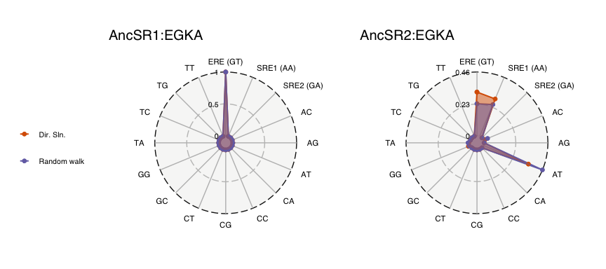

The figures above showed that after 3 mutation steps, the ancestral RH genotype, EGKA, had very different PDFVs on each GP map. From AncSR1 to AncSR2 the probability of retaining the ancestral function decreased, and the probability of evolving SRE1 binding increased. Interestingly, the probability of evolving ATRE binding, a non-historical phenotype, was higher than that of SRE1 on the AncSR2 background.

Let's now explore how the probability of each DNA binding phenotype changes at each step along the Markov chain. We're particularly interested in tracking the change in probability of the derived historical function SRE1 on both DBD backgrounds. We will focus for now on the `P` matrix from the Drift scenario.

``` r
# Number of iterations to run the Markov chain
mc_iter <- 10
SPECIFICITY=TRUE
PROMISCUOUS=TRUE

# Simulations under random walk, directional selection, and stabilizing selection
pdfv_mc_multistep_sr1 <- simulate_markov_chain_multistep(REF_GENOTYPE,P_drift_sr1_ntwrk,mc_iter,"AncSR1",specific = SPECIFICITY)
pdfv_mc_multistep_sr2 <- simulate_markov_chain_multistep(REF_GENOTYPE,P_drift_sr2_ntwrk,mc_iter,"AncSR2",specific = SPECIFICITY)

# re-normalize functions excluding promiscuous
if(!PROMISCUOUS){
  pdfv_mc_multistep_sr1 <- lapply(pdfv_mc_multistep_sr1, function(x) x %>% filter(RE != "Promiscuous") %>% 
                                    mutate(Norm_F_prob = Norm_F_prob /sum(Norm_F_prob)))

  pdfv_mc_multistep_sr2 <- lapply(pdfv_mc_multistep_sr2, function(x) x %>% filter(RE != "Promiscuous") %>% 
                                    mutate(Norm_F_prob = Norm_F_prob /sum(Norm_F_prob)))
}

# Plot the trajectory: Include stationary distributoins and proportional expectations as "extra mutation steps"
stationary_PDFV_sr1 <- get_PDFV_v2(P_drift_sr1_ntwrk_statdist,Bg = "AncSR1",model = mc_iter+1,specific = T,type="simulated mc")
stationary_PDFV_sr2 <- get_PDFV_v2(P_drift_sr2_ntwrk_statdist,Bg = "AncSR2",model = mc_iter+1,specific = T,type="simulated mc")
#s0 <- data.frame(RE=REs[[1]],Norm_F_prob=c(rep(0,2),1,rep(0,13)),model=0)
s0 <- data.frame(RE=REs[[2]],Norm_F_prob=c(rep(0,2),1,rep(0,14)),model=0)
#RE_COLS <- hex_RE_colors
RE_COLS <- c(hex_RE_colors,"Promiscuous"="black")

col_df <- do.call(rbind,pdfv_mc_multistep_sr1) %>% rbind(.,s0,stationary_PDFV_sr1) %>% 
 filter(RE=="SRE1 (AA)")
p1 <- do.call(rbind,pdfv_mc_multistep_sr1) %>% rbind(.,s0,stationary_PDFV_sr1) %>%
  ggplot(aes(x=model,y=Norm_F_prob,color=RE)) +
  geom_line(data=col_df,aes(x=model,y=Norm_F_prob),col="black",linewidth=3) + 
  geom_point() + geom_line() + scale_color_manual(values = RE_COLS) + 
  theme_classic() +
  labs(x="Mutation step",y="Probability",title = paste("AncSR1:",REF_GENOTYPE)) +
  scale_x_continuous(breaks=seq(0,mc_iter+1,1),labels=c(seq(0,mc_iter,1),Inf)) +
  theme(axis.text.x = element_text(size=15),
        axis.text.y = element_text(size=15),
        legend.position = "none")

col_df <- do.call(rbind,pdfv_mc_multistep_sr2) %>% rbind(.,s0,stationary_PDFV_sr2) %>% 
  filter(RE=="SRE1 (AA)")
p2 <- do.call(rbind,pdfv_mc_multistep_sr2) %>% rbind(.,s0,stationary_PDFV_sr2) %>%
  ggplot(aes(x=model,y=Norm_F_prob,color=RE)) +
  geom_line(data=col_df,aes(x=model,y=Norm_F_prob),col="black",linewidth=3) + 
  geom_point() + geom_line() + scale_color_manual(values = RE_COLS) + 
  theme_classic() +
  labs(x="Mutation step",y="Probability",title = paste("AncSR2:",REF_GENOTYPE)) +
  scale_x_continuous(breaks=seq(0,mc_iter+1,1),labels=c(seq(0,mc_iter,1),Inf)) +
  theme(axis.text.x = element_text(size=15),
        axis.text.y = element_text(size=15))

p1 + p2
```

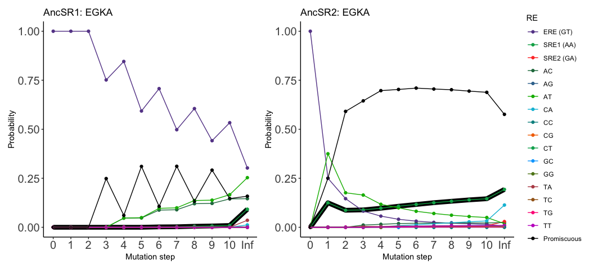

``` r
## heatmap showing the probability of each phenotype per mutation step
#pdfv_mc_multistep_sr1_mat <- do.call(rbind,pdfv_mc_multistep_sr1) %>% rbind(.,s0) %>%
#  pivot_wider(.,names_from="RE",values_from="Norm_F_prob") %>% dplyr::arrange(., model,model) %>%
#  column_to_rownames(var="model") %>%  select(order(names(.))) %>% relocate(`SRE1 (AA)`) %>% relocate(`SRE2 (GA)`, .after=`SRE1 (AA)`) %>% 
#  relocate(`ERE (GT)`, .after=`SRE2 (GA)`) %>% 
#  with(as.matrix(.))
#
#pdfv_mc_multistep_sr2_mat <- do.call(rbind,pdfv_mc_multistep_sr2) %>% rbind(.,s0) %>%
#  pivot_wider(.,names_from="RE",values_from="Norm_F_prob") %>% dplyr::arrange(., model,model) %>%
#  column_to_rownames(var="model") %>% select(order(names(.))) %>% relocate(`SRE1 (AA)`) %>% relocate(`SRE2 (GA)`, .after=`SRE1 (AA)`) %>% 
#  relocate(`ERE (GT)`, .after=`SRE2 (GA)`) %>%
#  with(as.matrix(.))
#
#breaksList <- seq(-1,4,0.1)
#pheatmap(t(pdfv_mc_multistep_sr1_mat[4,]),cluster_rows = F,cluster_cols = F,na_col = "black",
#         border_color = "black",
#         color = colorRampPalette(rev(RColorBrewer::brewer.pal(n = 11, name = "RdYlBu")))(length(breaksList)),
#         breaks = breaksList, legend_labels = seq(-1,4,0.1),scale="row")
#
#pheatmap(t(pdfv_mc_multistep_sr2_mat[4,]),cluster_rows = F,cluster_cols = F,na_col = "black",
#         border_color = "black",
#         color = colorRampPalette(rev(RColorBrewer::brewer.pal(n = 11, name = "RdYlBu")))(length(breaksList)),
#         breaks = breaksList, legend_labels = seq(-1,4,0.1),scale="row")
```

The first figure shows the change in the probability of evolving each phenotype over time when evolution begins from the ancestral EKGA genotype. We see that SRE1 (green+black background) is inaccesible during the first 10 mutation steps on the AncSR1 background, whereas it becomes quickly accessible on the AncSR2 background. However, it becomes the most accessible specificity only 6 mutation steps. This implies that, under the historical conditions, the evolution of SRE1 was not the most likey outcome and, therefore, there was an important role for chance (\*results are robust if we use the directional sln. `P` matrix).

We also know that the AncSR2 network has more promiscuous genotypes, so we can ask what is the effect of accessing promiscuous genotypes for phenotypic evolution.

``` r
## Tracking the number of specific vs promiscuous genotypes at each step of the MC
genotype_types_sr1 <- list()
for(i in 1:mc_iter){
  mc_tmp <- simulate_markov_chain(REF_GENOTYPE,P_drift_sr1_ntwrk,n_steps = i)
  genotype_types_sr1[[i]] <- genotype_type_mc(mc_tmp,Bg="AncSR1",model=i)
}

genotype_types_sr2 <- list()
for(i in 1:mc_iter){
  mc_tmp <- simulate_markov_chain(REF_GENOTYPE,P_drift_sr2_ntwrk,n_steps = i)
  genotype_types_sr2[[i]] <- genotype_type_mc(mc_tmp,Bg="AncSR2",model=i)
}

s0_type <- data.frame(type=c("Specific","Promiscuous"),count=c(1,0),fraction=c(1,0),model=0)

p1 <- do.call(rbind,genotype_types_sr1) %>% rbind(.,s0_type) %>% 
  ggplot(aes(x=model,y=fraction,color=type)) + geom_vline(xintercept = 3,linetype="dashed",col="gray",linewidth=1.2) +
  geom_point() + geom_line() + theme_classic() + scale_color_manual(values = c("black","#c21a0e")) + 
  labs(x="Mutation step",y="Fraction of genotypes",title = paste("AncSR1:",REF_GENOTYPE)) +
  scale_x_continuous(breaks=seq(0,10,1),labels=c(seq(0,10,1))) + theme(legend.position = "none")

p2 <- do.call(rbind,genotype_types_sr2) %>% rbind(.,s0_type) %>% 
  ggplot(aes(x=model,y=fraction,color=type)) + geom_vline(xintercept = 3,linetype="dashed",col="gray",linewidth=1.2) +
  geom_point() + geom_line() + theme_classic() + scale_color_manual(values = c("black","#c21a0e")) + 
  labs(x="Mutation step",y="Fraction of genotypes",title = paste("AncSR2:",REF_GENOTYPE)) +
  scale_x_continuous(breaks=seq(0,10,1),labels=c(seq(0,10,1)))
p1 + p2
```

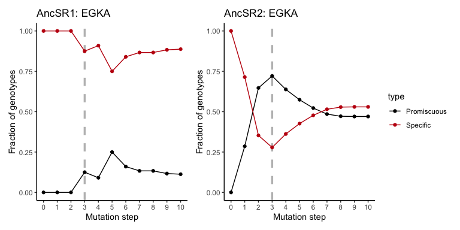

``` r
## Exploration of the phenotypic space 
# Data from 'pdfv_mc_multistep_sr1' and 'pdfv_mc_multistep_sr2', with option 'specific=FALSE'
step_phenotypes <- data.frame(bg=rep(c("AncSR1","AncSR2"),each=3),
                              step=rep(c(1,2,3),times=2),
                              n_phenotypes = c(1,1,2,7,11,15),
                              n_phenotypes_prom = c(0,0,1,4,8,8),
                              n_phenotypes_spec = c(1,1,1,3,3,7)) %>% 
  pivot_longer(cols = 4:5, names_to="type",values_to="n_pheno_split") %>%
  mutate(legend = ifelse(type=="n_phenotypes_prom","Promiscuous","Specific"))

p3 <- step_phenotypes %>% filter(bg=="AncSR1") %>% 
  ggplot(aes(x=step,y=n_pheno_split,fill=legend)) + 
  geom_bar(stat="identity",color="black") +
  scale_fill_manual(name="Genotype type",values = c("#f0e92e","gray")) +
  theme_classic() + scale_y_continuous(limits = c(0,16),breaks = c(4,8,12,16)) +
  labs(x="Mutation step",y="No. of phenotypes") +
  theme(axis.text.x = element_text(size = 17),
        axis.text.y = element_text(size = 17),
        axis.title=element_text(size=12,face="bold"),
        legend.position = "none") +
  geom_text(aes(x=step,label=n_phenotypes,y=n_phenotypes),vjust=-0.2)

p4 <- step_phenotypes %>% filter(bg=="AncSR2") %>% 
  ggplot(aes(x=step,y=n_pheno_split,fill=legend)) + 
  geom_bar(stat="identity",color="black") +
  scale_fill_manual(name="Genotype type",values = c("#f0e92e","gray")) +
  theme_classic() + scale_y_continuous(limits = c(0,16),breaks = c(4,8,12,16)) +
  labs(x="Mutation step",y="No. of phenotypes") +
  theme(axis.text.x = element_text(size = 17),
        axis.text.y = element_text(size = 17),
        axis.title=element_text(size=12,face="bold")) +
  geom_text(aes(x=step,label=n_phenotypes,y=n_phenotypes),vjust=-0.2)

p3 + p4
```

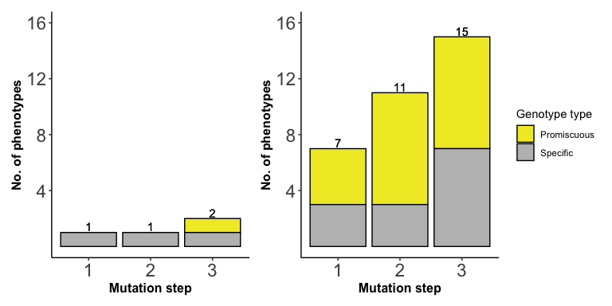

We see that EGKA can access more promiscuous genotypes on AncSR2, and also faster - within few mutations it gains access to more promiscuous genotypes. The second figure shows the effects of accessing promiscuous genotypes for how the ancestral genotype can explore the phenotypic space. First, we see that EGKA quickly explores the phenotypic space on the AncSR2 netwrok: by the third mutation step it has explord 15/16 phenotypes, compared to only 2/16 on the AncSR1 network. Second, we can see that at each step on the AncSR2 network, at least 50% of the new phenotypes are due to access to promiscuous genotypes.

### Phenotypic transitions

Besides asking what phenotypic variation was accessible to the ancestral genotype - EGKA -, we can also ask which phenotypic transitions where more likely to happen at each point in the evolutionary trajectory. That is, we know that the transition ERE--&gt;SRE is what happened during evolution, but we still can ask: 1) what was the likelihood of this transition? and 2) What was the likelihood of all possible phenotypic transitions?

To answer these questions, we can specify Markov chains to simulate evolution on each ancestral genotype network. The initial states for each chain will be the genotypes that bind *specifically* to each DNA element **and** are part of the main network. This specification allows us to estimate the probability of each phenotypic transition averaged over all possible initial states.

``` r
# Phenotypic transitions only between specific genotypes --> change in specificity
pheno_transition_sr1_spec <- phenotypic_transitions(from=REs[[1]],to=REs[[1]],tr_mat=P_drift_sr1_ntwrk,bg = "AncSR1",n_steps = PATH_LENGTH,specific = T)
pheno_transition_sr2_spec <- phenotypic_transitions(from=REs[[1]],to=REs[[1]],tr_mat=P_drift_sr2_ntwrk,bg = "AncSR2",n_steps = PATH_LENGTH,specific = T)

# optional: compute global transition probs --> from all specific genotype in main network to every specific genotype
# AncSR1 network
spec_nodes_sr1 <- phenotypes_tbl %>% filter(specific=="YES" & bg=="AncSR1") %>% pull(AA_var)
ntwrk_transition_sr1 <- phenotypic_transitions(from=NULL,from_nodes = spec_nodes_sr1,tr_mat=P_drift_sr1_ntwrk,
                                               bg = "AncSR1",n_steps = PATH_LENGTH,specific = T)
ntwrk_transition_sr1 <- apply(ntwrk_transition_sr1,2,sum,na.rm=T)
ntwrk_transition_sr1 <- as.matrix(t(ntwrk_transition_sr1/sum(ntwrk_transition_sr1))); rownames(ntwrk_transition_sr1) <- "Network"
pheno_transition_sr1_spec <- rbind(ntwrk_transition_sr1,pheno_transition_sr1_spec)

# AncSR2 network
spec_nodes_sr2 <- phenotypes_tbl %>% filter(specific=="YES" & bg=="AncSR2") %>% pull(AA_var)
ntwrk_transition_sr2 <- phenotypic_transitions(from=NULL,from_nodes = spec_nodes_sr2,tr_mat=P_drift_sr2_ntwrk,
                                               bg = "AncSR2",n_steps = PATH_LENGTH,specific = T)
ntwrk_transition_sr2 <- apply(ntwrk_transition_sr2,2,sum,na.rm=T)
ntwrk_transition_sr2 <- as.matrix(t(ntwrk_transition_sr2/sum(ntwrk_transition_sr2))); rownames(ntwrk_transition_sr2) <- "Network"
pheno_transition_sr2_spec <- rbind(ntwrk_transition_sr2,pheno_transition_sr2_spec)

# plot
#breaksList <- seq(0,1,0.1)
#pheatmap(pheno_transition_sr1_spec,cluster_rows = F,cluster_cols = F,na_col = "black",
#         border_color = "black",
#         color = colorRampPalette(rev(RColorBrewer::brewer.pal(n = 11, name = "RdYlBu")))(length(breaksList)), 
#         breaks = breaksList, legend_labels = seq(0,1,0.2))
#
#pheatmap(pheno_transition_sr2_spec,cluster_rows = F,cluster_cols = F,na_col = "black",
#         border_color = "black",
#         color = colorRampPalette(rev(RColorBrewer::brewer.pal(n = 11, name = "RdYlBu")))(length(breaksList)), 
#         breaks = breaksList, legend_labels = seq(0,1,0.2))

# scaled probabilities
pheno_transition_sr1_spec_scaled <- t(apply(pheno_transition_sr1_spec,1,scale)); colnames(pheno_transition_sr1_spec_scaled) <- REs[[1]]
pheno_transition_sr2_spec_scaled <- t(apply(pheno_transition_sr2_spec,1,scale)); colnames(pheno_transition_sr2_spec_scaled) <- REs[[1]]

breaksList <- seq(-1,4,0.1)
pheatmap(pheno_transition_sr1_spec_scaled,cluster_rows = F,cluster_cols = F,na_col = "black",
         border_color = "black",
         color = colorRampPalette(rev(RColorBrewer::brewer.pal(n = 11, name = "RdYlBu")))(length(breaksList)), 
         breaks = breaksList, legend_labels = seq(-1,4,0.2))
```

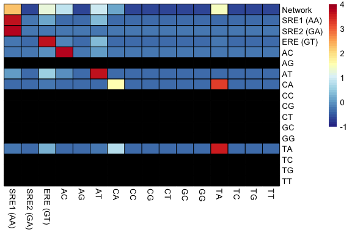

``` r
pheatmap(pheno_transition_sr2_spec_scaled,cluster_rows = F,cluster_cols = F,na_col = "black",
         border_color = "black",
         color = colorRampPalette(rev(RColorBrewer::brewer.pal(n = 11, name = "RdYlBu")))(length(breaksList)), 
         breaks = breaksList, legend_labels = seq(-1,4,0.2))
```

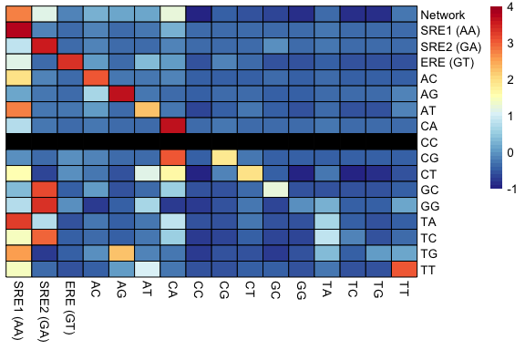

These plots show two very contrasting patterns: On the one hand, on AncSR1 genetic background, SRE1 was only more likely to evolve if evolution had started from GA-specific genotyes. In most cases, the most likely event was to remain on the same phenotype. On the other hand, on AncSR2 genetic background, SRE1 is amogst the most likely phenotypes to evolve from almost all phenotypes. An interesting similarity between both backgrounds, is that when integrating the evolutionary trajectory over the entire network, SRE1 is the most likely phenotype to evolve. However, the historical phenotypic transition (ERE --&gt; SRE1), was very unlikely on AncSR1 but becomes a high-probability transition on AncSR2, suggesting that the GP map and its features evolved along the phylogenetic interval.

We can also see that in almost every case (on both backgrounds), the most likely event is to remain with the same DNA binding specificity. This suggests that robustness is an intrinsic feature of these GP maps, and need not be a "selected" feature.

Overall, the AncSR2 genetic background has two interesting patterns: First, we observed before pattern of *phenotype bias* where SRE1 is the most likely phenotype to arise by random mutation; second, we can now observe a pattern of *phenotypic transition bias* where the evolutionary transition X --&gt; SRE1 is the most likely to occur. This highlights the importance of the structure of the GP map on phenotypic evolution (\* all the results are robust if we use the directional sln. `P` matrix).

### References

1.  Gillespie J. Molecular Evolution Over the Mutational Landscape. Evolution (N Y). 1984;38: 1116–1129.
2.  Mccandlish DM, Stoltzfus A. Modeling Evolution Using the Probability of Fixation: History and Implications. Q Rev Biol. 2014;89: 225–252.
3.  Maynard-Smith J. Natural Selection and the Concept of a Protein Space. Nature. 1970;225: 726–734.
4.  King JL, Jukes TH. Non-Darwinian evolution. Science. 1969. pp. 788–798. <doi:10.1126/science.164.3881.788>
