Genotype-phenotype distributions
================
Jaeda Patton
2023-05-10

## Loading data and functions

``` r
# load general functions
source(file.path(basedir, "scripts", "general_functions.R"))

# reading in cleaned data from binned sort experiment

# reading in complete fluorescence data
AncSR1_meanF_data <- read.csv(file.path(basedir, "results", 
                                        "mutation_effects_model",
                                        "AncSR1_complete_data.csv.gz"), 
                              stringsAsFactors = TRUE)
AncSR2_meanF_data <- read.csv(file.path(basedir, "results", 
                                        "mutation_effects_model",
                                        "AncSR2_complete_data.csv.gz"), 
                              stringsAsFactors = TRUE)
meanF_data <- bind_rows(AncSR1 = AncSR1_meanF_data, AncSR2 = AncSR2_meanF_data, 
                        .id = "bg") %>%
  mutate(RE = factor(RE, levels = levels(REs[[1]])))
rm(AncSR1_meanF_data, AncSR2_meanF_data)
```

## How many functional variants are there in each ancestral background?

We define “functional” variants as those with fluorescence at least as
high as that of AncSR2-WT:SRE1. This is our reference variant.

``` r
# defining minimum fluorescence cutoff for functional variants
AncSR2WT_SRE1_data <- meanF_data %>% 
  filter(AA_var == "GSKV", bg == "AncSR2", RE == "SRE1 (AA)")
```

To classify variants as functional vs. nonfunctional, we will test
whether their fluorescence is significantly lower than that of the
reference variant. If it is, then variants are classified as
nonfunctional, otherwise they are considered functional.

Since our fluorescence estimates come from different sources (observed
vs. inferred), we will use different tests to classify the variants
whose fluorescence is estimated from the binned sort data, the debulk
sort data, and the mutation effects models:

1.  Variants that are classified as having null fluorescence from the
    debulk sort data (see `data_cleaning.md`) are considered
    nonfunctional.
2.  Variants whose fluorescence is estimated from the binned sort data
    have been observed in at least two replicates (most in three
    replicates). We will use a t-test to test the null hypothesis that
    their fluorescence is greater than or equal to that of the reference
    variant.
3.  Variants whose fluorescence is estimated from the mutation effects
    model have only a single predicted fluorescence value. To generate a
    p-value for these variants, we will use a nonparametric bootstrap
    test to test the same null hypothesis as in the t-test. This
    approach takes advantage of the fact that we can use the prediction
    error observed during model cross-validation as an estimate of the
    error associated with each predicted variant’s fluorescence. For
    each variant with predicted fluorescence $F_{\text{test}}$, we will
    take the distribution of cross-validation residuals in the interval
    $F_{\text{test}} \pm 0.1$ as an estimate of the error distribution
    for that variant. We will then create bootstrap fluorescence samples
    from this error distribution and compute the p-value as the fraction
    of the bootstrap sample with fluorescence greater than or equal to
    the reference variant. This will be done separately for AncSR1
    vs. AncSR2 variants, since the models were fit separately for each
    protein background and thus have different error distributions.

A false-discovery rate threshold of 0.1 will be used to classify
variants as functional vs. nonfunctional.

``` r
# Compute p-value for calling variants functional that were observed in the 
# binned sort experiment.
#
# H0: Variant is at least as fluorescent as reference variant.
# HA: Variant is less fluorescent than reference variant.
# Use a t-test and FDR-adjusted p-value. Variants with padj < 0.1 are called nonfunctional.

# get active (not null) variants
# meanF_data_active <- meanF_data %>% 
#   filter(active) %>%
#   mutate(RE = factor(RE, levels = levels(REs[[1]])))

# test for normality of measurement error for observed active variants
# m.error.active <- meanF_data_active %>%
#   filter(type == "binned") %>%
#   select(avg_meanF, meanF_REP1:meanF_REP4) %>%
#   pivot_longer(meanF_REP1:meanF_REP4, names_to = "rep", values_to = "obs") %>%
#   mutate(e = obs - avg_meanF) %>%
#   pull(e)
# m.error.active <- m.error.active[!is.na(m.error.active)]
# hist(m.error.active, freq = FALSE)
# abline(v = 0)
# error.normal.fit <- fitdistr(m.error.active, "normal")
# lines(seq(-.2, .2, 0.01), dnorm(seq(-.2, .2, 0.01), error.normal.fit$estimate[1], error.normal.fit$estimate[2]))

# compute p-values with Mann-Whitney U test
# pfunctional <- apply(meanF_data_active %>% 
#                        filter(type == "binned") %>%
#                        select(meanF_REP1:meanF_REP4), 
#                      1, function(x) 
#                        wilcox.test(AncSR2WT_SRE1_data %>% 
#                                      select(meanF_REP1:meanF_REP3) %>%
#                                      as.numeric(), x,
#                                    alternative = "greater")$p.value)
# # FDR correction
# padjfunctional <- p.adjust(pfunctional, "fdr")

# pfunctionalt <- meanF_data_active %>%
#   filter(type == "binned") %>%
#   select(meanF_REP1:meanF_REP4) %>%
#   apply(1, function(x) t.test(as.numeric(x),
#                               AncSR2WT_SRE1_data %>%
#                                 select(meanF_REP1:meanF_REP3) %>%
#                                 as.numeric(),
#                               "less", na.action = "na.omit")$p.value)
# padjfunctionalt <- p.adjust(pfunctionalt, "fdr")
# data.frame(f = meanF_data_active %>% filter(type == "binned") %>% pull(avg_meanF),
#            sig = padjfunctionalt <= 0.1) %>%
#   ggplot(aes(x = f, fill = sig)) +
#   geom_histogram() +
#   geom_vline(xintercept = AncSR2WT_SRE1_data$avg_meanF)

if(!file.exists(file.path(results_dir, "pbinned.rda"))) {
  pbinned <- apply(select(data, meanF_REP1:meanF_REP4), 1, function(x)
      t.test(as.numeric(x), 
             as.numeric(select(AncSR2WT_SRE1_data, meanF_REP1:meanF_REP4)),
             "less", na.action = "na.omit")$p.value)
  save(pbinned, file = file.path(results_dir, "pbinned.rda"))
} else load(file.path(results_dir, "pbinned.rda"))
```

``` r
# For variants with predicted fluorescence from reference-free model, test for
# fluorescence less than the reference with a nonparametric bootstrap test,
# where bootstrapped fluorescence samples are taken from the cross-validation
# error distribution for variants with fluorescence similar to that of the test
# variant. This method helps to account for the non-normal error distributions
# observed for high predicted fluorescence values.
#
# H0: Variant is at least as fluorescent as reference variant.
# HA: Variant is less fluorescent than reference variant.
# Adjust p-value using FDR correction. Variants with padj < 0.1 are called 
# nonfunctional.

# First test AncSR1 predicted variants

# first load the cross-validation fits from the model fitting
load(file.path(basedir, "results", "mutation_effects_model", 
               "AncSR1.cv.pred.fine.rda"))
load(file.path(basedir, "results", "mutation_effects_model", "AncSR1_foldid.rda"))
load(file.path(basedir, "results", "mutation_effects_model", 
               "AncSR1_model_data.rda"))
AncSR1.cv.pred <- lapply(AncSR1.cv.pred.fine, function(x) as.numeric(x[,10]))

AncSR1.cv.obs <- lapply(1:10, function(x) 
  AncSR1_model_data$avg_meanF[AncSR1_foldid == x])

rm(AncSR1.cv.pred.fine, AncSR1_foldid, AncSR1_model_data)

# concatenate fits across all 10 cross-validation folds
AncSR1.cv <- data.frame(pred = unlist(AncSR1.cv.pred, use.names = FALSE),
                        obs = unlist(AncSR1.cv.obs, use.names = FALSE))
# ggplot(AncSR1.cv, aes(x = pred, y = obs)) +
#   geom_bin_2d() +
#   scale_fill_continuous(trans = log10plus1) +
#   geom_hline(yintercept = min(meanF_data %>% filter(type == "predicted", bg == "AncSR1", active) %>% pull(avg_meanF)), linetype = 2) +
#   geom_vline(xintercept = min(meanF_data %>% filter(type == "predicted", bg == "AncSR1", active) %>% pull(avg_meanF)), linetype = 2) +
#   geom_hline(yintercept = AncSR2WT_SRE1_data$avg_meanF, linetype = 2, color = "gray") +
#   geom_vline(xintercept = AncSR2WT_SRE1_data$avg_meanF, linetype = 2, color = "gray")

# compute residuals
AncSR1.cv$res <- AncSR1.cv$pred - AncSR1.cv$obs

# Bootstrap predicted fluorescence based on CV error distributions. For each
# predicted variant, sample from the distribution of CV residuals concatenated
# across all 10 CV folds, within a range of +/- 0.1 of the predicted
# fluorescence. Sample 250 bootstrap samples per replicate.

if(!file.exists(file.path(results_dir, "bspred.AncSR1.rda"))) {
  # parallel processing
  cores <- 24
  cl <- parallel::makeCluster(cores, "FORK", outfile = "")
  registerDoParallel(cl)
  bspred.AncSR1 <- foreach(i = 1:cores, .combine = 'cbind') %dopar% {
    data <- meanF_data %>% filter(type == "predicted", bg == "AncSR1")
    
    # split data into chunks
    size <- nrow(data)
    chunksize <- ceiling(size / cores)
    chunk <- data[((i - 1) * chunksize + 1):min(i * chunksize, size),]
    
    # create bootstrap reps
    sapply(chunk$avg_meanF, function(x) {
      # residual distribution centered around meanF of test variant
      res <- AncSR1.cv %>% filter(pred > x - 0.1 & pred < x + 0.1) %>% pull(res)
      # bootstrap
      sample(x + res, 250, replace = TRUE)
    })
  }
  stopCluster(cl)
  colnames(bspred.AncSR1) <- meanF_data %>% 
    filter(type == "predicted", bg == "AncSR1") %>% select(AA_var, RE) %>%
    unite(AA_var, RE, col = "var") %>% pull(var)
  save(bspred.AncSR1, file = file.path(results_dir, "bspred.AncSR1.rda"))
} else load(file.path(results_dir, "bspred.AncSR1.rda"))

# AncSR1.pred.bs <- sapply(meanF_data %>% 
#                            filter(type == "predicted", bg == "AncSR1") %>%
#                            pull(avg_meanF), function(x) {
#   res <- AncSR1.cv %>% filter(pred > x - 0.1 & pred < x + 0.1) %>% pull(res)
#   sample(x + res, 250, replace = TRUE)
# })

# Compute p-value for functional variants as fraction of bootstrap replicates
# that are greater than or equal to that of the mean AncSR2:SRE1 WT variant.
if(!file.exists(file.path(results_dir, "ppredicted.AncSR1.rda"))) {
  ppredicted.AncSR1 <- apply(bspred.AncSR1, 2, function(x) 
    sum(x >= AncSR2WT_SRE1_data$avg_meanF) / 250)
  save(ppredicted.AncSR1, file = file.path(results_dir, "ppredicted.AncSR1.rda"))
} else load(file.path(results_dir, "ppredicted.AncSR1.rda"))
```

``` r
# Repeat for AncSR2 predicted variants

# first load the cross-validation fits from the model fitting
load(file.path(basedir, "results", "mutation_effects_model", 
               "AncSR2.cv.pred.fine.rda"))
load(file.path(basedir, "results", "mutation_effects_model", "AncSR2_foldid.rda"))
load(file.path(basedir, "results", "mutation_effects_model", 
               "AncSR2_model_data.rda"))
AncSR2.cv.pred <- lapply(AncSR2.cv.pred.fine, function(x) as.numeric(x[,13]))

AncSR2.cv.obs <- lapply(1:10, function(x)
  AncSR2_model_data$avg_meanF[AncSR2_foldid == x])

rm(AncSR2.cv.pred.fine, AncSR2_foldid, AncSR2_model_data)

# concatenate fits across all 10 cross-validation folds
AncSR2.cv <- data.frame(pred = unlist(AncSR2.cv.pred, use.names = FALSE),
                        obs = unlist(AncSR2.cv.obs, use.names = FALSE))

# compute residuals
AncSR2.cv$res <- AncSR2.cv$pred - AncSR2.cv$obs
# Bootstrap predicted fluorescence based on CV error distributions. For each
# predicted variant, sample from the distribution of CV residuals concatenated
# across all 10 CV folds, within a range of +/- 0.1 of the predicted
# fluorescence. Sample 250 bootstrap samples per replicate.

if(!file.exists(file.path(results_dir, "bspred.AncSR2.rda"))) {
  # parallel processing
  cores <- 24
  cl <- parallel::makeCluster(cores, "FORK", outfile = "")
  registerDoParallel(cl)
  bspred.AncSR2 <- foreach(i = 1:cores, .combine = 'cbind') %dopar% {
    data <- meanF_data %>% filter(type == "predicted", bg == "AncSR2")
    
    # split data into chunks
    size <- nrow(data)
    chunksize <- ceiling(size / cores)
    chunk <- data[((i - 1) * chunksize + 1):min(i * chunksize, size),]
    
    # create bootstrap reps
    sapply(chunk$avg_meanF, function(x) {
      # residual distribution centered around meanF of test variant
      res <- AncSR2.cv %>% filter(pred > x - 0.1 & pred < x + 0.1) %>% pull(res)
      # bootstrap
      sample(x + res, 250, replace = TRUE)
    })
  }
  stopCluster(cl)
  colnames(bspred.AncSR2) <- meanF_data %>% 
    filter(type == "predicted", bg == "AncSR2") %>% select(AA_var, RE) %>%
    unite(AA_var, RE, col = "var") %>% pull(var)
  save(bspred.AncSR2, file = file.path(results_dir, "bspred.AncSR2.rda"))
} else load(file.path(results_dir, "bspred.AncSR2.rda"))

# AncSR2.pred.bs <- sapply(meanF_data %>% 
#                            filter(type == "predicted", bg == "AncSR2") %>%
#                            pull(avg_meanF), function(x) {
#   res <- AncSR2.cv %>% filter(pred > x - 0.1 & pred < x + 0.1) %>% pull(res)
#   sample(x + res, 250, replace = TRUE)
# })

# Compute p-value for functional variants as fraction of bootstrap replicates
# that are greater than or equal to that of the mean AncSR2:SRE1 WT variant.
if(!file.exists(file.path(results_dir, "ppredicted.AncSR2.rda"))) {
  ppredicted.AncSR2 <- apply(bspred.AncSR2, 2, function(x) 
    sum(x >= AncSR2WT_SRE1_data$avg_meanF) / 250)
  save(ppredicted.AncSR2, file = file.path(results_dir, "ppredicted.AncSR2.rda"))
} else load(file.path(results_dir, "ppredicted.AncSR2.rda"))
```

``` r
# classify variants as functional if padj >= 0.1 (not significantly less 
# fluorescent than AncSR2:SRE1 WT)
meanF_data <- rbind(meanF_data %>% 
                      filter(type == "binned") %>%
                      mutate(p = pbinned),
                    meanF_data %>%
                      filter(type == "predicted", bg == "AncSR1") %>%
                      mutate(p = ppredicted.AncSR1),
                    meanF_data %>%
                      filter(type == "predicted", bg == "AncSR2") %>%
                      mutate(p = ppredicted.AncSR2),
                    meanF_data %>%
                      filter(type == "debulk") %>%
                      mutate(p = 0)) %>%
  mutate(padj = p.adjust(p, "fdr"), functional = padj >= 0.1) %>%
  arrange(bg, AA_var, RE)

# export data
write.csv(meanF_data %>% filter(functional) %>% select(bg:meanF_REP4), 
          file = gzfile(file.path(results_dir, "meanF_data_fxnal.csv.gz"), 
                        compression = 9),
          row.names = FALSE)

# plot histogram of fluorescence colored by functional vs. not functional
ggplot(meanF_data, aes(x = avg_meanF, fill = type, alpha = functional)) +
  geom_histogram(position = "stack") +
  scale_y_continuous(trans = log10plus1, name = "Count + 1") +
  scale_alpha_manual(values = c(0.6, 1)) +
  geom_vline(xintercept = AncSR2WT_SRE1_data$avg_meanF, 
             color = "gray30", linetype = 2) +
  facet_grid(cols = vars(bg)) +
  theme_classic() +
  labs(x = "Fluorescence")
```

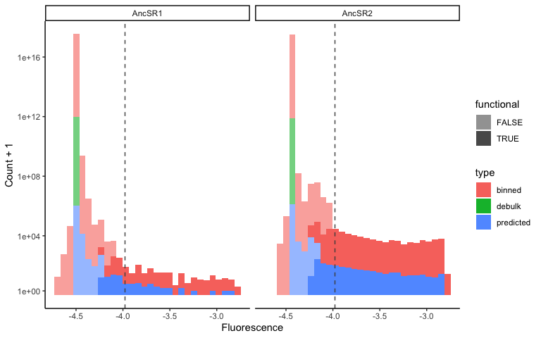<!-- -->

The histograms above show the distribution of fluorescence for variants
classified as functional vs. nonfunctional. The vertical dashed line
shows the fluorescence of the reference variant.

Let’s look at the number of variants classified as functional on each
ancestral background.

``` r
# print number of variants (protein:RE) classified as functional on each 
# background
meanF_data %>%
  group_by(bg, type) %>%
  filter(type != "debulk") %>%
  summarize(count = sum(functional)) %>%
  pivot_wider(names_from = type, values_from = count) %>%
  mutate(all = binned + predicted, fraction.total = all / 2560000) %>%
  knitr::kable(caption = "Number of functional protein:RE variants")
```

| bg     | binned | predicted |  all | fraction.total |
|:-------|-------:|----------:|-----:|---------------:|
| AncSR1 |    192 |       114 |  306 |      0.0001195 |
| AncSR2 |   3762 |      1270 | 5032 |      0.0019656 |

Number of functional protein:RE variants

``` r
# plot as bar plot
fxnalproteinREbgplot <- meanF_data %>%
  filter(functional) %>%
  ggplot(aes(x = bg, fill = bg)) +
  geom_bar() +
  geom_text(stat = "count", 
            aes(label = paste0(..count.., " (", 
                               signif(..count.. / 2560000 * 100, 2), "%)")), 
            vjust = -1, size = 4) +
  # geom_text(stat = "count", 
  #           aes(label = paste0(signif(..count.. / 2560000 * 100, 2), "%")), 
  #           vjust = -1, size = 4) +
  scale_y_continuous(expand = expansion(mult = c(0.05, 0.1))) +
  scale_fill_manual(values = bg_color(), drop = FALSE) +
  xlab("Ancestral background") +
  ylab("Number of functional protein:RE variants") +
  theme_classic() +
  theme(text = element_text(size = fontsize),
        legend.text = element_text(size = fontsize),
        strip.background = element_blank(),
        strip.text = element_blank(),
        legend.position = "none") +
  guides(x = guide_axis(angle = 45))

# print number of protein variants classified as functional on each background
meanF_data %>%
  group_by(bg, AA_var) %>%
  summarize(functional = sum(functional) > 0) %>%
  group_by(bg) %>%
  summarize(count = sum(functional)) %>%
  mutate(fraction.total = count / 160000) %>%
  knitr::kable(caption = "Number of functional protein variants")
```

| bg     | count | fraction.total |
|:-------|------:|---------------:|
| AncSR1 |   259 |      0.0016187 |
| AncSR2 |  2390 |      0.0149375 |

Number of functional protein variants

``` r
# plot as bar plot
fxnalproteinbgplot <- meanF_data %>%
  group_by(bg, AA_var) %>%
  summarize(functional = sum(functional) > 0) %>%
  filter(functional) %>%
  ggplot(aes(x = bg, fill = bg)) +
  geom_bar() +
  geom_text(stat = "count", 
            aes(label = paste0(..count.., " (", 
                               signif(..count.. / 160000 * 100, 2), "%)")), 
            vjust = -1, size = 4) +
  # geom_text(stat = "count", 
  #           aes(label = paste0(signif(..count.. / 160000 * 100, 2), "%")), 
  #           vjust = -1, size = 4) +
  scale_y_continuous(expand = expansion(mult = c(0.05, 0.1))) +
  scale_fill_manual(values = bg_color(), drop = FALSE) +
  xlab("Ancestral background") +
  ylab("Number of functional protein variants") +
  theme_classic() +
  theme(text = element_text(size = fontsize),
        legend.text = element_text(size = fontsize),
        strip.background = element_blank(),
        strip.text = element_blank(),
        legend.position = "none") +
  guides(x = guide_axis(angle = 45))

fxnalproteinREbgplot + fxnalproteinbgplot
```

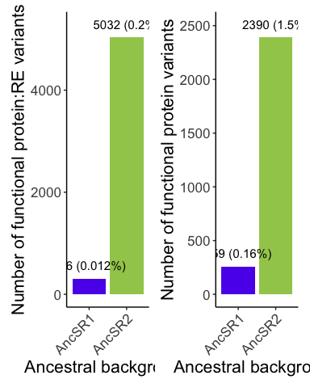<!-- -->

``` r
# histogram of fluorescence colored by FDR <= 0.15
# meanF_data_active %>%
#   ggplot(aes(x = avg_meanF, fill = padjfunctional <= 0.15)) +
#   geom_histogram() +
#   geom_vline(xintercept = AncSR2WT_SRE1_data$avg_meanF) +  # fluorescence of reference
#   theme_classic() +
#   labs(title = "active variants", x = "fluorescence", fill = "significant")
# 
# meanF_data_functional <- meanF_data_active %>% filter(padjfunctional > 0.15)
```

## What is the mechanism behind more functional variants in the AncSR2 vs. AncSR1 background?

``` r
# get protein:RE variants that are functional in both backgrounds
meanF_data_fxnal <- meanF_data %>%
  select(bg:meanF_REP4, functional) %>%
  pivot_wider(names_from = bg, values_from = avg_meanF:functional) %>%
  filter(functional_AncSR1 | functional_AncSR2)

# How many variants that are functional in at least one ancestral background 
# have higher fluorescence in AncSR2? Use a nonparametric bootstrap test (like 
# the one used above for classifying functional variants) for variants with 
# model-predicted fluorescence in at least one background; for all others, use a 
# t-test.
if(!file.exists(file.path(results_dir, "phigherAncSR2.rda"))) {
  nbootstrap <- 1000
  phigherAncSR2 <- numeric(length = nrow(meanF_data_fxnal))
  for(i in 1:nrow(meanF_data_fxnal)) {
    # if fluorescence is from binned sort in both backgrounds, use a t-test
    if(meanF_data_fxnal$type_AncSR1[i] == "binned" && 
       meanF_data_fxnal$type_AncSR2[i] == "binned") {
      p <- t.test(meanF_data_fxnal %>% slice(i) %>% 
                    select(grep("meanF_REP._AncSR1", 
                                colnames(meanF_data_fxnal), 
                                value = T)),
                  meanF_data_fxnal %>% slice(i) %>% 
                    select(grep("meanF_REP._AncSR2", 
                                colnames(meanF_data_fxnal), 
                                value = T)),
                  alternative = "less",
                  na.action = "na.omit")$p.value
    } 
    # if fluorescence is model-predicted in either background, use bootstrap test
    else if(meanF_data_fxnal$type_AncSR1[i] == "predicted" ||
              meanF_data_fxnal$type_AncSR2[i] == "predicted") {
      meanF_AncSR1 <- meanF_data_fxnal$avg_meanF_AncSR1[i]
      meanF_AncSR2 <- meanF_data_fxnal$avg_meanF_AncSR2[i]
      if(meanF_data_fxnal$type_AncSR1[i] == "predicted") {
        # residual distribution centered around meanF of AncSR1 test variant
        res <- AncSR1.cv %>% 
          filter(pred > meanF_AncSR1 - 0.1 & pred < meanF_AncSR1 + 0.1) %>% 
          pull(res)
        # bootstrap
        meanF_AncSR1 <- sample(meanF_AncSR1 + res, nbootstrap, replace = TRUE)
      }
      if(meanF_data_fxnal$type_AncSR2[i] == "predicted") {
        # residual distribution centered around meanF of AncSR2 test variant
        res <- AncSR2.cv %>% 
          filter(pred > meanF_AncSR2 - 0.1 & pred < meanF_AncSR2 + 0.1) %>% 
          pull(res)
        # bootstrap
        meanF_AncSR2 <- sample(meanF_AncSR2 + res, nbootstrap, replace = TRUE)
      }
      p <- sum(meanF_AncSR1 >= meanF_AncSR2) / nbootstrap
    } 
    # if fluorescence inferred null in AncSR1 from debulk sort, use a t-test
    else if(meanF_data_fxnal$type_AncSR1[i] == "debulk") {
      p <- t.test(meanF_data_fxnal %>% slice(i) %>% 
                    select(grep("meanF_REP._AncSR2", 
                                colnames(meanF_data_fxnal), 
                                value = T)),
                  alternative = "greater",
                  mu = meanF_data_fxnal$avg_meanF_AncSR1[i],
                  na.action = "na.omit")$p.value
    } 
    # if fluorescence is inferred null in AncSR2 from debulk sort, then it cannot 
    # be higher in AncSR1
    else if(meanF_data_fxnal$type_AncSR2[i] == "debulk") {
      p <- 1
    }
    phigherAncSR2[i] <- p
  }
  
  save(phigherAncSR2, file = file.path(results_dir, "phigherAncSR2.rda"))
} else load(file.path(results_dir, "phigherAncSR2.rda"))

# FDR correction
padjhigherAncSR2 <- p.adjust(phigherAncSR2, "fdr")
print(paste("variants with higher fluorescence in AncSR2:", 
            sum(padjhigherAncSR2 < 0.05)))
```

    ## [1] "variants with higher fluorescence in AncSR2: 4090"

``` r
print(paste("Fraction variants with higher fluorescence in AncSR2 out of those that are functional in either background:", 
            sum(padjhigherAncSR2 < 0.05) / nrow(meanF_data_fxnal)))
```

    ## [1] "Fraction variants with higher fluorescence in AncSR2 out of those that are functional in either background: 0.800704776820673"

``` r
# plot fluorescence in each background colored by significance
bgfluorscatterplot <- meanF_data_fxnal %>%
  mutate(padj = padjhigherAncSR2) %>%
  ggplot(aes(x = avg_meanF_AncSR1, y = avg_meanF_AncSR2, color = padj < 0.05)) +
  geom_point(alpha = 0.5) +
  scale_color_discrete(labels = c(paste0("Not significant (", 
                                         signif((1 - sum(padjhigherAncSR2 < 0.05) / 
                                                   nrow(meanF_data_fxnal)) * 100, 2), "%)"),
                                  paste0("Significant (", 
                                         signif(sum(padjhigherAncSR2 < 0.05) / 
                                                  nrow(meanF_data_fxnal) * 100, 2), "%)")),
                       name = "Higher fluorescence in\nAncSR2 background") +
  labs(x = "Fluorescence in AncSR1 background",
       y = "Fluorescence in AncSR2 background") +
  geom_abline(slope = 1, intercept = 0, color = "red") +
  theme_classic()
bgfluorscatterplot
```

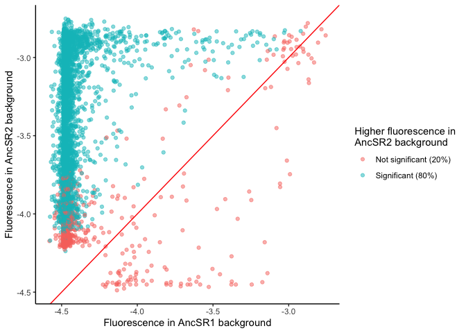<!-- -->

``` r
# boxplot of the distribution of fluorescence in each background; p-value from 
# Wilcoxon paired-sample test
bgfluorboxplot <- meanF_data_fxnal %>%
  select(AA_var:avg_meanF_AncSR2) %>%
  pivot_longer(3:4, names_to = "bg", names_prefix = "avg_meanF_", 
               values_to = "avg_meanF") %>%
  ggplot(aes(x = bg, y = avg_meanF, fill = bg)) +
  # geom_violin(width = 2, draw_quantiles = c(0.25, 0.5, 0.75)) +
  stat_boxplot() +
  # stat_summary(geom = "point", fun = "median") +
  geom_signif(comparisons = list(c("AncSR1", "AncSR2")), test = "wilcox.test",
              test.args = list(alternative = "less", paired = TRUE), 
              map_signif_level = TRUE) +
  scale_fill_manual(values = bg_color(), drop = FALSE) +
  xlab("Ancestral background") +
  ylab("Fluorescence") +
  theme_classic() +
  theme(text = element_text(size = fontsize),
        legend.position = "none")
bgfluorboxplot
```

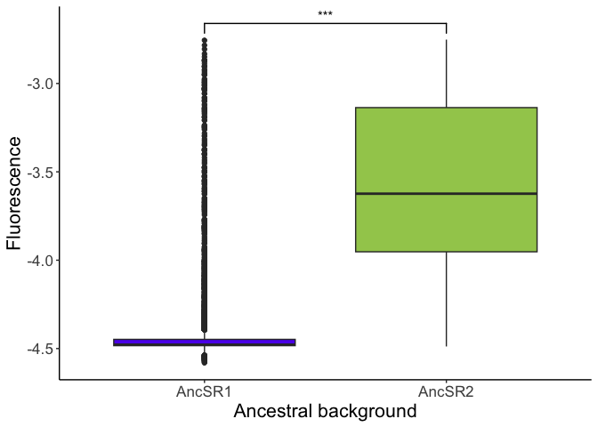<!-- -->

``` r
# boxplots of the distribution of fluorescence in each background, plotted 
# separately for each RE; p-value from Wilcoxon paired-sample test
bgREfluorboxplot <- meanF_data_fxnal %>%
  select(AA_var:avg_meanF_AncSR2) %>%
  pivot_longer(3:4, names_to = "bg", names_prefix = "avg_meanF_", 
               values_to = "avg_meanF") %>%
  ggplot(aes(x = bg, y = avg_meanF, fill = bg)) +
  # geom_violin() +
  stat_boxplot(outlier.size = 1) +
  facet_wrap(vars(RE), nrow = 2) +
  geom_signif(comparisons = list(c("AncSR1", "AncSR2")), test = "wilcox.test",
              test.args = list(alternative = "less", paired = TRUE), 
              map_signif_level = TRUE, textsize = 3) +
  scale_fill_manual(values = bg_color(), drop = FALSE, 
                    name = "Ancestral\nbackground") +
  xlab("") +
  ylab("Fluorescence") +
  theme_classic() +
  theme(text = element_text(size = fontsize),
        legend.position = "right",
        axis.text.x = element_blank(),
        axis.ticks.x = element_blank(),
        strip.text = element_text(size = fontsize - 6))
bgREfluorboxplot
```

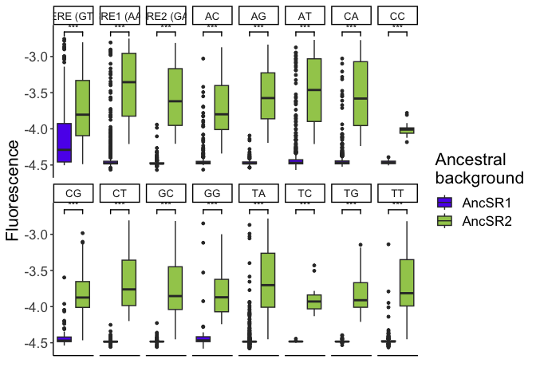<!-- -->

``` r
# adjusted p-values for RE-wise Wilcoxon test
phigherAncSR2RE <- sapply(sort(unique(meanF_data_fxnal$RE)), function(x) {
  data <- meanF_data_fxnal %>% filter(RE == x)
  wilcox.test(data$avg_meanF_AncSR1, data$avg_meanF_AncSR2, alternative = "less",
              paired = TRUE)$p.value
})
padjhigherAncSR2RE <- p.adjust(phigherAncSR2RE, "fdr")
# check whether FDR < 0.05 for RE-wise Wilcoxon test
print(sum(padjhigherAncSR2RE < 0.05))
```

    ## [1] 16

## How many functional protein variants bind to each RE?

Let’s now count the number of functional protein variants that bind to
each RE variant.

``` r
nboundRE <- meanF_data %>%
  group_by(bg, RE) %>%
  summarize(n = sum(functional)) %>%
  ungroup() %>%
  complete(bg, RE, fill = list(n = 0))

nboundRE %>%
  pivot_wider(names_from = bg, values_from = n) %>%
  mutate(nincreaseAncSR2 = AncSR2 - AncSR1,
         foldincreaseAncSR2 = round(AncSR2 / AncSR1, 1)) %>%
  knitr::kable(caption = "Number of functional protein variants per RE")
```

| RE        | AncSR1 | AncSR2 | nincreaseAncSR2 | foldincreaseAncSR2 |
|:----------|-------:|-------:|----------------:|-------------------:|
| ERE (GT)  |    124 |    234 |             110 |                1.9 |
| SRE1 (AA) |     55 |   1380 |            1325 |               25.1 |
| SRE2 (GA) |      3 |    309 |             306 |              103.0 |
| AC        |     16 |    296 |             280 |               18.5 |
| AG        |      2 |    231 |             229 |              115.5 |
| AT        |     41 |    501 |             460 |               12.2 |
| CA        |     20 |    718 |             698 |               35.9 |
| CC        |      0 |     14 |              14 |                Inf |
| CG        |      6 |    133 |             127 |               22.2 |
| CT        |      0 |    141 |             141 |                Inf |
| GC        |      1 |    149 |             148 |              149.0 |
| GG        |      4 |     41 |              37 |               10.2 |
| TA        |     29 |    564 |             535 |               19.4 |
| TC        |      0 |     11 |              11 |                Inf |
| TG        |      0 |     73 |              73 |                Inf |
| TT        |      5 |    237 |             232 |               47.4 |

Number of functional protein variants per RE

Plot number of functional variants per RE.

``` r
# bar plot (AncSR1 on top, AncSR2 on bottom)
fxnalREbarplotfacet <- nboundRE %>%
  ggplot(aes(x = RE, y = n, fill = bg)) +
  geom_col() +
  facet_grid(rows = vars(bg), scales = "free") +
  scale_x_discrete(drop = FALSE) +
  scale_fill_manual(values = bg_color(), drop = FALSE, 
                    name = "Ancestral\nbackground") +
  ylab("Number of protein variants") +
  theme_classic() +
  theme(text = element_text(size = fontsize),
        legend.text = element_text(size = fontsize),
        strip.background = element_blank(),
        strip.text = element_blank(),
        legend.position = c(0.9, 0.9)) +
  guides(x = guide_axis(angle = 45))

fxnalREbarplotfacet
```

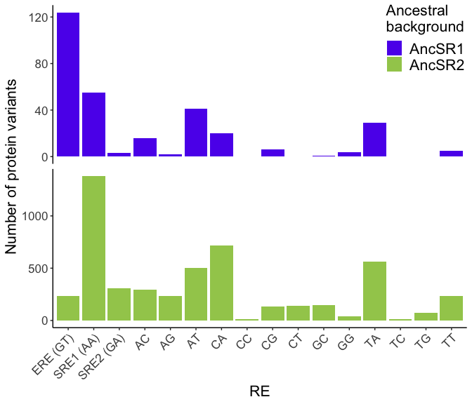<!-- -->

``` r
# bar plot (AncSR1/AncSR2 bars dodged)
fxnalREbarplotdodge <- nboundRE %>%
  ggplot(aes(x = RE, y = n, fill = bg)) +
  geom_col(position = "dodge") +
  scale_x_discrete(drop = FALSE) +
  scale_fill_manual(values = bg_color(), drop = FALSE, 
                    name = "Ancestral\nbackground") +
  ylab("Number of protein variants") +
  theme_classic() +
  theme(text = element_text(size = fontsize),
        legend.text = element_text(size = fontsize),
        legend.position = c(0.9, 0.9)) +
  guides(x = guide_axis(angle = 45))

fxnalREbarplotdodge
```

<!-- -->

``` r
# scatter plot
fxnalREscatterplot <- nboundRE %>%
  pivot_wider(names_from = bg, values_from = n) %>%
  ggplot(aes(x = AncSR1, y = AncSR2)) +
  geom_smooth(method = "lm", color = "red") +
  geom_point() +
  geom_text_repel(aes(label = RE), box.padding = 0.15) +
  labs(x = "Number of protein variants bound in AncSR1 background",
       y = "Number of protein variants bound in AncSR2 background") +
  theme(text = element_text(size = fontsize)) +
  theme_classic()
fxnalREscatterplot
```

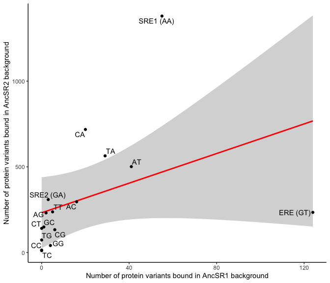<!-- -->

``` r
nfxnalbglm <- nboundRE %>%
  pivot_wider(names_from = bg, values_from = n) %>%
  lm(formula = AncSR2 ~ AncSR1, data = .)
summary(nfxnalbglm)
```

    ## 
    ## Call:
    ## lm(formula = AncSR2 ~ AncSR1, data = .)
    ## 
    ## Residuals:
    ##     Min      1Q  Median      3Q     Max 
    ## -533.72 -171.17  -51.82   71.13  910.46 
    ## 
    ## Coefficients:
    ##             Estimate Std. Error t value Pr(>|t|)  
    ## (Intercept)  231.851     96.593   2.400   0.0309 *
    ## AncSR1         4.322      2.625   1.647   0.1219  
    ## ---
    ## Signif. codes:  0 '***' 0.001 '**' 0.01 '*' 0.05 '.' 0.1 ' ' 1
    ## 
    ## Residual standard error: 330.1 on 14 degrees of freedom
    ## Multiple R-squared:  0.1622, Adjusted R-squared:  0.1024 
    ## F-statistic: 2.711 on 1 and 14 DF,  p-value: 0.1219

``` r
nfxnalbgnoERESRE1lm <- nboundRE %>%
  filter(!RE %in% c("ERE (GT)", "SRE1 (AA)")) %>%
  pivot_wider(names_from = bg, values_from = n) %>%
  lm(formula = AncSR2 ~ AncSR1, data = .)
summary(nfxnalbgnoERESRE1lm)
```

    ## 
    ## Call:
    ## lm(formula = AncSR2 ~ AncSR1, data = .)
    ## 
    ## Residuals:
    ##     Min      1Q  Median      3Q     Max 
    ## -175.59  -97.84  -13.90   49.46  325.84 
    ## 
    ## Coefficients:
    ##             Estimate Std. Error t value Pr(>|t|)    
    ## (Intercept)  121.279     45.125   2.688 0.019757 *  
    ## AncSR1        13.544      2.953   4.586 0.000625 ***
    ## ---
    ## Signif. codes:  0 '***' 0.001 '**' 0.01 '*' 0.05 '.' 0.1 ' ' 1
    ## 
    ## Residual standard error: 135.9 on 12 degrees of freedom
    ## Multiple R-squared:  0.6368, Adjusted R-squared:  0.6065 
    ## F-statistic: 21.04 on 1 and 12 DF,  p-value: 0.0006254

``` r
# # number of functional protein:RE variants on each background
# a <- meanF_data_functional %>%
#   group_by(bg) %>%
#   count() %>%
#   ggplot(aes(x = bg, y = n, fill = bg)) +
#   geom_col(width = 0.9) +
#   geom_text(aes(label = n), vjust = -0.5, color = "black", size = 3.5) +
#   scale_y_continuous(expand = expansion(mult = c(0, 0.1))) +
#   scale_fill_manual(values = bg_color(), drop = FALSE) +
#   scale_x_discrete(drop = FALSE) +
#   labs(x = "Ancestral\nbackground", 
#        y = "number of functional\nprotein:response element variants") +
#   theme_classic() +
#   theme(text = element_text(size = fontsize),
#         legend.position = "none") +
#   guides(x = guide_axis(angle = 45))
# 
# # number of functional protein variants on each background
# a2 <- meanF_data_functional %>%
#   group_by(bg) %>%
#   distinct(AA_var, .keep_all = TRUE) %>%
#   count() %>%
#   ggplot(aes(x = bg, y = n, fill = bg)) +
#   geom_col(width = 0.9) +
#   # geom_text(aes(label = n), vjust = -0.5, color = "black", size = 3.5) +
#   scale_y_continuous(expand = expansion(mult = c(0, 0.1))) +
#   scale_fill_manual(values = bg_color(), drop = FALSE) +
#   scale_x_discrete(drop = FALSE) +
#   labs(x = "Ancestral\nbackground", 
#        y = "number of bound protein variants") +
#   theme_classic() +
#   theme(text = element_text(size = fontsize),
#         legend.position = "none") +
#   guides(x = guide_axis(angle = 45))
# 
# # number of functional variants on each background that bind to each RE
# b <- meanF_data_functional %>%
#   group_by(bg, RE) %>%
#   count() %>%
#   mutate(RE = factor(RE, levels = levels(REs[[1]]))) %>%
#   ggplot(aes(x = RE, y = n, fill = bg)) +
#   geom_col(width = 0.9) +
#   facet_grid(rows = vars(bg), scales = "free") +
#   scale_y_continuous(expand = expansion(mult = c(0, 0.1))) +
#   scale_fill_manual(values = bg_color(), drop = FALSE) +
#   scale_x_discrete(drop = FALSE) +
#   # geom_text(aes(label = n), vjust = -0.5, color = "black", size = 3.5) +
#   labs(x = "Response element", y = "Number of bound protein variants", 
#        fill = "Ancestral\nbackground") +
#   theme_classic() +
#   theme(text = element_text(size = fontsize),
#         legend.text = element_text(size = 14),
#         strip.background = element_blank(),
#         strip.text.y = element_blank(),
#         legend.position = c(0.9, 0.9)) +
#   guides(x = guide_axis(angle = 45))
# 
# # same as b but plotting the backgrounds next to each other
# b2 <- meanF_data_functional %>%
#   group_by(bg, RE) %>%
#   count() %>%
#   ungroup() %>%
#   complete(bg, RE, fill = list(n = 0)) %>%
#   mutate(RE = factor(RE, levels = levels(REs[[1]]))) %>%
#   ggplot(aes(x = RE, y = n, fill = bg)) +
#   geom_col(width = 0.9, position = "dodge") +
#   # geom_text(aes(label = n), vjust = -0.5, color = "black",
#   #           size = 3.5, position = position_dodge(width = 0.9)) +
#   scale_y_continuous(expand = expansion(mult = c(0, 0.05))) +
#   scale_fill_manual(values = bg_color(), drop = FALSE) +
#   scale_x_discrete(drop = FALSE) +
#   labs(x = "Response element", y = "Number of bound protein variants", 
#        fill = "Ancestral\nbackground") +
#   theme_classic() +
#   theme(text = element_text(size = fontsize),
#         legend.text = element_text(size = 14),
#         strip.background = element_blank(),
#         strip.text.y = element_blank(),
#         legend.position = c(0.9, 0.9)) +
#   guides(x = guide_axis(angle = 45))
# 
# a + plot_spacer() + b + plot_layout(widths = c(1, 0.5, 5))
# a2 + plot_spacer() + b + plot_layout(widths = c(1, 0.5, 10))
# a2 + plot_spacer() + b2 + plot_layout(widths = c(1, 0.5, 10))
```

``` r
# # get number of protein variants that bind each RE in only AncSR1 background,
# # only AncSR2 background, or both backgrounds
# variants_bound_by_bg <- meanF_data_functional %>%
#   filter(type == "exp") %>%
#   select(AA_var, RE, bg) %>%
#   group_by(RE) %>%
#   mutate(n = 1) %>%
#   pivot_wider(names_from = bg, values_from = n) %>%
#   mutate(both = AncSR1 + AncSR2 == 2) %>%
#   summarize(AncSR1 = sum(AncSR1, na.rm = T),
#             AncSR2 = sum(AncSR2, na.rm = T), 
#             both = sum(both, na.rm = T)) %>%
#   mutate(AncSR1 = AncSR1 - both,
#          AncSR2 = AncSR2 - both,
#          RE = factor(RE, levels = c("all", levels(REs[[1]])))) %>%
#   rbind(c("all", colSums(select(., 2:4)))) %>%
#   mutate(AncSR1 = as.numeric(AncSR1), AncSR2 = as.numeric(AncSR2),
#          both = as.numeric(both))
# 
# # compute p-value for overlap by bootstrap sampling variants in each background 
# # and computing amount of random overlap
# variants_bound_by_bg$p <- apply(select(variants_bound_by_bg, 2:4), 1,
#                                 function(x) {
#                                   overlaps <- numeric(length = 1000)
#                                   for(i in 1:1000) {
#                                     AncSR1_sample <- sample(160000, sum(x[c(1,3)]))
#                                     AncSR2_sample <- sample(160000, sum(x[2:3]))
#                                     overlaps[i] <- length(intersect(AncSR1_sample, AncSR2_sample))
#                                   }
#                                   p <- sum(overlaps >= x[3]) / 1000
#                                   p
#                                 })
# variants_bound_by_bg$padj <- p.adjust(variants_bound_by_bg$p, 
#                                       method = "bonferroni")
# 
# # plot fraction of protein variants per RE that are functional in the AncSR1,
# # AncSR2, or both backgrounds
# a <- variants_bound_by_bg %>%
#   mutate(AncSR1_total = AncSR1 + both) %>%
#   pivot_longer(2:4, names_to = "background") %>%
#   filter(background != "AncSR2") %>%
#   ggplot(aes(x = RE, y = value, 
#              fill = factor(background, levels = c("both", "AncSR1")))) +
#   geom_col(position = "stack", width = 0.9) +
#   scale_fill_manual(values = c(both = "deepskyblue", bg_color("AncSR1")),
#                     labels = c("AncSR1 and AncSR2", "AncSR1 only"),
#                     drop = FALSE) +
#   scale_x_discrete(drop = FALSE) +
#   geom_text(aes(y = AncSR1_total, label = ifelse(padj <= .05, "*", "")), 
#             vjust = 0, color = "black", size = 6) +
#   scale_y_continuous(expand = expansion(mult = c(0, 0.05))) +
#   labs(title = "Variants functional on AncSR1", x = "Response element", 
#        y = "Number of protein variants", fill = "Ancestral background") +
#   theme_classic() +
#   theme(text = element_text(size = fontsize),
#         plot.title = element_text(size = 14),
#         legend.text = element_text(size =12),
#         legend.title = element_text(size = 14),
#         legend.position = c(0.8, 0.9),
#         plot.caption = element_text(hjust = 0)) +
#   guides(x = guide_axis(angle = 45))
# 
# # plot the distribution of fluorescence for protein variants that bind in 
# # both backgrounds
# fluorescence_both_backgrounds <- meanF_data_functional %>%
#   select(AA_var, RE, bg, avg_meanF) %>%
#   group_by(RE) %>%
#   pivot_wider(names_from = bg, values_from = avg_meanF) %>%
#   drop_na()
# fluorescence_bg_p <- fluorescence_both_backgrounds %>%
#   ungroup() %>%
#   summarize(p = wilcox.test(AncSR1, AncSR2, alternative = "less")$p.value)
# 
# b <- fluorescence_both_backgrounds %>%
#   pivot_longer(3:4, names_to = "background") %>%
#   ggplot(aes(x = factor(RE, levels = levels(REs[[1]])), y = value, 
#              fill = background)) +
#   geom_boxplot() +
#   scale_fill_manual(values = c(bg_color()), drop = FALSE) +
#   scale_x_discrete(drop = FALSE) +
#   labs(x = "Response element", y = "Fluorescence", 
#        fill = "Ancestral\nbackground") +
#   theme_classic() +
#   theme(text = element_text(size = fontsize),
#         legend.text = element_text(size = 14),
#         axis.line.x = element_line(color = "black",),
#         legend.position = "right",
#         plot.caption = element_text(hjust = 0)) +
#   guides(x = guide_axis(angle = 45))
# 
# c <- fluorescence_both_backgrounds %>%
#   pivot_longer(3:4, names_to = "background") %>%
#   ggplot(aes(x = background, y = value, fill = background)) +
#   geom_boxplot() +
#   scale_fill_manual(values = c(bg_color()), drop = FALSE) +
#   labs(title = "Variants functional on\nboth backgrounds", 
#        x = "Ancestral\nbackground", y = "Fluorescence") +
#   theme_classic() +
#   theme(text = element_text(size = fontsize),
#         plot.title = element_text(size = 14),
#         legend.text = element_text(size = 14),
#         axis.line.x = element_line(color = "black",),
#         legend.position = "none",
#         plot.caption = element_text(hjust = 0)) +
#   guides(x = guide_axis(angle = 45)) +
#   geom_signif(comparisons = list(c("AncSR1", "AncSR2")), 
#               test = "wilcox.test",
#               test.args = list(alternative = "less"),
#               map_signif_level = TRUE)
# 
# a + plot_spacer() + c + plot_layout(widths = c(5, 0.5, 2))
# 
# # plot fluorescence in each background for variants that bind in both backgrounds
# d <- fluorescence_both_backgrounds %>%
#   ggplot(aes(x = AncSR1, y = AncSR2)) +
#   geom_point()
# d
```

### What is the distribution of fluorescence for variants that bind to each RE?

``` r
# fluorREplot <- meanF_data %>%
#   filter(functional) %>%
#   ggplot(aes(x = bg, y = avg_meanF, fill = bg)) +
#   # geom_violin(scale = "width") +
#   # stat_summary(geom = "point", fun = "median") +
#   geom_boxplot() +
#   facet_wrap(vars(RE), nrow = 2) +
#   scale_x_discrete(drop = FALSE, name = "") +
#   scale_fill_manual(values = bg_color(), drop = FALSE, 
#                     name = "Ancestral\nbackground") +
#   ylab("Fluorescence") +
#   theme_classic() +
#   theme(text = element_text(size = fontsize),
#         legend.text = element_text(size = fontsize),
#         strip.text = element_text(size = fontsize - 8),
#         strip.background = element_blank(),
#         axis.text.x = element_blank(),
#         axis.ticks.x = element_blank(),
#         axis.line.x = element_blank()) +
#   guides(x = guide_axis(angle = 45))
# fluorREplot
```

## How many protein variants bind promiscuously?

<!-- Let's now determine which protein variants bind promiscuously, *i.e.* are functional on multiple REs. Simply counting the number of REs on which each protein variant is classified as functional will overestimate the number of promiscuous variants due to multiple testing (each protein variant has been tested on 16 REs). To correct for this, for each possible set of $k$ REs where $k \in [1:16]$, we will compute a p-value for each protein variant as the probability that it is at least as fluorescent as the reference variant on all $k$ REs in the set. This is simply the product across all $k$ REs of the p-values computed for each RE:protein variant individually. We will again use an FDR threshold of 0.1 to classify variants as functional vs. nonfunctional on each set of REs. -->

``` r
# # Compute p-values for binding to multiple REs
# if(!file.exists(file.path(results_dir, "ppromiscuous.rda"))) {
#   # Create list to store p-values for the null hypothesis that a variant is at
#   # least as fluorescent as the reference variant on n RE variants, where 
#   # k in [1:16]. Each element is a dataframe listing the p-values for binding to
#   # k REs; each row is a protein:RE set combination, and there are k columns
#   # listing the REs in the set
#   ppromiscuous <- list()
#   
#   # The dataframe for k=1 simply lists the p-values for individual REs computed
#   # above, including only variant combinations with p>0 for computational 
#   # efficiency.
#   ppromiscuous[[1]] <- meanF_data %>% filter(p > 0) %>% select(bg:RE, p)
#   
#   # number of REs per protein variant with p > 0
#   npg0 <- ppromiscuous[[1]] %>% group_by(bg, AA_var) %>% count(name = "nRE")
#   
#   # Compute p-values for each k > 1
#   for(k in 2:16) {
#     print(paste("k =", k))
#     
#     # subset of data for which p > 0 for at least n REs per protein variant
#     datak <- ppromiscuous[[1]] %>% semi_join(filter(npg0, nRE >= k))
#     
#     # subset data by protein background (parallel)
#     cl <- makeCluster(2, "FORK", outfile = "")
#     registerDoParallel(cl)
#     
#     ppromiscuous[[k]] <- foreach(background = unique(as.character(datak$bg)), 
#                                  .combine = "rbind") %dopar% {
#       print(background)
#       databg <- filter(datak, bg == background)
#       out <- data.frame(matrix(nrow = 0, ncol = 0))
#       aas <- unique(as.character(databg$AA_var))
#       
#       # subset data by amino acid variant
#       for(aa in aas) {
#         print(aa)
#         dataaa <- filter(databg, AA_var == aa)
#         
#         # get all possible combinations of k REs
#         REcombos <- data.frame(t(combn(as.character(dataaa$RE), k)))
#         colnames(REcombos) <- sapply(1:k, function(x) paste0("RE", x))
#         
#         # compute p-val for each combination of REs
#         p <- apply(REcombos, 1, function(x)
#           dataaa %>% filter(RE %in% x) %>% pull(p) %>% prod())
#         
#         out <- rbind(out, data.frame(bg = background, AA_var = aa, REcombos, p))
#       }
#     }
#     stopCluster(cl)
#   }
#   
#   save(ppromiscuous, file = file.path(results_dir, "ppromiscuous.rda"))
# } else load(file.path(results_dir, "ppromiscuous.rda"))
```

``` r
# if(!file.exists(file.path(results_dir, "multiple_REs_bound_data.rda"))) {
#   multiple_REs_bound_data <- list(AncSR1 = list(), AncSR2 = list())
#   multiple_REs_bound_data[["AncSR1"]][[1]] <- meanF_data_functional %>% 
#     filter(bg == "AncSR1") %>% 
#     mutate(p = pfunctional, padj = padjfunctional, RE1 = RE) %>%
#     select(AA_var, RE1, p, padj)
#   multiple_REs_bound_data[["AncSR2"]][[1]] <- meanF_data_functional %>% 
#     filter(bg == "AncSR2") %>% 
#     mutate(p = pfunctional, padj = padjfunctional, RE1 = RE) %>%
#     select(AA_var, RE1, p, padj)
#   
#   # initialize data frames
#   for(background in c("AncSR1", "AncSR2")) {
#     for(i in 2:16) {
#       df <- data.frame(AA_var = NA)
#       df[sapply(1:i, function(x) paste0("RE", x))] <- NA
#       df$p <- NA
#       multiple_REs_bound_data[[background]][[i]] <- df
#     }
#   }
#   
#   for(background in c("AncSR1", "AncSR2")) {
#     AA_vars <- meanF_data_active %>%
#         filter(bg == background) %>% pull("AA_var") %>% 
#         unique() %>% as.character() %>% sort()
#     
#     for(aa in AA_vars) {
#       print(aa)
#       aa_df <- meanF_data_active %>% 
#           filter(AA_var == aa, bg == background) %>%
#           select(RE, meanF_REP1:meanF_REP4, pfunctional)
#       i <- 2
#       while(i <= nrow(aa_df)) {
#         # compute all possible sets of i REs for variant aa
#         RE_combs <- combn(as.character(aa_df$RE), i)
#         
#         # compute p-value of aa being worse than AncSR2-WT:SRE1 on any of the
#         # set of REs
#         p <- apply(RE_combs, 2, function(x) {
#           df2 <- aa_df %>% filter(RE %in% x)
#           prod(df2$pfunctional)
#         })
#         
#         new_df <- data.frame(AA_var = rep(aa, ncol(RE_combs)))
#         new_df[sapply(1:i, function(x) paste0("RE", x))] <- t(RE_combs)
#         new_df$p <- p
#         multiple_REs_bound_data[[background]][[i]] <- 
#           multiple_REs_bound_data[[background]][[i]] %>%
#           rbind(new_df)
#         
#         i <- i + 1
#       }
#     }
#   }
#   
#   # merge data for AncSR1 & AncSR2
#   multiple_REs_bound_data <- lapply(1:16, function(x) 
#     rbind(multiple_REs_bound_data[[1]][[x]] %>% 
#             slice(-1) %>% mutate(bg = "AncSR1"), 
#           multiple_REs_bound_data[[2]][[x]] %>% 
#             slice(-1) %>% mutate(bg = "AncSR2")))
#   
#   # compute adjusted p-values
#   multiple_REs_bound_data <- lapply(multiple_REs_bound_data, function(x)
#     mutate(x, padj = p.adjust(p, "fdr")))
#   
#   save(multiple_REs_bound_data, 
#        file = file.path(results_dir, "multiple_REs_bound_data.rda"))
# } else load(file = file.path(results_dir, "multiple_REs_bound_data.rda"))
# 
# # TODO: check what's up with AncSR1 AAKM
```

## Specificity vs. Promiscuity

Let’s now identify how many protein variants bind specifically
vs. promiscuously. Protein variants are defined as “specific” if they
are functional on only one RE variant, and “promiscuous” if they bind to
multiple RE variants.

``` r
# Count the number of REs on which each protein variant is functional.
meanF_data_specificity <- meanF_data %>%
  pivot_wider(id_cols = bg:AA_var, names_from = RE, 
              values_from = c(avg_meanF, functional), 
              names_sep = "_") %>%
  mutate(nfxnal = rowSums(select(., 19:34)))

# Print the number of REs bound vs. number of protein variants
meanF_data_specificity %>%
  filter(nfxnal > 0) %>%
  mutate(nfxnal = factor(nfxnal, levels = 1:16)) %>%
  group_by(bg, nfxnal) %>%
  rename(nREs = nfxnal) %>%
  count(name = "nproteinvars", .drop = FALSE) %>%
  group_by(bg) %>%
  mutate(fracfxnal = round(nproteinvars / sum(nproteinvars), 3)) %>%
  pivot_wider(names_from = bg, values_from = nproteinvars:fracfxnal, 
              values_fill = 0) %>%
  knitr::kable(caption = "Number of protein variants bound to n REs")
```

| nREs | nproteinvars_AncSR1 | nproteinvars_AncSR2 | fracfxnal_AncSR1 | fracfxnal_AncSR2 |
|:-----|--------------------:|--------------------:|-----------------:|-----------------:|
| 1    |                 222 |                1223 |            0.857 |            0.512 |
| 2    |                  30 |                 584 |            0.116 |            0.244 |
| 3    |                   5 |                 257 |            0.019 |            0.108 |
| 4    |                   1 |                 126 |            0.004 |            0.053 |
| 5    |                   1 |                  69 |            0.004 |            0.029 |
| 6    |                   0 |                  50 |            0.000 |            0.021 |
| 7    |                   0 |                  30 |            0.000 |            0.013 |
| 8    |                   0 |                  15 |            0.000 |            0.006 |
| 9    |                   0 |                   9 |            0.000 |            0.004 |
| 10   |                   0 |                   8 |            0.000 |            0.003 |
| 11   |                   0 |                   8 |            0.000 |            0.003 |
| 12   |                   0 |                   5 |            0.000 |            0.002 |
| 13   |                   0 |                   3 |            0.000 |            0.001 |
| 14   |                   0 |                   2 |            0.000 |            0.001 |
| 15   |                   0 |                   1 |            0.000 |            0.000 |

Number of protein variants bound to n REs

``` r
# Plot the number of REs on which each protein variant is functional
nREbarplot <- meanF_data_specificity %>%
  filter(nfxnal > 0) %>%
  ggplot(aes(x = nfxnal, fill = bg)) +
  geom_bar() +
  facet_wrap(vars(bg), nrow = 2, scales = "free_y") +
  scale_x_continuous(breaks = 1:16) +
  scale_fill_manual(values = bg_color(), drop = FALSE, 
                    name = "Ancestral\nbackground") +
  xlab("Number of REs bound") +
  ylab("Number of protein variants") +
  theme_classic() +
  theme(text = element_text(size = fontsize),
        legend.text = element_text(size = fontsize),
        strip.background = element_blank(),
        strip.text = element_blank(),
        legend.position = c(0.9, 0.9))
nREbarplot
```

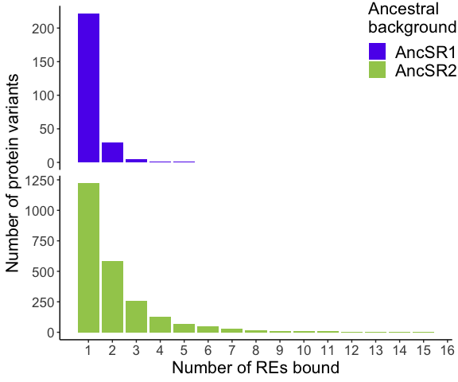<!-- -->

How many protein variants bind specifically to each RE?

``` r
# count the number of protein that bind specifically to each RE in each 
# background
nspecificRE <- meanF_data_specificity %>%
  filter(nfxnal == 1) %>%
  select(-c(3:18, nfxnal)) %>%
  pivot_longer(3:18, names_to = "RE", values_to = "fxnal", 
               names_prefix = "functional_") %>%
  mutate(RE = factor(RE, levels = levels(REs[[1]]))) %>%
  filter(fxnal) %>%
  group_by(bg, RE) %>%
  count(name = "nproteinvars") %>%
  ungroup() %>%
  complete(bg, RE, fill = list(nproteinvars = 0))

kable(nspecificRE %>% 
        group_by(bg) %>%
        mutate(fracproteinvars = round(nproteinvars / sum(nproteinvars), 3)) %>%
        pivot_wider(names_from = bg, 
                    values_from = nproteinvars:fracproteinvars),
      caption = "Number of protein variants bound specifically per RE")
```

| RE        | nproteinvars_AncSR1 | nproteinvars_AncSR2 | fracproteinvars_AncSR1 | fracproteinvars_AncSR2 |
|:----------|--------------------:|--------------------:|-----------------------:|-----------------------:|
| ERE (GT)  |                 105 |                  45 |                  0.473 |                  0.037 |
| SRE1 (AA) |                  38 |                 534 |                  0.171 |                  0.437 |
| SRE2 (GA) |                   2 |                 127 |                  0.009 |                  0.104 |
| AC        |                  16 |                  86 |                  0.072 |                  0.070 |
| AG        |                   0 |                  62 |                  0.000 |                  0.051 |
| AT        |                  20 |                  66 |                  0.090 |                  0.054 |
| CA        |                  12 |                 198 |                  0.054 |                  0.162 |
| CC        |                   0 |                   0 |                  0.000 |                  0.000 |
| CG        |                   5 |                  12 |                  0.023 |                  0.010 |
| CT        |                   0 |                  12 |                  0.000 |                  0.010 |
| GC        |                   1 |                  24 |                  0.005 |                  0.020 |
| GG        |                   0 |                   2 |                  0.000 |                  0.002 |
| TA        |                  23 |                  46 |                  0.104 |                  0.038 |
| TC        |                   0 |                   0 |                  0.000 |                  0.000 |
| TG        |                   0 |                   3 |                  0.000 |                  0.002 |
| TT        |                   0 |                   6 |                  0.000 |                  0.005 |

Number of protein variants bound specifically per RE

Create barplot.

``` r
# plot number of protein variants bound specifically on each RE/background as a
# bar plot
nspecificbarplot <- nspecificRE %>%
  ungroup() %>%
  complete(bg, RE, fill = list(nproteinvars = 0)) %>%
  ggplot(aes(x = RE, y = nproteinvars, fill = bg)) +
  geom_col() +
  facet_wrap(vars(bg), nrow = 2, scales = "free_y") +
  scale_fill_manual(values = bg_color(), drop = FALSE, 
                    name = "Ancestral\nbackground") +
  ylab("Number of protein variants bound specifically") +
  theme_classic() +
  theme(text = element_text(size = fontsize),
        legend.text = element_text(size = fontsize),
        strip.background = element_blank(),
        strip.text = element_blank(),
        legend.position = c(0.9, 0.9)) +
  guides(x = guide_axis(angle = 45))
nspecificbarplot
```

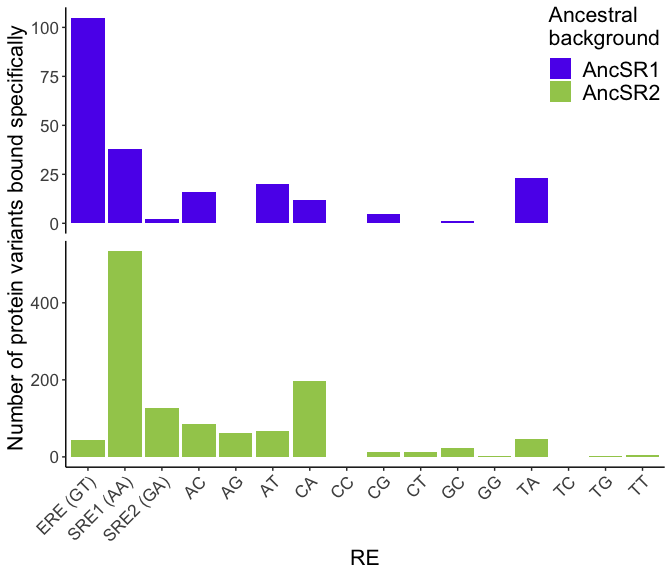<!-- -->

Does the number of protein variants bound specifically per RE correlate
with the total number of protein variants bound per RE?

``` r
# plot number of protein variants bound specifically vs. number bound total per
# RE/bg
nboundspecificvtotalplot <- nspecificRE %>%
  rename(nspecific = nproteinvars) %>%
  full_join(nboundRE) %>%
  rename(ntotal = n) %>%
  ggplot(aes(x = ntotal, y = nspecific)) +
  geom_smooth(method = "lm", color = "black") +
  geom_point(aes(color = bg)) +
  geom_text_repel(aes(label = RE), box.padding = 0.15) +
  facet_wrap(vars(bg), ncol = 2, scales = "free") +
  scale_color_manual(values = bg_color(), name = "Ancestral\nbackground") +
  ylim(0, NA) +
  labs(x = "Number of protein variants bound total",
       y = "Number of protein variants bound specifically") +
  theme_classic() +
  theme(text = element_text(size = fontsize),
        legend.text = element_text(size = fontsize),
        strip.background = element_blank(),
        strip.text = element_blank(),
        legend.position = "right")
nboundspecificvtotalplot
```

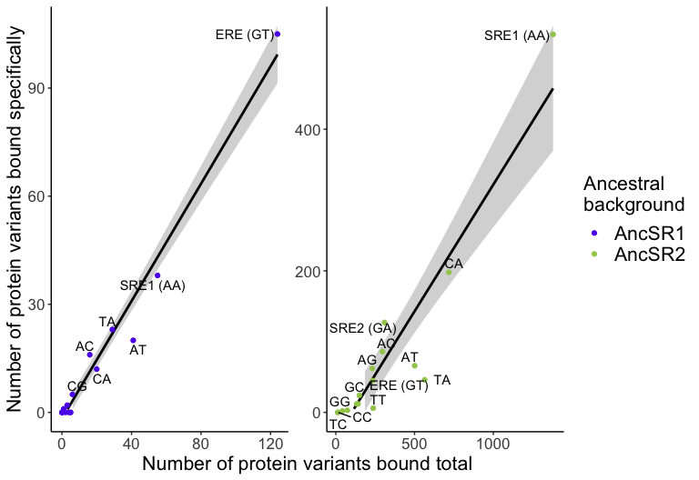<!-- -->

``` r
# print Pearson's r^2 between total and specific variants bound per RE in each
# background
nspecificRE %>%
  rename(nspecific = nproteinvars) %>%
  full_join(nboundRE) %>%
  rename(ntotal = n) %>%
  group_by(bg) %>%
  summarize("r2" = round(cor(nspecific, ntotal)^2, 2)) %>%
  kable(caption = "r^2 n total vs. specific protein variants bound per RE")
```

| bg     |   r2 |
|:-------|-----:|
| AncSR1 | 0.98 |
| AncSR2 | 0.87 |

r^2 n total vs. specific protein variants bound per RE

``` r
# plot number protein variants bound and bound specifically per RE
nboundspecifictotalbarplot <- nspecificRE %>%
  rename(nspecific = nproteinvars) %>%
  full_join(meanF_data %>%
              filter(functional) %>%
              group_by(bg, RE) %>%
              summarize(ntotal = n())) %>%
  ungroup() %>%
  complete(bg, RE, fill = list(nspecific = 0, ntotal = 0)) %>%
  mutate(npromiscuous = ntotal - nspecific) %>%
  pivot_longer(c(nspecific, npromiscuous), names_to = "specific", 
               names_prefix = "n", values_to = "n") %>%
  ggplot(aes(x = RE, y = n, fill = bg, alpha = specific)) +
  geom_col(position = "fill") +
  facet_wrap(vars(bg), nrow = 2, scales = "free_y") +
  scale_fill_manual(values = bg_color(), drop = FALSE, 
                    name = "Ancestral\nbackground") +
  scale_alpha_manual(values = c("specific" = 1, "promiscuous" = 0.5)) +
  ylab("Number of protein variants bound") +
  theme_classic() +
  theme(text = element_text(size = fontsize),
        legend.text = element_text(size = fontsize),
        strip.background = element_blank(),
        strip.text = element_blank(),
        legend.position = "right") +
  guides(x = guide_axis(angle = 45))
nboundspecifictotalbarplot
```

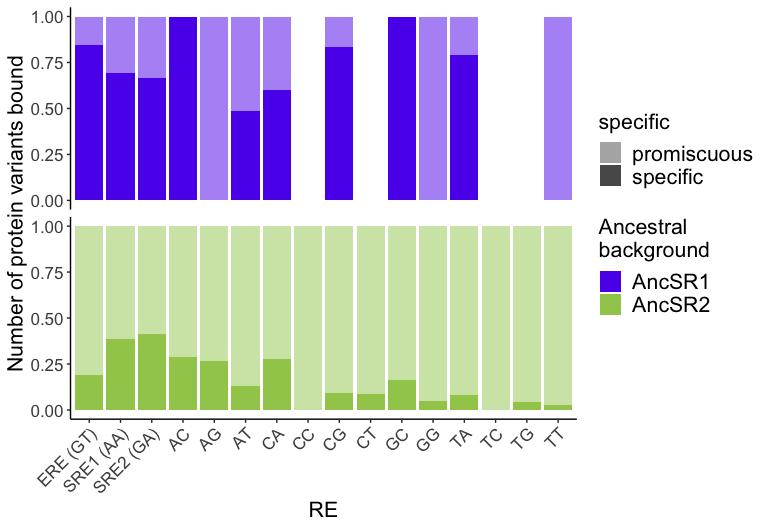<!-- -->

For those protein variants that bind to multiple REs (promiscuous),
which RE combinations do they bind to? Plot a heatmap of the number of
protein variants that bind to each pair of REs.

``` r
npromiscuousREpairs <- map_dfr(combn(colnames(meanF_data_specificity)[19:34], 2,
                                     simplify = FALSE),
                               ~ meanF_data_specificity %>%
                                 filter(nfxnal >= 2) %>%
                                 select(c(bg, all_of(.x))) %>%
                                 mutate(n = rowSums(select(., -bg))) %>%
                                 group_by(bg) %>%
                                 summarize(pairs = paste(sub("functional_", "", .x), 
                                                         collapse = "_"),
                                           n = sum(n == 2))) %>%
  separate(pairs, c("RE1", "RE2"), sep = "_") %>%
  mutate(RE1 = factor(RE1, levels = levels(REs[[1]])),
         RE2 = factor(RE2, levels = levels(REs[[1]])))

promiscuousheatmapAncSR1 <- npromiscuousREpairs %>%
  filter(bg == "AncSR1") %>%
  ggplot(aes(x = RE1, y = RE2, fill = n)) +
  geom_tile() +
  scale_fill_viridis() +
  labs(x = "", y = "", title = "AncSR1", fill = "Number of\nprotein variants") +
  theme_classic() +
  theme(text = element_text(size = fontsize - 2),
        legend.position = "bottom") +
  guides(x = guide_axis(angle = 45),
         fill = guide_colorbar(title.position = "top",
                               title.theme = element_text(size = fontsize - 2),
                               label.theme = element_text(angle = 45),
                               label.hjust = 1))

# promiscuousheatmapAncSR1 <- npromiscuousREpairs %>%
#   filter(bg == "AncSR1") %>%
#   select(-bg) %>%
#   pivot_wider(names_from = "RE2", values_from = "n") %>%
#   column_to_rownames("RE1") %>%
#   apply(1:2, function(x) x / (meanF_data_specificity %>% 
#                                 filter(nfxnal >= 2, bg == "AncSR1") %>%
#                                 nrow())) %>%
#   heatmaply(dendrogram = "none")

promiscuousheatmapAncSR2 <- npromiscuousREpairs %>%
  filter(bg == "AncSR2") %>%
  ggplot(aes(x = RE1, y = RE2, fill = n)) +
  geom_tile() +
  scale_fill_viridis() +
  labs(x = "", y = "", title = "AncSR2", fill = "Number of\nprotein variants") +
  theme_classic() +
  theme(text = element_text(size = fontsize - 2),
        legend.position = "bottom") +
  guides(x = guide_axis(angle = 45),
         fill = guide_colorbar(title.position = "top",
                               title.theme = element_text(size = fontsize - 2),
                               label.theme = element_text(angle = 45),
                               label.hjust = 1))

promiscuousheatmapAncSR1 + promiscuousheatmapAncSR2
```

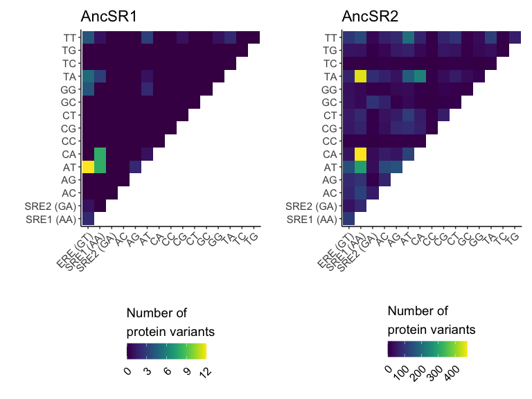<!-- -->

Heatmaps v2

``` r
# fill scale: fraction of promiscuous variants
promiscuousheatmapbothbg <- npromiscuousREpairs %>%
  mutate(frac = ifelse(bg == "AncSR1", 
                       n / (meanF_data_specificity %>% 
                              filter(nfxnal >= 2, bg == "AncSR1") %>%
                              nrow()),
                       n / (meanF_data_specificity %>% 
                              filter(nfxnal >= 2, bg == "AncSR2") %>%
                              nrow()))) %>%
  ggplot(aes(fill = frac)) +
  geom_tile(data = . %>% filter(bg == "AncSR1"), aes(x = RE1, y = RE2)) +
  geom_tile(data = . %>% filter(bg == "AncSR2"), aes(x = RE2, y = RE1)) +
  scale_x_discrete(limits = levels(REs[[1]])) +
  scale_y_discrete(limits = levels(REs[[1]])) +
  scale_fill_viridis(limits = c(0, 0.48)) +
  labs(x = "", y = "", fill = "Fraction of\nprotein variants") +
  theme_classic() +
  theme(text = element_text(size = fontsize - 2),
        legend.position = "bottom") +
  guides(x = guide_axis(angle = 45))

# fill scale: fraction of specific variants
specificheatmapAncSR1 <- nspecificRE %>%
  ungroup() %>%
  filter(bg == "AncSR1") %>%
  select(-bg) %>%
  complete(RE, fill = list(nproteinvars = 0)) %>%
  mutate(frac = nproteinvars / (meanF_data_specificity %>%
                                  filter(nfxnal == 1, bg == "AncSR1") %>%
                                  nrow())) %>%
  ggplot(aes(x = RE, y = "Specific", fill = frac)) +
  geom_tile() +
  scale_x_discrete(limits = levels(REs[[1]]), position = "top") +
  scale_fill_viridis(limits = c(0, 0.48)) +
  labs(x = "AncSR1 background", y = "", fill = "Fraction of\nprotein variants") +
  theme_classic() +
  theme(text = element_text(size = fontsize),
        axis.title.x.top = element_text(size = fontsize),
        axis.text.x = element_blank(),
        axis.ticks.x = element_blank(),
        axis.line.x = element_blank())

specificheatmapAncSR2 <- nspecificRE %>%
  ungroup() %>%
  filter(bg == "AncSR2") %>%
  select(-bg) %>%
  complete(RE, fill = list(nproteinvars = 0)) %>%
  mutate(frac = nproteinvars / (meanF_data_specificity %>%
                                  filter(nfxnal == 1, bg == "AncSR2") %>%
                                  nrow())) %>%
  ggplot(aes(x = "Specific", y = RE, fill = frac)) +
  geom_tile() +
  scale_y_discrete(limits = levels(REs[[1]]), position = "right") +
  scale_fill_viridis(limits = c(0, 0.48)) +
  labs(x = "", y = "AncSR2 background", fill = "Fraction of\nprotein variants") +
  theme_classic() +
  theme(text = element_text(size = fontsize),
        axis.title.y.right = element_text(size = fontsize),
        axis.text.y = element_blank(),
        axis.ticks.y = element_blank(),
        axis.line.y = element_blank()) +
  guides(x = guide_axis(angle = 45))

(specificheatmapAncSR1 + theme(legend.position = "none")) +
  plot_spacer() +
  (promiscuousheatmapbothbg + theme(legend.position = "none")) +
  (specificheatmapAncSR2 + theme(legend.position = "right")) +
  plot_layout(ncol = 2, byrow = TRUE, widths = c(16, 1), heights = c(1, 16))
```

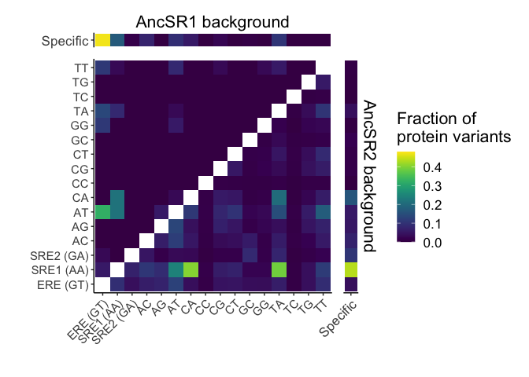<!-- -->

Heatmaps v3

``` r
promiscuousspecificheatmapAncSR1 <- nspecificRE %>%
  ungroup() %>%
  complete(bg, RE, fill = list(nproteinvars = 0)) %>%
  rename(RE1 = RE, n = nproteinvars) %>%
  mutate(RE2 = RE1) %>%
  rbind(npromiscuousREpairs) %>%
  filter(bg == "AncSR1") %>%
  ggplot(aes(fill = n)) +
  geom_tile(aes(x = RE1, y = RE2)) +
  geom_tile(aes(x = RE2, y = RE1)) +
  scale_x_discrete(limits = levels(REs[[1]])) +
  scale_y_discrete(limits = levels(REs[[1]])) +
  scale_fill_viridis() +
  labs(x = "", y = "", title = "AncSR1", fill = "Number of\nprotein variants") +
  theme_classic() +
  theme(text = element_text(size = fontsize - 2),
        legend.position = "bottom") +
  guides(x = guide_axis(angle = 45),
         fill = guide_colorbar(title.position = "top",
                               title.theme = element_text(size = fontsize - 2),
                               label.theme = element_text(angle = 45),
                               label.hjust = 1))

promiscuousspecificheatmapAncSR2 <- nspecificRE %>%
  ungroup() %>%
  complete(bg, RE, fill = list(nproteinvars = 0)) %>%
  rename(RE1 = RE, n = nproteinvars) %>%
  mutate(RE2 = RE1) %>%
  rbind(npromiscuousREpairs) %>%
  filter(bg == "AncSR2") %>%
  ggplot(aes(fill = n)) +
  geom_tile(aes(x = RE1, y = RE2)) +
  geom_tile(aes(x = RE2, y = RE1)) +
  scale_x_discrete(limits = levels(REs[[1]])) +
  scale_y_discrete(limits = levels(REs[[1]])) +
  scale_fill_viridis() +
  labs(x = "", y = "", title = "AncSR2", fill = "Number of\nprotein variants") +
  theme_classic() +
  theme(text = element_text(size = fontsize - 2),
        legend.position = "bottom") +
  guides(x = guide_axis(angle = 45),
         fill = guide_colorbar(title.position = "top",
                               title.theme = element_text(size = fontsize - 2),
                               label.theme = element_text(angle = 45),
                               label.hjust = 1))

promiscuousspecificheatmapAncSR1 + promiscuousspecificheatmapAncSR2
```

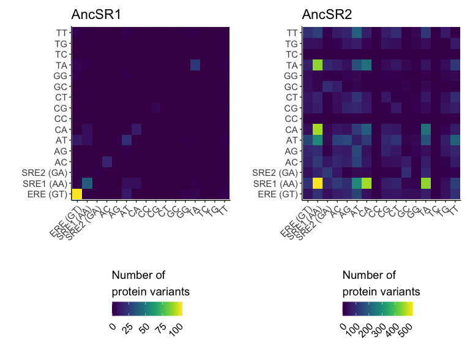<!-- -->

Clustered heatmaps

``` r
# AncSR1 (removed RE variants with nothing bound)
nspecificRE %>%
  ungroup() %>%
  complete(bg, RE, fill = list(nproteinvars = 0)) %>%
  rename(RE1 = RE, n = nproteinvars) %>%
  mutate(RE2 = RE1) %>%
  rbind(npromiscuousREpairs) %>%
  filter(bg == "AncSR1") %>%
  rbind(rename(., RE1 = RE2, RE2 = RE1) %>% filter(RE1 != RE2)) %>%
  filter(!RE1 %in% filter(nboundRE, bg == "AncSR1", n == 0)$RE,
         !RE2 %in% filter(nboundRE, bg == "AncSR1", n == 0)$RE) %>%
  pivot_wider(names_from = RE2, values_from = n) %>%
  column_to_rownames("RE1") %>%
  select(-bg) %>%
  as.matrix() %>%
  heatmap.2(col = viridis, trace = "none", dendrogram = "none", 
            breaks = 0:max(.))
```

<!-- -->

``` r
# AncSR2 (removed RE variants with nothing bound)
nspecificRE %>%
  ungroup() %>%
  complete(bg, RE, fill = list(nproteinvars = 0)) %>%
  rename(RE1 = RE, n = nproteinvars) %>%
  mutate(RE2 = RE1) %>%
  rbind(npromiscuousREpairs) %>%
  filter(bg == "AncSR2") %>%
  rbind(rename(., RE1 = RE2, RE2 = RE1) %>% filter(RE1 != RE2)) %>%
  filter(!RE1 %in% filter(nboundRE, bg == "AncSR2", n == 0)$RE,
         !RE2 %in% filter(nboundRE, bg == "AncSR2", n == 0)$RE) %>%
  pivot_wider(names_from = RE2, values_from = n) %>%
  column_to_rownames("RE1") %>%
  select(-bg) %>%
  as.matrix() %>%
  heatmap.2(col = viridis, trace = "none", dendrogram = "none",
            breaks = 0:max(.))
```

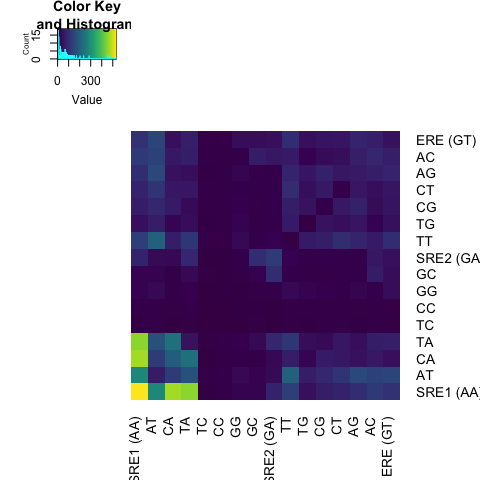<!-- -->

Are there RE sequence determinants of promiscuity?

``` r
# Can promiscuity be explained by modeling the probability of binding each RE
# variant as independent? First just look at the pairwise co-binding 
# probabilities (the probability that two REs are co-bound by the same protein
# variant)
REpairs <- as.data.frame(t(combn(levels(REs[[1]]), 2)))
colnames(REpairs) <- c("RE1", "RE2")
REpairs <- REpairs %>%
  left_join(nboundRE, by = c("RE1" = "RE")) %>%
  left_join(nboundRE, by = c("bg", "RE2" = "RE"), suffix = c("1", "2")) %>%
  left_join(npromiscuousREpairs) %>%
  rename(n12 = n) %>%
  mutate(p1 = n1 / 160000, p2 = n2 / 160000, p12true = n12 / 160000, 
         p12pred = p1 * p2) %>%
  filter(!(bg == "AncSR1" & RE1 %in% filter(nboundRE, bg == "AncSR1", n == 0)$RE),
         !(bg == "AncSR1" & RE2 %in% filter(nboundRE, bg == "AncSR1", n == 0)$RE),
         !(bg == "AncSR2" & RE1 %in% filter(nboundRE, bg == "AncSR2", n == 0)$RE),
         !(bg == "AncSR2" & RE2 %in% filter(nboundRE, bg == "AncSR2", n == 0)$RE))
coboundpairstruevpredplotAncSR1 <- REpairs %>%
  filter(bg == "AncSR1") %>%
  unite(RE1, RE2, col = "REs") %>%
  select(REs, p12true, p12pred) %>%
  ggplot(aes(x = p12pred, y = p12true)) +
  geom_abline(slope = 1, intercept = 0, color = "red") +
  geom_point(color = bg_color()[1]) +
  labs(y = "true co-binding frequency", 
       x = "predicted independent co-binding frequency",
       title = "AncSR1") +
  theme_classic()
coboundpairstruevpredplotAncSR2 <- REpairs %>%
  filter(bg == "AncSR2") %>%
  unite(RE1, RE2, col = "REs") %>%
  select(REs, p12true, p12pred) %>%
  ggplot(aes(x = p12pred, y = p12true)) +
  geom_abline(slope = 1, intercept = 0, color = "red") +
  geom_point(color = bg_color()[2]) +
  labs(y = "true co-binding frequency", 
       x = "predicted independent co-binding frequency",
       title = "AncSR2") +
  theme_classic()
coboundpairstruevpredplotAncSR1 + coboundpairstruevpredplotAncSR2
```

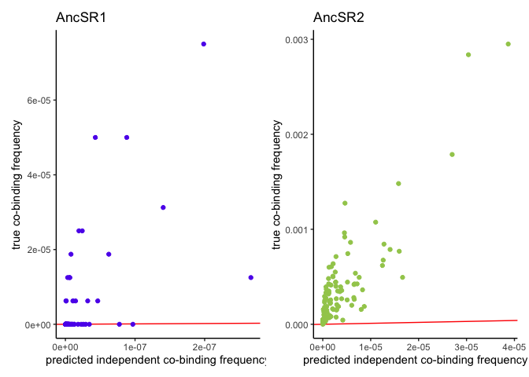<!-- -->

``` r
# How much more likely is an RE variant to be cobound with another RE variant 
# that has the same nucleotide at position 1 or 2 compared?
# Use a likelihood ratio test to test for effects of matching nucleotides at
# site 1 or 2 in the RE compared to a null model where cobinding frequencies are
# predicted from the independent binding expectation alone.
REpairsmatch <- REpairs %>%
  mutate(RE1 = gsub(".+\\(|\\)", "", RE1), RE2 = gsub(".+\\(|\\)", "", RE2)) %>%
  separate_wider_position(RE1, widths = c("RE1.1" = 1, "RE1.2" = 1)) %>%
  separate_wider_position(RE2, widths = c("RE2.1" = 1, "RE2.2" = 1)) %>%
  mutate(A1 = RE1.1 == "A" & RE2.1 == "A",
         C1 = RE1.1 == "C" & RE2.1 == "C",
         G1 = RE1.1 == "G" & RE2.1 == "G",
         T1 = RE1.1 == "T" & RE2.1 == "T",
         A2 = RE1.2 == "A" & RE2.2 == "A",
         C2 = RE1.2 == "C" & RE2.2 == "C",
         G2 = RE1.2 == "G" & RE2.2 == "G",
         T2 = RE1.2 == "T" & RE2.2 == "T")
  # mutate(match = map2_int(RE1, RE2, 
  #                         ~ str_split_fixed(c(.x, .y), "", 2) %>%
  #                           apply(2, function(x) x[1] == x[2]) %>%
  #                           {if(sum(.) == 1) which(.) else 0}))

REsiteeffect <- as.data.frame(matrix(nrow = 0, ncol = 4))
colnames(REsiteeffect) <- c("bg", "effect", "beta", "p")
for(b in c("AncSR1", "AncSR2")) {
  lmH0 <- lm(p12true ~ p12pred, REpairsmatch %>% filter(bg == b))
  print(b)
  print(summary(lmH0))
  for(position in 1:2) {
    for(nt in c("A", "C", "G", "T")) {
      datasub <- REpairsmatch %>% filter(bg == b) %>%
      select(p12true, p12pred, paste0(nt, position)) %>%
        rename(match = paste0(nt, position))
      lmH1 <- lm(p12true ~ p12pred + match, datasub)
      LRS <- -2 * (as.numeric(logLik(lmH0)) - as.numeric(logLik(lmH1)))
      pval <- pchisq(LRS, df = 1, lower.tail = FALSE)
      
      REsiteeffect <- REsiteeffect %>% 
      rbind(data.frame(bg = b, effect = paste0(nt, position), 
                       beta = coef(lmH1)[3], p = pval), 
            make.row.names = FALSE)
    }
  }
}
```

    ## [1] "AncSR1"
    ## 
    ## Call:
    ## lm(formula = p12true ~ p12pred, data = REpairsmatch %>% filter(bg == 
    ##     b))
    ## 
    ## Residuals:
    ##        Min         1Q     Median         3Q        Max 
    ## -3.642e-05 -2.879e-06 -2.276e-06 -2.044e-06  4.041e-05 
    ## 
    ## Coefficients:
    ##              Estimate Std. Error t value Pr(>|t|)    
    ## (Intercept) 2.028e-06  1.512e-06   1.342    0.184    
    ## p12pred     1.760e+02  2.996e+01   5.875 1.66e-07 ***
    ## ---
    ## Signif. codes:  0 '***' 0.001 '**' 0.01 '*' 0.05 '.' 0.1 ' ' 1
    ## 
    ## Residual standard error: 1.113e-05 on 64 degrees of freedom
    ## Multiple R-squared:  0.3503, Adjusted R-squared:  0.3402 
    ## F-statistic: 34.51 on 1 and 64 DF,  p-value: 1.658e-07
    ## 
    ## [1] "AncSR2"
    ## 
    ## Call:
    ## lm(formula = p12true ~ p12pred, data = REpairsmatch %>% filter(bg == 
    ##     b))
    ## 
    ## Residuals:
    ##        Min         1Q     Median         3Q        Max 
    ## -7.226e-04 -1.034e-04 -6.108e-05  1.206e-04  8.610e-04 
    ## 
    ## Coefficients:
    ##              Estimate Std. Error t value Pr(>|t|)    
    ## (Intercept) 1.044e-04  2.422e-05   4.309 3.41e-05 ***
    ## p12pred     6.676e+01  3.507e+00  19.035  < 2e-16 ***
    ## ---
    ## Signif. codes:  0 '***' 0.001 '**' 0.01 '*' 0.05 '.' 0.1 ' ' 1
    ## 
    ## Residual standard error: 0.0002271 on 118 degrees of freedom
    ## Multiple R-squared:  0.7543, Adjusted R-squared:  0.7523 
    ## F-statistic: 362.3 on 1 and 118 DF,  p-value: < 2.2e-16

``` r
print(REsiteeffect)
```

    ##        bg effect          beta            p
    ## 1  AncSR1     A1  4.171304e-06 3.730714e-01
    ## 2  AncSR1     C1 -2.903018e-06 7.928825e-01
    ## 3  AncSR1     G1  2.247073e-06 6.336514e-01
    ## 4  AncSR1     T1  9.637972e-06 3.820512e-01
    ## 5  AncSR1     A2  5.853113e-06 2.097958e-01
    ## 6  AncSR1     C2 -2.177960e-06 8.439390e-01
    ## 7  AncSR1     G2 -2.252452e-06 7.292590e-01
    ## 8  AncSR1     T2  2.706379e-05 1.600337e-05
    ## 9  AncSR2     A1  4.860740e-05 6.233613e-01
    ## 10 AncSR2     C1  6.746642e-06 9.431748e-01
    ## 11 AncSR2     G1  6.641466e-05 4.828893e-01
    ## 12 AncSR2     T1  5.815968e-05 5.388270e-01
    ## 13 AncSR2     A2  1.337302e-05 9.113171e-01
    ## 14 AncSR2     C2 -3.373950e-05 7.226365e-01
    ## 15 AncSR2     G2  1.306268e-04 1.675448e-01
    ## 16 AncSR2     T2  4.796477e-04 6.948014e-08

``` r
REeffect <- as.data.frame(matrix(nrow = 0, ncol = 4))
colnames(REeffect) <- c("bg", "effect", "beta", "p")
for(b in c("AncSR1", "AncSR2")) {
  lmH0 <- lm(p12true ~ p12pred, REpairs %>% filter(bg == b))
  for(RE in levels(REs[[1]])) {
    datasub <- REpairs %>% filter(bg == b) %>%
    select(p12true, p12pred, RE1, RE2) %>%
      mutate(match = RE1 == RE | RE2 == RE)
    lmH1 <- lm(p12true ~ p12pred + match, datasub)
    LRS <- -2 * (as.numeric(logLik(lmH0)) - as.numeric(logLik(lmH1)))
    pval <- pchisq(LRS, df = 1, lower.tail = FALSE)
    
    REeffect <- REeffect %>% 
    rbind(data.frame(bg = b, effect = RE, 
                     beta = coef(lmH1)[3], p = pval), 
          make.row.names = FALSE)
  }
}
REeffect <- REeffect %>% drop_na()
REeffect$padj <- p.adjust(REeffect$p, method = "fdr")
print(REeffect)
```

    ##        bg    effect          beta            p       padj
    ## 1  AncSR1  ERE (GT) -4.024507e-07 0.9275670375 0.96192137
    ## 2  AncSR1 SRE1 (AA)  2.387640e-06 0.5250180417 0.70002406
    ## 3  AncSR1 SRE2 (GA) -2.512199e-06 0.4939493129 0.69152904
    ## 4  AncSR1        AC -5.927083e-06 0.0985621317 0.39424853
    ## 5  AncSR1        AG -1.581600e-06 0.6676732588 0.80271955
    ## 6  AncSR1        AT  9.460154e-06 0.0082109937 0.04598156
    ## 7  AncSR1        CA -5.876303e-07 0.8710838639 0.93809031
    ## 8  AncSR1        CG -3.169363e-06 0.3852039749 0.66646805
    ## 9  AncSR1        GC -2.770825e-06 0.4522461767 0.66646805
    ## 10 AncSR1        GG  1.473584e-06 0.6880453323 0.80271955
    ## 11 AncSR1        TA -9.635335e-07 0.7906367895 0.88551320
    ## 12 AncSR1        TT  4.734334e-06 0.1937197638 0.41724257
    ## 13 AncSR2  ERE (GT)  8.829304e-05 0.1541783035 0.41724257
    ## 14 AncSR2 SRE1 (AA) -2.584579e-04 0.0007538544 0.01980141
    ## 15 AncSR2 SRE2 (GA) -1.640209e-04 0.0074208959 0.04598156
    ## 16 AncSR2        AC  2.211627e-06 0.9716237697 0.97162377
    ## 17 AncSR2        AG  5.048469e-05 0.4165875459 0.66646805
    ## 18 AncSR2        AT  1.965182e-04 0.0014143865 0.01980141
    ## 19 AncSR2        CA -1.499243e-04 0.0194998791 0.09099944
    ## 20 AncSR2        CC -8.481662e-05 0.1812681074 0.41724257
    ## 21 AncSR2        CG  6.023413e-05 0.3351820553 0.62567317
    ## 22 AncSR2        CT  8.142594e-05 0.1915957664 0.41724257
    ## 23 AncSR2        GC -9.249838e-05 0.1372673703 0.41724257
    ## 24 AncSR2        GG -2.862185e-05 0.6514074927 0.80271955
    ## 25 AncSR2        TA  6.729911e-05 0.2869038398 0.57380768
    ## 26 AncSR2        TC -9.728357e-05 0.1249578094 0.41724257
    ## 27 AncSR2        TG  4.875067e-05 0.4389512336 0.66646805
    ## 28 AncSR2        TT  1.713982e-04 0.0051129601 0.04598156

``` r
# AncSR1siteeffectH0 <- lm(p12true ~ p12pred, 
#                          REpairsmatch %>% filter(bg == "AncSR1"))
# AncSR1siteeffectH1 <- lm(p12true ~ p12pred + match1, 
#                          REpairsmatch %>% filter(bg == "AncSR1") %>%
#                            mutate(match1 = match == 1))
# AncSR1siteeffectH2 <- lm(p12true ~ p12pred + match2, 
#                          REpairsmatch %>% filter(bg == "AncSR1") %>%
#                            mutate(match2 = match == 2))
# LRS1 <- -2 * (as.numeric(logLik(AncSR1siteeffectH0)) - 
#                 as.numeric(logLik(AncSR1siteeffectH1)))
# LRS2 <- -2 * (as.numeric(logLik(AncSR1siteeffectH0)) - 
#                 as.numeric(logLik(AncSR1siteeffectH2)))
# pval1 <- pchisq(LRS1, df = 1, lower.tail = FALSE)
# pval2 <- pchisq(LRS2, df = 1, lower.tail = FALSE)
# print(paste("AncSR1 RE site 1 match effect:", 
#             signif(coef(AncSR1siteeffectH1)[3], 3), "p =", signif(pval1, 3)))
# print(paste("AncSR1 RE site 2 match effect:", 
#             signif(coef(AncSR1siteeffectH2)[3], 3), "p =", signif(pval2, 3)))
# 
# AncSR2siteeffectH0 <- lm(p12true ~ p12pred, 
#                          REpairsmatch %>% filter(bg == "AncSR2"))
# AncSR2siteeffectH1 <- lm(p12true ~ p12pred + match1, 
#                          REpairsmatch %>% filter(bg == "AncSR2") %>%
#                            mutate(match1 = match == 1))
# AncSR2siteeffectH2 <- lm(p12true ~ p12pred + match2, 
#                          REpairsmatch %>% filter(bg == "AncSR2") %>%
#                            mutate(match2 = match == 2))
# LRS1 <- -2 * (as.numeric(logLik(AncSR2siteeffectH0)) - 
#                 as.numeric(logLik(AncSR2siteeffectH1)))
# LRS2 <- -2 * (as.numeric(logLik(AncSR2siteeffectH0)) - 
#                 as.numeric(logLik(AncSR2siteeffectH2)))
# pval1 <- pchisq(LRS1, df = 1, lower.tail = FALSE)
# pval2 <- pchisq(LRS2, df = 1, lower.tail = FALSE)
# print(paste("AncSR2 RE site 1 match effect:", 
#             signif(coef(AncSR2siteeffectH1)[3], 3), "p =", signif(pval1, 3)))
# print(paste("AncSR2 RE site 2 match effect:", 
#             signif(coef(AncSR2siteeffectH2)[3], 3), "p =", signif(pval2, 3)))
# 
# # test separately for each RE
# REsiteeffect <- as.data.frame(matrix(nrow = 0, ncol = 6))
# colnames(REsiteeffect) <- c("bg", "RE", "beta1", "p1", "beta2", "p2")
# for(i in 1:16) {
#   RE <- levels(REs[[1]])[i]
#   for(b in c("AncSR1", "AncSR2")) {
#     subset <- REpairs %>% 
#       filter(bg == b, RE1 == RE | RE2 == RE) %>%
#       unite(RE1:RE2, col = "RE2", sep = "") %>%
#       mutate(RE2 = sub(RE, "", RE2, fixed = TRUE), RE1 = RE) %>%
#       mutate(RE1 = gsub(".+\\(|\\)", "", RE1), 
#              RE2 = gsub(".+\\(|\\)", "", RE2)) %>%
#       separate_wider_position(RE1, widths = c("RE1.1" = 1, "RE1.2" = 1)) %>%
#       separate_wider_position(RE2, widths = c("RE2.1" = 1, "RE2.2" = 1)) %>%
#       mutate(match1 = RE1.1 == RE2.1, match2 = RE1.2 == RE2.2)
#     
#     subsetlmH0 <- lm(p12true ~ p12pred, subset)
#     subsetlmH1 <- lm(p12true ~ p12pred + match1, subset)
#     subsetlmH2 <- lm(p12true ~ p12pred + match2, subset)
#     subsetlmH12 <- lm(p12true ~ p12pred + match1 + match2, subset)
#     LRS1 <- -2 * (as.numeric(logLik(subsetlmH0)) - 
#                     as.numeric(logLik(subsetlmH1)))
#     LRS2 <- -2 * (as.numeric(logLik(subsetlmH0)) - 
#                     as.numeric(logLik(subsetlmH2)))
#     pval1 <- pchisq(LRS1, df = 1, lower.tail = FALSE)
#     pval2 <- pchisq(LRS2, df = 1, lower.tail = FALSE)
#     REsiteeffect <- REsiteeffect %>% 
#       rbind(data.frame(bg = b, RE = RE, beta1 = coef(subsetlmH1)[3], p1 = pval1, 
#                        beta2 = coef(subsetlmH2)[3], p2 = pval2), 
#             make.row.names = FALSE)
#   }
# }
```

How do protein variants switch between specific and promiscuous
categories between the AncSR1 and AncSR2 backgrounds? Do they switch
specificity?

``` r
# Of protein variants that are functional in either ancestral background, how do
# their phenotypes (specific, promiscuous, or nonfunctional) differ between the
# backgrounds?
meanF_data_specificity %>%
  filter(nfxnal > 0) %>%
  mutate(specific = ifelse(nfxnal == 1, "specific", "promiscuous")) %>%
  select(bg, AA_var, specific) %>%
  pivot_wider(names_from = bg, values_from = specific) %>%
  replace_na(list(AncSR1 = "nonfunctional", AncSR2 = "nonfunctional")) %>%
  count(AncSR1, AncSR2) %>%
  ungroup() %>%
  mutate(frac = n / sum(n)) %>%
  kable(caption = "Change in specificity/promsicuity phenotype")
```

| AncSR1        | AncSR2        |    n |      frac |
|:--------------|:--------------|-----:|----------:|
| nonfunctional | promiscuous   | 1014 | 0.4140465 |
| nonfunctional | specific      | 1176 | 0.4801960 |
| promiscuous   | nonfunctional |    2 | 0.0008167 |
| promiscuous   | promiscuous   |   35 | 0.0142915 |
| specific      | nonfunctional |   57 | 0.0232748 |
| specific      | promiscuous   |  118 | 0.0481829 |
| specific      | specific      |   47 | 0.0191915 |

Change in specificity/promsicuity phenotype

``` r
specificpromiscuousswitchplot <- meanF_data_specificity %>%
  filter(nfxnal > 0) %>%
  mutate(specific = ifelse(nfxnal == 1, "specific", "promiscuous")) %>%
  select(bg, AA_var, specific) %>%
  pivot_wider(names_from = bg, values_from = specific) %>%
  replace_na(list(AncSR1 = "nonfunctional", AncSR2 = "nonfunctional")) %>%
  count(AncSR1, AncSR2) %>%
  mutate(change = map2_chr(AncSR1, AncSR2,
                           ~ {if((.x == "specific" & .y == "promiscuous") |
                                 .x == "nonfunctional") "gained binding"
                             else if(.x == .y) "maintained binding"
                             else "lost binding"})) %>%
  mutate(AncSR1 = factor(AncSR1, levels = c("specific", "promiscuous", 
                                            "nonfunctional")),
         AncSR2 = factor(AncSR2, levels = c("specific", "promiscuous", 
                                            "nonfunctional")),
         change = factor(change, levels = c("gained binding",
                                            "maintained binding",
                                            "lost binding"))) %>%
  ggplot(aes(y = n, axis1 = AncSR1, axis2 = AncSR2)) +
  geom_alluvium(aes(fill = change)) +
  geom_stratum() +
  geom_text(stat = "stratum", aes(label = after_stat(stratum))) +
  scale_x_discrete(limits = c("AncSR1\nbackground", "AncSR2\nbackground"),
                   expand = c(0.15, 0.05),
                   position = "top") +
  labs(y = "Number of protein variants") +
  theme_classic() +
  theme(text = element_text(size = fontsize),
        axis.line.x = element_blank(),
        axis.ticks.x = element_blank())
specificpromiscuousswitchplot
```

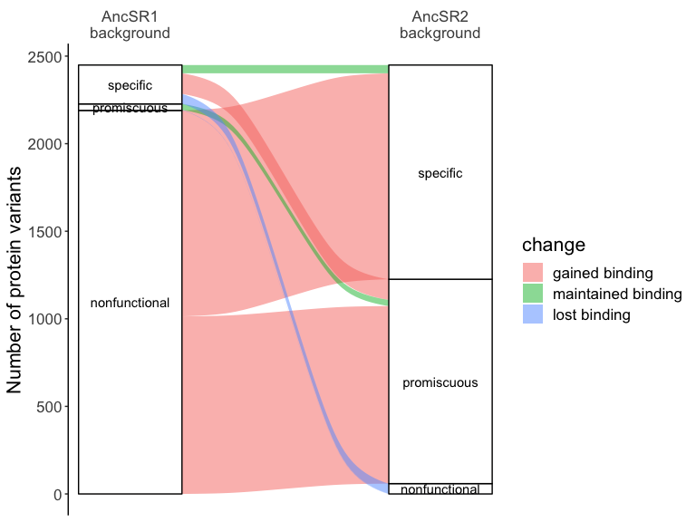<!-- -->

``` r
# Of protein variants that are specific in the AncSR1 background, do they change
# specificity or maintain the same specificity in the AncSR2 background?
meanF_data_specificity %>%
  filter(nfxnal > 0) %>%
  mutate(specific = ifelse(nfxnal == 1, "specific", "promiscuous")) %>%
  select(bg, AA_var, specific) %>%
  pivot_wider(names_from = bg, values_from = specific) %>%
  replace_na(list(AncSR1 = "nonfunctional", AncSR2 = "nonfunctional")) %>%
  count(AncSR1, AncSR2) %>%
  ungroup() %>%
  filter(AncSR1 == "specific") %>%
  mutate(frac = n / sum(n)) %>%
  kable(caption = "Change in phenotype for AncSR1 specific variants")
```

| AncSR1   | AncSR2        |   n |      frac |
|:---------|:--------------|----:|----------:|
| specific | nonfunctional |  57 | 0.2567568 |
| specific | promiscuous   | 118 | 0.5315315 |
| specific | specific      |  47 | 0.2117117 |

Change in phenotype for AncSR1 specific variants

``` r
AncSR1specificswitchplot <- meanF_data_specificity %>%
  filter(nfxnal > 0) %>%
  mutate(specificity = apply(select(., `functional_ERE (GT)`:functional_TT), 
                             1, which)) %>%
  mutate(specificity = sapply(specificity, function(x) 
    ifelse(length(x) == 1, levels(REs[[1]])[x], "promiscuous"))) %>%
  select(bg, AA_var, specificity) %>%
  pivot_wider(names_from = bg, values_from = specificity) %>%
  filter(AncSR1 %in% REs[[1]]) %>%
  replace_na(list(AncSR2 = "nonfunctional")) %>%
  count(AncSR1, AncSR2) %>%
  mutate(change = map2_chr(AncSR1, AncSR2,
                           ~ {if(.x == .y) "maintained specificity"
                             else if(.y %in% REs[[1]]) "switched specificity"
                             else if(.y == "promiscuous") "gained promiscuity"
                             else "lost binding"})) %>%
  mutate(AncSR1 = factor(AncSR1, levels = levels(REs[[1]])),
         AncSR2 = factor(AncSR2, levels = c(levels(REs[[1]]), "promiscuous", 
                                            "nonfunctional")),
         change = factor(change, levels = c("maintained specificity", 
                                            "switched specificity",
                                            "gained promiscuity",
                                            "lost binding"))) %>%
  ggplot(aes(y = n, axis1 = AncSR1, axis2 = AncSR2)) +
  geom_alluvium(aes(fill = change)) +
  geom_stratum() +
  geom_text(stat = "stratum", aes(label = after_stat(stratum))) +
  scale_x_discrete(limits = c("AncSR1\nbackground", "AncSR2\nbackground"),
                   expand = c(0.15, 0.05),
                   position = "top") +
  labs(y = "Number of protein variants") +
  theme_classic() +
  # guides(fill = "none") +
  theme(text = element_text(size = fontsize),
        axis.line.x = element_blank(),
        axis.ticks.x = element_blank())
AncSR1specificswitchplot
```

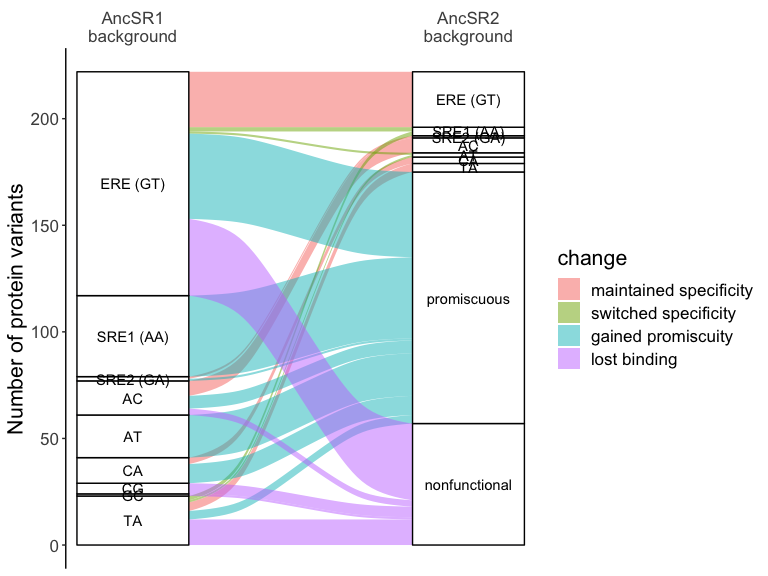<!-- -->

What are the amino acid sequence determinants of binding, specificity,
and promiscuity?

``` r
allbindersbybglogoplot <- list(AncSR1 = meanF_data %>% 
                             filter(functional, bg == "AncSR1") %>% 
                             pull(AA_var) %>%
                             as.character() %>%
                             unique(),
                           AncSR2 = meanF_data %>%
                             filter(functional, bg == "AncSR2") %>%
                             pull(AA_var) %>%
                             as.character() %>%
                             unique()) %>%
  ggseqlogo(method = "probability") +
  theme(text = element_text(size = fontsize)) +
  labs(x = "RH position", title = "All binders")
allbindersbybglogoplot
```

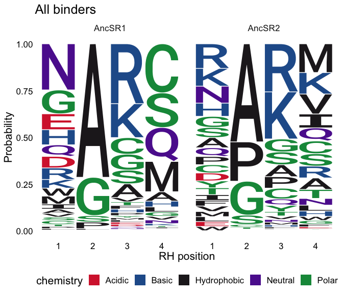<!-- -->

``` r
allbindersbybgRElogoplot <- list(AncSR1 = meanF_data %>%
                                   filter(functional, bg == "AncSR1") %>%
                                   {sapply(levels(REs[[1]]), function(x)
                                     filter(., RE == x) %>% pull(AA_var) %>%
                                       as.character(), USE.NAMES = TRUE)},
                                 AncSR2 = meanF_data %>%
                                   filter(functional, bg == "AncSR2") %>%
                                   {sapply(levels(REs[[1]]), function(x)
                                     filter(., RE == x) %>% pull(AA_var) %>%
                                       as.character(), USE.NAMES = TRUE)}) %>%
  list_flatten(name_spec = "{outer} {inner}") %>%
  discard(~ length(.x) == 0) %>%
  ggseqlogo(method = "probability", nrow = 4) +
  theme(text = element_text(size = fontsize - 4)) +
  labs(x = "RH position", title = "All binders")
allbindersbybgRElogoplot
```

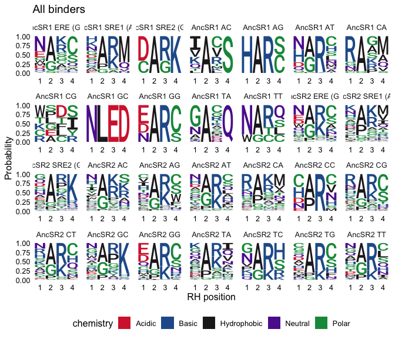<!-- -->

``` r
specificbinderslogoplot <- list(AncSR1 = meanF_data_specificity %>% 
                                  filter(nfxnal == 1, bg == "AncSR1") %>% 
                                  mutate(specificity = 
                                           apply(select(., `functional_ERE (GT)`:functional_TT), 
                                                 1, function(x) 
                                                   as.character(REs[[1]][which(x)]))) %>%
                                  {sapply(levels(REs[[1]]), function(x)
                                    filter(., specificity == x) %>% 
                                      pull(AA_var) %>% as.character(),
                                    USE.NAMES = TRUE)},
                                AncSR2 = meanF_data_specificity %>% 
                                  filter(nfxnal == 1, bg == "AncSR2") %>% 
                                  mutate(specificity = 
                                           apply(select(., `functional_ERE (GT)`:functional_TT), 
                                                 1, function(x) 
                                                   as.character(REs[[1]][which(x)]))) %>%
                                  {sapply(levels(REs[[1]]), function(x)
                                    filter(., specificity == x) %>% 
                                      pull(AA_var) %>% as.character(),
                                    USE.NAMES = TRUE)}) %>%
  list_flatten(name_spec = "{outer} {inner}") %>%
  discard(~ length(.x) == 0) %>%
  ggseqlogo(method = "probability", nrow = 4) +
  theme(text = element_text(size = fontsize - 4)) +
  labs(x = "RH position", title = "Specific binders")
specificbinderslogoplot
```

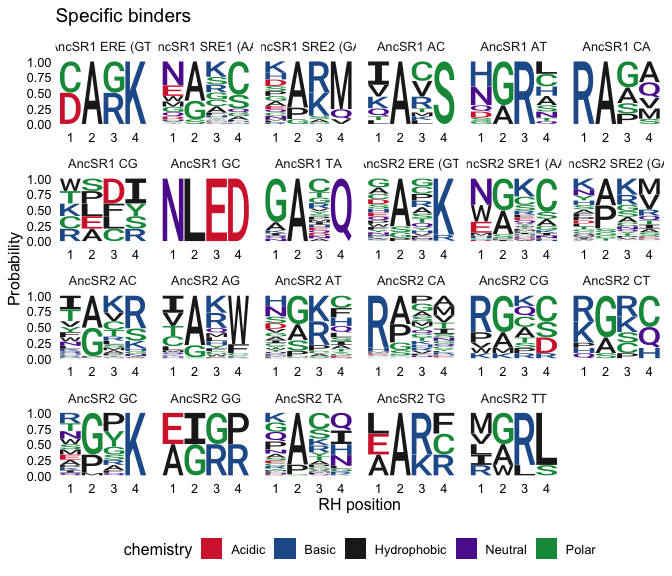<!-- -->

``` r
promiscuousbinderslogoplot <- list(AncSR1 = meanF_data_specificity %>% 
                                  filter(nfxnal > 1, bg == "AncSR1") %>% 
                                  pull(AA_var) %>% unique() %>% as.character(),
                                AncSR2 = meanF_data_specificity %>% 
                                  filter(nfxnal > 1, bg == "AncSR2") %>% 
                                  pull(AA_var) %>% unique() %>% as.character()) %>%
  ggseqlogo(method = "probability") +
  theme(text = element_text(size = fontsize)) +
  labs(x = "RH position", title = "Promiscuous binders")
promiscuousbinderslogoplot
```

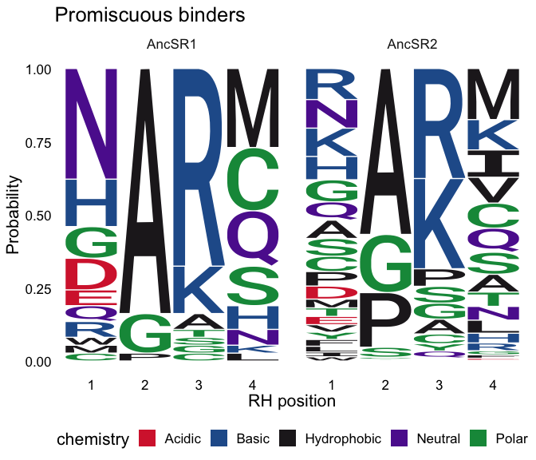<!-- -->

``` r
promiscuouspairslogoplot <- list(AncSR1 = map2(c("ERE (GT)", "SRE1 (AA)", "SRE1 (AA)"),
                                               c("AT", "AT", "CA"),
                                               ~ meanF_data_specificity %>%
                                                 filter(bg == "AncSR1",
                                                        !!sym(paste0("functional_", .x)),
                                                        !!sym(paste0("functional_", .y))) %>%
                                                 pull(AA_var) %>% as.character()) %>%
                                   set_names(c("ERE (GT), AT", "SRE1 (AA), AT", "SRE1 (AA), CA")),
                                 AncSR2 = map2(c("SRE1 (AA)", "SRE1 (AA)", "SRE1 (AA)", "AT", "CA"),
                                               c("AT", "CA", "TA", "TT", "TA"),
                                               ~ meanF_data_specificity %>%
                                                 filter(bg == "AncSR2",
                                                        !!sym(paste0("functional_", .x)),
                                                        !!sym(paste0("functional_", .y))) %>%
                                                 pull(AA_var) %>% as.character()) %>%
                                   set_names(c("SRE1 (AA), AT", "SRE1 (AA), CA", "SRE1 (AA), TA", 
                                               "AT, TT", "CA, TA"))) %>%
  list_flatten(name_spec = "{outer} {inner}") %>%
  ggseqlogo(method = "probability") +
  theme(text = element_text(size = fontsize - 4)) +
  labs(x = "RH position", title = "Promiscuous binders")
promiscuouspairslogoplot
```

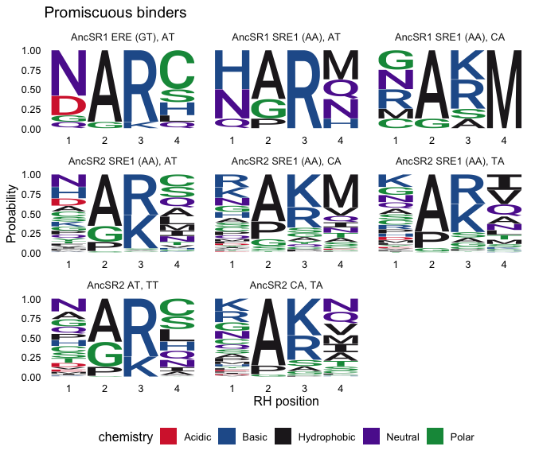<!-- -->

``` r
# plot the number of REs each RH variant is active on
a1 <- multiple_REs_variants %>%
  mutate(specific = factor(ifelse(nREs == 1, "specific", "promiscuous"),
                           levels = c("specific", "promiscuous"))) %>%
  group_by(bg, specific) %>%
  count(name = "nvars") %>%
  ggplot(aes(x = as.factor(specific), y = nvars, fill = bg)) +
  geom_col(width=0.9) +
  geom_text(aes(label=nvars), vjust=-0.5, color="black", size=4) +
  scale_y_continuous(expand = expansion(mult = c(0, 0.1))) +
  facet_grid(rows = vars(bg), scales = "free") +
  scale_fill_manual(values=bg_color()) +
  labs(title = "", x = "", 
       y = "Number of protein variants",
       fill = "Ancestral\nbackground") +
  theme_classic() +
  theme(text = element_text(size = fontsize),
        plot.title = element_text(size = 14),
        legend.position = "none",
        strip.background = element_blank(),
        strip.text.y = element_blank()) +
  guides(x = guide_axis(angle = 45))

a2 <- multiple_REs_variants %>%
  group_by(bg, nREs) %>% 
  count(name = "nvars") %>%
  ggplot(aes(x = as.factor(nREs), y = nvars, fill = bg)) +
  geom_col(width=0.9) +
  geom_text(aes(label=nvars), vjust=-0.5, color="black", size=4) +
  scale_y_continuous(expand = expansion(mult = c(0, 0.1))) +
  facet_grid(rows = vars(bg), scales = "free") +
  scale_fill_manual(values=bg_color()) +
  labs(title = "",
       x = "Number of response elements bound", 
       y = "",
       fill = "Ancestral\nbackground") +
  theme_classic() +
  theme(text = element_text(size = fontsize),
        plot.title = element_text(size = 14),
        legend.text = element_text(size = 14),
        legend.position = c(0.9, 0.9),
        strip.background = element_blank(),
        strip.text.y = element_blank())

a1 + a2 + plot_layout(widths = c(1, 5))

# plot as proportion promiscuous vs. specific
totals <- multiple_REs_variants %>%
  mutate(specific = factor(ifelse(nREs == 1, "specific", "promiscuous"),
                           levels = c("specific", "promiscuous"))) %>%
  group_by(bg, specific) %>%
  count(name = "nvars") %>%
  group_by(bg) %>%
  summarize(total = sum(nvars))
a3 <- multiple_REs_variants %>%
  mutate(specific = factor(ifelse(nREs == 1, "specific", "promiscuous"),
                           levels = c("specific", "promiscuous"))) %>%
  group_by(bg, specific) %>%
  count(name = "nvars") %>%
  ggplot(aes(x = bg, y = nvars, fill = bg, alpha = fct_rev(specific))) +
  geom_bar(stat = "identity", width=0.9, position = "fill") +
  geom_text(aes(label=nvars), position = position_fill(vjust = 0.5),
            color="black", size=4, alpha = 1) +
  # geom_text(data = totals, 
  #           aes(x = bg, label = total, y = 1, fill = NULL, alpha = NULL), 
  #           vjust = -0.5, size = 4) +
  scale_y_continuous(expand = expansion(mult = c(0, 0.1))) +
  scale_fill_manual(values=bg_color()) +
  scale_alpha_manual(values = c(0.5, 1)) +
  labs(title = "", x = "Ancestral\nbackground", 
       y = "Proportion of protein variants",
       fill = "Ancestral\nbackground",
       alpha = "Specificity") +
  theme_classic() +
  theme(text = element_text(size = fontsize),
        plot.title = element_text(size = 14),
        legend.position = "none",
        strip.background = element_blank(),
        strip.text.y = element_blank()) +
  guides(x = guide_axis(angle = 45))

# plot as proportion promiscuous
a4 <- multiple_REs_variants %>%
  mutate(specific = factor(ifelse(nREs == 1, "specific", "promiscuous"),
                           levels = c("specific", "promiscuous"))) %>%
  group_by(bg) %>%
  summarize(prop = sum(specific == "promiscuous") / n()) %>%
  ggplot(aes(x = bg, y = prop, fill = bg)) +
  geom_col(width=0.9) +
  scale_fill_manual(values=bg_color()) +
  labs(title = "", x = "Ancestral\nbackground", 
       y = "Fraction of promiscuous protein variants",
       fill = "Ancestral\nbackground",
       alpha = "Specificity") +
  theme_classic() +
  theme(text = element_text(size = fontsize),
        plot.title = element_text(size = 14),
        legend.position = "none",
        strip.background = element_blank(),
        strip.text.y = element_blank()) +
  guides(x = guide_axis(angle = 45))


# plot which REs each RH variant is active on by number of genotypes that it 
# binds to

# Find the RE variant(s) that is (are) bound by each protein variant. If a
# a protein variant binds to multiple sets of REs significantly but the union
# of those REs are not significantly bound, take the set with the highest
# p-value
multiple_REs_bound_data <- lapply(multiple_REs_bound_data, function(x)
  x %>% group_by(bg, AA_var) %>% arrange(desc(padj), .by_group = TRUE))
multiple_REs_variants$RE <- NA
for(i in 1:nrow(multiple_REs_variants)) {
  row <- multiple_REs_variants[i,]
  revars <- multiple_REs_bound_data[[as.numeric(row[3])]] %>% 
    ungroup() %>%
    semi_join(row, by = c("AA_var", "bg")) %>%
    slice(1) %>% 
    select(2:(as.numeric(row[3])+1)) %>% 
    t() %>% 
    str_c(collapse = ", ")
  multiple_REs_variants[i, "RE"] <- revars
}

# plot
b <- multiple_REs_variants %>%
  group_by(bg, nREs) %>%
  count(RE) %>%
  arrange(n) %>%
  ggplot(aes(x = factor(nREs), y = n, color = RE, fill = bg, label = RE)) +
  geom_col(width = 0.9, color = "black", position = "fill") +
  facet_grid(rows = vars(bg)) +
  geom_text(aes(color = bg), 
            position = position_fill(vjust = 0.5), size = 2.5) +
  geom_text(data = multiple_REs_variants %>% 
              group_by(bg, nREs) %>% count(name = "nvars"),
            aes(x = factor(nREs), label=nvars), y = 1, vjust=-0.5, color="black", size=4) +
  scale_y_continuous(expand = expansion(mult = c(0, 0.1))) +
  scale_fill_manual(values=bg_color()) +
  scale_color_manual(values = c("white", "black"), guide = "none") +
  labs(title = "",
       x = "Number of REs bound", 
       y = "Fraction of protein variants binding\neach RE combination",
       fill = "Ancestral\nbackground") +
  theme_classic() +
  theme(text = element_text(size = fontsize),
        plot.title = element_text(size = 14),
        legend.text = element_text(size = 14),
        legend.position = c(0.9, 0.9),
        strip.background = element_blank(),
        strip.text.y = element_blank())
b


# for each RE, how many protein variants bind it specifically vs. promiscuously?
RE_frac_specific <- data.frame(bg = rep(NA, 32), RE = NA, 
                               specific = NA, promiscuous = NA)
i <- 1
for(revar in REs[[1]]) {
  for(background in c("AncSR1", "AncSR2")) {
    specific <- multiple_REs_variants %>%
      filter(bg == background, nREs == 1, RE == revar) %>%
      nrow()
    promiscuous <- multiple_REs_variants %>%
      filter(bg == background, nREs > 1, 
             grepl(sub("\\(..\\)", "", revar), RE)) %>%
      nrow()
    RE_frac_specific[i,] <- c(background, revar, specific, promiscuous)
    i <- i + 1
  }
}

c <- RE_frac_specific %>%
  pivot_longer(3:4, names_to = "specific", values_to = "n") %>%
  ggplot(aes(x = factor(RE, levels = levels(REs[[1]])), 
             y = as.numeric(n), 
             fill = bg, 
             alpha = factor(specific, levels = c("specific", "promiscuous")))) +
  geom_col(width = 0.9, position = "dodge") +
  facet_grid(rows = vars(bg), scales = "free") +
  scale_alpha_manual(values = c(1, 0.5)) +
  labs(x = "Response element", y = "Number of protein variants",
       fill = "Ancestral\nbackground", alpha = "Specificity") +
  scale_fill_manual(values=bg_color()) +
  theme_classic() +
  guides(x = guide_axis(angle = 45)) +
  theme(text = element_text(size = fontsize),
        plot.title = element_text(size = 14),
        legend.text = element_text(size = 14),
        strip.background = element_blank(),
        strip.text.y = element_blank())
c

# plot as proportion promiscuous vs. specific
totals <- RE_frac_specific %>%
  pivot_longer(3:4, names_to = "specific", values_to = "n") %>%
  mutate(n = as.numeric(n)) %>%
  group_by(bg, RE) %>%
  summarize(total = sum(n))
c2 <- RE_frac_specific %>%
  pivot_longer(3:4, names_to = "specific", values_to = "n") %>%
  mutate(n = as.numeric(n)) %>%
  ggplot(aes(x = factor(RE, levels = levels(REs[[1]])), 
             y = n, 
             fill = bg, 
             alpha = factor(specific, levels = c("promiscuous", "specific")))) +
  geom_bar(stat = "identity", width = 0.9, position = "fill") +
  # scale_y_continuous(expand = c(0, 0.1)) +
  facet_grid(rows = vars(bg), scales = "free") +
  scale_alpha_manual(values = c(0.5, 1)) +
  # geom_text(data = totals, 
  #           aes(x = RE, label = total, y = 1, fill = NULL, alpha = NULL), 
  #           vjust = -0.5) +
  labs(x = "Response element", y = "",
       fill = "Ancestral\nbackground", alpha = "Specificity") +
  scale_fill_manual(values=bg_color()) +
  theme_classic() +
  guides(x = guide_axis(angle = 45)) +
  theme(text = element_text(size = fontsize),
        plot.title = element_text(size = 14),
        legend.text = element_text(size = 14),
        strip.background = element_blank(),
        strip.text.y = element_blank())

# plot as proportion promiscuous
c3 <- RE_frac_specific %>%
  mutate(specific = as.numeric(specific),
         promiscuous = as.numeric(promiscuous),
         prop = promiscuous / (specific + promiscuous)) %>%
  ggplot(aes(x = factor(RE, levels = levels(REs[[1]])), y = prop, fill = bg)) +
  geom_col(width=0.9, position = "dodge") +
  scale_fill_manual(values=bg_color()) +
  labs(title = "", x = "Ancestral\nbackground", 
       y = "Fraction of promiscuous protein variants",
       fill = "Ancestral\nbackground",
       alpha = "Specificity") +
  theme_classic() +
  theme(text = element_text(size = fontsize),
        plot.title = element_text(size = 14),
        legend.position = "none",
        strip.background = element_blank(),
        strip.text.y = element_blank()) +
  guides(x = guide_axis(angle = 45))

a3 + plot_spacer() + c2 + plot_layout(widths = c(1.5, 0.5, 6))

# plot as number promiscuous vs. specific
c4 <- RE_frac_specific %>%
  pivot_longer(3:4, names_to = "specific", values_to = "n") %>%
  mutate(n = as.numeric(n)) %>%
  ggplot(aes(x = factor(RE, levels = levels(REs[[1]])), 
             y = n, 
             fill = bg, 
             alpha = factor(specific, levels = c("promiscuous", "specific")))) +
  geom_bar(stat = "identity", width = 0.9, position = "stack") +
  # scale_y_continuous(expand = c(0, 0.1)) +
  facet_grid(rows = vars(bg), scales = "free") +
  scale_alpha_manual(values = c(0.5, 1)) +
  # geom_text(data = totals, 
  #           aes(x = RE, label = total, y = 1, fill = NULL, alpha = NULL), 
  #           vjust = -0.5) +
  labs(x = "Response element", y = "Number of functional protein variants",
       fill = "Ancestral\nbackground", alpha = "Specificity") +
  scale_fill_manual(values=bg_color()) +
  theme_classic() +
  guides(x = guide_axis(angle = 45)) +
  theme(text = element_text(size = fontsize),
        plot.title = element_text(size = 14),
        legend.text = element_text(size = 14),
        strip.background = element_blank(),
        strip.text.y = element_blank())
c4

# plot as number promiscuous vs. specific side by side
c5 <- RE_frac_specific %>%
  pivot_longer(3:4, names_to = "specific", values_to = "n") %>%
  mutate(n = as.numeric(n)) %>%
  ggplot(aes(x = bg, 
             y = n, 
             fill = bg, 
             alpha = factor(specific, levels = c("promiscuous", "specific")))) +
  geom_bar(stat = "identity", width = 0.9, position = "stack") +
  facet_grid(cols = vars(factor(RE, levels = levels(REs[[1]])))) +
  # scale_y_continuous(expand = c(0, 0.1)) +
  scale_alpha_manual(values = c(0.5, 1)) +
  # geom_text(data = totals, 
  #           aes(x = RE, label = total, y = 1, fill = NULL, alpha = NULL), 
  #           vjust = -0.5) +
  labs(x = "Response element", y = "Number of functional protein variants",
       fill = "Ancestral\nbackground", alpha = "Specificity") +
  scale_fill_manual(values=bg_color()) +
  theme_classic() +
  guides(x = guide_axis(angle = 45)) +
  theme(text = element_text(size = fontsize),
        plot.title = element_text(size = 14),
        legend.text = element_text(size = 14),
        strip.background = element_blank(),
        strip.text.x = element_blank())
c5
```

## What is the distribution of fluorescence for protein variants that bind specifically vs. promiscously?

``` r
meanF_data_functional <- meanF_data_functional %>%
  left_join(multiple_REs_variants %>% select(-RE)) %>%
  mutate(nREs = ifelse(nREs == 1, "specific", "promiscuous")) %>% 
  rename(specific = nREs)
a <- meanF_data_functional %>%
  drop_na(specific) %>%
  mutate(specific = factor(specific, levels = c("specific", "promiscuous"))) %>%
  ggplot(aes(x = specific, 
             y = avg_meanF, fill = bg, alpha = specific)) +
  geom_boxplot() +
  scale_alpha_manual(values = c(1, 0.5), guide = "none") +
  labs(y = "Fluorescence", fill = "Ancestral\nbackground", x = "") +
  scale_fill_manual(values=bg_color()) +
  geom_signif(aes(group = specific),
              comparisons = list(c("specific", "promiscuous")), 
              test = "wilcox.test",
              map_signif_level = TRUE) +
  facet_grid(cols = vars(bg)) +
  theme_classic() +
  theme(text = element_text(size = fontsize),
        plot.title = element_text(size = 14),
        legend.text = element_text(size = 14),
        strip.background = element_blank(),
        strip.text.x = element_blank())
a
```

``` r
a2 <- multiple_REs_variants %>%
  group_by(bg, nREs) %>% 
  count(name = "nvars") %>%
  ggplot(aes(x = as.factor(nREs), y = nvars, fill = bg)) +
  geom_col(width=0.9) +
  geom_text(aes(label=nvars), vjust=-0.5, color="black", size=4) +
  scale_y_continuous(expand = expansion(mult = c(0, 0.1))) +
  facet_grid(rows = vars(bg), scales = "free") +
  scale_fill_manual(values=bg_color()) +
  labs(title = "",
       x = "Number of response elements bound", 
       y = "Number of protein variants",
       fill = "Ancestral\nbackground") +
  theme_classic() +
  theme(text = element_text(size = fontsize),
        plot.title = element_text(size = 14),
        legend.text = element_text(size = 14),
        legend.position = c(0.9, 0.9),
        strip.background = element_blank(),
        strip.text.y = element_blank())
a2

c <- fluorescence_both_backgrounds %>%
  pivot_longer(3:4, names_to = "background") %>%
  ggplot(aes(x = background, y = value, fill = background)) +
  geom_boxplot() +
  scale_fill_manual(values = c(bg_color()), drop = FALSE) +
  labs(title = "Protein:RE variant combos\nfunctional in both backgrounds", 
       x = "Ancestral background", y = "Fluorescence", 
       fill = "Ancestral\nbackground") +
  theme_classic() +
  theme(text = element_text(size = fontsize),
        plot.title = element_text(size = 14),
        legend.text = element_text(size = 14),
        axis.line.x = element_line(color = "black",),
        legend.position = "none",
        plot.caption = element_text(hjust = 0)) +
  guides(x = guide_axis(angle = 45)) +
  geom_signif(comparisons = list(c("AncSR1", "AncSR2")), 
              test = "wilcox.test",
              test.args = list(alternative = "less"),
              map_signif_level = function(p) sprintf("p = %.2g", p))
c

c + a2 + plot_layout(widths = c(1.5, 3))
```

## What is the genetic basis of specificity vs. promiscuity?

``` r
# logo plots for all functional variants in the AncSR2 background
a <- ggseqlogo(meanF_data_functional %>% 
                 filter(bg == "AncSR2") %>%
                 pull(AA_var) %>% unique() %>% as.character(),
                 method = "bits") +
  theme(text=element_text(size=fontsize),
        plot.title = element_text(size = fontsize),
        legend.position = "none") +
  labs(x="AA position", title="All AncSR2 protein variants")
a

# logo plots for variants that bind specifically to one RE in the AncSR2 background
AncSR2_specific_vars <- lapply(REs[[1]], function(x) multiple_REs_variants %>%
                                 filter(bg == "AncSR2", nREs == 1, RE == x) %>% 
                                 pull(AA_var) %>%
                                 as.character())
names(AncSR2_specific_vars) <- REs[[1]]
AncSR2_specific_vars <- AncSR2_specific_vars[sapply(AncSR2_specific_vars, length) >= 50]
b <- ggseqlogo(AncSR2_specific_vars, 
          method="bits", ncol = length(meanF_data_functional)) +
  theme(text=element_text(size=fontsize),
        strip.text.x = element_text(size = fontsize),
        legend.position = "none") +
  labs(x="AA position")
b


# logo plots for variants that bind promiscuously to more than one RE in the AncSR2 background
c <- ggseqlogo(meanF_data_functional %>% 
                 filter(specific == "promiscuous", bg == "AncSR2") %>%
                 pull(AA_var) %>% unique() %>% as.character(), 
          method="bits") +
  theme(text=element_text(size=fontsize),
        legend.position = "none") +
  labs(x="AA position", title="Promiscuous AncSR2 protein variants")
c
```

## do variants switch between functional/nonfunctional/promiscuous/specific between AncSR1 and AnSR2?

``` r
alluvial_data <- multiple_REs_variants %>%
  mutate(specificity = factor(ifelse(nREs > 1, "promiscuous", RE), 
                           levels = c(levels(REs[[1]]), 
                                      "same specificity", "switched specificity", 
                                      "promiscuous", "nonfunctional"))) %>%
  select(AA_var, bg, specificity) %>%
  pivot_wider(names_from = bg, values_from = specificity) %>%
  replace_na(list(AncSR1 = "nonfunctional", AncSR2 = "nonfunctional")) %>%
  filter(AncSR1 != "nonfunctional")
for(i in 1:nrow(alluvial_data)) {
  spec1 <- as.character(alluvial_data[i,2] %>% pull(1))
  spec2 <- as.character(alluvial_data[i,3] %>% pull(1))
  if(spec2 %in% as.character(REs[[1]])) {
    if(spec1 %in% as.character(REs[[1]])) {
      if(spec1 == spec2) alluvial_data[i,3] <- "same specificity"
      else alluvial_data[i,3] <- "switched specificity"
    } else {
      alluvial_data[i,3] <- "switched specificity"
    }
  }
}

alluvial_data <- alluvial_data %>%
  mutate(AncSR1 = factor(ifelse(AncSR1 %in% REs[[1]], "specific", "promiscuous"),
                         levels = c("promiscuous", "specific")),
         AncSR2 = factor(AncSR2, levels = c("promiscuous", "same specificity", 
                                            "switched specificity", "nonfunctional")))


a <- alluvial_data %>%
  filter(AncSR2 != "nonfunctional") %>%
  count(AncSR1, AncSR2) %>%
  ggplot(aes(axis1 = AncSR1, 
             axis2 = AncSR2, 
             y = n)) +
  geom_alluvium(aes(fill = AncSR2), width = 3/5) +
  geom_stratum(width = 3/5) +
  geom_text(stat = "stratum", aes(label = after_stat(stratum)), size = 4) +
  scale_x_discrete(limits = c("AncSR1\nbackground", "AncSR2\nbackground"),
                   expand = c(0.15, 0.05),
                   position = "top") +
  # scale_fill_manual(values = viridis(4)) +
  labs(title = "Protein variants functional\nin both backgrounds", 
       x = "", y = "Number of protein variants",
       fill = "AncSR2 phenotype") +
  theme_classic() +
  guides(fill = "none") +
  theme(text = element_text(size = fontsize),
        plot.title = element_text(size = 14),
        legend.text = element_text(size = 12),
        axis.text.y = element_blank(),
        axis.ticks = element_blank(),
        axis.line = element_blank(),
        axis.text.x = element_text(size = fontsize))
a


# mean fluorescence for things that became promiscuous, 
# retained specificity, or retained promiscuity
b <- alluvial_data %>%
  filter(AncSR2 %in% c("promiscuous", "same specificity")) %>%
  unite(col = "phechange", AncSR1, AncSR2, sep = " to ") %>%
  mutate(phechange = factor(ifelse(phechange == "specific to same specificity",
                            "retained specificity", 
                            ifelse(phechange == "promiscuous to promiscuous",
                                   "retained promiscuity",
                                   phechange)),
                            levels = c("retained specificity",
                                       "specific to promiscuous",
                                   "retained promiscuity" ))) %>%
  inner_join(meanF_data_functional) %>%
  filter(bg == "AncSR1") %>%
  ggplot(aes(x = phechange, y = avg_meanF, fill = bg)) +
  geom_boxplot() +
  scale_fill_manual(values = bg_color("AncSR1")) +
  labs(x = "AncSR1 to AncSR2\nphenotype change", y = "Fluorescence", 
       fill = "", title = "Protein:RE variant combos\nfunctional in AncSR1 background") +
  theme_classic() +
  theme(text = element_text(size = fontsize),
        plot.title = element_text(size = 14),
        legend.text = element_text(size = 14),
        axis.line.x = element_line(color = "black",),
        legend.position = "none",
        plot.caption = element_text(hjust = 0)) +
  guides(x = guide_axis(angle = 45)) +
  geom_signif(comparisons = list(c("retained specificity", "specific to promiscuous"),
                                 c("specific to promiscuous", "retained promiscuity")), 
              test = "wilcox.test",
              test.args = list(alternative = "less"),
              map_signif_level = function(p) sprintf("p = %.2g", p))

c <- fluorescence_both_backgrounds %>%
  pivot_longer(3:4, names_to = "background") %>%
  ggplot(aes(x = background, y = value, fill = background)) +
  geom_boxplot() +
  scale_fill_manual(values = c(bg_color()), drop = FALSE) +
  labs(title = "Protein:RE variant combos\nfunctional in both backgrounds", 
       x = "Ancestral background", y = "", fill = "Ancestral\nbackground") +
  theme_classic() +
  theme(text = element_text(size = fontsize),
        plot.title = element_text(size = 14),
        legend.text = element_text(size = 14),
        axis.line.x = element_line(color = "black",),
        legend.position = "right",
        plot.caption = element_text(hjust = 0)) +
  guides(x = guide_axis(angle = 45)) +
  geom_signif(comparisons = list(c("AncSR1", "AncSR2")), 
              test = "wilcox.test",
              test.args = list(alternative = "less"),
              map_signif_level = function(p) sprintf("p = %.2g", p))

b + c + plot_layout(widths = c(3, 3))
```

# Network analysis

Let’s create the genotype networks, where each node is a protein variant
and their associated traits are the REs that they bind to.

``` r
# create data frame of which protein variants bind to which REs
# REs_bound <- multiple_REs_variants %>%
#   separate_longer_delim(cols = RE, delim = ", ") %>%
#   mutate(present = 1) %>%
#   pivot_wider(names_from = RE, values_from = present)
  

## AncSR1
AncSR1_comb <- combn(meanF_data_specificity %>% 
                       filter(bg == "AncSR1", nfxnal > 0) %>% 
                       pull(AA_var) %>% 
                       as.character(), 2)
AncSR1_edges <- t(AncSR1_comb)
AncSR1_connected <- apply(AncSR1_edges, 1, connected)
AncSR1_connected <- AncSR1_edges[AncSR1_connected,]
  

# create undirected graph where edges represent single step mutations between
# RH genotypes permissible by the genetic code; node attributes are boolean
# variables indicating binding to each RE, and one integer variable for number
# of REs bound
AncSR1_graph <- graph_from_data_frame(AncSR1_connected, directed=FALSE, 
                                      vertices = meanF_data_specificity %>% 
                                        filter(bg == "AncSR1", nfxnal > 0) %>% 
                                        select(AA_var, `functional_ERE (GT)`:nfxnal) %>%
                                        mutate(AA_var = as.character(AA_var)))
write_graph(AncSR1_graph, 
            file.path(results_dir, "AncSR1_RH_network.graphml"),
            format="graphml")

## AncSR2
AncSR2_comb <- combn(meanF_data_specificity %>% 
                       filter(bg == "AncSR2", nfxnal > 0) %>% 
                       pull(AA_var) %>% 
                       as.character(), 2)
AncSR2_edges <- t(AncSR2_comb)
AncSR2_connected <- apply(AncSR2_edges, 1, connected)
AncSR2_connected <- AncSR2_edges[AncSR2_connected,]
  

# create undirected graph where edges represent single step mutations between
# RH genotypes permissible by the genetic code; node attributes are boolean
# variables indicating binding to each RE, and one integer variable for number
# of REs bound
AncSR2_graph <- graph_from_data_frame(AncSR2_connected, directed=FALSE, 
                                      vertices = meanF_data_specificity %>% 
                                        filter(bg == "AncSR2", nfxnal > 0) %>% 
                                        select(AA_var, `functional_ERE (GT)`:nfxnal) %>%
                                        mutate(AA_var = as.character(AA_var)))
write_graph(AncSR2_graph, 
            file.path(results_dir, "AncSR2_RH_network.graphml"),
            format="graphml")
```

RH-RE networks

``` r
# AncSR1
AncSR1_RHRE_comb <- combn(meanF_data_specificity %>% 
                            filter(bg == "AncSR1", nfxnal > 0) %>% 
                            select(bg, AA_var, 
                                   `functional_ERE (GT)`:functional_TT) %>%
                            pivot_longer(`functional_ERE (GT)`:functional_TT, 
                                         names_to = "RE", 
                                         names_prefix = "functional_", 
                                         values_to = "functional") %>%
                            filter(functional) %>%
                            mutate(RE = sub(".+ \\(", "", RE)) %>%
                            mutate(RE = sub("\\)", "", RE)) %>%
                            unite(AA_var, RE, col = "var", sep = "") %>%
                            pull(var), 2)
AncSR1_RHRE_edges <- t(AncSR1_RHRE_comb)
AncSR1_RHRE_connected <- apply(AncSR1_RHRE_edges, 1, connected_RH_RE)
AncSR1_RHRE_connected <- AncSR1_RHRE_edges[AncSR1_RHRE_connected,]
AncSR1_RHRE_vertices <- unique(as.character(AncSR1_RHRE_comb))
AncSR1_RHRE_vertices <- data.frame(var = AncSR1_RHRE_vertices,
                                   RE = sub("....", "", AncSR1_RHRE_vertices))

AncSR1_RHRE_graph <- graph_from_data_frame(AncSR1_RHRE_connected, directed=FALSE, 
                                           vertices = AncSR1_RHRE_vertices)
write_graph(AncSR1_RHRE_graph, 
            file.path(results_dir, "AncSR1_RHRE_network.graphml"),
            format="graphml")
```

``` r
# AncSR2
AncSR2_RHRE_comb <- combn(meanF_data_specificity %>% 
                            filter(bg == "AncSR2", nfxnal > 0) %>% 
                            select(bg, AA_var, 
                                   `functional_ERE (GT)`:functional_TT) %>%
                            pivot_longer(`functional_ERE (GT)`:functional_TT, 
                                         names_to = "RE", 
                                         names_prefix = "functional_", 
                                         values_to = "functional") %>%
                            filter(functional) %>%
                            mutate(RE = sub(".+ \\(", "", RE)) %>%
                            mutate(RE = sub("\\)", "", RE)) %>%
                            unite(AA_var, RE, col = "var", sep = "") %>%
                            pull(var), 2)
AncSR2_RHRE_edges <- t(AncSR2_RHRE_comb)
if(!file.exists(file.path(results_dir, "AncSR2_RHRE_connected.rda"))) {
  AncSR2_RHRE_connected <- apply(AncSR2_RHRE_edges, 1, connected_RH_RE)
  save(AncSR2_RHRE_connected, file = file.path(results_dir, "AncSR2_RHRE_connected.rda"))
} else load(file.path(results_dir, "AncSR2_RHRE_connected.rda"))
AncSR2_RHRE_connected <- AncSR2_RHRE_edges[AncSR2_RHRE_connected,]
AncSR2_RHRE_vertices <- unique(as.character(AncSR2_RHRE_comb))
AncSR2_RHRE_vertices <- data.frame(var = AncSR2_RHRE_vertices,
                                   RE = sub("....", "", AncSR2_RHRE_vertices))

AncSR2_RHRE_graph <- graph_from_data_frame(AncSR2_RHRE_connected, directed=FALSE, 
                                           vertices = AncSR2_RHRE_vertices)
write_graph(AncSR2_RHRE_graph, 
            file.path(results_dir, "AncSR2_RHRE_network.graphml"),
            format="graphml")
```
