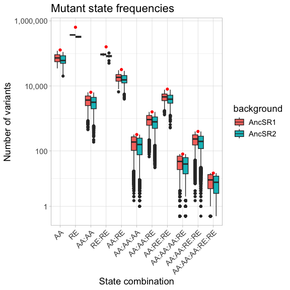
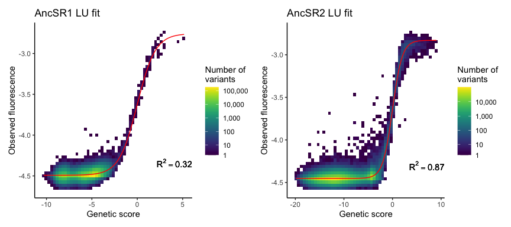
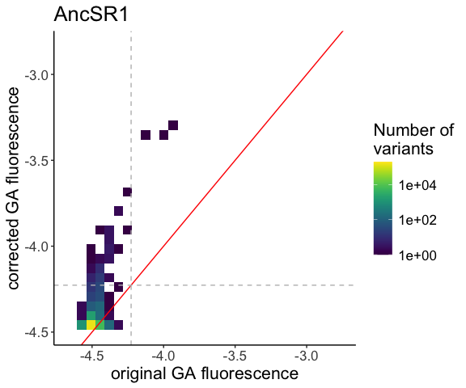

Fluorescence inference for missing variants
================
Jaeda Patton
2023-04-20

This code fits a reference-free analysis model (RFA; Park et al. 2024)
to empirical fluorescence values obtained from the RH-RE DMS experiment
to infer fluorescence for complexes missing in the dataset. The model
implemented here infers both main (first-order) and epistatic effects of
amino acid mutations in the AncSR1 or AncSR2 RH and nucleotide mutations
in the RE. Both intermolecular (i.e. between RH and RE) and
intramolecular (i.e. within RH or within RE) epistatic effects are
included; the sum of all effects of the states contained within a
variant is referred to as its genetic score. Main effects are defined as
the difference between the mean genetic score of all variants containing
a particular state (alanine at RH site 1) and the mean genetic score
across all variants. Pairwise epistatic (second-order) effects are
further defined as the difference between the mean genetic score of all
variants containing a particular pair of states (e.g. alanine at RH site
1 and valine at RH site 2) and the sum of all constituent lower-order
effects (i.e. the global mean plus additive effects of each of the two
states). Higher-order epistatic terms are defined analagously. The full
model can be written as

$$
F = g \left( \beta_0 + \sum_{i \epsilon [1,6]} \beta_i(s_i) + \sum_{i<j \epsilon [1,6]} \beta_{i,j}(s_i,s_j) + ... \right) + \varepsilon
$$

where $F$ is the fluorescence phenotype of a variant, $\beta_0$ is the
global mean genetic score, $\beta_i(s_i)$ is the first-order effect of
state $s_i$ at site $i$ in the sequence, $\beta_{i,j}(s_i,s_j)$ is the
second-order effect of the states at sites $i$ and $j$ in the sequence,
and $\varepsilon$ is an error term. Higher-order epistatic terms can be
added as needed. Sites are indexed from 1 through 6 for the four sites
in the RH and the two sites in the RE. $g$ is a logistic function
modeling the relationship between genetic score and fluorescence,
defined as

$$
g(x) = L + \frac{U - L}{1 + e^{-x}}.
$$

The use of a logistic function is motivated by the fact that the dynamic
range of fluorescence is limited in yeast, which masks the effects of
mutations at the lower and upper bounds of fluorescence. The two global
parameters, $L$ and $U$, correspond to the lower and upper bounds,
respectively.

We will use L2 regularization to reduce overfitting of the model and
enforce sparsity in the inferred effects. This is necessary for two
reasons. First, some effects included in the model may not be estimable
due to missing data. Second, previous studies have shown that epistatic
effects tend to be sparse compared to the total number of possible
effects (Park et al. 2024, Poelwijk et al. 2019); this makes enforcement
of sparsity a reasonable constraint for our model.

Note that the above model takes the form of a generalized linear model
with a scaled logit link function. We will thus use the `glmnet v4.1-6`
package, which contains efficient functions for regularization and
cross-validation, for model fitting.

Code chunks with option `purl = TRUE` were run on the University of
Chicago’s Midway high-performance computing cluster. The output from
these chunks were saved to the `results/mutation_effects_model/`
directory for faster reloading. Chunks with the option `purl = FALSE`
were run locally.

## Loading data and functions

``` r
# load general functions
source(file.path(basedir, "scripts", "general_functions.R"))
# load model fitting functions
source(file.path(basedir, "scripts", "missing_variants_functions.R"))
# load functions for parsing flow cytometry data
source(file.path(basedir, "scripts", "FACS_functions.R"))

# reading in cleaned data from binned sort and enrichment (debulk) sort experiments
if(!file.exists(file.path(results_dir, "meanF_data.rda"))) {
  meanF_data <- read.csv(file.path(basedir, "results", "data_cleaning", 
                                 "meanF_data_corrected_NovaSeq.csv.gz"),
                       row.names = 1, stringsAsFactors = TRUE)
  save(meanF_data, file = file.path(results_dir, "meanF_data.rda"))
} else load(file.path(results_dir, "meanF_data.rda"))

if(!file.exists(file.path(results_dir, "debulk_data.rda"))) {
  debulk_data <- read.csv(file.path(basedir, "results", "data_cleaning", 
                                 "debulk_data_filtered.csv.gz"),
                       row.names = 1, stringsAsFactors = TRUE)
  debulk_data <- debulk_data %>% 
          separate(REBC, into = c("bg", "RE"), sep = "_", 
                   remove = F, extra = "merge") %>%
          mutate(RE = str_replace(RE, "REBC\\d+", as.character(REBC_to_RE(RE))))
  save(debulk_data, file = file.path(results_dir, "debulk_data.rda"))
} else load(file.path(results_dir, "debulk_data.rda"))
```

## Combining data from binned sort and enrichment GFP- datasets

Since complexes that were inferred as null from the enrichment sort GFP-
data do not have quantitative estimates of fluorescence, we will assign
to them the mean fluorescence of nonsense variants from the same protein
background. We will then combine them with the mean fluorescence
estimates from the binned sort dataset. This will be the full dataset
that we use for fitting the model.

``` r
AncSR1_nullF <- meanF_data %>% 
  filter(type == "exp", bg == "AncSR1", sig == "nonsense") %>% 
  pull(avg_meanF) %>% mean()

AncSR2_nullF <- meanF_data %>% 
  filter(type == "exp", bg == "AncSR2", sig == "nonsense") %>% 
  pull(avg_meanF) %>% mean()

AncSR1_model_data <- meanF_data %>%
  filter(type == "exp", bg == "AncSR1", sig != "nonsense") %>%
  mutate(active = sig == "significant") %>%
  select(AA_var, RE, avg_meanF, active) %>%
  mutate(type = "binned") %>%
  bind_rows(debulk_data %>% 
              filter(bg == "AncSR1", !grepl("\\*", AA_var)) %>%
              # remove duplicated variants from redo libraries
              distinct(AA_var, RE) %>%  
              mutate(avg_meanF = AncSR1_nullF, active = FALSE, 
                     type = "debulk")) %>%
  # remove enrichment sort variants if they are in the binned sort dataset
  distinct(AA_var, RE, .keep_all = TRUE) %>%  
  arrange(AA_var, RE)

AncSR2_model_data <- meanF_data %>%
  filter(type == "exp", bg == "AncSR2", sig != "nonsense") %>%
  mutate(active = sig == "significant") %>%
  select(AA_var, RE, avg_meanF, active) %>%
  mutate(type = "binned") %>%
  bind_rows(debulk_data %>% 
              filter(bg == "AncSR2", !grepl("\\*", AA_var)) %>%
              select(AA_var, RE) %>% 
              mutate(avg_meanF = AncSR2_nullF, active = FALSE,
                     type = "debulk")) %>%
  # remove enrichment sort variants if they are in the binned sort dataset
  distinct(AA_var, RE, .keep_all = TRUE) %>%  
  arrange(AA_var, RE)

save(AncSR1_model_data, file = file.path(results_dir, "AncSR1_model_data.rda"))
save(AncSR2_model_data, file = file.path(results_dir, "AncSR2_model_data.rda"))

rm(debulk_data)  # clearing space
```

## Model fitting

### Building covariate matrices

To fit our mutation effects model, we first need to build covariate
matrices for our data, one each for the AncSR1 and AncSR2 protein
backgrounds. Each row in the covariate matrix represents an RH:RE
complex, and each column represents a variable in the model, which in
our case are amino acid or nucleotide states at sites or combinations of
sites in the sequence. For example, there are $20 \times 4 = 80$ columns
for the first-order effects of amino acid states in the RH sequence,
$4 \times 2 = 16$ columns for the first-order effects of nucleotide
states in the RE sequence, $20 \times 20 \times 6 = 2400$ columns for
the second-order RH $\times$ RH effects, and so on. The matrix is
encoded such that $x_{ij} = 1$ if variant $i$ contains the sequence
state or state combination corresponding to column $j$, and $0$
otherwise.

We will build covariate matrices containing the following effects:

| effect         | nterms |
|:---------------|:-------|
| AA             | 80     |
| RE             | 8      |
| AA:AA          | 2400   |
| RE:RE          | 16     |
| AA:RE          | 640    |
| AA:AA:AA       | 32000  |
| AA:AA:RE       | 19200  |
| AA:RE:RE       | 1280   |
| AA:AA:RE:RE    | 38400  |
| AA:AA:AA:RE    | 256000 |
| AA:AA:AA:RE:RE | 512000 |
| total          | 862024 |

``` r
# specify orders of intermolecular interactions to include in the model;
# first column represents RH interaction order and second column represents
# corresponding RE interaction order

# all interaction orders up to RHxRHxRHxRExRE
RH.RE.order <- matrix(c(c(1,1), c(2,1), c(1,2), c(3,1), c(2,2), c(3,2)), 
                      ncol=2, byrow = TRUE)

# make and save matrices, or load if already saved
if(!file.exists(file.path(results_dir, "AncSR1_full_mat.rda"))) {
  AncSR1_full_mat <- make_cov_matrix(AncSR1_model_data,
                                     RH.order = 3, RE.order = 2,
                                     RH.RE.order = RH.RE.order,
                                     cores = 12, its=20)
  save(AncSR1_full_mat, file = file.path(results_dir, "AncSR1_full_mat.rda"))
} else load(file.path(results_dir, "AncSR1_full_mat.rda"))

if(!file.exists(file.path(results_dir, "AncSR2_full_mat.rda"))) {
  AncSR2_full_mat <- make_cov_matrix(AncSR2_model_data,
                                     RH.order = 3, RE.order = 2,
                                     RH.RE.order = RH.RE.order,
                                     cores = 12, its=20)
  save(AncSR2_full_mat, file = file.path(results_dir, "AncSR2_full_mat.rda"))
} else load(file.path(results_dir, "AncSR2_full_mat.rda"))
```

### Checking state frequencies

Let’s check how often each combination of amino acid and nucleotide
states is observed in the datasets. States and state combinations that
are not observed in the dataset will not have estimable effects. Those
that are only observed at the lower bound of fluorescence will be
inferred to be bad for binding, but the estimate will likely not be
quantitatively accurate.

``` r
mutfreq <- data.frame(mut = colnames(AncSR1_full_mat),
                      AncSR1 = colSums(AncSR1_full_mat),
                      AncSR2 = colSums(AncSR2_full_mat)) %>%
  pivot_longer(cols = 2:3, names_to = "background", values_to = "nvars") %>%
  mutate(order = gsub("AA..", "AA", mut)) %>%
  mutate(order = gsub("RE..", "RE", order)) %>%
  mutate(order = factor(order, levels = unique(order)))

# plot the number of variants in the dataset containing a mutant state
# or state combination of a given order
# red points represent expected frequencies if all 2,560,000 complexes were sampled
mutfreq %>%
  ggplot(aes(x = order, y = nvars)) +
  geom_boxplot(aes(fill = background)) +
  geom_point(data = cov_table, 
             aes(x = factor(effect, levels = levels(mutfreq$order)), 
                 y = 2560000 / c(20, 4, 20^2, 4^2, 20*4, 20^3, 20^2*4, 20*4^2, 
                                 20^2*4^2, 20^3*4, 20^3*4^2)), 
             color = "red") +
  scale_y_continuous(trans = log10plus1, labels = label_comma()) +
  labs(title = "Mutant state frequencies", x = "State combination", 
       y = "Number of variants") +
  theme_light() +
  theme(axis.text.x = element_text(angle = 45, vjust = 1, hjust = 1),
        text = element_text(size = 14))
```

<!-- -->

``` r
# how many mutation combinations are observed in 3 or fewer variants,
# according to mutation order, and what is the proportion out of all possible
# combinations?
mutfreq %>%
  group_by(background, order) %>%
  summarize(nlessthan4 = sum(nvars <= 3),
            proplessthan4 = round(sum(nvars <= 3) / n(), 3)) %>%
  as.data.frame() %>% knitr::kable()
```

| background | order          | nlessthan4 | proplessthan4 |
|:-----------|:---------------|-----------:|--------------:|
| AncSR1     | AA             |          0 |         0.000 |
| AncSR1     | RE             |          0 |         0.000 |
| AncSR1     | AA:AA          |          0 |         0.000 |
| AncSR1     | RE:RE          |          0 |         0.000 |
| AncSR1     | AA:RE          |          0 |         0.000 |
| AncSR1     | AA:AA:AA       |          4 |         0.000 |
| AncSR1     | AA:AA:RE       |          0 |         0.000 |
| AncSR1     | AA:RE:RE       |          0 |         0.000 |
| AncSR1     | AA:AA:AA:RE    |       3142 |         0.012 |
| AncSR1     | AA:AA:RE:RE    |          2 |         0.000 |
| AncSR1     | AA:AA:AA:RE:RE |      71668 |         0.140 |
| AncSR2     | AA             |          0 |         0.000 |
| AncSR2     | RE             |          0 |         0.000 |
| AncSR2     | AA:AA          |          0 |         0.000 |
| AncSR2     | RE:RE          |          0 |         0.000 |
| AncSR2     | AA:RE          |          0 |         0.000 |
| AncSR2     | AA:AA:AA       |         26 |         0.001 |
| AncSR2     | AA:AA:RE       |          0 |         0.000 |
| AncSR2     | AA:RE:RE       |          0 |         0.000 |
| AncSR2     | AA:AA:AA:RE    |       9824 |         0.038 |
| AncSR2     | AA:AA:RE:RE    |         13 |         0.000 |
| AncSR2     | AA:AA:AA:RE:RE |     108494 |         0.212 |

``` r
# how many mutation combinations are observed in no variants,
# according to mutation order, and what is the proportion out of all possible
# combinations?
mutfreq %>%
  group_by(background, order) %>%
  summarize(nmissing = sum(nvars == 0),
            propmissing = round(sum(nvars == 0) / n(), 3)) %>%
  as.data.frame() %>% knitr::kable()
```

| background | order          | nmissing | propmissing |
|:-----------|:---------------|---------:|------------:|
| AncSR1     | AA             |        0 |       0.000 |
| AncSR1     | RE             |        0 |       0.000 |
| AncSR1     | AA:AA          |        0 |       0.000 |
| AncSR1     | RE:RE          |        0 |       0.000 |
| AncSR1     | AA:RE          |        0 |       0.000 |
| AncSR1     | AA:AA:AA       |        0 |       0.000 |
| AncSR1     | AA:AA:RE       |        0 |       0.000 |
| AncSR1     | AA:RE:RE       |        0 |       0.000 |
| AncSR1     | AA:AA:AA:RE    |      202 |       0.001 |
| AncSR1     | AA:AA:RE:RE    |        0 |       0.000 |
| AncSR1     | AA:AA:AA:RE:RE |    11903 |       0.023 |
| AncSR2     | AA             |        0 |       0.000 |
| AncSR2     | RE             |        0 |       0.000 |
| AncSR2     | AA:AA          |        0 |       0.000 |
| AncSR2     | RE:RE          |        0 |       0.000 |
| AncSR2     | AA:RE          |        0 |       0.000 |
| AncSR2     | AA:AA:AA       |        0 |       0.000 |
| AncSR2     | AA:AA:RE       |        0 |       0.000 |
| AncSR2     | AA:RE:RE       |        0 |       0.000 |
| AncSR2     | AA:AA:AA:RE    |      981 |       0.004 |
| AncSR2     | AA:AA:RE:RE    |        1 |       0.000 |
| AncSR2     | AA:AA:AA:RE:RE |    24706 |       0.048 |

Now let’s just restrict the analysis to active mutants, i.e. those with
fluorescence significantly greater than nonsense variants.

``` r
mutfreqactive <- data.frame(mut = colnames(AncSR1_full_mat),
                            AncSR1 = colSums(AncSR1_full_mat[AncSR1_model_data$active,]),
                            AncSR2 = colSums(AncSR2_full_mat[AncSR2_model_data$active,])) %>%
  pivot_longer(cols = 2:3, names_to = "background", values_to = "nvars") %>%
  mutate(order = gsub("AA..", "AA", mut)) %>%
  mutate(order = gsub("RE..", "RE", order)) %>%
  mutate(order = factor(order, levels = unique(order)))

# plot the number of active variants in the dataset containing a mutant state
# or state combination of a given order
# red points represent expected frequencies if all 2,560,000 complexes were sampled
mutfreqactive %>%
  ggplot(aes(x = order, y = nvars)) +
  geom_boxplot(aes(fill = background)) +
  geom_point(data = cov_table, 
             aes(x = factor(effect, levels = levels(mutfreq$order)), 
                 y = 2560000 / c(20, 4, 20^2, 4^2, 20*4, 20^3, 20^2*4, 20*4^2, 
                                 20^2*4^2, 20^3*4, 20^3*4^2)), 
             color = "red") +
  scale_y_continuous(trans = log10plus1, labels = label_comma()) +
  labs(title = "Mutant state frequencies, active variants", x = "State combination", 
       y = "Number of variants") +
  theme_light() +
  theme(axis.text.x = element_text(angle = 45, vjust = 1, hjust = 1),
        text = element_text(size = 14))
```

<!-- -->

``` r
# how many mutation combinations are observed in 3 or fewer active variants,
# according to mutation order, and what is the proportion out of all possible
# combinations?
mutfreqactive %>%
  group_by(background, order) %>%
  summarize(nlessthan4 = sum(nvars <= 3),
            proplessthan4 = round(sum(nvars <= 3) / n(), 3)) %>%
  as.data.frame() %>% knitr::kable()
```

| background | order          | nlessthan4 | proplessthan4 |
|:-----------|:---------------|-----------:|--------------:|
| AncSR1     | AA             |         24 |         0.300 |
| AncSR1     | RE             |          0 |         0.000 |
| AncSR1     | AA:AA          |       2243 |         0.935 |
| AncSR1     | RE:RE          |          2 |         0.125 |
| AncSR1     | AA:RE          |        437 |         0.683 |
| AncSR1     | AA:AA:AA       |      31904 |         0.997 |
| AncSR1     | AA:AA:RE       |      18872 |         0.983 |
| AncSR1     | AA:RE:RE       |       1168 |         0.912 |
| AncSR1     | AA:AA:AA:RE    |     255841 |         0.999 |
| AncSR1     | AA:AA:RE:RE    |      38242 |         0.996 |
| AncSR1     | AA:AA:AA:RE:RE |     511933 |         1.000 |
| AncSR2     | AA             |          0 |         0.000 |
| AncSR2     | RE             |          0 |         0.000 |
| AncSR2     | AA:AA          |       1470 |         0.613 |
| AncSR2     | RE:RE          |          0 |         0.000 |
| AncSR2     | AA:RE          |        142 |         0.222 |
| AncSR2     | AA:AA:AA       |      30420 |         0.951 |
| AncSR2     | AA:AA:RE       |      15955 |         0.831 |
| AncSR2     | AA:RE:RE       |        666 |         0.520 |
| AncSR2     | AA:AA:AA:RE    |     252317 |         0.986 |
| AncSR2     | AA:AA:RE:RE    |      36115 |         0.940 |
| AncSR2     | AA:AA:AA:RE:RE |     510540 |         0.997 |

``` r
# how many mutation combinations are observed in no active variants,
# according to mutation order, and what is the proportion out of all possible
# combinations?
mutfreqactive %>%
  group_by(background, order) %>%
  summarize(nmissing = sum(nvars == 0),
            propmissing = round(sum(nvars == 0) / n(), 3)) %>%
  as.data.frame() %>% knitr::kable()
```

| background | order          | nmissing | propmissing |
|:-----------|:---------------|---------:|------------:|
| AncSR1     | AA             |        2 |       0.025 |
| AncSR1     | RE             |        0 |       0.000 |
| AncSR1     | AA:AA          |     1753 |       0.730 |
| AncSR1     | RE:RE          |        0 |       0.000 |
| AncSR1     | AA:RE          |      236 |       0.369 |
| AncSR1     | AA:AA:AA       |    31144 |       0.973 |
| AncSR1     | AA:AA:RE       |    17375 |       0.905 |
| AncSR1     | AA:RE:RE       |      942 |       0.736 |
| AncSR1     | AA:AA:AA:RE    |   253947 |       0.992 |
| AncSR1     | AA:AA:RE:RE    |    37285 |       0.971 |
| AncSR1     | AA:AA:AA:RE:RE |   510851 |       0.998 |
| AncSR2     | AA             |        0 |       0.000 |
| AncSR2     | RE             |        0 |       0.000 |
| AncSR2     | AA:AA          |      622 |       0.259 |
| AncSR2     | RE:RE          |        0 |       0.000 |
| AncSR2     | AA:RE          |       56 |       0.088 |
| AncSR2     | AA:AA:AA       |    27031 |       0.845 |
| AncSR2     | AA:AA:RE       |    11722 |       0.611 |
| AncSR2     | AA:RE:RE       |      434 |       0.339 |
| AncSR2     | AA:AA:AA:RE    |   240162 |       0.938 |
| AncSR2     | AA:AA:RE:RE    |    31621 |       0.823 |
| AncSR2     | AA:AA:AA:RE:RE |   500066 |       0.977 |

### Fitting nonspecific epistasis

First we will estimate the $U$ and $L$ parameters of the logistic
function used for modeling nonspecific epistasis. We do this prior to
fitting the full regularized model because `glmnet` cannot estimate
nonlinear parameters in the link function. We estimate $U$ and $L$ by
using unregularized nonlinear least squares regression to fit a
reference-free epistasic model consisting of logistic nonspecific
epistasis, first-order mutation effects (RH and RE), second-order
intramolecular effects (RH$\times$RH and RE$\times$RE), and all
intermolecular interactions between those effects (i.e. RE$\times$RH,
RE$\times$RE$\times$RH, RH$\times$RH$\times$RE, and
RH$\times$RH$\times$RE$\times$RE). While estimates of mutation effects
may be inaccurate in this model, it is likely to be sufficient for
estimating the two global parameters of the link function.

``` r
# get observed phenotypes
y.AncSR1 <- AncSR1_model_data$avg_meanF
y.AncSR2 <- AncSR2_model_data$avg_meanF

# fit unregularized mutation effects models to estimate L and U
if(!file.exists(file.path(results_dir, "AncSR1_UL_fit.rda"))) {
  AncSR1_UL_fit <- fit_LU(y.AncSR1, 
                          cbind(1, AncSR1_full_mat),
                          maxit = 1000)
  save(AncSR1_UL_fit, file = file.path(results_dir, "AncSR1_UL_fit.rda"))
} else {
  load(file.path(results_dir, "AncSR1_UL_fit.rda"))
}

if(!file.exists(file.path(results_dir, "AncSR2_UL_fit.rda"))) {
  AncSR2_UL_fit <- fit_LU(y.AncSR2, 
                          cbind(1, AncSR2_full_mat),
                          maxit = 1000)
  save(AncSR2_UL_fit, file = file.path(results_dir, "AncSR2_UL_fit.rda"))
} else {
  load(file.path(results_dir, "AncSR2_UL_fit.rda"))
}

# get genetic scores from model fits
if(!file.exists(file.path(results_dir, "AncSR1_UL_fit_gs.rda"))) {
  AncSR1_UL_fit_gs <- get_gs_LU_fit(cbind(1, AncSR1_full_mat), 
                                    AncSR1_UL_fit, its = 20, cores = 12)
  save(AncSR1_UL_fit_gs, file = file.path(results_dir, "AncSR1_UL_fit_gs.rda"))
} else load(file.path(results_dir, "AncSR1_UL_fit_gs.rda"))

if(!file.exists(file.path(results_dir, "AncSR2_UL_fit_gs.rda"))) {
  AncSR2_UL_fit_gs <- get_gs_LU_fit(cbind(1, AncSR2_full_mat), 
                                    AncSR2_UL_fit, its = 20, cores = 12)
  save(AncSR2_UL_fit_gs, file = file.path(results_dir, "AncSR2_UL_fit_gs.rda"))
} else load(file.path(results_dir, "AncSR2_UL_fit_gs.rda"))

# get U and L estimates from each fit
AncSR1.U <- AncSR1_UL_fit$par[length(AncSR1_UL_fit$par)]
AncSR1.L <- AncSR1_UL_fit$par[length(AncSR1_UL_fit$par)-1]
AncSR2.U <- AncSR2_UL_fit$par[length(AncSR2_UL_fit$par)]
AncSR2.L <- AncSR2_UL_fit$par[length(AncSR2_UL_fit$par)-1]
```

Now let’s assess the fit by calculating the coefficient of determination
($R^2$) of each model and plotting the inferred genetic score
vs. observed phenotype using the models fit above.

``` r
# calculate R^2 of each model
AncSR1_UL_R2 <- calc_R2(logistic(AncSR1_UL_fit_gs, L=AncSR1.L, U=AncSR1.U), 
                        y.AncSR1)
AncSR2_UL_R2 <- calc_R2(logistic(AncSR2_UL_fit_gs, L=AncSR2.L, U=AncSR2.U), 
                        y.AncSR2)

print(paste("AncSR1 UL fit R^2:", round(AncSR1_UL_R2, 2)))
```

    ## [1] "AncSR1 UL fit R^2: 0.32"

``` r
print(paste("AncSR2 UL fit R^2:", round(AncSR2_UL_R2, 2)))
```

    ## [1] "AncSR2 UL fit R^2: 0.87"

``` r
# create plots of genetic score vs. true phenotype
a <- data.frame(geneticscore = AncSR1_UL_fit_gs,
                fluorescence = y.AncSR1) %>%
  ggplot(aes(x = geneticscore, y = fluorescence)) +
  geom_bin2d(bins = 50) +
  scale_fill_viridis(trans = log10plus1, name = "Number of\nvariants",
                     labels = label_comma()) +
  geom_function(fun = logistic, args = list(L = AncSR1.L, U = AncSR1.U), 
                color = "red") +
  labs(x = "Genetic score", y = "Observed fluorescence", 
       title = "AncSR1 LU fit") +
  annotate(geom = "text", x = Inf, y = AncSR1.L + 0.1, 
           label = bquote(R^2 == .(round(AncSR1_UL_R2, 2))), 
           vjust = 0, hjust = 1) +
  theme_classic()

b <- data.frame(geneticscore = AncSR2_UL_fit_gs,
                fluorescence = y.AncSR2) %>%
  ggplot(aes(x = geneticscore, y = fluorescence)) +
  geom_bin2d(bins = 50) +
  scale_fill_viridis(trans = log10plus1, name = "Number of\nvariants",
                     labels = label_comma()) +
  geom_function(fun = logistic, args = list(L = AncSR2.L, U = AncSR2.U), 
                color = "red") +
  labs(x = "Genetic score", y = "Observed fluorescence", 
       title = "AncSR2 LU fit") +
  annotate(geom = "text", x = Inf, y = AncSR2.L + 0.1, 
           label = bquote(R^2 == .(round(AncSR2_UL_R2, 2))), 
           vjust = 0, hjust = 1) +
  theme_classic()

(a + b)
```

<!-- -->

``` r
rm(a, b, AncSR1_UL_fit, AncSR2_UL_fit)  # clearing space
```

### Fitting mutation effect terms

Let’s now fit the main, pairwise, and higher-order mutation effects
using `glmnet`. We will use a scaled logit link function for our model,

$$
h(F) = x = \ln \left( \frac{F - \hat{L}}{\hat{U} - F} \right),
$$

to relate the measured fluorescence $F$ of each variant to its genetic
score $x$. This function is simply the inverse of the scaled logistic
function that we defined previously, where $\hat{U}$ and $\hat{L}$ are
the global upper and lower bound parameters that we just stimated. We
will assume a Gaussian error distribution on the fluorescence
measurements.

The model will be fit with L2 regularization. 10-fold cross-validation
(CV) will be used to optimize regularization strength.

Because of the very large size of our covariate matrices, we modified
the `glmnet` function in the `glmnet v1.4.6` package to avoid memory
allocation errors. Modified functions can be accessed in the script
`mut_effects_model_fitting_functions.R`.

#### Initial full dataset fit

First fit a model to the full AncSR1 and AncSR2 datasets. We will use
the default `glmnet` regularization path with 100 $\lambda$ values.

``` r
# specify link function
family.AncSR1 <- gaussian(link = glogit(L = AncSR1.L, U = AncSR1.U))

# perform L2-regularized fitting
if(!file.exists(file.path(results_dir, "full.fit.AncSR1.rda"))) {
  full.fit.AncSR1 <- glmnet.large(AncSR1_full_mat, y.AncSR1,
                                family = family.AncSR1, alpha = 0,
                                nlambda = 100, trace.it = 2)
  save(full.fit.AncSR1, file = file.path(results_dir, "full.fit.AncSR1.rda"))
} else load(file.path(results_dir, "full.fit.AncSR1.rda"))
```

``` r
# specify link function
family.AncSR2 <- gaussian(link = glogit(L = AncSR2.L, U = AncSR2.U))

# perform L2-regularized fitting
if(!file.exists(file.path(results_dir, "full.fit.AncSR2.rda"))) {
  full.fit.AncSR2 <- glmnet.large(AncSR2_full_mat, y.AncSR2,
                                family = family.AncSR2, alpha = 0,
                                nlambda = 100, trace.it = 2)
  save(full.fit.AncSR2, file = file.path(results_dir, "full.fit.AncSR2.rda"))
} else load(file.path(results_dir, "full.fit.AncSR2.rda"))
```

#### Initial fit cross validation

We will now use cross validation to select the value of $\lambda$ that
minimizes prediction error, $\lambda_{min}$. In standard 10-fold CV, the
data is randomly into 10 equal-size test sets and for each test set, the
model is trained on the remaining 90% of the data and performance is
then assessed on the held-out 10%. To save on computational resources,
we will first assess fits with only two 90-10 splits per dataset.

``` r
# specify family functions
family.AncSR1 <- gaussian(link = glogit(L = AncSR1.L, U = AncSR1.U))
family.AncSR2 <- gaussian(link = glogit(L = AncSR2.L, U = AncSR2.U))

# generate cv folds
nfolds <- 10
AncSR1_foldid <- rep_len(1:nfolds, nrow(AncSR1_full_mat))
set.seed(230703)
AncSR1_foldid <- sample(AncSR1_foldid, nrow(AncSR1_full_mat))
save(AncSR1_foldid, file = file.path(results_dir, "AncSR1_foldid.rda"))
AncSR2_foldid <- rep_len(1:nfolds, nrow(AncSR2_full_mat))
set.seed(230703)
AncSR2_foldid <- sample(AncSR2_foldid, nrow(AncSR2_full_mat))
save(AncSR2_foldid, file = file.path(results_dir, "AncSR2_foldid.rda"))

# regularization paths
AncSR1_path <- full.fit.AncSR1$lambda
AncSR2_path <- full.fit.AncSR2$lambda
```

``` r
# fit AncSR1 CV fold 1
which <- AncSR1_foldid == 1
if(!file.exists(file.path(results_dir, "cv.fold1.fit.AncSR1.rda"))) {
  fold_fit <- glmnet.large(AncSR1_full_mat[!which,], y.AncSR1[!which],
                           family = family.AncSR1, alpha = 0,
                           lambda = AncSR1_path, trace.it = 2)
  save(fold_fit, file = file.path(results_dir, "cv.fold1.fit.AncSR1.rda"))
} else {
  load(file.path(results_dir, "cv.fold1.fit.AncSR1.rda"))
  cv.fit.AncSR1.fold1 <- fold_fit
  rm(fold_fit)
}
```

``` r
# fit AncSR1 CV fold 2
which <- AncSR1_foldid == 2
if(!file.exists(file.path(results_dir, "cv.fold2.fit.AncSR1.rda"))) {
  fold_fit <- glmnet.large(AncSR1_full_mat[!which,], y.AncSR1[!which],
                           family = family.AncSR1, alpha = 0,
                           lambda = AncSR1_path, trace.it = 2)
  save(fold_fit, file = file.path(results_dir, "cv.fold2.fit.AncSR1.rda"))
} else {
  load(file.path(results_dir, "cv.fold2.fit.AncSR1.rda"))
  cv.fit.AncSR1.fold2 <- fold_fit
  rm(fold_fit)
}
```

``` r
# fit AncSR2 CV fold 1
which <- AncSR2_foldid == 1
if(!file.exists(file.path(results_dir, "cv.fold1.fit.AncSR2.rda"))) {
  fold_fit <- glmnet.large(AncSR2_full_mat[!which,], y.AncSR2[!which],
                           family = family.AncSR2, alpha = 0,
                           lambda = AncSR2_path, trace.it = 2)
  save(fold_fit, file = file.path(results_dir, "cv.fold1.fit.AncSR2.rda"))
} else {
  load(file.path(results_dir, "cv.fold1.fit.AncSR2.rda"))
  cv.fit.AncSR2.fold1 <- fold_fit
  rm(fold_fit)
}
```

``` r
# fit AncSR2 CV fold 2
which <- AncSR2_foldid == 2
if(!file.exists(file.path(results_dir, "cv.fold2.fit.AncSR2.rda"))) {
  fold_fit <- glmnet.large(AncSR2_full_mat[!which,], y.AncSR2[!which],
                           family = family.AncSR2, alpha = 0,
                           lambda = AncSR2_path, trace.it = 2)
  save(fold_fit, file = file.path(results_dir, "cv.fold2.fit.AncSR2.rda"))
} else {
  load(file.path(results_dir, "cv.fold2.fit.AncSR2.rda"))
  cv.fit.AncSR2.fold2 <- fold_fit
  rm(fold_fit)
}
```

Compute genetic scores and predicted fluorescence for the cross
validation models.

``` r
# AncSR1 test set 1 prediction
if(!file.exists(file.path(results_dir, "cv.pred.AncSR1.fold1.rda"))) {
  which <- AncSR1_foldid == 1
  cv.gs.AncSR1.fold1 <- predict(cv.fit.AncSR1.fold1, AncSR1_full_mat[which,])
  cv.pred.AncSR1.fold1 <- apply(cv.gs.AncSR1.fold1, 2, logistic, 
                                L = AncSR1.L, U = AncSR1.U)
  save(cv.gs.AncSR1.fold1, file = file.path(results_dir, "cv.gs.AncSR1.fold1.rda"))
  save(cv.pred.AncSR1.fold1, file = file.path(results_dir, "cv.pred.AncSR1.fold1.rda"))
} else {
  load(file.path(results_dir, "cv.gs.AncSR1.fold1.rda"))
  load(file.path(results_dir, "cv.pred.AncSR1.fold1.rda"))
}
# AncSR1 test set 2 prediction
if(!file.exists(file.path(results_dir, "cv.pred.AncSR1.fold2.rda"))) {
  which <- AncSR1_foldid == 2
  cv.gs.AncSR1.fold2 <- predict(cv.fit.AncSR1.fold2, AncSR1_full_mat[which,])
  cv.pred.AncSR1.fold2 <- apply(cv.gs.AncSR1.fold2, 2, logistic, 
                                L = AncSR1.L, U = AncSR1.U)
  save(cv.gs.AncSR1.fold2, file = file.path(results_dir, "cv.gs.AncSR1.fold2.rda"))
  save(cv.pred.AncSR1.fold2, file = file.path(results_dir, "cv.pred.AncSR1.fold2.rda"))
} else {
  load(file.path(results_dir, "cv.gs.AncSR1.fold2.rda"))
  load(file.path(results_dir, "cv.pred.AncSR1.fold2.rda"))
}
# AncSR2 test set 1 prediction
if(!file.exists(file.path(results_dir, "cv.pred.AncSR2.fold1.rda"))) {
  which <- AncSR2_foldid == 1
  cv.gs.AncSR2.fold1 <- predict(cv.fit.AncSR2.fold1, AncSR2_full_mat[which,])
  cv.pred.AncSR2.fold1 <- apply(cv.gs.AncSR2.fold1, 2, logistic, 
                                L = AncSR2.L, U = AncSR2.U)
  save(cv.gs.AncSR2.fold1, file = file.path(results_dir, "cv.gs.AncSR2.fold1.rda"))
  save(cv.pred.AncSR2.fold1, file = file.path(results_dir, "cv.pred.AncSR2.fold1.rda"))
} else {
  load(file.path(results_dir, "cv.gs.AncSR2.fold1.rda"))
  load(file.path(results_dir, "cv.pred.AncSR2.fold1.rda"))
}
# AncSR2 test set 2 prediction
if(!file.exists(file.path(results_dir, "cv.pred.AncSR2.fold2.rda"))) {
  which <- AncSR2_foldid == 2
  cv.gs.AncSR2.fold2 <- predict(cv.fit.AncSR2.fold2, AncSR2_full_mat[which,])
  cv.pred.AncSR2.fold2 <- apply(cv.gs.AncSR2.fold2, 2, logistic, 
                                L = AncSR2.L, U = AncSR2.U)
  save(cv.gs.AncSR2.fold2, file = file.path(results_dir, "cv.gs.AncSR2.fold2.rda"))
  save(cv.pred.AncSR2.fold2, file = file.path(results_dir, "cv.pred.AncSR2.fold2.rda"))
} else {
  load(file.path(results_dir, "cv.gs.AncSR2.fold2.rda"))
  load(file.path(results_dir, "cv.pred.AncSR2.fold2.rda"))
}
```

Compute out-of-sample mean-squared error (MSE) for CV models and plot as
a function of $\lambda$.

``` r
# AncSR1 fold 1 MSE
AncSR1.fold1.mse <- apply(cv.pred.AncSR1.fold1, 2, 
                          function(x) x - y.AncSR1[AncSR1_foldid == 1])
AncSR1.fold1.mse <- colMeans(AncSR1.fold1.mse^2)
# AncSR1 fold 2 MSE
AncSR1.fold2.mse <- apply(cv.pred.AncSR1.fold2, 2, 
                          function(x) x - y.AncSR1[AncSR1_foldid == 2])
AncSR1.fold2.mse <- colMeans(AncSR1.fold2.mse^2)
# AncSR1 MSE mean and range
AncSR1.mse <- data.frame(lambda = AncSR1_path,
                         fold1 = AncSR1.fold1.mse,
                         fold2 = AncSR1.fold2.mse)

# plot lambda vs. MSE
AncSR1.mse %>%
  select(lambda, fold1, fold2) %>%
  pivot_longer(2:3, names_to = "fold", values_to = "MSE") %>%
  ggplot(aes(x = log(lambda), y = MSE, color = fold)) +
  geom_point() +
  labs(title = "AncSR1 prediction error", x = bquote(log(lambda)),
       y = "Mean squared error") +
  theme_classic()
```

<!-- -->

``` r
# AncSR2 fold 1 MSE
AncSR2.fold1.mse <- apply(cv.pred.AncSR2.fold1, 2, 
                          function(x) x - y.AncSR2[AncSR2_foldid == 1])
AncSR2.fold1.mse <- colMeans(AncSR2.fold1.mse^2)
# AncSR2 fold 2 MSE
AncSR2.fold2.mse <- apply(cv.pred.AncSR2.fold2, 2, 
                          function(x) x - y.AncSR2[AncSR2_foldid == 2])
AncSR2.fold2.mse <- colMeans(AncSR2.fold2.mse^2)
# AncSR2 MSE mean and range
AncSR2.mse <- data.frame(lambda = AncSR2_path,
                         fold1 = AncSR2.fold1.mse,
                         fold2 = AncSR2.fold2.mse)

# plot lambda vs. MSE
AncSR2.mse %>%
  select(lambda, fold1, fold2) %>%
  pivot_longer(2:3, names_to = "fold", values_to = "MSE") %>%
  ggplot(aes(x = log(lambda), y = MSE, color = fold)) +
  geom_point() +
  labs(title = "AncSR2 prediction error", x = bquote(log(lambda)), 
       y = "Mean squared error") +
  theme_classic()
```

<!-- -->

We see that the global minimum MSE has not been reached for either the
AncSR1 or AncSR2 datasets, so the regularization path did not extend far
enough towards 0 for either dataset. We will extend it manually.

#### Extended regularization path cross validation

We first extend the regularization path computed by `glmnet` by adding
10 values of $\lambda$ spanning the same range as the original path.

``` r
rm(full.fit.AncSR1, full.fit.AncSR2)  # clearing space

# extend lambda range
AncSR1.path.range <- log(AncSR1_path[100]) - log(AncSR1_path[1])
AncSR1_path_ext <- exp(seq(log(AncSR1_path[100]), 
                           log(AncSR1_path[100]) + AncSR1.path.range, 
                           length.out = 11))[-1]

AncSR2.path.range <- log(AncSR2_path[100]) - log(AncSR2_path[1])
AncSR2_path_ext <- exp(seq(log(AncSR2_path[100]),
                           log(AncSR2_path[100]) + AncSR2.path.range,
                           length.out = 11))[-1]
```

We will use the fit from the least-penalized model in the previous
regularization path as a warm start for the extended path (`glmnet` was
modified to allow user-supplied initial parameter values, or “warm
starts”).

``` r
which <- AncSR1_foldid == 1
init <- list(a0 = cv.fit.AncSR1.fold1$a0[100],
             beta = cv.fit.AncSR1.fold1$beta[,100])
rm(cv.fit.AncSR1.fold1)  # clearing space
if(!file.exists(file.path(results_dir, "cv.fold1.ext.fit.AncSR1.rda"))) {
  fold_fit <- glmnet.large(AncSR1_full_mat[!which,], y.AncSR1[!which],
                           family = family.AncSR1, alpha = 0,
                           lambda = AncSR1_path_ext, init = init, trace.it = 2)
  save(fold_fit, file = file.path(results_dir, "cv.fold1.ext.fit.AncSR1.rda"))
} else {
  load(file.path(results_dir, "cv.fold1.ext.fit.AncSR1.rda"))
  cv.fit.AncSR1.fold1.ext <- fold_fit
  rm(fold_fit)
}
```

``` r
which <- AncSR1_foldid == 2
init <- list(a0 = cv.fit.AncSR1.fold2$a0[100],
             beta = cv.fit.AncSR1.fold2$beta[,100])
rm(cv.fit.AncSR1.fold2)  # clearing space
if(!file.exists(file.path(results_dir, "cv.fold2.ext.fit.AncSR1.rda"))) {
  fold_fit <- glmnet.large(AncSR1_full_mat[!which,], y.AncSR1[!which],
                           family = family.AncSR1, alpha = 0,
                           lambda = AncSR1_path_ext[1:6], init = init, trace.it = 2)
  save(fold_fit, file = file.path(results_dir, "cv.fold2.ext.fit.AncSR1.rda"))
} else {
  load(file.path(results_dir, "cv.fold2.ext.fit.AncSR1.rda"))
  cv.fit.AncSR1.fold2.ext <- fold_fit
  rm(fold_fit)
}
```

``` r
which <- AncSR2_foldid == 1
init <- list(a0 = cv.fit.AncSR2.fold1$a0[100],
             beta = cv.fit.AncSR2.fold1$beta[,100])
rm(cv.fit.AncSR2.fold1)  # clearing space
if(!file.exists(file.path(results_dir, "cv.fold1.ext.fit.AncSR2.rda"))) {
  fold_fit <- glmnet.large(AncSR2_full_mat[!which,], y.AncSR2[!which],
                           family = family.AncSR2, alpha = 0,
                           lambda = AncSR2_path_ext, init = init, trace.it = 2)
  save(fold_fit, file = file.path(results_dir, "cv.fold1.ext.fit.AncSR2.rda"))
} else {
  load(file.path(results_dir, "cv.fold1.ext.fit.AncSR2.rda"))
  cv.fit.AncSR2.fold1.ext <- fold_fit
  rm(fold_fit)
}
```

``` r
which <- AncSR2_foldid == 2
init <- list(a0 = cv.fit.AncSR2.fold2$a0[100],
             beta = cv.fit.AncSR2.fold2$beta[,100])
rm(cv.fit.AncSR2.fold2)  # clearing space
if(!file.exists(file.path(results_dir, "cv.fold2.ext.fit.AncSR2.rda"))) {
  fold_fit <- glmnet.large(AncSR2_full_mat[!which,], y.AncSR2[!which],
                           family = family.AncSR2, alpha = 0,
                           lambda = AncSR2_path_ext[1:6], init = init, 
                           trace.it = 2)
  save(fold_fit, file = file.path(results_dir, "cv.fold2.ext.fit.AncSR2.rda"))
} else {
  load(file.path(results_dir, "cv.fold2.ext.fit.AncSR2.rda"))
  cv.fit.AncSR2.fold2.ext <- fold_fit
  rm(fold_fit)
}
```

Get out-of-sample predicted genetic scores and phenotypes.

``` r
# AncSR1 test set 1 extended path prediction
if(!file.exists(file.path(results_dir, "cv.pred.AncSR1.fold1.ext.rda"))) {
  which <- AncSR1_foldid == 1
  cv.gs.AncSR1.fold1.ext <- predict(cv.fit.AncSR1.fold1.ext,
                                    AncSR1_full_mat[which,])
  cv.pred.AncSR1.fold1.ext <- apply(cv.gs.AncSR1.fold1.ext, 2, logistic, 
                                    L = AncSR1.L, U = AncSR1.U)
  save(cv.gs.AncSR1.fold1.ext, 
       file = file.path(results_dir, "cv.gs.AncSR1.fold1.ext.rda"))
  save(cv.pred.AncSR1.fold1.ext, 
       file = file.path(results_dir, "cv.pred.AncSR1.fold1.ext.rda"))
} else {
  load(file.path(results_dir, "cv.gs.AncSR1.fold1.ext.rda"))
  load(file.path(results_dir, "cv.pred.AncSR1.fold1.ext.rda"))
}
# AncSR1 test set 2 extended path prediction
if(!file.exists(file.path(results_dir, "cv.pred.AncSR1.fold2.ext.rda"))) {
  which <- AncSR1_foldid == 2
  cv.gs.AncSR1.fold2.ext <- predict(cv.fit.AncSR1.fold2.ext,
                                    AncSR1_full_mat[which,])
  cv.pred.AncSR1.fold2.ext <- apply(cv.gs.AncSR1.fold2.ext, 2, logistic, 
                                    L = AncSR1.L, U = AncSR1.U)
  save(cv.gs.AncSR1.fold2.ext, 
       file = file.path(results_dir, "cv.gs.AncSR1.fold2.ext.rda"))
  save(cv.pred.AncSR1.fold2.ext, 
       file = file.path(results_dir, "cv.pred.AncSR1.fold2.ext.rda"))
} else {
  load(file.path(results_dir, "cv.gs.AncSR1.fold2.ext.rda"))
  load(file.path(results_dir, "cv.pred.AncSR1.fold2.ext.rda"))
}
# AncSR2 test set 1 extended path prediction
if(!file.exists(file.path(results_dir, "cv.pred.AncSR2.fold1.ext.rda"))) {
  which <- AncSR2_foldid == 1
  cv.gs.AncSR2.fold1.ext <- predict(cv.fit.AncSR2.fold1.ext,
                                    AncSR2_full_mat[which,])
  cv.pred.AncSR2.fold1.ext <- apply(cv.gs.AncSR2.fold1.ext, 2, logistic, 
                                    L = AncSR2.L, U = AncSR2.U)
  save(cv.gs.AncSR2.fold1.ext, 
       file = file.path(results_dir, "cv.gs.AncSR2.fold1.ext.rda"))
  save(cv.pred.AncSR2.fold1.ext, 
       file = file.path(results_dir, "cv.pred.AncSR2.fold1.ext.rda"))
} else {
  load(file.path(results_dir, "cv.gs.AncSR2.fold1.ext.rda"))
  load(file.path(results_dir, "cv.pred.AncSR2.fold1.ext.rda"))
}
# AncSR2 test set 1 extended path prediction
if(!file.exists(file.path(results_dir, "cv.pred.AncSR2.fold2.ext.rda"))) {
  which <- AncSR2_foldid == 2
  cv.gs.AncSR2.fold2.ext <- predict(cv.fit.AncSR2.fold2.ext,
                                    AncSR2_full_mat[which,])
  cv.pred.AncSR2.fold2.ext <- apply(cv.gs.AncSR2.fold2.ext, 2, logistic, 
                                    L = AncSR2.L, U = AncSR2.U)
  save(cv.gs.AncSR2.fold2.ext, 
       file = file.path(results_dir, "cv.gs.AncSR2.fold2.ext.rda"))
  save(cv.pred.AncSR2.fold2.ext, 
       file = file.path(results_dir, "cv.pred.AncSR2.fold2.ext.rda"))
} else {
  load(file.path(results_dir, "cv.gs.AncSR2.fold2.ext.rda"))
  load(file.path(results_dir, "cv.pred.AncSR2.fold2.ext.rda"))
}
```

Analyze out-of-sample MSE.

``` r
# AncSR1 test set 1 extended lambda path MSE
AncSR1.fold1.mse.ext <- apply(cv.pred.AncSR1.fold1.ext, 2, 
                              function(x) x - y.AncSR1[AncSR1_foldid == 1])
AncSR1.fold1.mse.ext <- colMeans(AncSR1.fold1.mse.ext^2)
# AncSR1 test set 2 extended lambda path MSE
AncSR1.fold2.mse.ext <- apply(cv.pred.AncSR1.fold2.ext, 2, 
                              function(x) x - y.AncSR1[AncSR1_foldid == 2])
AncSR1.fold2.mse.ext <- colMeans(AncSR1.fold2.mse.ext^2)
# add to data frame
AncSR1.mse <- rbind(AncSR1.mse,
                    data.frame(lambda = AncSR1_path_ext,
                               fold1 = AncSR1.fold1.mse.ext,
                               fold2 = c(AncSR1.fold2.mse.ext, rep(NA, 4))))

# plot lambda vs. MSE
AncSR1.mse[1:106,] %>%
  select(lambda, fold1, fold2) %>%
  pivot_longer(2:3, names_to = "fold", values_to = "MSE") %>%
  ggplot(aes(x = log(lambda), y = MSE, color = fold)) +
  geom_point() +
  labs(title = "AncSR1 prediction error", x = bquote(log(lambda)),
       y = "Mean squared error") +
  theme_classic()
```

<!-- -->

``` r
# AncSR2 extended lambda path MSE
AncSR2.fold1.mse.ext <- apply(cv.pred.AncSR2.fold1.ext, 2, 
                              function(x) x - y.AncSR2[AncSR2_foldid == 1])
AncSR2.fold1.mse.ext <- colMeans(AncSR2.fold1.mse.ext^2)
# AncSR2 test set 2 extended lambda path MSE
AncSR2.fold2.mse.ext <- apply(cv.pred.AncSR2.fold2.ext, 2, 
                              function(x) x - y.AncSR2[AncSR2_foldid == 2])
AncSR2.fold2.mse.ext <- colMeans(AncSR2.fold2.mse.ext^2)
# add to data frame
AncSR2.mse <- rbind(AncSR2.mse,
                    data.frame(lambda = AncSR2_path_ext,
                               fold1 = AncSR2.fold1.mse.ext,
                               fold2 = c(AncSR2.fold2.mse.ext, rep(NA, 4))))

# plot lambda vs. MSE
AncSR2.mse[1:106,] %>%
  select(lambda, fold1, fold2) %>%
  pivot_longer(2:3, names_to = "fold", values_to = "MSE") %>%
  ggplot(aes(x = log(lambda), y = MSE, color = fold)) +
  geom_point() +
  labs(title = "AncSR2 prediction error", x = bquote(log(lambda)),
       y = "Mean squared error") +
  theme_classic()
```

<!-- -->

We now see a global minimum in the $\lambda$-MSE plots.

#### Regularization fine-tuning

Let’s now get more fine-grained resolution on the optimum value of
$\lambda$ by running the cross-validation again, this time on all 10
cross validation splits, and with the resolution of the original
regularization path computed by `glmnet`.

``` r
# define fine-grained lambda paths
AncSR1_path_fine <- seq(from = log(AncSR1_path_ext[2]), 
                        to = log(AncSR1_path_ext[4]),
                        by = diff(log(AncSR1_path[1:2])))[-21]
AncSR1_path_fine <- exp(AncSR1_path_fine)
AncSR2_path_fine <- seq(from = log(AncSR2_path_ext[2]), 
                        to = log(AncSR2_path_ext[4]),
                        by = diff(log(AncSR2_path[1:2])))[-21]
AncSR2_path_fine <- exp(AncSR2_path_fine)

# initialize with mean of fold1 and fold2 parameter values
init.AncSR1 <- list(a0 = mean(c(cv.fit.AncSR1.fold1.ext$a0[2],
                                cv.fit.AncSR1.fold2.ext$a0[2])),
                    beta = rowMeans(cbind(cv.fit.AncSR1.fold1.ext$beta[,2],
                                          cv.fit.AncSR1.fold2.ext$beta[,2])))
init.AncSR2 <- list(a0 = mean(c(cv.fit.AncSR2.fold1.ext$a0[2],
                                cv.fit.AncSR2.fold2.ext$a0[2])),
                    beta = rowMeans(cbind(cv.fit.AncSR2.fold1.ext$beta[,2],
                                          cv.fit.AncSR2.fold2.ext$beta[,2])))

# clearing space
rm(cv.fit.AncSR1.fold1.ext, cv.fit.AncSR1.fold2.ext, 
   cv.fit.AncSR2.fold1.ext, cv.fit.AncSR2.fold2.ext)
```

``` r
which <- AncSR1_foldid == 1
if(!file.exists(file.path(results_dir, "cv.fold1.fine.fit.AncSR1.rda"))) {
  fold_fit <- glmnet.large(AncSR1_full_mat[!which,], y.AncSR1[!which],
                           family = family.AncSR1, init = init.AncSR1, 
                           alpha = 0, lambda = AncSR1_path_fine, trace.it = 2)
  save(fold_fit, file = file.path(results_dir, "cv.fold1.fine.fit.AncSR1.rda"))
}
```

``` r
which <- AncSR1_foldid == 2
if(!file.exists(file.path(results_dir, "cv.fold2.fine.fit.AncSR1.rda"))) {
  fold_fit <- glmnet.large(AncSR1_full_mat[!which,], y.AncSR1[!which],
                           family = family.AncSR1, init = init.AncSR1, 
                           alpha = 0, lambda = AncSR1_path_fine, trace.it = 2)
  save(fold_fit, file = file.path(results_dir, "cv.fold2.fine.fit.AncSR1.rda"))
}
```

``` r
which <- AncSR1_foldid == 3
if(!file.exists(file.path(results_dir, "cv.fold3.fine.fit.AncSR1.rda"))) {
  fold_fit <- glmnet.large(AncSR1_full_mat[!which,], y.AncSR1[!which],
                           family = family.AncSR1, init = init.AncSR1, 
                           alpha = 0, lambda = AncSR1_path_fine, trace.it = 2)
  save(fold_fit, file = file.path(results_dir, "cv.fold3.fine.fit.AncSR1.rda"))
}
```

``` r
which <- AncSR1_foldid == 4
if(!file.exists(file.path(results_dir, "cv.fold4.fine.fit.AncSR1.rda"))) {
  fold_fit <- glmnet.large(AncSR1_full_mat[!which,], y.AncSR1[!which],
                           family = family.AncSR1, init = init.AncSR1, 
                           alpha = 0, lambda = AncSR1_path_fine, trace.it = 2)
  save(fold_fit, file = file.path(results_dir, "cv.fold4.fine.fit.AncSR1.rda"))
}
```

``` r
which <- AncSR1_foldid == 5
if(!file.exists(file.path(results_dir, "cv.fold5.fine.fit.AncSR1.rda"))) {
  fold_fit <- glmnet.large(AncSR1_full_mat[!which,], y.AncSR1[!which],
                           family = family.AncSR1, init = init.AncSR1, 
                           alpha = 0, lambda = AncSR1_path_fine, trace.it = 2)
  save(fold_fit, file = file.path(results_dir, "cv.fold5.fine.fit.AncSR1.rda"))
}
```

``` r
which <- AncSR1_foldid == 6
if(!file.exists(file.path(results_dir, "cv.fold6.fine.fit.AncSR1.rda"))) {
  fold_fit <- glmnet.large(AncSR1_full_mat[!which,], y.AncSR1[!which],
                           family = family.AncSR1, init = init.AncSR1, 
                           alpha = 0, lambda = AncSR1_path_fine, trace.it = 2)
  save(fold_fit, file = file.path(results_dir, "cv.fold6.fine.fit.AncSR1.rda"))
}
```

``` r
which <- AncSR1_foldid == 7
if(!file.exists(file.path(results_dir, "cv.fold7.fine.fit.AncSR1.rda"))) {
  fold_fit <- glmnet.large(AncSR1_full_mat[!which,], y.AncSR1[!which],
                           family = family.AncSR1, init = init.AncSR1, 
                           alpha = 0, lambda = AncSR1_path_fine, trace.it = 2)
  save(fold_fit, file = file.path(results_dir, "cv.fold7.fine.fit.AncSR1.rda"))
}
```

``` r
which <- AncSR1_foldid == 8
if(!file.exists(file.path(results_dir, "cv.fold8.fine.fit.AncSR1.rda"))) {
  fold_fit <- glmnet.large(AncSR1_full_mat[!which,], y.AncSR1[!which],
                           family = family.AncSR1, init = init.AncSR1, 
                           alpha = 0, lambda = AncSR1_path_fine, trace.it = 2)
  save(fold_fit, file = file.path(results_dir, "cv.fold8.fine.fit.AncSR1.rda"))
}
```

``` r
which <- AncSR1_foldid == 9
if(!file.exists(file.path(results_dir, "cv.fold9.fine.fit.AncSR1.rda"))) {
  fold_fit <- glmnet.large(AncSR1_full_mat[!which,], y.AncSR1[!which],
                           family = family.AncSR1, init = init.AncSR1, 
                           alpha = 0, lambda = AncSR1_path_fine, trace.it = 2)
  save(fold_fit, file = file.path(results_dir, "cv.fold9.fine.fit.AncSR1.rda"))
}
```

``` r
which <- AncSR1_foldid == 10
if(!file.exists(file.path(results_dir, "cv.fold10.fine.fit.AncSR1.rda"))) {
  fold_fit <- glmnet.large(AncSR1_full_mat[!which,], y.AncSR1[!which],
                           family = family.AncSR1, init = init.AncSR1, 
                           alpha = 0, lambda = AncSR1_path_fine, trace.it = 2)
  save(fold_fit, file = file.path(results_dir, "cv.fold10.fine.fit.AncSR1.rda"))
}
```

``` r
which <- AncSR2_foldid == 1
if(!file.exists(file.path(results_dir, "cv.fold1.fine.fit.AncSR2.rda"))) {
  fold_fit <- glmnet.large(AncSR2_full_mat[!which,], y.AncSR2[!which],
                           family = family.AncSR2, init = init.AncSR2, 
                           alpha = 0, lambda = AncSR2_path_fine, trace.it = 2)
  save(fold_fit, file = file.path(results_dir, "cv.fold1.fine.fit.AncSR2.rda"))
}
```

``` r
which <- AncSR2_foldid == 2
if(!file.exists(file.path(results_dir, "cv.fold2.fine.fit.AncSR2.rda"))) {
  fold_fit <- glmnet.large(AncSR2_full_mat[!which,], y.AncSR2[!which],
                           family = family.AncSR2, init = init.AncSR2, 
                           alpha = 0, lambda = AncSR2_path_fine, trace.it = 2)
  save(fold_fit, file = file.path(results_dir, "cv.fold2.fine.fit.AncSR2.rda"))
}
```

``` r
which <- AncSR2_foldid == 3
if(!file.exists(file.path(results_dir, "cv.fold3.fine.fit.AncSR2.rda"))) {
  fold_fit <- glmnet.large(AncSR2_full_mat[!which,], y.AncSR2[!which],
                           family = family.AncSR2, init = init.AncSR2, 
                           alpha = 0, lambda = AncSR2_path_fine, trace.it = 2)
  save(fold_fit, file = file.path(results_dir, "cv.fold3.fine.fit.AncSR2.rda"))
}
```

``` r
which <- AncSR2_foldid == 4
if(!file.exists(file.path(results_dir, "cv.fold4.fine.fit.AncSR2.rda"))) {
  fold_fit <- glmnet.large(AncSR2_full_mat[!which,], y.AncSR2[!which],
                           family = family.AncSR2, init = init.AncSR2, 
                           alpha = 0, lambda = AncSR2_path_fine, trace.it = 2)
  save(fold_fit, file = file.path(results_dir, "cv.fold4.fine.fit.AncSR2.rda"))
}
```

``` r
which <- AncSR2_foldid == 5
if(!file.exists(file.path(results_dir, "cv.fold5.fine.fit.AncSR2.rda"))) {
  fold_fit <- glmnet.large(AncSR2_full_mat[!which,], y.AncSR2[!which],
                           family = family.AncSR2, init = init.AncSR2, 
                           alpha = 0, lambda = AncSR2_path_fine, trace.it = 2)
  save(fold_fit, file = file.path(results_dir, "cv.fold5.fine.fit.AncSR2.rda"))
}
```

``` r
which <- AncSR2_foldid == 6
if(!file.exists(file.path(results_dir, "cv.fold6.fine.fit.AncSR2.rda"))) {
  fold_fit <- glmnet.large(AncSR2_full_mat[!which,], y.AncSR2[!which],
                           family = family.AncSR2, init = init.AncSR2, 
                           alpha = 0, lambda = AncSR2_path_fine, trace.it = 2)
  save(fold_fit, file = file.path(results_dir, "cv.fold6.fine.fit.AncSR2.rda"))
}
```

``` r
which <- AncSR2_foldid == 7
if(!file.exists(file.path(results_dir, "cv.fold7.fine.fit.AncSR2.rda"))) {
  fold_fit <- glmnet.large(AncSR2_full_mat[!which,], y.AncSR2[!which],
                           family = family.AncSR2, init = init.AncSR2, 
                           alpha = 0, lambda = AncSR2_path_fine, trace.it = 2)
  save(fold_fit, file = file.path(results_dir, "cv.fold7.fine.fit.AncSR2.rda"))
}
```

``` r
which <- AncSR2_foldid == 8
if(!file.exists(file.path(results_dir, "cv.fold8.fine.fit.AncSR2.rda"))) {
  fold_fit <- glmnet.large(AncSR2_full_mat[!which,], y.AncSR2[!which],
                           family = family.AncSR2, init = init.AncSR2, 
                           alpha = 0, lambda = AncSR2_path_fine, trace.it = 2)
  save(fold_fit, file = file.path(results_dir, "cv.fold8.fine.fit.AncSR2.rda"))
}
```

``` r
which <- AncSR2_foldid == 9
if(!file.exists(file.path(results_dir, "cv.fold9.fine.fit.AncSR2.rda"))) {
  fold_fit <- glmnet.large(AncSR2_full_mat[!which,], y.AncSR2[!which],
                           family = family.AncSR2, init = init.AncSR2, 
                           alpha = 0, lambda = AncSR2_path_fine, trace.it = 2)
  save(fold_fit, file = file.path(results_dir, "cv.fold9.fine.fit.AncSR2.rda"))
}
```

``` r
which <- AncSR2_foldid == 10
if(!file.exists(file.path(results_dir, "cv.fold10.fine.fit.AncSR2.rda"))) {
  fold_fit <- glmnet.large(AncSR2_full_mat[!which,], y.AncSR2[!which],
                           family = family.AncSR2, init = init.AncSR2, 
                           alpha = 0, lambda = AncSR2_path_fine, trace.it = 2)
  save(fold_fit, file = file.path(results_dir, "cv.fold10.fine.fit.AncSR2.rda"))
}
```

Get out-of-sample predicted genetic scores and fluorescence for all
fine-grained cross validation models.

``` r
AncSR1.cv.fits.fine <- list()
AncSR2.cv.fits.fine <- list()
for(i in 1:10) {
  # load AncSR1 glmnet object
  load(file.path(results_dir, paste0("cv.fold", i, ".fine.fit.AncSR1.rda")))
  AncSR1.cv.fits.fine[[paste0("fold", i)]] <- fold_fit
  # load AncSR2 glmnet object
  load(file.path(results_dir, paste0("cv.fold", i, ".fine.fit.AncSR2.rda")))
  AncSR2.cv.fits.fine[[paste0("fold", i)]] <- fold_fit
}
rm(fold_fit)

if(!file.exists(file.path(results_dir, "AncSR1.cv.gs.fine.rda"))) {
  AncSR1.cv.gs.fine <- list()
  AncSR1.cv.pred.fine <- list()
  AncSR2.cv.gs.fine <- list()
  AncSR2.cv.pred.fine <- list()
  for(i in 1:10) {
    # get predictions for AncSR1 test sets
    which <- AncSR1_foldid == i
    gs <- predict(AncSR1.cv.fits.fine[[paste0("fold", i)]], 
                  AncSR1_full_mat[which,])
    pred <- apply(gs, 2, logistic, L = AncSR1.L, U = AncSR1.U)
    AncSR1.cv.gs.fine[[paste0("fold", i)]] <- gs
    AncSR1.cv.pred.fine[[paste0("fold", i)]] <- pred
    
    # get predictions for AncSR2 test sets
    which <- AncSR2_foldid == i
    gs <- predict(AncSR2.cv.fits.fine[[paste0("fold", i)]], 
                  AncSR2_full_mat[which,])
    pred <- apply(gs, 2, logistic, L = AncSR2.L, U = AncSR2.U)
    AncSR2.cv.gs.fine[[paste0("fold", i)]] <- gs
    AncSR2.cv.pred.fine[[paste0("fold", i)]] <- pred
  }
  rm(gs, pred)
  save(AncSR1.cv.gs.fine, 
       file = file.path(results_dir, "AncSR1.cv.gs.fine.rda"))
  save(AncSR1.cv.pred.fine, 
       file = file.path(results_dir, "AncSR1.cv.pred.fine.rda"))
  save(AncSR2.cv.gs.fine, 
       file = file.path(results_dir, "AncSR2.cv.gs.fine.rda"))
  save(AncSR2.cv.pred.fine, 
       file = file.path(results_dir, "AncSR2.cv.pred.fine.rda"))
} else {
  load(file.path(results_dir, "AncSR1.cv.gs.fine.rda"))
  load(file.path(results_dir, "AncSR1.cv.pred.fine.rda"))
  load(file.path(results_dir, "AncSR2.cv.gs.fine.rda"))
  load(file.path(results_dir, "AncSR2.cv.pred.fine.rda"))
}
```

Analyze out-of-sample prediction error across 10 fine-grained
cross-validation sets.

``` r
# compute mean squared error for all fine-grained cross-validation models
AncSR1.mse.fine <- data.frame(matrix(nrow = 20, ncol = 10))
colnames(AncSR1.mse.fine) <- sapply(1:10, function(x) paste0("fold", x))
AncSR2.mse.fine <- data.frame(matrix(nrow = 20, ncol = 10))
colnames(AncSR2.mse.fine) <- sapply(1:10, function(x) paste0("fold", x))
for(i in 1:10) {
  which <- AncSR1_foldid == i
  AncSR1.mse.fine[,i] <- apply(AncSR1.cv.pred.fine[[i]], 2,
                               function(x) mean((x - y.AncSR1[which])^2))
  which <- AncSR2_foldid == i
  AncSR2.mse.fine[,i] <- apply(AncSR2.cv.pred.fine[[i]], 2,
                               function(x) mean((x - y.AncSR2[which])^2))
}

# compute mean and sd of MSE across CV folds
AncSR1.mse.fine$mean <- rowMeans(AncSR1.mse.fine)
AncSR1.mse.fine$sd <- rowSds(as.matrix(AncSR1.mse.fine[,1:10]))
AncSR1.mse.fine$lambda <- AncSR1_path_fine
AncSR2.mse.fine$mean <- rowMeans(AncSR2.mse.fine)
AncSR2.mse.fine$sd <- rowSds(as.matrix(AncSR2.mse.fine[,1:10]))
AncSR2.mse.fine$lambda <- AncSR2_path_fine

AncSR1.mse <- bind_rows(AncSR1.mse[1:106,], AncSR1.mse.fine)
AncSR2.mse <- bind_rows(AncSR2.mse[1:106,], AncSR2.mse.fine)

# find value of lambda that minimizes mean MSE
AncSR1.lambdamin.i <- which(AncSR1.mse.fine$mean == min(AncSR1.mse.fine$mean))
AncSR1.lambdamin <- AncSR1_path_fine[AncSR1.lambdamin.i]
AncSR2.lambdamin.i <- which(AncSR2.mse.fine$mean == min(AncSR2.mse.fine$mean))
AncSR2.lambdamin <- AncSR2_path_fine[AncSR2.lambdamin.i]

# plot lambda vs. MSE, with error bars showing SD of MSE across 10 CV folds
AncSR1.mse %>%
  select(lambda, fold1, fold2, mean, sd) %>%
  pivot_longer(cols = c(fold1, fold2), names_to = "fold", values_to = "mse") %>% 
  ggplot(aes(x = log(lambda))) +
  geom_point(data = . %>% filter(is.na(mean)), aes(y = mse, color = fold)) +
  geom_errorbar(aes(y = mean, ymin = mean - sd, ymax = mean + sd)) +
  geom_point(aes(y = mean, color = "10-fold mean")) +
  geom_vline(xintercept = log(AncSR1.lambdamin), linetype = 2, color = "gray30") +
  labs(title = "AncSR1 prediction error", 
       x = bquote(log(lambda)), y = "Mean squared error") +
  scale_color_manual(name = "fold",
                     breaks = c("fold1", "fold2", "10-fold mean"),
                     values = c("fold1" = hue_pal()(2)[1],
                                "fold2" = hue_pal()(2)[2],
                                "10-fold mean" = "red")) +
  theme_classic()
```

<!-- -->

``` r
AncSR2.mse %>%
  select(lambda, fold1, fold2, mean, sd) %>%
  pivot_longer(cols = c(fold1, fold2), names_to = "fold", values_to = "mse") %>% 
  ggplot(aes(x = log(lambda))) +
  geom_point(data = . %>% filter(is.na(mean)), aes(y = mse, color = fold)) +
  geom_errorbar(aes(y = mean, ymin = mean - sd, ymax = mean + sd)) +
  geom_point(aes(y = mean, color = "10-fold mean")) +
  geom_vline(xintercept = log(AncSR2.lambdamin), linetype = 2, color = "gray30") +
  labs(title = "AncSR2 prediction error", 
       x = bquote(log(lambda)), y = "Mean squared error") +
  scale_color_manual(name = "fold",
                     breaks = c("fold1", "fold2", "10-fold mean"),
                     values = c("fold1" = hue_pal()(2)[1],
                                "fold2" = hue_pal()(2)[2],
                                "10-fold mean" = "red")) +
  theme_classic()
```

<!-- -->

``` r
# save predictions for cv models with lambda_min
AncSR1.cv.pred.fine.lambdamin <- 
  lapply(AncSR1.cv.pred.fine, function(x) as.numeric(x[,AncSR1.lambdamin.i]))
AncSR2.cv.pred.fine.lambdamin <- 
  lapply(AncSR2.cv.pred.fine, function(x) as.numeric(x[,AncSR2.lambdamin.i]))
save(AncSR1.cv.pred.fine.lambdamin, 
       file = file.path(results_dir, "AncSR1.cv.pred.fine.lambdamin.rda"))
save(AncSR2.cv.pred.fine.lambdamin, 
       file = file.path(results_dir, "AncSR2.cv.pred.fine.lambdamin.rda"))
```

The vertical dashed line in the plots shows the value of
$\lambda_{min}$. We will use this as our final regularization strength
moving forward.

Let’s plot the fitted vs. observed fluorescence for the $\lambda_{min}$
out-of-sample variants, as well as the residuals, to inspect the fits
more closely. Also calculate the out-of-sample $R^2$.

``` r
# calculate R^2
AncSR1.cv.pred.R2 <- sapply(1:10, function(x)
  calc_R2(AncSR1.cv.pred.fine[[x]][,AncSR1.lambdamin.i], 
          y.AncSR1[AncSR1_foldid == x]))
AncSR2.cv.pred.R2 <- sapply(1:10, function(x)
  calc_R2(AncSR2.cv.pred.fine[[x]][,AncSR2.lambdamin.i], 
          y.AncSR2[AncSR2_foldid == x]))

# calculate R^2 only for variants that are significantly more active than null
AncSR1.active <- meanF_data %>%
  filter(bg == "AncSR1", type == "exp") %>%
  select(AA_var, RE, sig) %>%
  right_join(AncSR1_model_data) %>%
  arrange(AA_var, RE) %>%
  pull(sig)
AncSR1.active <- AncSR1.active == "significant" & !is.na(AncSR1.active)
AncSR1.cv.pred.R2.active <- sapply(1:10, function(x)
  calc_R2(AncSR1.cv.pred.fine[[x]][AncSR1.active[AncSR1_foldid == x], 
                                   AncSR1.lambdamin.i],
          y.AncSR1[AncSR1_foldid == x & AncSR1.active]))
# approximate lower bound of fluorescence for active variants
AncSR1.active.lb <- meanF_data %>%
  filter(type == "exp", bg == "AncSR1", sig == "significant") %>%
  group_by(rcbin) %>%
  summarize(minF = min(avg_meanF)) %>%
  left_join(meanF_data %>%
              filter(type == "exp", bg == "AncSR1") %>%
              count(rcbin)) %>%
  summarize(lb = sum(minF * n / sum(n))) %>%
  pull(lb)

AncSR2.active <- meanF_data %>%
  filter(bg == "AncSR2", type == "exp") %>%
  select(AA_var, RE, sig) %>%
  right_join(AncSR2_model_data) %>%
  arrange(AA_var, RE) %>%
  pull(sig)
AncSR2.active <- AncSR2.active == "significant" & !is.na(AncSR2.active)
AncSR2.cv.pred.R2.active <- sapply(1:10, function(x)
  calc_R2(AncSR2.cv.pred.fine[[x]][AncSR2.active[AncSR2_foldid == x], 
                                   AncSR2.lambdamin.i],
          y.AncSR2[AncSR2_foldid == x & AncSR2.active]))
# approximate lower bound of fluorescence for active variants
AncSR2.active.lb <- meanF_data %>%
  filter(type == "exp", bg == "AncSR2", sig == "significant") %>%
  group_by(rcbin) %>%
  summarize(minF = min(avg_meanF)) %>%
  left_join(meanF_data %>%
              filter(type == "exp", bg == "AncSR2") %>%
              count(rcbin)) %>%
  summarize(lb = sum(minF * n / sum(n))) %>%
  pull(lb)

# WT AncSR2/SRE1 fluorescence level for comparison
AncSR2.SRE1.f <- AncSR2_model_data %>%
  filter(AA_var == "GSKV", RE == "SRE1 (AA)") %>%
  pull(avg_meanF)

# plot predicted vs. observed fluorescence for all CV folds
lapply(1:10, function(x)
  data.frame(pred = AncSR1.cv.pred.fine[[x]][,AncSR1.lambdamin.i],
             obs = y.AncSR1[AncSR1_foldid == x])) %>%
  bind_rows(.id = "fold") %>% 
  mutate(fold = factor(fold, levels = 1:10)) %>%
  ggplot(aes(x = pred, y = obs)) +
  geom_bin_2d() +
  geom_abline(slope = 1, intercept = 0, color = "red") +
  geom_hline(yintercept = AncSR1.active.lb, color = "gray", linetype = "dashed") + 
  geom_vline(xintercept = AncSR1.active.lb, color = "gray", linetype = "dashed") + 
  scale_fill_viridis(trans = log10plus1, limits = c(1, 160000),
                     labels = label_comma(), name = "Number of\nvariants") +
  labs(title = bquote(
    "AncSR1 cross-validation" ~ 
      (italic(R)^2 == .(format(round(mean(AncSR1.cv.pred.R2), 2), nsmall = 2))*
         ''%+-%''*.(format(round(sd(AncSR1.cv.pred.R2), 2), nsmall = 2)) ~"," ~ 
         {italic(R)^2}[active] == .(format(round(mean(AncSR1.cv.pred.R2.active), 2), nsmall = 2))*
         ''%+-%''*.(format(round(sd(AncSR1.cv.pred.R2.active), 2), nsmall = 2)))
  ), x = "Predicted fluorescence", y = "Observed fluorescence") +
  facet_wrap(facets = vars(fold), nrow = 2) +
  theme_classic() +
  theme(text = element_text(size = fontsize),
        strip.text.x = element_blank())
```

<!-- -->

``` r
lapply(1:10, function(x)
  data.frame(pred = AncSR2.cv.pred.fine[[x]][,AncSR2.lambdamin.i],
             obs = y.AncSR2[AncSR2_foldid == x])) %>%
  bind_rows(.id = "fold") %>% 
  mutate(fold = factor(fold, levels = 1:10)) %>%
  ggplot(aes(x = pred, y = obs)) +
  geom_bin_2d() +
  geom_abline(slope = 1, intercept = 0, color = "red") +
  geom_hline(yintercept = AncSR2.active.lb, color = "gray", linetype = "dashed") + 
  geom_vline(xintercept = AncSR2.active.lb, color = "gray", linetype = "dashed") + 
  scale_fill_viridis(trans = log10plus1, limits = c(1, 160000),
                     labels = label_comma(), name = "Number of\nvariants") +
  labs(title = bquote(
    "AncSR2 cross-validation" ~ 
      (italic(R)^2 == .(format(round(mean(AncSR2.cv.pred.R2), 2), nsmall = 2))*
         ''%+-%''*.(format(round(sd(AncSR2.cv.pred.R2), 2), nsmall = 2)) ~"," ~ 
         {italic(R)^2}[active] == .(format(round(mean(AncSR2.cv.pred.R2.active), 2), nsmall = 2))*
         ''%+-%''*.(format(round(sd(AncSR2.cv.pred.R2.active), 2), nsmall = 2)))
  ), x = "Predicted fluorescence", y = "Observed fluorescence") +
  facet_wrap(facets = vars(fold), nrow = 2) +
  theme_classic() +
  theme(text = element_text(size = fontsize),
        strip.text.x = element_blank())
```

<!-- -->

The out-of-sample $R^2$ for the AncSR1 cross-validation fits is quite
low, likely because there are very few variants in the dynamic range of
fluorescence for this dataset. The out-of-sample $R^2$ for the AncSR2
cross-validation fits is much higher because there are many more
variants in the dynamic range.

We can also see that there is some bias towards underestimation of
fluorescence for variants in the dynamic range, especially for the
AncSR1 models. For the AncSR1 dataset, this results in a much lower
$R^2$ of only 0.07 for variants that are in the dynamic range of
fluorescence. The bias likely also arises because there are very few
variants in the dynamic range of fluorescence, especially for the AncSR1
dataset, so there is not much data with which to learn mutation effects.
Since most variants are at the lower bound of fluorescence, unseen
states are inferred to be result in low fluorescence.

#### Final model fitting

Let’s now fit the full models using the $\lambda_{min}$ regularization
strength.

``` r
# fit model on full AncSR1 dataset, using lambda_min from cross validation
# use mean of parameter estimates from cross-validation fit to initalize
init <- list(a0 = mean(sapply(AncSR1.cv.fits.fine, 
                              function(x) x$a0[AncSR1.lambdamin.i])),
             beta = rowMeans(sapply(AncSR1.cv.fits.fine, 
                                    function(x) x$beta[,AncSR1.lambdamin.i])))
if(!file.exists(file.path(results_dir, "full.fit.final.AncSR1.rda"))) {
  full.fit.final.AncSR1 <- glmnet.large(AncSR1_full_mat, y.AncSR1, 
                                        family = family.AncSR1, init = init,
                                        alpha = 0, 
                                        lambda = AncSR1_path_fine[AncSR1.lambdamin.i], 
                                        trace.it = 2)
  save(full.fit.final.AncSR1, 
       file = file.path(results_dir, "full.fit.final.AncSR1.rda"))
} else load(file.path(results_dir, "full.fit.final.AncSR1.rda"))
```

``` r
# fit model on full AncSR2 dataset, using lambda_min from cross validation
# use mean of parameter estimates from cross-validation fit to initalize
init <- list(a0 = mean(sapply(AncSR2.cv.fits.fine, function(x) x$a0[AncSR2.lambdamin.i])),
             beta = rowMeans(sapply(AncSR2.cv.fits.fine, 
                                    function(x) x$beta[,AncSR2.lambdamin.i])))
if(!file.exists(file.path(results_dir, "full.fit.final.AncSR2.rda"))) {
  full.fit.final.AncSR2 <- glmnet.large(AncSR2_full_mat, y.AncSR2, 
                                        family = family.AncSR2, init = init,
                                        alpha = 0, 
                                        lambda = AncSR2_path_fine[AncSR2.lambdamin.i], 
                                        trace.it = 2)
  save(full.fit.final.AncSR2, 
       file = file.path(results_dir, "full.fit.final.AncSR2.rda"))
} else load(file.path(results_dir, "full.fit.final.AncSR2.rda"))
```

Get predictions from final models on the complete datasets.

``` r
# AncSR1 full training set prediction
if(!file.exists(file.path(results_dir, "full.pred.final.AncSR1.rda"))) {
  full.gs.final.AncSR1 <- as.vector(predict(full.fit.final.AncSR1, 
                                            AncSR1_full_mat))
  full.pred.final.AncSR1 <- logistic(full.gs.final.AncSR1,
                                     L = AncSR1.L, U = AncSR1.U)
  save(full.gs.final.AncSR1,
       file = file.path(results_dir, "full.gs.final.AncSR1.rda"))
  save(full.pred.final.AncSR1, 
       file = file.path(results_dir, "full.pred.final.AncSR1.rda"))
} else {
  load(file.path(results_dir, "full.gs.final.AncSR1.rda"))
  load(file.path(results_dir, "full.pred.final.AncSR1.rda"))
}
# AncSR2 full training set prediction
if(!file.exists(file.path(results_dir, "full.pred.final.AncSR2.rda"))) {
  full.gs.final.AncSR2 <- as.vector(predict(full.fit.final.AncSR2, 
                                            AncSR2_full_mat))
  full.pred.final.AncSR2 <- logistic(full.gs.final.AncSR2,
                                     L = AncSR2.L, U = AncSR2.U)
  save(full.gs.final.AncSR2,
       file = file.path(results_dir, "full.gs.final.AncSR2.rda"))
  save(full.pred.final.AncSR2, 
       file = file.path(results_dir, "full.pred.final.AncSR2.rda"))
} else {
  load(file.path(results_dir, "full.gs.final.AncSR2.rda"))
  load(file.path(results_dir, "full.pred.final.AncSR2.rda"))
}
```

Analyze final model predictions and prediction error.

``` r
### AncSR1

# calculate R^2 for all AncSR1 predictions
AncSR1.final.R2 <- calc_R2(full.pred.final.AncSR1, y.AncSR1)

# calculate R^2 for just active AncSR1 variants
AncSR1.active.final.R2 <- calc_R2(full.pred.final.AncSR1[AncSR1.active],
                                  y.AncSR1[AncSR1.active])

# plot genetic score vs. true phenotypes for AncSR1
data.frame(gs = full.gs.final.AncSR1,
           y = y.AncSR1) %>%
  ggplot(aes(x = gs, y = y)) +
  geom_bin_2d() +
  geom_function(fun = logistic, args = list(L = AncSR1.L, U = AncSR1.U), 
                color = "red") +
  geom_hline(yintercept = AncSR1.active.lb, color = "gray", linetype = "dashed") +
  scale_fill_viridis(trans = log10plus1, labels = label_comma(), 
                     name = "Number of\nvariants") +
  labs(title = "AncSR1 final predictions", x = "Genetic score", 
       y = "Observed fluorescence") +
  annotate(x = min(full.gs.final.AncSR1), y = max(y.AncSR1), 
           hjust = 0, vjust = 1, geom = "text", parse = TRUE, size = 6, 
           label = as.expression(bquote(R^2 == .(round(AncSR1.final.R2, 2))))) +
  annotate(x = min(full.gs.final.AncSR1), y = max(y.AncSR1) - 0.15, 
           hjust = 0, vjust = 1, geom = "text", parse = TRUE, size = 6, 
           label = as.expression(bquote(
             {R^2}[active] == .(round(AncSR1.active.final.R2, 2))))) +
  theme_classic() +
  theme(text = element_text(size = fontsize))
```

<!-- -->

``` r
# plot predicted vs. true phenotypes for AncSR1
AncSR1fullmodelfitplot <- data.frame(pred = full.pred.final.AncSR1,
           y = y.AncSR1) %>%
  ggplot(aes(x = pred, y = y)) +
  geom_bin_2d() +
  geom_abline(slope = 1, intercept = 0, color = "red") +
  geom_hline(yintercept = AncSR1.active.lb, color = "gray", linetype = "dashed") +
  geom_vline(xintercept = AncSR1.active.lb, color = "gray", linetype = "dashed") +
  scale_fill_viridis(trans = log10plus1, labels = label_comma(), 
                     name = "Number of\nvariants", limits = c(1, 1200000)) +
  labs(title = "AncSR1 final predictions", 
       x = "Predicted fluorescence", y = "Observed fluorescence") +
  annotate(x = min(full.pred.final.AncSR1), y = max(y.AncSR1), 
           hjust = 0, vjust = 1, geom = "text", parse = TRUE, size = 6, 
           label = as.expression(bquote(italic(R)^2 == .(round(AncSR1.final.R2, 2))))) +
  annotate(x = min(full.pred.final.AncSR1), y = max(y.AncSR1) - 0.15, 
           hjust = 0, vjust = 1, geom = "text", parse = TRUE, size = 6, 
           label = as.expression(bquote(
             {italic(R)^2}[active] == .(round(AncSR1.active.final.R2, 2))))) +
  theme_classic() +
  theme(text = element_text(size = fontsize))
AncSR1fullmodelfitplot
```

<!-- -->

``` r
### AncSR2

# calculate R^2 for all AncSR2 predictions
AncSR2.final.R2 <- calc_R2(full.pred.final.AncSR2, y.AncSR2)

# calculate R^2 for just active AncSR2 variants
AncSR2.active.final.R2 <- calc_R2(full.pred.final.AncSR2[AncSR2.active],
                                  y.AncSR2[AncSR2.active])

# plot genetic score vs. true phenotypes for AncSR2
data.frame(gs = full.gs.final.AncSR2,
           y = y.AncSR2) %>%
  ggplot(aes(x = gs, y = y)) +
  geom_bin_2d() +
  geom_function(fun = logistic, args = list(L = AncSR2.L, U = AncSR2.U), 
                color = "red") +
  geom_hline(yintercept = AncSR2.active.lb, color = "gray", linetype = "dashed") +
  scale_fill_viridis(trans = log10plus1, labels = label_comma(), 
                     name = "Number of\nvariants") +
  labs(title = "AncSR2 final predictions", x = "Genetic score", 
       y = "Observed fluorescence") +
  annotate(x = min(full.gs.final.AncSR2), y = max(y.AncSR2), 
           hjust = 0, vjust = 1, geom = "text", parse = TRUE, size = 6, 
           label = as.expression(bquote(R^2 == .(round(AncSR2.final.R2, 2))))) +
  annotate(x = min(full.gs.final.AncSR2), y = max(y.AncSR2) - 0.15, 
           hjust = 0, vjust = 1, geom = "text", parse = TRUE, size = 6, 
           label = as.expression(bquote(
             {R^2}[active] == .(round(AncSR2.active.final.R2, 2))))) +
  theme_classic() +
  theme(text = element_text(size = fontsize))
```

<!-- -->

``` r
# plot predicted vs. true phenotypes for AncSR2
AncSR2fullmodelfitplot <- data.frame(pred = full.pred.final.AncSR2,
           y = y.AncSR2) %>%
  ggplot(aes(x = pred, y = y)) +
  geom_bin_2d() +
  geom_abline(slope = 1, intercept = 0, color = "red") +
  geom_hline(yintercept = AncSR2.active.lb, color = "gray", linetype = "dashed") +
  geom_vline(xintercept = AncSR2.active.lb, color = "gray", linetype = "dashed") +
  scale_fill_viridis(trans = log10plus1, labels = label_comma(), 
                     name = "Number of\nvariants", limits = c(1, 1200000)) +
  labs(title = "AncSR2 final predictions", 
       x = "Predicted fluorescence", y = "Observed fluorescence") +
  annotate(x = min(full.pred.final.AncSR2), y = max(y.AncSR2), 
           hjust = 0, vjust = 1, geom = "text", parse = TRUE, size = 6, 
           label = as.expression(bquote(italic(R)^2 == .(round(AncSR2.final.R2, 2))))) +
  annotate(x = min(full.pred.final.AncSR2), y = max(y.AncSR2) - 0.15, 
           hjust = 0, vjust = 1, geom = "text", parse = TRUE, size = 6, 
           label = as.expression(bquote(
             {italic(R)^2}[active] == .(round(AncSR2.active.final.R2, 2))))) +
  theme_classic() +
  theme(text = element_text(size = fontsize))
AncSR2fullmodelfitplot
```

<!-- -->

We see that the fits look quite good. The $R^2$ is again quite low for
the AncSR1 dataset at 0.31, but much higher for the subset of active
variants at 0.96. The $R^2$ for the AncSR2 dataset is higher at 0.88 for
all variants and 0.99 for active variants. Let’s compare to the $R^2$
between replicates in the training data.

``` r
# AncSR1
# mean pairwise R^2 all reps all data
meanF_data %>%
  filter(type == "exp", bg == "AncSR1") %>%
  select(AA_var, bg, RE, meanF_REP1:meanF_REP4) %>%
  right_join(AncSR1_model_data) %>%
  mutate(meanF_REP1 = replace(meanF_REP1, type == "debulk", .$avg_meanF[type == "debulk"]),
         meanF_REP2 = replace(meanF_REP2, type == "debulk", .$avg_meanF[type == "debulk"]),
         meanF_REP3 = replace(meanF_REP3, type == "debulk", .$avg_meanF[type == "debulk"]),
         meanF_REP4 = replace(meanF_REP4, type == "debulk", .$avg_meanF[type == "debulk"])) %>%
  select(meanF_REP1, meanF_REP2, meanF_REP3, meanF_REP4) %>%
  cor(use = "pairwise.complete.obs") %>%
  {round(mean(.[upper.tri(.)])^2, 2)}
```

    ## [1] 0.06

``` r
# mean pairwise R^2 reps 1-3 all data
meanF_data %>%
  filter(type == "exp", bg == "AncSR1") %>%
  select(AA_var, bg, RE, meanF_REP1:meanF_REP3) %>%
  right_join(AncSR1_model_data) %>%
  mutate(meanF_REP1 = replace(meanF_REP1, type == "debulk", .$avg_meanF[type == "debulk"]),
         meanF_REP2 = replace(meanF_REP2, type == "debulk", .$avg_meanF[type == "debulk"]),
         meanF_REP3 = replace(meanF_REP3, type == "debulk", .$avg_meanF[type == "debulk"])) %>%
  select(meanF_REP1, meanF_REP2, meanF_REP3) %>%
  cor(use = "pairwise.complete.obs") %>%
  {round(mean(.[upper.tri(.)])^2, 2)}
```

    ## [1] 0.16

``` r
# mean pairwise R^2 all reps active variants
meanF_data %>%
  filter(type == "exp", bg == "AncSR1", sig == "significant") %>%
  select(meanF_REP1, meanF_REP2, meanF_REP3, meanF_REP4) %>%
  cor(use = "pairwise.complete.obs") %>%
  {round(mean(.[upper.tri(.)])^2, 2)}
```

    ## [1] 0.95

``` r
# AncSR2
# mean pairwise R^2 all reps all data
meanF_data %>%
  filter(type == "exp", bg == "AncSR2") %>%
  select(AA_var, bg, RE, meanF_REP1:meanF_REP4) %>%
  right_join(AncSR2_model_data) %>%
  mutate(meanF_REP1 = replace(meanF_REP1, type == "debulk", .$avg_meanF[type == "debulk"]),
         meanF_REP2 = replace(meanF_REP2, type == "debulk", .$avg_meanF[type == "debulk"]),
         meanF_REP3 = replace(meanF_REP3, type == "debulk", .$avg_meanF[type == "debulk"]),
         meanF_REP4 = replace(meanF_REP4, type == "debulk", .$avg_meanF[type == "debulk"])) %>%
  select(meanF_REP1, meanF_REP2, meanF_REP3, meanF_REP4) %>%
  cor(use = "pairwise.complete.obs") %>%
  {round(mean(.[upper.tri(.)])^2, 2)}
```

    ## [1] 0.82

``` r
# mean pairwise R^2 reps 1-3 all data
meanF_data %>%
  filter(type == "exp", bg == "AncSR2") %>%
  select(AA_var, bg, RE, meanF_REP1:meanF_REP3) %>%
  right_join(AncSR2_model_data) %>%
  mutate(meanF_REP1 = replace(meanF_REP1, type == "debulk", .$avg_meanF[type == "debulk"]),
         meanF_REP2 = replace(meanF_REP2, type == "debulk", .$avg_meanF[type == "debulk"]),
         meanF_REP3 = replace(meanF_REP3, type == "debulk", .$avg_meanF[type == "debulk"])) %>%
  select(meanF_REP1, meanF_REP2, meanF_REP3) %>%
  cor(use = "pairwise.complete.obs") %>%
  {round(mean(.[upper.tri(.)])^2, 2)}
```

    ## [1] 0.66

``` r
# mean pairwise R^2 all reps active variants
meanF_data %>%
  filter(type == "exp", bg == "AncSR2", sig == "significant") %>%
  select(meanF_REP1, meanF_REP2, meanF_REP3) %>%
  cor(use = "pairwise.complete.obs") %>%
  {round(mean(.[upper.tri(.)])^2, 2)}
```

    ## [1] 0.95

## Predictions for missing data

We will now use our best-fit models to predict the phenotypes for
genotypes that are missing from our dataset.

First we need to build covariate matrices for the missing genotypes.

``` r
# build dataframe of all possible combinations of protein and RE variants
all_vars <- expand.grid(list(AA1 = AA_STANDARD,
                             AA2 = AA_STANDARD,
                             AA3 = AA_STANDARD,
                             AA4 = AA_STANDARD,
                             RE = unique(AncSR2_model_data$RE)))
all_vars <- unite(all_vars, "AA_var", AA1:AA4, sep = "")

# get only variants that are missing in our datasets
missing_vars_AncSR1 <- all_vars %>% 
  anti_join(AncSR1_model_data, by = c("AA_var", "RE"))
missing_vars_AncSR2 <- all_vars %>% 
  anti_join(AncSR2_model_data, by = c("AA_var", "RE"))

# build model matrices for missing variants
if(!file.exists(file.path(results_dir, "AncSR1_missing_full_mat.rda"))) {
  AncSR1_missing_full_mat <- make_cov_matrix(missing_vars_AncSR1,
                                             RH.order = 3, RE.order = 2,
                                             RH.RE.order = RH.RE.order,
                                             cores = 24, its=10)
  save(AncSR1_missing_full_mat, 
       file = file.path(results_dir, "AncSR1_missing_full_mat.rda"))
} else load(file.path(results_dir, "AncSR1_missing_full_mat.rda"))

if(!file.exists(file.path(results_dir, "AncSR2_missing_full_mat.rda"))) {
  AncSR2_missing_full_mat <- make_cov_matrix(missing_vars_AncSR2,
                                             RH.order = 3, RE.order = 2,
                                             RH.RE.order = RH.RE.order,
                                             cores = 24, its=10)
  save(AncSR2_missing_full_mat, 
       file = file.path(results_dir, "AncSR2_missing_full_mat.rda"))
} else load(file.path(results_dir, "AncSR2_missing_full_mat.rda"))
```

Now predict the fluorescence for the missing genotypes.

``` r
# genetic scores and fluorescence predictions for missing genotypes
if(!file.exists(file.path(results_dir, "AncSR1.missing.pred.rda"))) {
  AncSR1.missing.gs <- as.vector(predict(full.fit.final.AncSR1, 
                                         AncSR1_missing_full_mat))
  AncSR1.missing.pred <- logistic(AncSR1.missing.gs, AncSR1.L, AncSR1.U)
  save(AncSR1.missing.gs, 
       file = file.path(results_dir, "AncSR1.missing.gs.rda"))
  save(AncSR1.missing.pred,
       file = file.path(results_dir, "AncSR1.missing.pred.rda"))
} else {
  load(file.path(results_dir, "AncSR1.missing.gs.rda"))
  load(file.path(results_dir, "AncSR1.missing.pred.rda"))
}

if(!file.exists(file.path(results_dir, "AncSR2.missing.pred.rda"))) {
  AncSR2.missing.gs <- as.vector(predict(full.fit.final.AncSR2, 
                                         AncSR2_missing_full_mat))
  AncSR2.missing.pred <- logistic(AncSR2.missing.gs, AncSR2.L, AncSR2.U)
  save(AncSR2.missing.gs, 
       file = file.path(results_dir, "AncSR2.missing.gs.rda"))
  save(AncSR2.missing.pred,
       file = file.path(results_dir, "AncSR2.missing.pred.rda"))
} else {
  load(file.path(results_dir, "AncSR2.missing.gs.rda"))
  load(file.path(results_dir, "AncSR2.missing.pred.rda"))
}

AncSR1_missing_data <- missing_vars_AncSR1 %>%
  mutate(avg_meanF = AncSR1.missing.pred, type = "predicted")
AncSR2_missing_data <- missing_vars_AncSR2 %>%
  mutate(avg_meanF = AncSR2.missing.pred, type = "predicted")
```

Combine predictions for missing variants with data for observed variants
and export complete datasets.

``` r
# combine predictions with observed data and add back per-replicate meanF
AncSR1_complete_data <- AncSR1_model_data %>%
  left_join(meanF_data %>%
              dplyr::filter(type == "exp", bg == "AncSR1") %>%
              select(AA_var, RE, meanF_REP1:meanF_REP4, 
                     avg_meanF, sd_meanF, p:sig)) %>%
  bind_rows(AncSR1_missing_data) %>%
  arrange(AA_var, RE)

AncSR2_complete_data <- AncSR2_model_data %>%
  left_join(meanF_data %>%
              dplyr::filter(type == "exp", bg == "AncSR2") %>%
              select(AA_var, RE, meanF_REP1:meanF_REP3, 
                     avg_meanF, sd_meanF, p:sig)) %>%
  bind_rows(AncSR2_missing_data) %>%
  arrange(AA_var, RE)
```

## GA-RE correction

The GA-RE yeast strain used in the sort-seq experiments was modified
from the original GA-RE strain to include mutations at nucleotide sites
flanking the core motif. This was to correct for an artifact in the
original GA-RE strain that caused high basal fluorescence in the absence
of DBD protein. We expected that these flanking mutations would not
affect the binding affinity of SR DBD to the RE site; however, two lines
of evidence suggest that the flanking mutations did in fact lower the
affinity of the protein for the GA-RE site. First, the wild type AncSR2
protein, which is known to bind and activate gene expression on GA-RE to
a similar level as on SRE when the flanking sequence is kept constant
(McKeown et al. 2014; Anderson, McKeown & Thornton 2015), is at the
lower bound of fluorescence in our sort-seq assay, whereas wild type
AncSR2 on SRE is within the dynamic range. Second, we used flow
cytometry to measure the fluorescence for a panel of SR DBD variants in
the ERE, SRE, and the modified GA-RE strain, and compared this to *in
vitro* affinity measurements for this same panel of SR DBD variants on
the same REs, but with the flanking sequence kept constant (McKeown et
al. 2014; Anderson, McKeown & Thornton 2015). We observed that the
affinity-fluorescence relationship appears similar for ERE and SRE1, but
is right-shifted for GA-RE, such that fluorescence is lower than
expected in SRE2 based on affinity. This is shown below.

``` r
# extract mean GFP fluorescence from flow cytometry data on isogenic strains
# measured on ERE, SRE (SRE1), and the modified GA (SRE2)
fcs_files <- list.files(file.path(basedir, "data", "flow_cytometry", 
                                  "affinity_fluorescence_test"), 
                        full.names = TRUE)
iso_GFP <- sapply(fcs_files, function(x) mean(extract_GFP(x)), USE.NAMES = FALSE)

# read in affinity measurements for isogenic strains measured on ERE, SRE (SRE1), and
# unmodified GA (SRE2)
iso_Kmac <- read.table(file.path(basedir, "data", "DBDvariants_KAmac_vals.txt"), 
                       sep = "\t", header = TRUE)

# combine data
iso_strains <- data.frame(sample = str_extract(fcs_files, ".RE2?\\+."),
                          meanGFP = iso_GFP) %>%
  left_join(select(iso_Kmac, sample, DBD, log10_Kmac)) %>%
  separate(sample, sep = "\\+", into = c("RE", "DBD_variant")) %>%
  mutate(RE = map_chr(RE, ~ if(.x == "ERE") {levels(REs[[6]])[1]} 
                      else if(.x == "SRE") {levels(REs[[6]])[2]} 
                      else levels(REs[[6]])[10]))

# fit logistic function to log10(Kmac) vs. fluorescence,
# with range constrained to the range of the AncSR1 reference free model

# Define maximum range of fluorescence
AncSR1.range <- AncSR1.U - AncSR1.L

# Fit curves with the same midpoint for all REs
iso_X <- select(iso_strains, log10_Kmac)
Kmac_F_fit_1midpoint <- nls(
  meanGFP ~ L + AncSR1.range / (1 + exp((xmid - log10_Kmac) / scal)), 
  iso_strains, 
  start = c(L = AncSR1.L, xmid = mean(iso_strains$log10_Kmac), scal = 1))
# calculate log-likelihood
ll_1midpoint <- as.numeric(logLik(Kmac_F_fit_1midpoint))

# Likelihood ratio test to test for significant RE effects
Kmac_F_fit_2midpoint <- list()
ll_2midpoint <- numeric(length = 3)
for(i in 1:3) {
  re <- unique(iso_strains$RE)[i]
  # fit curves with an effect for one RE, and the other two have the same midpoint
  Kmac_F_fit_2midpoint[[i]] <- nls(
    meanGFP ~ L + AncSR1.range / (1 + exp((xmid + xmid1*RE1 - log10_Kmac) / scal)),
    mutate(iso_strains, RE1 = RE == re), 
    start = c(L = AncSR1.L, xmid = mean(iso_strains$log10_Kmac), xmid1 = 0, scal = 1))
  names(Kmac_F_fit_2midpoint)[i] <- re
  
  # LRT against one-midpoint model
  ll_2midpoint[i] <- as.numeric(logLik(Kmac_F_fit_2midpoint[[i]]))
  LRS <- -2 * (ll_1midpoint - ll_2midpoint[i])
  pval <- pchisq(LRS, df = 1, lower.tail = FALSE)
  print(paste(re, "p =", pval))
}
```

    ## [1] "ERE (GT) p = 0.0550764442855373"
    ## [1] "SRE (AA) p = 0.00576760521129481"
    ## [1] "GA p = 1.23097165530305e-07"

``` r
# fit curves with a separate midpoint for each RE
Kmac_F_fit_3midpoint <- nls(
  meanGFP ~ L + AncSR1.range / (1 + exp((xmid + xmid1*RE1 + xmid2*RE2 - log10_Kmac) / scal)),
  mutate(iso_strains, RE1 = RE == "SRE (AA)", RE2 = RE == "GA"), 
  start = c(L = AncSR1.L, xmid = mean(iso_strains$log10_Kmac), 
            xmid1 = 0, xmid2 = 0, scal = 1))
# LRT against best two-midpoint model (SRE2 (GA))
ll_3midpoint <- as.numeric(logLik(Kmac_F_fit_3midpoint))
LRS <- -2 * (max(ll_2midpoint) - ll_3midpoint)
pval <- pchisq(LRS, df = 1, lower.tail = FALSE)
print(paste("p = ", pval))
```

    ## [1] "p =  0.128316813061119"

``` r
# print summary of best fit model
Kmac_F_fit_best <- Kmac_F_fit_2midpoint[[3]]
summary(Kmac_F_fit_best)
```

    ## 
    ## Formula: meanGFP ~ L + AncSR1.range/(1 + exp((xmid + xmid1 * RE1 - log10_Kmac)/scal))
    ## 
    ## Parameters:
    ##       Estimate Std. Error t value Pr(>|t|)    
    ## L     -4.70324    0.05596 -84.045  < 2e-16 ***
    ## xmid  14.82701    0.07603 195.013  < 2e-16 ***
    ## xmid1  0.95423    0.11892   8.024 1.11e-07 ***
    ## scal   0.23747    0.07187   3.304  0.00354 ** 
    ## ---
    ## Signif. codes:  0 '***' 0.001 '**' 0.01 '*' 0.05 '.' 0.1 ' ' 1
    ## 
    ## Residual standard error: 0.2253 on 20 degrees of freedom
    ## 
    ## Number of iterations to convergence: 10 
    ## Achieved convergence tolerance: 8.454e-06

``` r
# Plot log10(Kmac) vs. fluorescence for best fit model (GA effect).
# Solid lines show the best-fit logistic curves with midpoints specific for 
# ERE/SRE and GA. Dashed lines show confidence intervals for the ERE/SRE1
# midpoint and GA midpoint.
SRE2affcoefs <- coef(Kmac_F_fit_best)
SRE2affcoefsse <- summary(Kmac_F_fit_best)$coefficients[,2]
ggplot(iso_strains, aes(x = log10_Kmac, y = meanGFP, fill = RE)) +
  geom_point(size = 2, shape = 21, color = "black") +
  scale_fill_manual(values = RE_color[names(RE_color) %in% levels(REs[[6]])[c(1,2,10)]],
                     labels = c("ERE (GT)", "SRE (AA)", "GA")) +
  theme_classic() +
  stat_function(fun = function(x, L, xmid, scal) L + AncSR1.range / (1 + exp((xmid - x) / scal)),
                args = list(L = SRE2affcoefs[1],
                            xmid = SRE2affcoefs[2],
                            scal = SRE2affcoefs[4]),
                color = "black") +
  stat_function(fun = function(x, L, xmid, scal) L + AncSR1.range / (1 + exp((xmid - x) / scal)),
                args = list(L = SRE2affcoefs[1],
                            xmid = SRE2affcoefs[2] - SRE2affcoefsse[2]*1.96,
                            scal = SRE2affcoefs[4]),
                color = "black", linetype = "dashed") +
  stat_function(fun = function(x, L, xmid, scal) L + AncSR1.range / (1 + exp((xmid - x) / scal)),
                args = list(L = SRE2affcoefs[1],
                            xmid = SRE2affcoefs[2] + SRE2affcoefsse[2]*1.96,
                            scal = SRE2affcoefs[4]),
                color = "black", linetype = "dashed") +
  stat_function(fun = function(x, L, xmid, scal) L + AncSR1.range / (1 + exp((xmid - x) / scal)),
                args = list(L = SRE2affcoefs[1],
                            xmid = sum(SRE2affcoefs[2:3]),
                            scal = SRE2affcoefs[4]),
                color = "gray") +
  stat_function(fun = function(x, L, xmid, scal) L + AncSR1.range / (1 + exp((xmid - x) / scal)),
                args = list(L = SRE2affcoefs[1],
                            xmid = sum(SRE2affcoefs[2:3]) + sum(SRE2affcoefsse[2:3])*1.96,
                            scal = SRE2affcoefs[4]),
                color = "gray",
                linetype = "dashed") +
  stat_function(fun = function(x, L, xmid, scal) L + AncSR1.range / (1 + exp((xmid - x) / scal)),
                args = list(L = SRE2affcoefs[1],
                            xmid = sum(SRE2affcoefs[2:3]) - sum(SRE2affcoefsse[2:3])*1.96,
                            scal = SRE2affcoefs[4]),
                color = "gray",
                linetype = "dashed") +
  labs(x = bquote(log[10](K[A, mac]) ~ ", original FS"), 
       y = "Fluorescence, GA FS mutant") +
  theme(text = element_text(size = 16))
```

<!-- -->

The above shows that a logistic curve with one midpoint for ERE and SRE
and a right-shifted midpoint for GA-RE best fits the data, with dashed
lines denoting 95% confidence intervals for the midpoints. (The
confidence interval is wider for the GA-RE curve because it incorporates
uncertainty in both the ERE/SRE midpoint and the GA-RE effect.) These
observations suggest that the flanking mutations have an
affinity-decreasing effect, which causes a global decrease in the
fluorescence measured for DBD variants on GA-RE relative to what would
have been expected without the flanking mutations.

To correct for this effect, it is not enough to simply adjust all of the
GA-RE fluorescence values up because of the nonlinear relationship
between affinity and fluorescence. Instead, we can take advantage of the
genetic scores inferred from our reference-free models, which account
for this nonlinear relationship. Specifically, the effect of the
flanking mutations on fluorescence, $\Delta F$, can be expressed either
in terms of an effect on affinity, $\Delta\log_{10}(K_A)$, or an effect
on genetic score $\Delta x$, *i.e.*

$$
\begin{align*}
  \Delta F &= L + \frac{R}{1 + e^{-\Delta x}} \\
  \Delta F &= L + \Delta L + \frac{R}{1 + e^{-\Delta \log_{10}(K_A) / a}}
\end{align*}
$$ where $a$ is the steepness of the $\log_{10}(K_A)$-fluorescence curve
and $\Delta L$ is the difference between the lower bound of the
reference-free model and that of the affinity-fluorescence curve.
Setting these expressions equal to each other and solving for
$\Delta x$, we obtain

$$
\Delta x = -\ln\left(\frac{R}{\Delta L + \frac{R}{1 + e^{-\Delta\log_{10}(K_A) / a}}} - 1\right).
$$

We can thus correct for the effect of the flanking substitutions on
GA-RE library variants by taking the inferred effect on affinity,
transforming it to a genetic score scale, and subtracting this value
from the genetic score inferred for each GA-RE variant to infer
corrected fluorescence values for those variants. This is done below
using the inferred GA-RE effect on affinity as well as the 95%
confidence interval bounds for the effect.

``` r
# scale SRE2 (GA) affinity effect to genetic score scale
z <- 1 + exp(-SRE2affcoefs[3] / SRE2affcoefs[4])
SRE2GSeffect <- -log(AncSR1.range * z / ((SRE2affcoefs[1] - AncSR1.L) * z + AncSR1.range) - 1)
zupper <- 1 + exp(-(SRE2affcoefs[3] + SRE2affcoefsse[3]) / SRE2affcoefs[4])
SRE2GSeffectupper <- -log(AncSR1.range * zupper / ((SRE2affcoefs[1] - AncSR1.L) * zupper + AncSR1.range) - 1)
zlower <- 1 + exp(-(SRE2affcoefs[3] - SRE2affcoefsse[3]) / SRE2affcoefs[4])
SRE2GSeffectlower <- -log(AncSR1.range * zlower / ((SRE2affcoefs[1] - AncSR1.L) * zlower + AncSR1.range) - 1)

# print inferred flank-spacer effect on genetic score +/- SE
paste("Genetic score effect:", round(SRE2GSeffect, 2), "+/-", 
      round(SRE2GSeffectupper - SRE2GSeffect, 2))
```

    ## [1] "Genetic score effect: 1.82 +/- 0.06"

``` r
# correct SRE2 (GA) genetic scores
AncSR1.SRE2.observed.gs.corrected <- full.gs.final.AncSR1[AncSR1_model_data$RE == "SRE2 (GA)"] + SRE2GSeffect
AncSR1.SRE2.missing.gs.corrected <- AncSR1.missing.gs[AncSR1_missing_data$RE == "SRE2 (GA)"] + SRE2GSeffect
AncSR2.SRE2.observed.gs.corrected <- full.gs.final.AncSR2[AncSR2_model_data$RE == "SRE2 (GA)"] + SRE2GSeffect
AncSR2.SRE2.missing.gs.corrected <- AncSR2.missing.gs[AncSR2_missing_data$RE == "SRE2 (GA)"] + SRE2GSeffect

# correct fluorescence
AncSR1.SRE2.observed.fluor.corrected <- logistic(AncSR1.SRE2.observed.gs.corrected,
                                                 L = AncSR1.L, U = AncSR1.U)
AncSR1.SRE2.missing.fluor.corrected <- logistic(AncSR1.SRE2.missing.gs.corrected,
                                                L = AncSR1.L, U = AncSR1.U)
AncSR2.SRE2.observed.fluor.corrected <- logistic(AncSR2.SRE2.observed.gs.corrected,
                                                 L = AncSR2.L, U = AncSR2.U)
AncSR2.SRE2.missing.fluor.corrected <- logistic(AncSR2.SRE2.missing.gs.corrected,
                                                L = AncSR2.L, U = AncSR2.U)

# recompute p-values for calling variants active vs. inactive; do this only for
# variants from the binned sort
if(!file.exists(file.path(results_dir, "AncSR1_SRE2_corrected_obs_active_p.rda"))) {
  # compute p-value for calling variants active 
  # (greater fluorescence than nonsense variants)
  fstop <- meanF_data %>% 
    filter(type == "exp", bg == "AncSR1", stop == TRUE) %>% 
    pull(avg_meanF)
  nstop <- length(fstop)
    
  # compute fraction of nonsense variants whose meanF is above that of the test variant;
  # perform test for all non-nonsense variants
  p.AncSR1.SRE2.obs <- sapply(AncSR1.SRE2.observed.fluor.corrected, 
                              function(x) sum(fstop > x) / nstop)
  save(p.AncSR1.SRE2.obs, 
       file = file.path(results_dir, "AncSR1_SRE2_corrected_obs_active_p.rda"))
} else load(file.path(results_dir, "AncSR1_SRE2_corrected_obs_active_p.rda"))
p.AncSR1.SRE2.obs[filter(AncSR1_model_data, RE == "SRE2 (GA)")$type == "debulk"] <- NA

if(!file.exists(file.path(results_dir, "AncSR2_SRE2_corrected_obs_active_p.rda"))) {
  # compute p-value for calling variants active 
  # (greater fluorescence than nonsense variants)
  fstop <- meanF_data %>% 
    filter(type == "exp", bg == "AncSR2", stop == TRUE) %>% 
    pull(avg_meanF)
  nstop <- length(fstop)
    
  # compute fraction of nonsense variants whose meanF is above that of the test variant;
  # perform test for all non-nonsense variants
  p.AncSR2.SRE2.obs <- sapply(AncSR2.SRE2.observed.fluor.corrected, 
                              function(x) sum(fstop > x) / nstop)
  save(p.AncSR2.SRE2.obs, 
       file = file.path(results_dir, "AncSR2_SRE2_corrected_obs_active_p.rda"))
} else load(file.path(results_dir, "AncSR2_SRE2_corrected_obs_active_p.rda"))
p.AncSR2.SRE2.obs[filter(AncSR2_model_data, RE == "SRE2 (GA)")$type == "debulk"] <- NA

# concatenate final results
AncSR1_complete_data_corrected <- AncSR1_model_data %>%
  mutate(avg_meanF = replace(avg_meanF, RE == "SRE2 (GA)",
                             AncSR1.SRE2.observed.fluor.corrected)) %>%
  left_join(meanF_data %>%
              filter(type == "exp", bg == "AncSR1") %>%
              select(AA_var, RE, meanF_REP1:meanF_REP4, sd_meanF, p:sig),
            by = c("AA_var", "RE")) %>%
  mutate(p = replace(p, RE == "SRE2 (GA)", p.AncSR1.SRE2.obs)) %>%
  bind_rows(mutate(AncSR1_missing_data, type = "predicted",
                   avg_meanF = replace(avg_meanF, RE == "SRE2 (GA)",
                                       AncSR1.SRE2.missing.fluor.corrected))) %>%
  mutate(padj = p.adjust(p, method = "fdr"), active = padj < 0.1) %>%
  select(-sig) %>%
  arrange(AA_var, RE)
AncSR2_complete_data_corrected <- AncSR2_model_data %>%
  mutate(avg_meanF = replace(avg_meanF, RE == "SRE2 (GA)",
                             AncSR2.SRE2.observed.fluor.corrected)) %>%
  left_join(meanF_data %>%
              dplyr::filter(type == "exp", bg == "AncSR2") %>%
              select(AA_var, RE, meanF_REP1:meanF_REP4, sd_meanF, p:sig),
            by = c("AA_var", "RE")) %>%
  mutate(p = replace(p, RE == "SRE2 (GA)", p.AncSR2.SRE2.obs)) %>%
  bind_rows(mutate(AncSR2_missing_data, type = "predicted",
                   avg_meanF = replace(avg_meanF, RE == "SRE2 (GA)",
                                       AncSR2.SRE2.missing.fluor.corrected))) %>%
  mutate(padj = p.adjust(p, method = "fdr"), active = padj < 0.1) %>%
  select(-sig) %>%
  arrange(AA_var, RE)

# plot old vs. new SRE2 (GA) fluorescence values
# AncSR1
AncSR1_GA_corrected_plot <- data.frame(old = AncSR1_complete_data %>% 
             filter(RE == "SRE2 (GA)") %>% 
             pull(avg_meanF),
           new = AncSR1_complete_data_corrected %>% 
             filter(RE == "SRE2 (GA)") %>% 
             pull(avg_meanF)) %>%
  ggplot(aes(x = old, y = new)) +
  geom_bin_2d() +
  geom_abline(slope = 1, intercept = 0, color = "red") +
  geom_hline(yintercept = AncSR1.active.lb, color = "gray", linetype = "dashed") +
  geom_vline(xintercept = AncSR1.active.lb, color = "gray", linetype = "dashed") +
  scale_fill_viridis(trans = "log10", limits = c(1, 200000)) +
  xlim(min(c(y.AncSR1, y.AncSR2)), max(c(y.AncSR1, y.AncSR2))) +
  ylim(AncSR1.L, AncSR2.U) +
  labs(title = "AncSR1", 
       x = "original GA fluorescence", 
       y = "corrected GA fluorescence",
       fill = "Number of\nvariants") +
  theme_classic() +
  theme(text = element_text(size = 16))
AncSR1_GA_corrected_plot
```

<!-- -->

``` r
# AncSR2
AncSR2_GA_corrected_plot <- data.frame(old = AncSR2_complete_data %>% 
             filter(RE == "SRE2 (GA)") %>% 
             pull(avg_meanF),
           new = AncSR2_complete_data_corrected %>% 
             filter(RE == "SRE2 (GA)") %>% 
             pull(avg_meanF)) %>%
  ggplot(aes(x = old, y = new)) +
  geom_bin_2d() +
  geom_abline(slope = 1, intercept = 0, color = "red") +
  geom_hline(yintercept = AncSR2.active.lb, color = "gray", linetype = "dashed") +
  geom_vline(xintercept = AncSR2.active.lb, color = "gray", linetype = "dashed") +
  scale_fill_viridis(trans = "log10", limits = c(1, 200000)) +
  xlim(min(c(y.AncSR1, y.AncSR2)), max(c(y.AncSR1, y.AncSR2))) +
  ylim(AncSR1.L, AncSR2.U) +
  labs(title = "AncSR2", 
       x = "original GA fluorescence", 
       y = "corrected GA fluorescence",
       fill = "Number of\nvariants") +
  theme_classic() +
  theme(text = element_text(size = 16))
AncSR2_GA_corrected_plot
```

<!-- -->

``` r
# comparing AncSR2-WT on SRE1 and SRE2 (GA) with correction
AncSR2_complete_data_corrected %>%
  filter(AA_var == "GSKV", RE %in% c("SRE1 (AA)", "SRE2 (GA)"))
```

    ##   AA_var        RE avg_meanF active   type meanF_REP1 meanF_REP2 meanF_REP3
    ## 1   GSKV SRE1 (AA) -3.978001   TRUE binned  -3.983844  -3.918519  -4.031640
    ## 2   GSKV SRE2 (GA) -4.283700   TRUE binned  -4.459648         NA  -4.460512
    ##   meanF_REP4    sd_meanF            p       padj
    ## 1         NA 0.056786297 0.0000000000 0.00000000
    ## 2         NA 0.000611014 0.0004063554 0.04468518

``` r
AncSR2_complete_data %>%
  filter(AA_var == "GSKV", RE %in% c("SRE1 (AA)", "SRE2 (GA)"))
```

    ##   AA_var        RE avg_meanF active   type meanF_REP1 meanF_REP2 meanF_REP3
    ## 1   GSKV SRE1 (AA) -3.978001   TRUE binned  -3.983844  -3.918519  -4.031640
    ## 2   GSKV SRE2 (GA) -4.460080  FALSE binned  -4.459648         NA  -4.460512
    ##      sd_meanF        p      padj             sig
    ## 1 0.056786297 0.000000 0.0000000     significant
    ## 2 0.000611014 0.606914 0.9635849 not significant

``` r
# export corrected datasets
write.csv(AncSR1_complete_data_corrected %>% select(-(p:padj)),
          file = gzfile(file.path(results_dir, "AncSR1_complete_data_corrected.csv.gz")),
          row.names = FALSE)
write.csv(AncSR2_complete_data_corrected %>% select(-(p:padj)), 
          file = gzfile(file.path(results_dir, "AncSR2_complete_data_corrected.csv.gz")),
          row.names = FALSE)
```

## References

D. W. Anderson, A. N. McKeown, J. W. Thornton, Intermolecular epistasis
shaped the function and evolution of an ancient transcription factor and
its DNA binding sites. *eLife* **4,** e07864 (2015).

A. N. McKeown, J. T. Bridgham, D. W. Anderson, M. N. Murphy, E. A.
Ortlund, J. W. Thornton, Evolution of DNA specificity in a transcription
factor family produced a new gene regulatory module. *Cell* **159,**
58-68 (2014).

Y. Park, B. P. H. Metzger, J. W. Thornton, The simplicity of protein
sequence-function relationships. *Nature Communications* \[accepted\]
(2024).

F. J. Poelwijk, M. Socolich, R. Ranganathan, Learning the pattern of
epistasis linking genotype and phenotype in a protein. *Nature
Communications* **10,** 4213 (2019).
