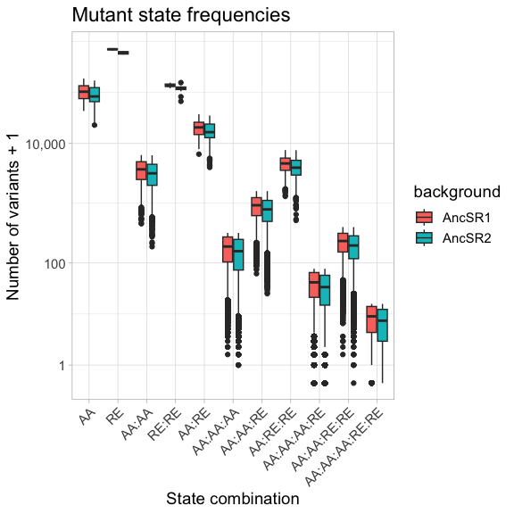
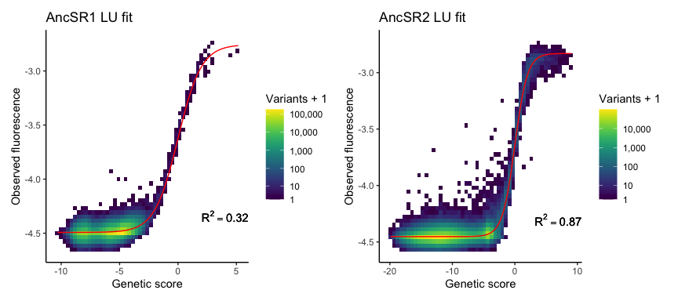
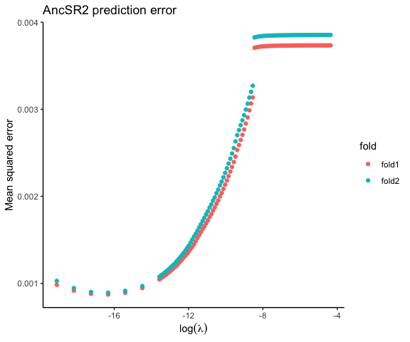
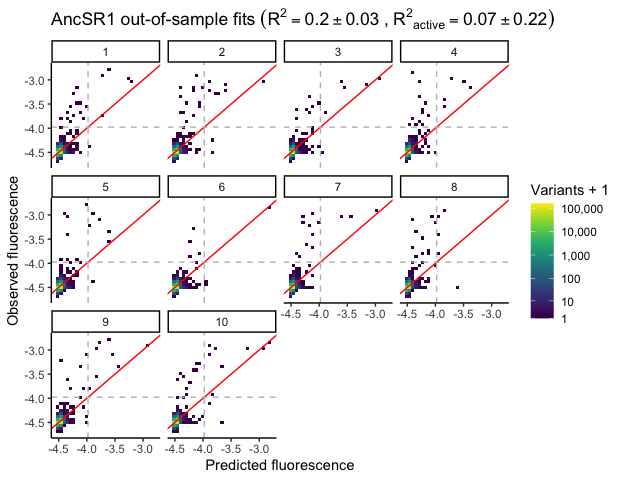
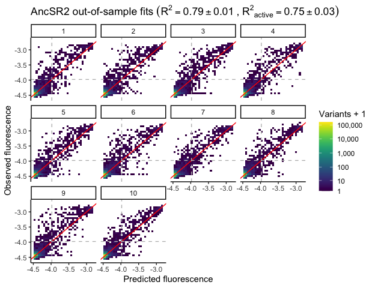
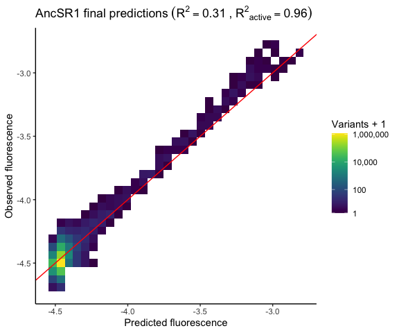
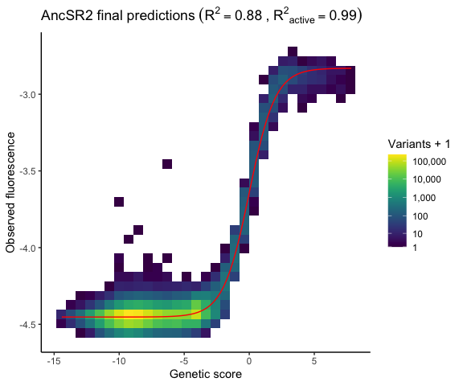
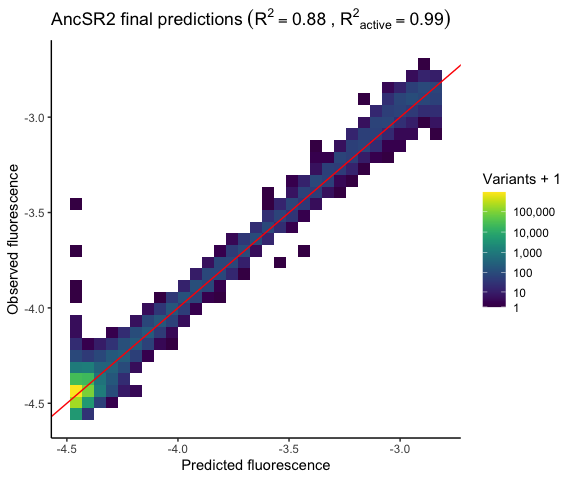

Mutation Effects Modeling
================
Jaeda Patton
2023-04-20

This code fits a model to the RH-RE mutation effects dataset to infer
additive and epistatic effects of amino acid mutations in the AncSR1 or
AncSR2 RH and nucleotide mutations in the RE. Both intermolecular
(i.e. between RH and RE) and intramolecular (i.e. within RH or within
RE) epistatic effects are inferred. Global epistasis is also inferred as
a logistic function that relates the genetic score of a variant (the sum
of additive and epistatic effects) to its fluorescence phenotype; this
accounts for the fact that the lower and upper bounds of the
fluorescence range mask the effects of mutations outside these bounds.
Mutation effects are defined following the reference-free epistasis
formalism outlined in Park & Thornton (2023). Briefly, main
(first-order) effects are defined as the difference between the mean
genetic score of all variants containing a particular state
(e.g. alanine at RH site 1) and the mean genetic score across all
variants. Pairwise epistatic (second-order) effects are further defined
as the difference between the mean genetic score of all variants
containing a particular pair of states (e.g. alanine at RH site 1 and
valine at RH site 2) and the sum of all constituent lower-order effects
(i.e. the global mean plus additive effects of each of the two states).
Higher-order epistatic terms are defined similarly. The full model can
be written as

$$
F = g \left( \beta_0 + \sum_{i \epsilon [1,6]} \beta_i(s_i) + \sum_{i<j \epsilon [1,6]} \beta_{i,j}(s_i,s_j) + ... \right) + \varepsilon
$$ where $F$ is the fluorescence phenotype of a variant, $\beta_0$ is
the global mean genetic score, $\beta_i(s_i)$ is the first-order effect
of state $s_i$ at site $i$ in the sequence, $\beta_{i,j}(s_i,s_j)$ is
the second-order effect of the states at sites $i$ and $j$ in the
sequence, and $\varepsilon$ is an error term. Higher-order epistatic
terms can be added as needed. Sites are indexed from 1 through 6 for the
four sites in the RH and the two sites in the RE. $g$ is a scaled
logistic function modeling nonspecific epistasis, defined as

$$
g(x) = L + \frac{U - L}{1 + e^{-x}}.
$$

It contains two global parameters, $L$ and $U$, that define the lower
and upper bounds, respectively, of the function. $x$ here represents the
genetic score.

L2 regularization will be used to reduce overfitting and to enforce
sparsity in the inferred mutation effects. This is necessary for several
reasons. First, our filtered variant set contains only \~50% of all
possible variants, meaning that some of the effects that we want to
estimate may be missing in our data; regularization is needed to deal
with this problem. Second, larger orders of mutation effects are
associated with larger estimation error since they are estimated using
smaller subsets of the data; since we want to estimate high-order
epistatic terms, regularization is needed to prevent overfitting.
Finally, previous studies have shown that epistatic effects in
combinatorial mutation datasets tend to be sparse compared to the total
number of possible effects **(cite)**; this makes enforcement of
sparsity a reasonable constraint for our model.

Note that the above model takes the form of a generalized linear model
with a scaled logit link function. We will thus use the `glmnet`
package, which contains efficient functions for regularization and
cross-validation, for model fitting.

In this notebook, code chunks with option `purl = TRUE` were run on the
University of Chicago’s Midway high-performance computing cluster. The
output from these chunks were saved to the
`results/mutation_effects_model/` directory and can be loaded in. Chunks
with the option `purl = FALSE` were run locally.

## Loading data and functions

``` r
# load general functions
source(file.path("..", "scripts", "general_functions.R"))
# load model fitting functins
source(file.path("..", "scripts", "mut_effects_model_fitting_functions.R"))

# reading in cleaned data from binned sort and debulk sort experiments
if(!file.exists(file.path(results_dir, "meanF_data.rda"))) {
  meanF_data <- read.csv(file.path("..", "results", "cleaned_data", 
                                 "meanF_data_corrected_NovaSeq.csv.gz"),
                       row.names = 1, stringsAsFactors = TRUE)
  save(meanF_data, file = file.path(results_dir, "meanF_data.rda"))
} else load(file.path(results_dir, "meanF_data.rda"))

if(!file.exists(file.path(results_dir, "debulk_data.rda"))) {
  debulk_data <- read.csv(file.path("..", "results", "cleaned_data", 
                                 "debulk_data_filtered.csv.gz"),
                       row.names = 1, stringsAsFactors = TRUE)
  debulk_data <- debulk_data %>% 
          separate(REBC, into = c("bg", "RE"), sep = "_", 
                   remove = F, extra = "merge") %>%
          mutate(RE = str_replace(RE, "REBC\\d+", as.character(REBC_to_RE(RE))))
  save(debulk_data, file = file.path(results_dir, "debulk_data.rda"))
} else load(file.path(results_dir, "debulk_data.rda"))
```

## Combining data from binned sort and debulk GFP- datasets

Since variants that were inferred as null from the debulk GFP- data do
not have quantitative estimates of fluorescence, we will assign to them
the mean fluorescence of nonsense variants from the same protein
background. We will then combine them with the mean fluorescence
estimates from the binned sort dataset. This will be the full dataset
that we use for fitting the model.

``` r
AncSR1_nullF <- meanF_data %>% 
  filter(type == "exp", bg == "AncSR1", sig == "nonsense") %>% 
  pull(avg_meanF) %>% mean()

AncSR2_nullF <- meanF_data %>% 
  filter(type == "exp", bg == "AncSR2", sig == "nonsense") %>% 
  pull(avg_meanF) %>% mean()

AncSR1_model_data <- meanF_data %>%
  filter(type == "exp", bg == "AncSR1", sig != "nonsense") %>%
  select(AA_var, RE, avg_meanF) %>%
  mutate(type = "binned") %>%
  bind_rows(debulk_data %>% 
              filter(bg == "AncSR1", !grepl("\\*", AA_var)) %>%
              distinct(AA_var, RE) %>%  # remove duplicated variants from redo libraries
              mutate(avg_meanF = AncSR1_nullF, type = "debulk")) %>%
  distinct(AA_var, RE, .keep_all = TRUE) %>%  # remove debulk sort variants if they are in the binned sort dataset
  arrange(AA_var, RE)

AncSR2_model_data <- meanF_data %>%
  filter(type == "exp", bg == "AncSR2", sig != "nonsense") %>%
  select(AA_var, RE, avg_meanF) %>%
  mutate(type = "binned") %>%
  bind_rows(debulk_data %>% 
              filter(bg == "AncSR2", !grepl("\\*", AA_var)) %>%
              select(AA_var, RE) %>% 
              mutate(avg_meanF = AncSR2_nullF, type = "debulk")) %>%
  distinct(AA_var, RE, .keep_all = TRUE) %>%  # remove debulk sort variants if they are in the binned sort dataset
  arrange(AA_var, RE)

rm(debulk_data)  # clearing space
```

## Model fitting

### Building covariate matrices

To fit our mutation effects model, we first need to build covariate
matrices for our data, one each for the AncSR1 and AncSR2 protein
backgrounds. Each row in the covariate matrix represents an RH:RE
variant, and each column represents a variable in the model, which in
our case are amino acid or nucleotide states at sites or combinations of
sites in the sequence. For example, there are $20 \times 4 = 80$ columns
for the first-order effects of amino acid variants in the RH sequence,
$4 \times 2 = 16$ columns for the first-order effects of nucleotide
variants in the RE sequence, $20 \times 20 \times 6 = 2400$ columns for
the second-order RH $\times$ RH effects, and so on. The matrix is
one-hot encoded, such that $x_{ij} = 1$ if variant $i$ contains the
sequence state or state combination corresponding to column $j$, and $0$
otherwise.

We will build covariate matrices containing the following effects:

| effect         | nterms |
|:---------------|:-------|
| RH             | 80     |
| RE             | 8      |
| RHxRH          | 2400   |
| RExRE          | 16     |
| RHxRE          | 640    |
| RHxRHxRH       | 32000  |
| RHxRHxRE       | 19200  |
| RHxRExRE       | 1280   |
| RHxRHxRExRE    | 38400  |
| RHxRHxRHxRE    | 256000 |
| RHxRHxRHxRExRE | 512000 |
| total          | 862024 |

Note that some of the above effect terms are redundant. For example,
there are 8 terms for the first-order RE effects and 16 terms for the
second-order RE effects, meaning that there are 24 total terms encoding
the effect of the RE sequence, more than the number of RE sequences.
These extra degrees of freedom will be dealt with by constraining the
effects to sum to zero over each site; see later section “Zero-mean
enforcement.”

``` r
# specify orders of intermolecular interactions to include in the model;
# first column represents RH interaction order and second column represents
# corresponding RE interaction order

# all interaction orders up to RHxRHxRHxRExRE
RH.RE.order <- matrix(c(c(1,1), c(2,1), c(1,2), c(3,1), c(2,2), c(3,2)), 
                      ncol=2, byrow = TRUE)

# make and save matrices, or load if already saved
if(!file.exists(file.path(results_dir, "AncSR1_full_mat.rda"))) {
  AncSR1_full_mat <- make_cov_matrix(AncSR1_model_data,
                                     RH.order = 3, RE.order = 2,
                                     RH.RE.order = RH.RE.order,
                                     cores = 12, its=20)
  save(AncSR1_full_mat, file = file.path(results_dir, "AncSR1_full_mat.rda"))
} else load(file.path(results_dir, "AncSR1_full_mat.rda"))

if(!file.exists(file.path(results_dir, "AncSR2_full_mat.rda"))) {
  AncSR2_full_mat <- make_cov_matrix(AncSR2_model_data,
                                     RH.order = 3, RE.order = 2,
                                     RH.RE.order = RH.RE.order,
                                     cores = 12, its=20)
  save(AncSR2_full_mat, file = file.path(results_dir, "AncSR2_full_mat.rda"))
} else load(file.path(results_dir, "AncSR2_full_mat.rda"))
```

### Checking mutation frequencies

``` r
mutfreq <- data.frame(mut = colnames(AncSR1_full_mat),
                      AncSR1 = colSums(AncSR1_full_mat),
                      AncSR2 = colSums(AncSR2_full_mat)) %>%
  pivot_longer(cols = 2:3, names_to = "background", values_to = "nvars") %>%
  mutate(order = gsub("AA..", "AA", mut)) %>%
  mutate(order = gsub("RE..", "RE", order)) %>%
  mutate(order = factor(order, levels = unique(order)))

# plot the number of variants in the dataset containing a mutant state
# or state combination of a given order
mutfreq %>%
  ggplot(aes(x = order, y = nvars, fill = background)) +
  geom_boxplot() +
  scale_y_log10() +
  labs(title = "Mutant state frequencies", x = "order", 
       y = "number of variants") +
  theme_light() +
  theme(axis.text.x = element_text(angle = 45, vjust = 1, hjust = 1),
        text = element_text(size = 14))
```

<!-- -->

``` r
# how many mutation combinations are observed in 3 or fewer variants,
# according to mutation order, and what is the proportion out of all possible
# combinations?
mutfreq %>%
  group_by(background, order) %>%
  summarize(nlessthan4 = sum(nvars <= 3),
            proplessthan4 = round(sum(nvars <= 3) / n(), 3)) %>%
  as.data.frame() %>% knitr::kable()
```

| background | order          | nlessthan4 | proplessthan4 |
|:-----------|:---------------|-----------:|--------------:|
| AncSR1     | AA             |          0 |         0.000 |
| AncSR1     | RE             |          0 |         0.000 |
| AncSR1     | AA:AA          |          0 |         0.000 |
| AncSR1     | RE:RE          |          0 |         0.000 |
| AncSR1     | AA:RE          |          0 |         0.000 |
| AncSR1     | AA:AA:AA       |          4 |         0.000 |
| AncSR1     | AA:AA:RE       |          0 |         0.000 |
| AncSR1     | AA:RE:RE       |          0 |         0.000 |
| AncSR1     | AA:AA:AA:RE    |       3142 |         0.012 |
| AncSR1     | AA:AA:RE:RE    |          2 |         0.000 |
| AncSR1     | AA:AA:AA:RE:RE |      71668 |         0.140 |
| AncSR2     | AA             |          0 |         0.000 |
| AncSR2     | RE             |          0 |         0.000 |
| AncSR2     | AA:AA          |          0 |         0.000 |
| AncSR2     | RE:RE          |          0 |         0.000 |
| AncSR2     | AA:RE          |          0 |         0.000 |
| AncSR2     | AA:AA:AA       |         26 |         0.001 |
| AncSR2     | AA:AA:RE       |          0 |         0.000 |
| AncSR2     | AA:RE:RE       |          0 |         0.000 |
| AncSR2     | AA:AA:AA:RE    |       9824 |         0.038 |
| AncSR2     | AA:AA:RE:RE    |         13 |         0.000 |
| AncSR2     | AA:AA:AA:RE:RE |     108494 |         0.212 |

``` r
# how many mutation combinations are observed in no variants,
# according to mutation order, and what is the proportion out of all possible
# combinations?
mutfreq %>%
  group_by(background, order) %>%
  summarize(nmissing = sum(nvars == 0),
            propmissing = round(sum(nvars == 0) / n(), 3)) %>%
  as.data.frame() %>% knitr::kable()
```

| background | order          | nmissing | propmissing |
|:-----------|:---------------|---------:|------------:|
| AncSR1     | AA             |        0 |       0.000 |
| AncSR1     | RE             |        0 |       0.000 |
| AncSR1     | AA:AA          |        0 |       0.000 |
| AncSR1     | RE:RE          |        0 |       0.000 |
| AncSR1     | AA:RE          |        0 |       0.000 |
| AncSR1     | AA:AA:AA       |        0 |       0.000 |
| AncSR1     | AA:AA:RE       |        0 |       0.000 |
| AncSR1     | AA:RE:RE       |        0 |       0.000 |
| AncSR1     | AA:AA:AA:RE    |      202 |       0.001 |
| AncSR1     | AA:AA:RE:RE    |        0 |       0.000 |
| AncSR1     | AA:AA:AA:RE:RE |    11903 |       0.023 |
| AncSR2     | AA             |        0 |       0.000 |
| AncSR2     | RE             |        0 |       0.000 |
| AncSR2     | AA:AA          |        0 |       0.000 |
| AncSR2     | RE:RE          |        0 |       0.000 |
| AncSR2     | AA:RE          |        0 |       0.000 |
| AncSR2     | AA:AA:AA       |        0 |       0.000 |
| AncSR2     | AA:AA:RE       |        0 |       0.000 |
| AncSR2     | AA:RE:RE       |        0 |       0.000 |
| AncSR2     | AA:AA:AA:RE    |      981 |       0.004 |
| AncSR2     | AA:AA:RE:RE    |        1 |       0.000 |
| AncSR2     | AA:AA:AA:RE:RE |    24706 |       0.048 |

### Fitting nonspecific epistasis

First we will estimate the $U$ and $L$ parameters of the logistic
function used for modeling nonspecific epistasis. We do this prior to
fitting the full regularized model because `glmnet` cannot estimate
nonlinear parameters in the link function. We estimate $U$ and $L$ by
using unregularized nonlinear least squares regression to fit a
reference-free epistasic model consisting of logistic nonspecific
epistasis, first-order mutation effects (RH and RE), second-order
intramolecular effects (RH$\times$RH and RE$\times$RE), and all
intermolecular interactions between those effects (i.e. RE$\times$RH,
RE$\times$RE$\times$RH, RH$\times$RH$\times$RE, and
RH$\times$RH$\times$RE$\times$RE). While estimates of the linear
mutation effects may be inaccurate in this model, it is likely to be
sufficient for estimating the two global parameters of the link
function.

``` r
# get observed phenotypes
y.AncSR1 <- AncSR1_model_data$avg_meanF
y.AncSR2 <- AncSR2_model_data$avg_meanF

# fit unregularized mutation effects models to estimate L and U
if(!file.exists(file.path(results_dir, "AncSR1_UL_fit.rda"))) {
  AncSR1_UL_fit <- fit_LU(y.AncSR1, 
                          cbind(1, AncSR1_full_mat),
                          maxit = 1000)
  save(AncSR1_UL_fit, file = file.path(results_dir, "AncSR1_UL_fit.rda"))
} else {
  load(file.path(results_dir, "AncSR1_UL_fit.rda"))
}

if(!file.exists(file.path(results_dir, "AncSR2_UL_fit.rda"))) {
  AncSR2_UL_fit <- fit_LU(y.AncSR2, 
                          cbind(1, AncSR2_full_mat),
                          maxit = 1000)
  save(AncSR2_UL_fit, file = file.path(results_dir, "AncSR2_UL_fit.rda"))
} else {
  load(file.path(results_dir, "AncSR2_UL_fit.rda"))
}

# get genetic scores from model fits
if(!file.exists(file.path(results_dir, "AncSR1_UL_fit_gs.rda"))) {
  AncSR1_UL_fit_gs <- get_gs_LU_fit(cbind(1, AncSR1_full_mat), 
                                    AncSR1_UL_fit, its = 20, cores = 12)
  save(AncSR1_UL_fit_gs, file = file.path(results_dir, "AncSR1_UL_fit_gs.rda"))
} else load(file.path(results_dir, "AncSR1_UL_fit_gs.rda"))

if(!file.exists(file.path(results_dir, "AncSR2_UL_fit_gs.rda"))) {
  AncSR2_UL_fit_gs <- get_gs_LU_fit(cbind(1, AncSR2_full_mat), 
                                    AncSR2_UL_fit, its = 20, cores = 12)
  save(AncSR2_UL_fit_gs, file = file.path(results_dir, "AncSR2_UL_fit_gs.rda"))
} else load(file.path(results_dir, "AncSR2_UL_fit_gs.rda"))

# get U and L estimates from each fit
AncSR1.U <- AncSR1_UL_fit$par[length(AncSR1_UL_fit$par)]
AncSR1.L <- AncSR1_UL_fit$par[length(AncSR1_UL_fit$par)-1]
AncSR2.U <- AncSR2_UL_fit$par[length(AncSR2_UL_fit$par)]
AncSR2.L <- AncSR2_UL_fit$par[length(AncSR2_UL_fit$par)-1]
```

Now let’s assess the fit by calculating the coefficient of determination
($R^2$) of each model and plotting the inferred genetic score
vs. observed phenotype using the models fit above.

``` r
# calculate R^2 of each model
AncSR1_UL_R2 <- calc_R2(logistic(AncSR1_UL_fit_gs, L=AncSR1.L, U=AncSR1.U), 
                        y.AncSR1)
AncSR2_UL_R2 <- calc_R2(logistic(AncSR2_UL_fit_gs, L=AncSR2.L, U=AncSR2.U), 
                        y.AncSR2)

print(paste("AncSR1 UL fit R^2:", round(AncSR1_UL_R2, 2)))
```

    ## [1] "AncSR1 UL fit R^2: 0.32"

``` r
print(paste("AncSR2 UL fit R^2:", round(AncSR2_UL_R2, 2)))
```

    ## [1] "AncSR2 UL fit R^2: 0.87"

``` r
# create plots of genetic score vs. true phenotype
a <- data.frame(geneticscore = AncSR1_UL_fit_gs,
                fluorescence = y.AncSR1) %>%
  ggplot(aes(x = geneticscore, y = fluorescence)) +
  geom_bin2d(bins = 50) +
  scale_fill_viridis(trans = "log") +
  geom_function(fun = logistic, args = list(L = AncSR1.L, U = AncSR1.U), 
                color = "red") +
  labs(x = "genetic score", y = "fluorescence", title = "AncSR1 LU fit") +
  annotate(geom = "text", x = Inf, y = AncSR1.L + 0.1, 
           label = bquote(R^2 == .(round(AncSR1_UL_R2, 2))), 
           vjust = 0, hjust = 1) +
  theme_classic()

b <- data.frame(geneticscore = AncSR2_UL_fit_gs,
                fluorescence = y.AncSR2) %>%
  ggplot(aes(x = geneticscore, y = fluorescence)) +
  geom_bin2d(bins = 50) +
  scale_fill_viridis(trans = "log") +
  geom_function(fun = logistic, args = list(L = AncSR2.L, U = AncSR2.U), 
                color = "red") +
  labs(x = "genetic score", y = "fluorescence", title = "AncSR2 LU fit") +
  annotate(geom = "text", x = Inf, y = AncSR2.L + 0.1, 
           label = bquote(R^2 == .(round(AncSR2_UL_R2, 2))), 
           vjust = 0, hjust = 1) +
  theme_classic()

(a + b)
```

<!-- -->

``` r
rm(a, b, AncSR1_UL_fit, AncSR2_UL_fit)  # clearing space
```

### Fitting linear mutation effect terms

Let’s now fit the linear main, pairwise, and higher-order mutation
effect parameters using `glmnet`. We will use a scaled logit link
function for our model,

$$
h(F) = x = \ln \left( \frac{F - \hat{L}}{\hat{U} - F} \right),
$$

to relate the measured fluorescence $F$ of each variant to its genetic
score $x$. This function is simply the inverse of the scaled logistic
function that we defined previously, where $\hat{U}$ and $\hat{L}$ are
the global upper and lower bound parameters that we estimated in the
previous section. We will assume a Gaussian error distribution on the
fluorescence measurements.

The model will be fit with L2 regularization. Cross-validation (CV) will
be used to optimize regularization strength, specified by the parameter
$\lambda$.

Because of the very large size of our covariate matrices, we had to
modify the `glmnet` function in the `glmnet v1.4.6` package to avoid
memory allocation errors. Modified functions can be accessed in the
mut_effects_model_fitting_functions.R script.

#### Initial full dataset fit

First fit a model to the full AncSR1 and AncSR2 datasets. We will use
the default `glmnet` regularization path with 100 $\lambda$ values.

``` r
# specify link function
family.AncSR1 <- gaussian(link = glogit(L = AncSR1.L, U = AncSR1.U))

# perform L2-regularized fitting
if(!file.exists(file.path(results_dir, "full.fit.AncSR1.rda"))) {
  full.fit.AncSR1 <- glmnet.large(AncSR1_full_mat, y.AncSR1,
                                family = family.AncSR1, alpha = 0,
                                nlambda = 100, trace.it = 2)
  save(full.fit.AncSR1, file = file.path(results_dir, "full.fit.AncSR1.rda"))
} else load(file.path(results_dir, "full.fit.AncSR1.rda"))
```

``` r
# specify link function
family.AncSR2 <- gaussian(link = glogit(L = AncSR2.L, U = AncSR2.U))

# perform L2-regularized fitting
if(!file.exists(file.path(results_dir, "full.fit.AncSR2.rda"))) {
  full.fit.AncSR2 <- glmnet.large(AncSR2_full_mat, y.AncSR2,
                                family = family.AncSR2, alpha = 0,
                                nlambda = 100, trace.it = 2)
  save(full.fit.AncSR2, file = file.path(results_dir, "full.fit.AncSR2.rda"))
} else load(file.path(results_dir, "full.fit.AncSR2.rda"))
```

#### Initial fit cross validation

We will now use cross validation to select the value of $\lambda$ that
minimizes prediction error, $\lambda_{min}$. In standard 10-fold CV, the
data is randomly into 10 equal-size test sets and for each test set, the
model is trained on the remaining 90% of the data and performance is
then assessed on the held-out 10%. To save on computational resources,
we will first assess fits with only two 90-10 training-test splits per
dataset.

``` r
# specify family functions
family.AncSR1 <- gaussian(link = glogit(L = AncSR1.L, U = AncSR1.U))
family.AncSR2 <- gaussian(link = glogit(L = AncSR2.L, U = AncSR2.U))

# generate cv folds
nfolds <- 10
AncSR1_foldid <- rep_len(1:nfolds, nrow(AncSR1_full_mat))
set.seed(230703)
AncSR1_foldid <- sample(AncSR1_foldid, nrow(AncSR1_full_mat))
AncSR2_foldid <- rep_len(1:nfolds, nrow(AncSR2_full_mat))
set.seed(230703)
AncSR2_foldid <- sample(AncSR2_foldid, nrow(AncSR2_full_mat))

# regularization paths
AncSR1_path <- full.fit.AncSR1$lambda
AncSR2_path <- full.fit.AncSR2$lambda
```

``` r
# fit AncSR1 CV fold 1
which <- AncSR1_foldid == 1
if(!file.exists(file.path(results_dir, "cv.fold1.fit.AncSR1.rda"))) {
  fold_fit <- glmnet.large(AncSR1_full_mat[!which,], y.AncSR1[!which],
                           family = family.AncSR1, alpha = 0,
                           lambda = AncSR1_path, trace.it = 2)
  save(fold_fit, file = file.path(results_dir, "cv.fold1.fit.AncSR1.rda"))
} else {
  load(file.path(results_dir, "cv.fold1.fit.AncSR1.rda"))
  cv.fit.AncSR1.fold1 <- fold_fit
  rm(fold_fit)
}
```

``` r
# fit AncSR1 CV fold 2
which <- AncSR1_foldid == 2
if(!file.exists(file.path(results_dir, "cv.fold2.fit.AncSR1.rda"))) {
  fold_fit <- glmnet.large(AncSR1_full_mat[!which,], y.AncSR1[!which],
                           family = family.AncSR1, alpha = 0,
                           lambda = AncSR1_path, trace.it = 2)
  save(fold_fit, file = file.path(results_dir, "cv.fold2.fit.AncSR1.rda"))
} else {
  load(file.path(results_dir, "cv.fold2.fit.AncSR1.rda"))
  cv.fit.AncSR1.fold2 <- fold_fit
  rm(fold_fit)
}
```

``` r
# fit AncSR2 CV fold 1
which <- AncSR2_foldid == 1
if(!file.exists(file.path(results_dir, "cv.fold1.fit.AncSR2.rda"))) {
  fold_fit <- glmnet.large(AncSR2_full_mat[!which,], y.AncSR2[!which],
                           family = family.AncSR2, alpha = 0,
                           lambda = AncSR2_path, trace.it = 2)
  save(fold_fit, file = file.path(results_dir, "cv.fold1.fit.AncSR2.rda"))
} else {
  load(file.path(results_dir, "cv.fold1.fit.AncSR2.rda"))
  cv.fit.AncSR2.fold1 <- fold_fit
  rm(fold_fit)
}
```

``` r
# fit AncSR2 CV fold 2
which <- AncSR2_foldid == 2
if(!file.exists(file.path(results_dir, "cv.fold2.fit.AncSR2.rda"))) {
  fold_fit <- glmnet.large(AncSR2_full_mat[!which,], y.AncSR2[!which],
                           family = family.AncSR2, alpha = 0,
                           lambda = AncSR2_path, trace.it = 2)
  save(fold_fit, file = file.path(results_dir, "cv.fold2.fit.AncSR2.rda"))
} else {
  load(file.path(results_dir, "cv.fold2.fit.AncSR2.rda"))
  cv.fit.AncSR2.fold2 <- fold_fit
  rm(fold_fit)
}
```

Compute genetic scores and predicted fluorescence for the cross
validation models.

``` r
# AncSR1 test set 1 prediction
if(!file.exists(file.path(results_dir, "cv.pred.AncSR1.fold1.rda"))) {
  which <- AncSR1_foldid == 1
  cv.gs.AncSR1.fold1 <- predict(cv.fit.AncSR1.fold1, AncSR1_full_mat[which,])
  cv.pred.AncSR1.fold1 <- apply(cv.gs.AncSR1.fold1, 2, logistic, 
                                L = AncSR1.L, U = AncSR1.U)
  save(cv.gs.AncSR1.fold1, file = file.path(results_dir, "cv.gs.AncSR1.fold1.rda"))
  save(cv.pred.AncSR1.fold1, file = file.path(results_dir, "cv.pred.AncSR1.fold1.rda"))
} else {
  load(file.path(results_dir, "cv.gs.AncSR1.fold1.rda"))
  load(file.path(results_dir, "cv.pred.AncSR1.fold1.rda"))
}
# AncSR1 test set 2 prediction
if(!file.exists(file.path(results_dir, "cv.pred.AncSR1.fold2.rda"))) {
  which <- AncSR1_foldid == 2
  cv.gs.AncSR1.fold2 <- predict(cv.fit.AncSR1.fold2, AncSR1_full_mat[which,])
  cv.pred.AncSR1.fold2 <- apply(cv.gs.AncSR1.fold2, 2, logistic, 
                                L = AncSR1.L, U = AncSR1.U)
  save(cv.gs.AncSR1.fold2, file = file.path(results_dir, "cv.gs.AncSR1.fold2.rda"))
  save(cv.pred.AncSR1.fold2, file = file.path(results_dir, "cv.pred.AncSR1.fold2.rda"))
} else {
  load(file.path(results_dir, "cv.gs.AncSR1.fold2.rda"))
  load(file.path(results_dir, "cv.pred.AncSR1.fold2.rda"))
}
# AncSR2 test set 1 prediction
if(!file.exists(file.path(results_dir, "cv.pred.AncSR2.fold1.rda"))) {
  which <- AncSR2_foldid == 1
  cv.gs.AncSR2.fold1 <- predict(cv.fit.AncSR2.fold1, AncSR2_full_mat[which,])
  cv.pred.AncSR2.fold1 <- apply(cv.gs.AncSR2.fold1, 2, logistic, 
                                L = AncSR2.L, U = AncSR2.U)
  save(cv.gs.AncSR2.fold1, file = file.path(results_dir, "cv.gs.AncSR2.fold1.rda"))
  save(cv.pred.AncSR2.fold1, file = file.path(results_dir, "cv.pred.AncSR2.fold1.rda"))
} else {
  load(file.path(results_dir, "cv.gs.AncSR2.fold1.rda"))
  load(file.path(results_dir, "cv.pred.AncSR2.fold1.rda"))
}
# AncSR2 test set 2 prediction
if(!file.exists(file.path(results_dir, "cv.pred.AncSR2.fold2.rda"))) {
  which <- AncSR2_foldid == 2
  cv.gs.AncSR2.fold2 <- predict(cv.fit.AncSR2.fold2, AncSR2_full_mat[which,])
  cv.pred.AncSR2.fold2 <- apply(cv.gs.AncSR2.fold2, 2, logistic, 
                                L = AncSR2.L, U = AncSR2.U)
  save(cv.gs.AncSR2.fold2, file = file.path(results_dir, "cv.gs.AncSR2.fold2.rda"))
  save(cv.pred.AncSR2.fold2, file = file.path(results_dir, "cv.pred.AncSR2.fold2.rda"))
} else {
  load(file.path(results_dir, "cv.gs.AncSR2.fold2.rda"))
  load(file.path(results_dir, "cv.pred.AncSR2.fold2.rda"))
}
```

Compute out-of-sample mean-squared error (MSE) for CV models and plot as
a function of $\lambda$.

``` r
# AncSR1 fold 1 MSE
AncSR1.fold1.mse <- apply(cv.pred.AncSR1.fold1, 2, 
                          function(x) x - y.AncSR1[AncSR1_foldid == 1])
AncSR1.fold1.mse <- colMeans(AncSR1.fold1.mse^2)
# AncSR1 fold 2 MSE
AncSR1.fold2.mse <- apply(cv.pred.AncSR1.fold2, 2, 
                          function(x) x - y.AncSR1[AncSR1_foldid == 2])
AncSR1.fold2.mse <- colMeans(AncSR1.fold2.mse^2)
# AncSR1 MSE mean and range
AncSR1.mse <- data.frame(lambda = AncSR1_path,
                         fold1 = AncSR1.fold1.mse,
                         fold2 = AncSR1.fold2.mse)

# get lambda that minimizes mean MSE
AncSR1.minlambda.i <- which(AncSR1.mse$mean == min(AncSR1.mse$mean))
AncSR1.minlambda <- AncSR1_path[AncSR1.minlambda.i]

# plot lambda vs. MSE
AncSR1.mse %>%
  select(lambda, fold1, fold2) %>%
  pivot_longer(2:3, names_to = "fold", values_to = "MSE") %>%
  ggplot(aes(x = log(lambda), y = MSE, color = fold)) +
  geom_point() +
  geom_vline(xintercept = log(AncSR1.minlambda), linetype = 2, 
             color = "gray30") +
  labs(title = "AncSR1 prediction error", x = bquote(log(lambda)),
       y = "Mean squared error") +
  theme_classic()
```

<!-- -->

``` r
# AncSR2 fold 1 MSE
AncSR2.fold1.mse <- apply(cv.pred.AncSR2.fold1, 2, 
                          function(x) x - y.AncSR2[AncSR2_foldid == 1])
AncSR2.fold1.mse <- colMeans(AncSR2.fold1.mse^2)
# AncSR2 fold 2 MSE
AncSR2.fold2.mse <- apply(cv.pred.AncSR2.fold2, 2, 
                          function(x) x - y.AncSR2[AncSR2_foldid == 2])
AncSR2.fold2.mse <- colMeans(AncSR2.fold2.mse^2)
# AncSR2 MSE mean and range
AncSR2.mse <- data.frame(lambda = AncSR2_path,
                         fold1 = AncSR2.fold1.mse,
                         fold2 = AncSR2.fold2.mse)

# get lambda that minimizes mean MSE
AncSR2.minlambda.i <- which(AncSR2.mse$mean == min(AncSR2.mse$mean))
AncSR2.minlambda <- AncSR2_path[AncSR2.minlambda.i]

# plot lambda vs. MSE
AncSR2.mse %>%
  select(lambda, fold1, fold2) %>%
  pivot_longer(2:3, names_to = "fold", values_to = "MSE") %>%
  ggplot(aes(x = log(lambda), y = MSE, color = fold)) +
  geom_point() +
  geom_vline(xintercept = log(AncSR2.minlambda), linetype = 2, 
             color = "gray30") +
  labs(title = "AncSR2 prediction error", x = bquote(log(lambda)), 
       y = "Mean squared error") +
  theme_classic()
```

<!-- -->

We see that there is no trough in the $\lambda$-MSE plots for either the
AncSR1 or AncSR2 datasets, so the regularization path did not extend far
enough towards 0 for either dataset. We will therefore extend it
manually.

#### Extended regularization path cross validation

We will first extend the regularization path computed by `glmnet` by
adding 10 values of $\lambda$ spanning the same range as the original
path.

``` r
rm(full.fit.AncSR1, full.fit.AncSR2)  # clearing space

# extend lambda range
AncSR1.path.range <- log(AncSR1_path[100]) - log(AncSR1_path[1])
AncSR1_path_ext <- exp(seq(log(AncSR1_path[100]), 
                           log(AncSR1_path[100]) + AncSR1.path.range, 
                           length.out = 11))[-1]

AncSR2.path.range <- log(AncSR2_path[100]) - log(AncSR2_path[1])
AncSR2_path_ext <- exp(seq(log(AncSR2_path[100]),
                           log(AncSR2_path[100]) + AncSR2.path.range,
                           length.out = 11))[-1]
```

Fitting the cross-validation test sets for the extended $\lambda$ range.
We will use the fit from the last model in the regularization path as a
warm start (`glmnet` was modified to allow user to supply initial
parameter values, or “warm starts”).

``` r
which <- AncSR1_foldid == 1
init <- list(a0 = cv.fit.AncSR1.fold1$a0[100],
             beta = cv.fit.AncSR1.fold1$beta[,100])
rm(cv.fit.AncSR1.fold1)  # clearing space
if(!file.exists(file.path(results_dir, "cv.fold1.ext.fit.AncSR1.rda"))) {
  fold_fit <- glmnet.large(AncSR1_full_mat[!which,], y.AncSR1[!which],
                           family = family.AncSR1, alpha = 0,
                           lambda = AncSR1_path_ext, init = init, trace.it = 2)
  save(fold_fit, file = file.path(results_dir, "cv.fold1.ext.fit.AncSR1.rda"))
} else {
  load(file.path(results_dir, "cv.fold1.ext.fit.AncSR1.rda"))
  cv.fit.AncSR1.fold1.ext <- fold_fit
  rm(fold_fit)
}
```

``` r
which <- AncSR1_foldid == 2
init <- list(a0 = cv.fit.AncSR1.fold2$a0[100],
             beta = cv.fit.AncSR1.fold2$beta[,100])
rm(cv.fit.AncSR1.fold2)  # clearing space
if(!file.exists(file.path(results_dir, "cv.fold2.ext.fit.AncSR1.rda"))) {
  fold_fit <- glmnet.large(AncSR1_full_mat[!which,], y.AncSR1[!which],
                           family = family.AncSR1, alpha = 0,
                           lambda = AncSR1_path_ext[1:6], init = init, trace.it = 2)
  save(fold_fit, file = file.path(results_dir, "cv.fold2.ext.fit.AncSR1.rda"))
} else {
  load(file.path(results_dir, "cv.fold2.ext.fit.AncSR1.rda"))
  cv.fit.AncSR1.fold2.ext <- fold_fit
  rm(fold_fit)
}
```

``` r
which <- AncSR2_foldid == 1
init <- list(a0 = cv.fit.AncSR2.fold1$a0[100],
             beta = cv.fit.AncSR2.fold1$beta[,100])
rm(cv.fit.AncSR2.fold1)  # clearing space
if(!file.exists(file.path(results_dir, "cv.fold1.ext.fit.AncSR2.rda"))) {
  fold_fit <- glmnet.large(AncSR2_full_mat[!which,], y.AncSR2[!which],
                           family = family.AncSR2, alpha = 0,
                           lambda = AncSR2_path_ext, init = init, trace.it = 2)
  save(fold_fit, file = file.path(results_dir, "cv.fold1.ext.fit.AncSR2.rda"))
} else {
  load(file.path(results_dir, "cv.fold1.ext.fit.AncSR2.rda"))
  cv.fit.AncSR2.fold1.ext <- fold_fit
  rm(fold_fit)
}
```

``` r
which <- AncSR2_foldid == 2
init <- list(a0 = cv.fit.AncSR2.fold2$a0[100],
             beta = cv.fit.AncSR2.fold2$beta[,100])
rm(cv.fit.AncSR2.fold2)  # clearing space
if(!file.exists(file.path(results_dir, "cv.fold2.ext.fit.AncSR2.rda"))) {
  fold_fit <- glmnet.large(AncSR2_full_mat[!which,], y.AncSR2[!which],
                           family = family.AncSR2, alpha = 0,
                           lambda = AncSR2_path_ext[1:6], init = init, 
                           trace.it = 2)
  save(fold_fit, file = file.path(results_dir, "cv.fold2.ext.fit.AncSR2.rda"))
} else {
  load(file.path(results_dir, "cv.fold2.ext.fit.AncSR2.rda"))
  cv.fit.AncSR2.fold2.ext <- fold_fit
  rm(fold_fit)
}
```

Get out-of-sample predicted genetic scores and phenotypes from the
extended path CV models.

``` r
# AncSR1 test set 1 extended path prediction
if(!file.exists(file.path(results_dir, "cv.pred.AncSR1.fold1.ext.rda"))) {
  which <- AncSR1_foldid == 1
  cv.gs.AncSR1.fold1.ext <- predict(cv.fit.AncSR1.fold1.ext,
                                    AncSR1_full_mat[which,])
  cv.pred.AncSR1.fold1.ext <- apply(cv.gs.AncSR1.fold1.ext, 2, logistic, 
                                    L = AncSR1.L, U = AncSR1.U)
  save(cv.gs.AncSR1.fold1.ext, 
       file = file.path(results_dir, "cv.gs.AncSR1.fold1.ext.rda"))
  save(cv.pred.AncSR1.fold1.ext, 
       file = file.path(results_dir, "cv.pred.AncSR1.fold1.ext.rda"))
} else {
  load(file.path(results_dir, "cv.gs.AncSR1.fold1.ext.rda"))
  load(file.path(results_dir, "cv.pred.AncSR1.fold1.ext.rda"))
}
# AncSR1 test set 2 extended path prediction
if(!file.exists(file.path(results_dir, "cv.pred.AncSR1.fold2.ext.rda"))) {
  which <- AncSR1_foldid == 2
  cv.gs.AncSR1.fold2.ext <- predict(cv.fit.AncSR1.fold2.ext,
                                    AncSR1_full_mat[which,])
  cv.pred.AncSR1.fold2.ext <- apply(cv.gs.AncSR1.fold2.ext, 2, logistic, 
                                    L = AncSR1.L, U = AncSR1.U)
  save(cv.gs.AncSR1.fold2.ext, 
       file = file.path(results_dir, "cv.gs.AncSR1.fold2.ext.rda"))
  save(cv.pred.AncSR1.fold2.ext, 
       file = file.path(results_dir, "cv.pred.AncSR1.fold2.ext.rda"))
} else {
  load(file.path(results_dir, "cv.gs.AncSR1.fold2.ext.rda"))
  load(file.path(results_dir, "cv.pred.AncSR1.fold2.ext.rda"))
}
# AncSR2 test set 1 extended path prediction
if(!file.exists(file.path(results_dir, "cv.pred.AncSR2.fold1.ext.rda"))) {
  which <- AncSR2_foldid == 1
  cv.gs.AncSR2.fold1.ext <- predict(cv.fit.AncSR2.fold1.ext,
                                    AncSR2_full_mat[which,])
  cv.pred.AncSR2.fold1.ext <- apply(cv.gs.AncSR2.fold1.ext, 2, logistic, 
                                    L = AncSR2.L, U = AncSR2.U)
  save(cv.gs.AncSR2.fold1.ext, 
       file = file.path(results_dir, "cv.gs.AncSR2.fold1.ext.rda"))
  save(cv.pred.AncSR2.fold1.ext, 
       file = file.path(results_dir, "cv.pred.AncSR2.fold1.ext.rda"))
} else {
  load(file.path(results_dir, "cv.gs.AncSR2.fold1.ext.rda"))
  load(file.path(results_dir, "cv.pred.AncSR2.fold1.ext.rda"))
}
# AncSR2 test set 1 extended path prediction
if(!file.exists(file.path(results_dir, "cv.pred.AncSR2.fold2.ext.rda"))) {
  which <- AncSR2_foldid == 2
  cv.gs.AncSR2.fold2.ext <- predict(cv.fit.AncSR2.fold2.ext,
                                    AncSR2_full_mat[which,])
  cv.pred.AncSR2.fold2.ext <- apply(cv.gs.AncSR2.fold2.ext, 2, logistic, 
                                    L = AncSR2.L, U = AncSR2.U)
  save(cv.gs.AncSR2.fold2.ext, 
       file = file.path(results_dir, "cv.gs.AncSR2.fold2.ext.rda"))
  save(cv.pred.AncSR2.fold2.ext, 
       file = file.path(results_dir, "cv.pred.AncSR2.fold2.ext.rda"))
} else {
  load(file.path(results_dir, "cv.gs.AncSR2.fold2.ext.rda"))
  load(file.path(results_dir, "cv.pred.AncSR2.fold2.ext.rda"))
}
```

Analyze out-of-sample MSE for extended regularization paths.

``` r
# AncSR1 test set 1 extended lambda path MSE
AncSR1.fold1.mse.ext <- apply(cv.pred.AncSR1.fold1.ext, 2, 
                              function(x) x - y.AncSR1[AncSR1_foldid == 1])
AncSR1.fold1.mse.ext <- colMeans(AncSR1.fold1.mse.ext^2)
# AncSR1 test set 2 extended lambda path MSE
AncSR1.fold2.mse.ext <- apply(cv.pred.AncSR1.fold2.ext, 2, 
                              function(x) x - y.AncSR1[AncSR1_foldid == 2])
AncSR1.fold2.mse.ext <- colMeans(AncSR1.fold2.mse.ext^2)
# add to data frame
AncSR1.mse <- rbind(AncSR1.mse,
                    data.frame(lambda = AncSR1_path_ext,
                               fold1 = AncSR1.fold1.mse.ext,
                               fold2 = c(AncSR1.fold2.mse.ext, rep(NA, 4))))

# plot lambda vs. MSE
AncSR1.mse[1:106,] %>%
  select(lambda, fold1, fold2) %>%
  pivot_longer(2:3, names_to = "fold", values_to = "MSE") %>%
  ggplot(aes(x = log(lambda), y = MSE, color = fold)) +
  geom_point() +
  labs(title = "AncSR1 prediction error", x = bquote(log(lambda)),
       y = "Mean squared error") +
  theme_classic()
```

<!-- -->

``` r
# AncSR2 extended lambda path MSE
AncSR2.fold1.mse.ext <- apply(cv.pred.AncSR2.fold1.ext, 2, 
                              function(x) x - y.AncSR2[AncSR2_foldid == 1])
AncSR2.fold1.mse.ext <- colMeans(AncSR2.fold1.mse.ext^2)
# AncSR2 test set 2 extended lambda path MSE
AncSR2.fold2.mse.ext <- apply(cv.pred.AncSR2.fold2.ext, 2, 
                              function(x) x - y.AncSR2[AncSR2_foldid == 2])
AncSR2.fold2.mse.ext <- colMeans(AncSR2.fold2.mse.ext^2)
# add to data frame
AncSR2.mse <- rbind(AncSR2.mse,
                    data.frame(lambda = AncSR2_path_ext,
                               fold1 = AncSR2.fold1.mse.ext,
                               fold2 = c(AncSR2.fold2.mse.ext, rep(NA, 4))))

# plot lambda vs. MSE
AncSR2.mse[1:106,] %>%
  select(lambda, fold1, fold2) %>%
  pivot_longer(2:3, names_to = "fold", values_to = "MSE") %>%
  ggplot(aes(x = log(lambda), y = MSE, color = fold)) +
  geom_point() +
  labs(title = "AncSR2 prediction error", x = bquote(log(lambda)),
       y = "Mean squared error") +
  theme_classic()
```

<!-- -->

We now see a trough in the $\lambda$-MSE plots, indicating that we have
found a region of the path where out-of-sample error is minimized.

#### Regularization fine-tuning

Let’s now get more fine-grained resolution on the optimum value of
$\lambda$ by running the cross-validation again, this time on all 10
cross validation splits, and with the resolution of the original
regularization path computed by `glmnet`.

``` r
# define fine-grained lambda paths
AncSR1_path_fine <- seq(from = log(AncSR1_path_ext[2]), 
                        to = log(AncSR1_path_ext[4]),
                        by = diff(log(AncSR1_path[1:2])))[-21]
AncSR1_path_fine <- exp(AncSR1_path_fine)
AncSR2_path_fine <- seq(from = log(AncSR2_path_ext[2]), 
                        to = log(AncSR2_path_ext[4]),
                        by = diff(log(AncSR2_path[1:2])))[-21]
AncSR2_path_fine <- exp(AncSR2_path_fine)

# initialize with mean of fold1 and fold2 parameter values
init.AncSR1 <- list(a0 = mean(c(cv.fit.AncSR1.fold1.ext$a0[2],
                                cv.fit.AncSR1.fold2.ext$a0[2])),
                    beta = rowMeans(cbind(cv.fit.AncSR1.fold1.ext$beta[,2],
                                          cv.fit.AncSR1.fold2.ext$beta[,2])))
init.AncSR2 <- list(a0 = mean(c(cv.fit.AncSR2.fold1.ext$a0[2],
                                cv.fit.AncSR2.fold2.ext$a0[2])),
                    beta = rowMeans(cbind(cv.fit.AncSR2.fold1.ext$beta[,2],
                                          cv.fit.AncSR2.fold2.ext$beta[,2])))

# clearing space
rm(cv.fit.AncSR1.fold1.ext, cv.fit.AncSR1.fold2.ext, 
   cv.fit.AncSR2.fold1.ext, cv.fit.AncSR2.fold2.ext)
```

``` r
which <- AncSR1_foldid == 1
if(!file.exists(file.path(results_dir, "cv.fold1.fine.fit.AncSR1.rda"))) {
  fold_fit <- glmnet.large(AncSR1_full_mat[!which,], y.AncSR1[!which],
                           family = family.AncSR1, init = init.AncSR1, 
                           alpha = 0, lambda = AncSR1_path_fine, trace.it = 2)
  save(fold_fit, file = file.path(results_dir, "cv.fold1.fine.fit.AncSR1.rda"))
}
```

``` r
which <- AncSR1_foldid == 2
if(!file.exists(file.path(results_dir, "cv.fold2.fine.fit.AncSR1.rda"))) {
  fold_fit <- glmnet.large(AncSR1_full_mat[!which,], y.AncSR1[!which],
                           family = family.AncSR1, init = init.AncSR1, 
                           alpha = 0, lambda = AncSR1_path_fine, trace.it = 2)
  save(fold_fit, file = file.path(results_dir, "cv.fold2.fine.fit.AncSR1.rda"))
}
```

``` r
which <- AncSR1_foldid == 3
if(!file.exists(file.path(results_dir, "cv.fold3.fine.fit.AncSR1.rda"))) {
  fold_fit <- glmnet.large(AncSR1_full_mat[!which,], y.AncSR1[!which],
                           family = family.AncSR1, init = init.AncSR1, 
                           alpha = 0, lambda = AncSR1_path_fine, trace.it = 2)
  save(fold_fit, file = file.path(results_dir, "cv.fold3.fine.fit.AncSR1.rda"))
}
```

``` r
which <- AncSR1_foldid == 4
if(!file.exists(file.path(results_dir, "cv.fold4.fine.fit.AncSR1.rda"))) {
  fold_fit <- glmnet.large(AncSR1_full_mat[!which,], y.AncSR1[!which],
                           family = family.AncSR1, init = init.AncSR1, 
                           alpha = 0, lambda = AncSR1_path_fine, trace.it = 2)
  save(fold_fit, file = file.path(results_dir, "cv.fold4.fine.fit.AncSR1.rda"))
}
```

``` r
which <- AncSR1_foldid == 5
if(!file.exists(file.path(results_dir, "cv.fold5.fine.fit.AncSR1.rda"))) {
  fold_fit <- glmnet.large(AncSR1_full_mat[!which,], y.AncSR1[!which],
                           family = family.AncSR1, init = init.AncSR1, 
                           alpha = 0, lambda = AncSR1_path_fine, trace.it = 2)
  save(fold_fit, file = file.path(results_dir, "cv.fold5.fine.fit.AncSR1.rda"))
}
```

``` r
which <- AncSR1_foldid == 6
if(!file.exists(file.path(results_dir, "cv.fold6.fine.fit.AncSR1.rda"))) {
  fold_fit <- glmnet.large(AncSR1_full_mat[!which,], y.AncSR1[!which],
                           family = family.AncSR1, init = init.AncSR1, 
                           alpha = 0, lambda = AncSR1_path_fine, trace.it = 2)
  save(fold_fit, file = file.path(results_dir, "cv.fold6.fine.fit.AncSR1.rda"))
}
```

``` r
which <- AncSR1_foldid == 7
if(!file.exists(file.path(results_dir, "cv.fold7.fine.fit.AncSR1.rda"))) {
  fold_fit <- glmnet.large(AncSR1_full_mat[!which,], y.AncSR1[!which],
                           family = family.AncSR1, init = init.AncSR1, 
                           alpha = 0, lambda = AncSR1_path_fine, trace.it = 2)
  save(fold_fit, file = file.path(results_dir, "cv.fold7.fine.fit.AncSR1.rda"))
}
```

``` r
which <- AncSR1_foldid == 8
if(!file.exists(file.path(results_dir, "cv.fold8.fine.fit.AncSR1.rda"))) {
  fold_fit <- glmnet.large(AncSR1_full_mat[!which,], y.AncSR1[!which],
                           family = family.AncSR1, init = init.AncSR1, 
                           alpha = 0, lambda = AncSR1_path_fine, trace.it = 2)
  save(fold_fit, file = file.path(results_dir, "cv.fold8.fine.fit.AncSR1.rda"))
}
```

``` r
which <- AncSR1_foldid == 9
if(!file.exists(file.path(results_dir, "cv.fold9.fine.fit.AncSR1.rda"))) {
  fold_fit <- glmnet.large(AncSR1_full_mat[!which,], y.AncSR1[!which],
                           family = family.AncSR1, init = init.AncSR1, 
                           alpha = 0, lambda = AncSR1_path_fine, trace.it = 2)
  save(fold_fit, file = file.path(results_dir, "cv.fold9.fine.fit.AncSR1.rda"))
}
```

``` r
which <- AncSR1_foldid == 10
if(!file.exists(file.path(results_dir, "cv.fold10.fine.fit.AncSR1.rda"))) {
  fold_fit <- glmnet.large(AncSR1_full_mat[!which,], y.AncSR1[!which],
                           family = family.AncSR1, init = init.AncSR1, 
                           alpha = 0, lambda = AncSR1_path_fine, trace.it = 2)
  save(fold_fit, file = file.path(results_dir, "cv.fold10.fine.fit.AncSR1.rda"))
}
```

``` r
which <- AncSR2_foldid == 1
if(!file.exists(file.path(results_dir, "cv.fold1.fine.fit.AncSR2.rda"))) {
  fold_fit <- glmnet.large(AncSR2_full_mat[!which,], y.AncSR2[!which],
                           family = family.AncSR2, init = init.AncSR2, 
                           alpha = 0, lambda = AncSR2_path_fine, trace.it = 2)
  save(fold_fit, file = file.path(results_dir, "cv.fold1.fine.fit.AncSR2.rda"))
}
```

``` r
which <- AncSR2_foldid == 2
if(!file.exists(file.path(results_dir, "cv.fold2.fine.fit.AncSR2.rda"))) {
  fold_fit <- glmnet.large(AncSR2_full_mat[!which,], y.AncSR2[!which],
                           family = family.AncSR2, init = init.AncSR2, 
                           alpha = 0, lambda = AncSR2_path_fine, trace.it = 2)
  save(fold_fit, file = file.path(results_dir, "cv.fold2.fine.fit.AncSR2.rda"))
}
```

``` r
which <- AncSR2_foldid == 3
if(!file.exists(file.path(results_dir, "cv.fold3.fine.fit.AncSR2.rda"))) {
  fold_fit <- glmnet.large(AncSR2_full_mat[!which,], y.AncSR2[!which],
                           family = family.AncSR2, init = init.AncSR2, 
                           alpha = 0, lambda = AncSR2_path_fine, trace.it = 2)
  save(fold_fit, file = file.path(results_dir, "cv.fold3.fine.fit.AncSR2.rda"))
}
```

``` r
which <- AncSR2_foldid == 4
if(!file.exists(file.path(results_dir, "cv.fold4.fine.fit.AncSR2.rda"))) {
  fold_fit <- glmnet.large(AncSR2_full_mat[!which,], y.AncSR2[!which],
                           family = family.AncSR2, init = init.AncSR2, 
                           alpha = 0, lambda = AncSR2_path_fine, trace.it = 2)
  save(fold_fit, file = file.path(results_dir, "cv.fold4.fine.fit.AncSR2.rda"))
}
```

``` r
which <- AncSR2_foldid == 5
if(!file.exists(file.path(results_dir, "cv.fold5.fine.fit.AncSR2.rda"))) {
  fold_fit <- glmnet.large(AncSR2_full_mat[!which,], y.AncSR2[!which],
                           family = family.AncSR2, init = init.AncSR2, 
                           alpha = 0, lambda = AncSR2_path_fine, trace.it = 2)
  save(fold_fit, file = file.path(results_dir, "cv.fold5.fine.fit.AncSR2.rda"))
}
```

``` r
which <- AncSR2_foldid == 6
if(!file.exists(file.path(results_dir, "cv.fold6.fine.fit.AncSR2.rda"))) {
  fold_fit <- glmnet.large(AncSR2_full_mat[!which,], y.AncSR2[!which],
                           family = family.AncSR2, init = init.AncSR2, 
                           alpha = 0, lambda = AncSR2_path_fine, trace.it = 2)
  save(fold_fit, file = file.path(results_dir, "cv.fold6.fine.fit.AncSR2.rda"))
}
```

``` r
which <- AncSR2_foldid == 7
if(!file.exists(file.path(results_dir, "cv.fold7.fine.fit.AncSR2.rda"))) {
  fold_fit <- glmnet.large(AncSR2_full_mat[!which,], y.AncSR2[!which],
                           family = family.AncSR2, init = init.AncSR2, 
                           alpha = 0, lambda = AncSR2_path_fine, trace.it = 2)
  save(fold_fit, file = file.path(results_dir, "cv.fold7.fine.fit.AncSR2.rda"))
}
```

``` r
which <- AncSR2_foldid == 8
if(!file.exists(file.path(results_dir, "cv.fold8.fine.fit.AncSR2.rda"))) {
  fold_fit <- glmnet.large(AncSR2_full_mat[!which,], y.AncSR2[!which],
                           family = family.AncSR2, init = init.AncSR2, 
                           alpha = 0, lambda = AncSR2_path_fine, trace.it = 2)
  save(fold_fit, file = file.path(results_dir, "cv.fold8.fine.fit.AncSR2.rda"))
}
```

``` r
which <- AncSR2_foldid == 9
if(!file.exists(file.path(results_dir, "cv.fold9.fine.fit.AncSR2.rda"))) {
  fold_fit <- glmnet.large(AncSR2_full_mat[!which,], y.AncSR2[!which],
                           family = family.AncSR2, init = init.AncSR2, 
                           alpha = 0, lambda = AncSR2_path_fine, trace.it = 2)
  save(fold_fit, file = file.path(results_dir, "cv.fold9.fine.fit.AncSR2.rda"))
}
```

``` r
which <- AncSR2_foldid == 10
if(!file.exists(file.path(results_dir, "cv.fold10.fine.fit.AncSR2.rda"))) {
  fold_fit <- glmnet.large(AncSR2_full_mat[!which,], y.AncSR2[!which],
                           family = family.AncSR2, init = init.AncSR2, 
                           alpha = 0, lambda = AncSR2_path_fine, trace.it = 2)
  save(fold_fit, file = file.path(results_dir, "cv.fold10.fine.fit.AncSR2.rda"))
}
```

Get out-of-sample predicted genetic scores and fluorescence for all
fine-grained cross validation models.

``` r
AncSR1.cv.fits.fine <- list()
AncSR1.cv.gs.fine <- list()
AncSR1.cv.pred.fine <- list()
AncSR2.cv.fits.fine <- list()
AncSR2.cv.gs.fine <- list()
AncSR2.cv.pred.fine <- list()
for(i in 1:10) {
  # load and store AncSR1 glmnet object and get predictions for test set
  print(paste("AncSR1 fold", i))
  load(file.path(results_dir, paste0("cv.fold", i, ".fine.fit.AncSR1.rda")))
  which <- AncSR1_foldid == i
  gs <- predict(fold_fit, AncSR1_full_mat[which,])
  pred <- apply(gs, 2, logistic, L = AncSR1.L, U = AncSR1.U)
  AncSR1.cv.fits.fine[[paste0("fold", i)]] <- fold_fit
  AncSR1.cv.gs.fine[[paste0("fold", i)]] <- gs
  AncSR1.cv.pred.fine[[paste0("fold", i)]] <- pred
  
  # load and store AncSR2 glmnet object and get predictions for test set
  print(paste("AncSR2 fold", i))
  load(file.path(results_dir, paste0("cv.fold", i, ".fine.fit.AncSR2.rda")))
  which <- AncSR2_foldid == i
  gs <- predict(fold_fit, AncSR2_full_mat[which,])
  pred <- apply(gs, 2, logistic, L = AncSR2.L, U = AncSR2.U)
  AncSR2.cv.fits.fine[[paste0("fold", i)]] <- fold_fit
  AncSR2.cv.gs.fine[[paste0("fold", i)]] <- gs
  AncSR2.cv.pred.fine[[paste0("fold", i)]] <- pred
}
```

    ## [1] "AncSR1 fold 1"
    ## [1] "AncSR2 fold 1"
    ## [1] "AncSR1 fold 2"
    ## [1] "AncSR2 fold 2"
    ## [1] "AncSR1 fold 3"
    ## [1] "AncSR2 fold 3"
    ## [1] "AncSR1 fold 4"
    ## [1] "AncSR2 fold 4"
    ## [1] "AncSR1 fold 5"
    ## [1] "AncSR2 fold 5"
    ## [1] "AncSR1 fold 6"
    ## [1] "AncSR2 fold 6"
    ## [1] "AncSR1 fold 7"
    ## [1] "AncSR2 fold 7"
    ## [1] "AncSR1 fold 8"
    ## [1] "AncSR2 fold 8"
    ## [1] "AncSR1 fold 9"
    ## [1] "AncSR2 fold 9"
    ## [1] "AncSR1 fold 10"
    ## [1] "AncSR2 fold 10"

``` r
rm(fold_fit, gs, pred)
```

Analyze out-of-sample prediction error across 10 fine-grained
cross-validation sets.

``` r
# compute mean squared error for all fine-grained cross-validation models
AncSR1.mse.fine <- data.frame(matrix(nrow = 20, ncol = 10))
colnames(AncSR1.mse.fine) <- sapply(1:10, function(x) paste0("fold", x))
AncSR2.mse.fine <- data.frame(matrix(nrow = 20, ncol = 10))
colnames(AncSR2.mse.fine) <- sapply(1:10, function(x) paste0("fold", x))
for(i in 1:10) {
  which <- AncSR1_foldid == i
  AncSR1.mse.fine[,i] <- apply(AncSR1.cv.pred.fine[[i]], 2,
                               function(x) mean((x - y.AncSR1[which])^2))
  which <- AncSR2_foldid == i
  AncSR2.mse.fine[,i] <- apply(AncSR2.cv.pred.fine[[i]], 2,
                               function(x) mean((x - y.AncSR2[which])^2))
}

# compute mean and sd of MSE across CV folds
AncSR1.mse.fine$mean <- rowMeans(AncSR1.mse.fine)
AncSR1.mse.fine$sd <- rowSds(as.matrix(AncSR1.mse.fine[,1:10]))
AncSR1.mse.fine$lambda <- AncSR1_path_fine
AncSR2.mse.fine$mean <- rowMeans(AncSR2.mse.fine)
AncSR2.mse.fine$sd <- rowSds(as.matrix(AncSR2.mse.fine[,1:10]))
AncSR2.mse.fine$lambda <- AncSR2_path_fine

AncSR1.mse <- bind_rows(AncSR1.mse[1:106,], AncSR1.mse.fine)
AncSR2.mse <- bind_rows(AncSR2.mse[1:106,], AncSR2.mse.fine)

# find value of lambda that minimizes mean MSE
AncSR1.lambdamin.i <- which(AncSR1.mse.fine$mean == min(AncSR1.mse.fine$mean))
AncSR1.lambdamin <- AncSR1_path_fine[AncSR1.lambdamin.i]
AncSR2.lambdamin.i <- which(AncSR2.mse.fine$mean == min(AncSR2.mse.fine$mean))
AncSR2.lambdamin <- AncSR2_path_fine[AncSR2.lambdamin.i]

# plot lambda vs. MSE, with error bars showing SD of MSE across 10 CV folds
AncSR1.mse %>%
  select(lambda, fold1, fold2, mean, sd) %>%
  pivot_longer(cols = c(fold1, fold2), names_to = "fold", values_to = "mse") %>% 
  ggplot(aes(x = log(lambda))) +
  geom_point(data = . %>% filter(is.na(mean)), aes(y = mse, color = fold)) +
  geom_errorbar(aes(y = mean, ymin = mean - sd, ymax = mean + sd)) +
  geom_point(aes(y = mean), color = "red") +
  geom_vline(xintercept = log(AncSR1.lambdamin), linetype = 2, color = "gray30") +
  labs(title = "AncSR1 prediction error", 
       x = bquote(log(lambda)), y = "Mean squared error") +
  theme_classic()
```

<!-- -->

``` r
AncSR2.mse %>%
  select(lambda, fold1, fold2, mean, sd) %>%
  pivot_longer(cols = c(fold1, fold2), names_to = "fold", values_to = "mse") %>% 
  ggplot(aes(x = log(lambda))) +
  geom_point(data = . %>% filter(is.na(mean)), aes(y = mse, color = fold)) +
  geom_errorbar(aes(y = mean, ymin = mean - sd, ymax = mean + sd)) +
  geom_point(aes(y = mean), color = "red") +
  geom_vline(xintercept = log(AncSR2.lambdamin), linetype = 2, color = "gray30") +
  labs(title = "AncSR2 prediction error", 
       x = bquote(log(lambda)), y = "Mean squared error") +
  theme_classic()
```

<!-- -->

The vertical dashed line in the plots shows the value of
$\lambda_{min}$. We will use this as our final regularization strength
moving forward.

Let’s plot the fitted vs. observed fluorescence for the $\lambda_{min}$
out-of-sample variants, as well as the residuals, to inspect the fits
more closely. Also calculate the out-of-sample $R^2$.

``` r
# calculate R^2
AncSR1.cv.pred.R2 <- sapply(1:10, function(x)
  calc_R2(AncSR1.cv.pred.fine[[x]][,AncSR1.lambdamin.i], 
          y.AncSR1[AncSR1_foldid == x]))
AncSR2.cv.pred.R2 <- sapply(1:10, function(x)
  calc_R2(AncSR2.cv.pred.fine[[x]][,AncSR2.lambdamin.i], 
          y.AncSR2[AncSR2_foldid == x]))

# calculate R^2 only for variants that are significantly more active than null
AncSR1.active <- meanF_data %>%
  filter(bg == "AncSR1", type == "exp") %>%
  select(AA_var, RE, sig) %>%
  right_join(AncSR1_model_data) %>%
  arrange(AA_var, RE) %>%
  pull(sig)
AncSR1.active <- AncSR1.active == "significant" & !is.na(AncSR1.active)
AncSR1.cv.pred.R2.active <- sapply(1:10, function(x)
  calc_R2(AncSR1.cv.pred.fine[[x]][AncSR1.active[AncSR1_foldid == x], 
                                   AncSR1.lambdamin.i],
          y.AncSR1[AncSR1_foldid == x & AncSR1.active]))

AncSR2.active <- meanF_data %>%
  filter(bg == "AncSR2", type == "exp") %>%
  select(AA_var, RE, sig) %>%
  right_join(AncSR2_model_data) %>%
  arrange(AA_var, RE) %>%
  pull(sig)
AncSR2.active <- AncSR2.active == "significant" & !is.na(AncSR2.active)
AncSR2.cv.pred.R2.active <- sapply(1:10, function(x)
  calc_R2(AncSR2.cv.pred.fine[[x]][AncSR2.active[AncSR2_foldid == x], 
                                   AncSR2.lambdamin.i],
          y.AncSR2[AncSR2_foldid == x & AncSR2.active]))

# WT AncSR2/SRE1 fluorescence level for comparison
AncSR2.SRE1.f <- AncSR2_model_data %>%
  filter(AA_var == "GSKV", RE == "SRE1 (AA)") %>%
  pull(avg_meanF)

# plot predicted vs. observed fluorescence for all CV folds
lapply(1:10, function(x)
  data.frame(pred = AncSR1.cv.pred.fine[[x]][,AncSR1.lambdamin.i],
             obs = y.AncSR1[AncSR1_foldid == x])) %>%
  bind_rows(.id = "fold") %>% 
  mutate(fold = factor(fold, levels = 1:10)) %>%
  ggplot(aes(x = pred, y = obs)) +
  geom_bin_2d() +
  geom_abline(slope = 1, intercept = 0, color = "red") +
  geom_vline(xintercept = AncSR2.SRE1.f, color = "gray", linetype = 2) +
  geom_hline(yintercept = AncSR2.SRE1.f, color = "gray", linetype = 2) +
  scale_fill_viridis(trans = "log", limits = c(1, 160000)) +
  labs(title = bquote("AncSR1 out-of-sample fits" ~ 
                        (R^2 == .(round(mean(AncSR1.cv.pred.R2), 2))*''%+-%''*
                         .(round(sd(AncSR1.cv.pred.R2)/sqrt(10), 2)) ~
                           "," ~ {R^2}[active] == 
                           .(round(mean(AncSR1.cv.pred.R2.active), 2))*''%+-%''*
                         .(round(sd(AncSR1.cv.pred.R2.active)/sqrt(10), 2)))), 
       x = "Predicted fluorescence", y = "Observed fluorescence") +
  facet_wrap(facets = vars(fold)) +
  theme_classic()
```

<!-- -->

``` r
lapply(1:10, function(x)
  data.frame(pred = AncSR2.cv.pred.fine[[x]][,AncSR2.lambdamin.i],
             obs = y.AncSR2[AncSR2_foldid == x])) %>%
  bind_rows(.id = "fold") %>% 
  mutate(fold = factor(fold, levels = 1:10)) %>%
  ggplot(aes(x = pred, y = obs)) +
  geom_bin_2d() +
  geom_abline(slope = 1, intercept = 0, color = "red") +
  geom_vline(xintercept = AncSR2.SRE1.f, color = "gray", linetype = 2) +
  geom_hline(yintercept = AncSR2.SRE1.f, color = "gray", linetype = 2) +
  scale_fill_viridis(trans = "log", limits = c(1, 160000)) +
  labs(title = bquote("AncSR2 out-of-sample fits" ~ 
                        (R^2 == .(round(mean(AncSR2.cv.pred.R2), 2))*''%+-%''*
                         .(round(sd(AncSR2.cv.pred.R2), 2)) ~
                           "," ~ {R^2}[active] == 
                           .(round(mean(AncSR2.cv.pred.R2.active)/sqrt(10), 2))*''%+-%''*
                         .(round(sd(AncSR2.cv.pred.R2.active)/sqrt(10), 2)))), 
       x = "Predicted fluorescence", y = "Observed fluorescence") +
  facet_wrap(facets = vars(fold)) +
  theme_classic()
```

<!-- -->

``` r
# calculate number of false positives and false negatives for calling variants 
# more active than WT AncSR2:SRE1
AncSR1.false.negative <- sapply(1:10, function(x) 
  sum(AncSR1.cv.pred.fine[[x]][,AncSR1.lambdamin.i] < AncSR2.SRE1.f & 
        y.AncSR1[AncSR1_foldid == x] >= AncSR2.SRE1.f))
AncSR1.false.negative.rate <- sapply(1:10, function(x) 
  AncSR1.false.negative[x] / 
    sum(y.AncSR1[AncSR1_foldid == x] >= AncSR2.SRE1.f))
AncSR1.false.positive <- sapply(1:10, function(x)
  sum(AncSR1.cv.pred.fine[[x]][,AncSR1.lambdamin.i] >= AncSR2.SRE1.f & 
        y.AncSR1[AncSR1_foldid == x] < AncSR2.SRE1.f))
AncSR1.false.positive.rate <- sapply(1:10, function(x)
  AncSR1.false.positive[x] / 
    sum(y.AncSR1[AncSR1_foldid == x] < AncSR2.SRE1.f))

AncSR2.false.negative <- sapply(1:10, function(x) 
  sum(AncSR2.cv.pred.fine[[x]][,AncSR2.lambdamin.i] < AncSR2.SRE1.f & 
        y.AncSR2[AncSR2_foldid == x] >= AncSR2.SRE1.f))
AncSR2.false.negative.rate <- sapply(1:10, function(x) 
  AncSR2.false.negative[x] / 
    sum(y.AncSR2[AncSR2_foldid == x] >= AncSR2.SRE1.f))
AncSR2.false.positive <- sapply(1:10, function(x) 
  sum(AncSR2.cv.pred.fine[[x]][,AncSR2.lambdamin.i] >= AncSR2.SRE1.f & 
        y.AncSR2[AncSR2_foldid == x] < AncSR2.SRE1.f))
AncSR2.false.positive.rate <- sapply(1:10, function(x)
  AncSR2.false.positive[x] /
    sum(y.AncSR2[AncSR2_foldid == x] < AncSR2.SRE1.f))

print(paste("AncSR1 false negatives:", sum(AncSR1.false.negative)))
```

    ## [1] "AncSR1 false negatives: 99"

``` r
print(paste("AncSR1 false positives:", sum(AncSR1.false.positive)))
```

    ## [1] "AncSR1 false positives: 10"

``` r
print(paste("AncSR2 false negatives:", sum(AncSR2.false.negative)))
```

    ## [1] "AncSR2 false negatives: 692"

``` r
print(paste("AncSR2 false positives:", sum(AncSR2.false.positive)))
```

    ## [1] "AncSR2 false positives: 348"

``` r
print(paste("AncSR1 false negative rate:", 
            round(mean(AncSR1.false.negative.rate), 2),
            "+/-", round(sd(AncSR1.false.negative.rate)/sqrt(10), 2)))
```

    ## [1] "AncSR1 false negative rate: 0.66 +/- 0.02"

``` r
print(paste("AncSR1 false positive rate:",
            round(mean(AncSR1.false.positive.rate), 7),
            "+/-", round(sd(AncSR1.false.positive.rate)/sqrt(10), 7)))
```

    ## [1] "AncSR1 false positive rate: 6.7e-06 +/- 1.7e-06"

``` r
print(paste("AncSR2 false negative rate:", 
            round(mean(AncSR2.false.negative.rate), 2),
            "+/-", round(sd(AncSR2.false.negative.rate)/sqrt(10), 2)))
```

    ## [1] "AncSR2 false negative rate: 0.21 +/- 0.01"

``` r
print(paste("AncSR2 false positive rate:",
            round(mean(AncSR2.false.positive.rate), 5),
            "+/-", round(sd(AncSR2.false.positive.rate)/sqrt(10), 5)))
```

    ## [1] "AncSR2 false positive rate: 0.00027 +/- 1e-05"

``` r
# # plot residuals as a function of fitted fluorescence
# AncSR1.cv.residuals <- lapply(1:10, function(x)
#    y.AncSR1[AncSR1_foldid == x] - AncSR1.cv.pred.fine[[x]][,AncSR1.lambdamin.i])
# lapply(1:10, function(x)
#   data.frame(pred = AncSR1.cv.pred.fine[[x]][,AncSR1.lambdamin.i],
#              res = AncSR1.cv.residuals[[x]])) %>%
#   bind_rows(.id = "fold") %>%
#   mutate(fold = factor(fold, levels = 1:10)) %>%
#   ggplot(aes(x = pred, y = res)) +
#   geom_bin_2d() +
#   geom_hline(yintercept = 0, color = "gray", linetype = 2) +
#   stat_smooth(col = "red") +
#   scale_fill_viridis(trans = "log", limits = c(1, 160000)) +
#   labs(title = "AncSR1 out-of-sample residuals",
#        x = "Predicted fluorescence", y = "Residual") +
#   facet_wrap(facets = vars(fold)) +
#   theme_classic()
# 
# AncSR2.cv.residuals <- lapply(1:10, function(x)
#    y.AncSR2[AncSR2_foldid == x] - AncSR2.cv.pred.fine[[x]][,AncSR2.lambdamin.i])
# lapply(1:10, function(x)
#   data.frame(pred = AncSR2.cv.pred.fine[[x]][,AncSR2.lambdamin.i],
#              res = AncSR2.cv.residuals[[x]])) %>%
#   bind_rows(.id = "fold") %>%
#   mutate(fold = factor(fold, levels = 1:10)) %>%
#   ggplot(aes(x = pred, y = res)) +
#   geom_bin_2d() +
#   geom_hline(yintercept = 0, color = "gray", linetype = 2) +
#   stat_smooth(col = "red") +
#   scale_fill_viridis(trans = "log", limits = c(1, 160000)) +
#   labs(title = "AncSR2 out-of-sample residuals",
#        x = "Predicted fluorescence", y = "Residual") +
#   facet_wrap(facets = vars(fold)) +
#   theme_classic()
```

The out-of-sample $R^2$ for the AncSR1 cross-validation fits is quite
low (0.20), likely because there are very few variants in the dynamic
range of fluorescence for this dataset. The out-of-sample $R^2$ for the
AncSR2 cross-validation fits is much higher (0.79) because there are
many more variants in the dynamic range.

We can also see that there is some bias towards underestimation of
fluorescence for variants in the dynamic range, especially for the
AncSR1 models. For the AncSR1 dataset, this results in a much lower
$R^2$ of only 0.07 for variants that are in the dynamic range of
fluorescence. The bias likely also arises because there are very few
variants in the dynamic range of fluorescence, especially for the AncSR1
dataset, so there is not much data with which to learn mutation effects.
Since most variants are at the lower bound of fluorescence, unseen
states are inferred to be result in low fluorescence.

For classifying variants that have greater fluorescence than the wild
type AncSR2:SRE1 control variant (dashed gray lines in the plots), the
bias results in about 10 times more false negative predictions than
false positive predictions for the AncSR1 dataset (99 vs. 10 across all
CV folds), and about twice as many false negatives as false positives
for the AncSR2 dataset (691 vs. 348 across all CV folds). The false
negative rates are somewhat high at 0.66 for the AncSR1 dataset and 0.21
for the AncSR2 dataset, although the false positive rates are very low.
We will thus likely be underestimating the number of active variants
when we apply our models to missing data.

#### Final model fitting

Let’s now fit the full models using the $\lambda_{min}$ regularization
strength.

``` r
# fit model on full AncSR1 dataset, using lambda_min from cross validation
# use mean of parameter estimates from cross-validation fit to initalize
init <- list(a0 = mean(sapply(AncSR1.cv.fits.fine, 
                              function(x) x$a0[AncSR1.lambdamin.i])),
             beta = rowMeans(sapply(AncSR1.cv.fits.fine, 
                                    function(x) x$beta[,AncSR1.lambdamin.i])))
if(!file.exists(file.path(results_dir, "full.fit.final.AncSR1.rda"))) {
  full.fit.final.AncSR1 <- glmnet.large(AncSR1_full_mat, y.AncSR1, 
                                        family = family.AncSR1, init = init,
                                        alpha = 0, 
                                        lambda = AncSR1_path_fine[AncSR1.lambdamin.i], 
                                        trace.it = 2)
  save(full.fit.final.AncSR1, 
       file = file.path(results_dir, "full.fit.final.AncSR1.rda"))
} else load(file.path(results_dir, "full.fit.final.AncSR1.rda"))
```

``` r
# fit model on full AncSR2 dataset, using lambda_min from cross validation
# use mean of parameter estimates from cross-validation fit to initalize
init <- list(a0 = mean(sapply(AncSR2.cv.fits.fine, function(x) x$a0[AncSR2.lambdamin.i])),
             beta = rowMeans(sapply(AncSR2.cv.fits.fine, 
                                    function(x) x$beta[,AncSR2.lambdamin.i])))
if(!file.exists(file.path(results_dir, "full.fit.final.AncSR2.rda"))) {
  full.fit.final.AncSR2 <- glmnet.large(AncSR2_full_mat, y.AncSR2, 
                                        family = family.AncSR2, init = init,
                                        alpha = 0, 
                                        lambda = AncSR2_path_fine[AncSR2.lambdamin.i], 
                                        trace.it = 2)
  save(full.fit.final.AncSR2, 
       file = file.path(results_dir, "full.fit.final.AncSR2.rda"))
} else load(file.path(results_dir, "full.fit.final.AncSR2.rda"))
```

Get predictions from final models on the complete datasets.

``` r
# AncSR1 full training set prediction
if(!file.exists(file.path(results_dir, "full.pred.final.AncSR1.rda"))) {
  full.gs.final.AncSR1 <- as.vector(predict(full.fit.final.AncSR1, 
                                            AncSR1_full_mat))
  full.pred.final.AncSR1 <- logistic(full.gs.final.AncSR1,
                                     L = AncSR1.L, U = AncSR1.U)
  save(full.gs.final.AncSR1,
       file = file.path(results_dir, "full.gs.final.AncSR1.rda"))
  save(full.pred.final.AncSR1, 
       file = file.path(results_dir, "full.pred.final.AncSR1.rda"))
} else {
  load(file.path(results_dir, "full.gs.final.AncSR1.rda"))
  load(file.path(results_dir, "full.pred.final.AncSR1.rda"))
}
# AncSR2 full training set prediction
if(!file.exists(file.path(results_dir, "full.pred.final.AncSR2.rda"))) {
  full.gs.final.AncSR2 <- as.vector(predict(full.fit.final.AncSR2, 
                                            AncSR2_full_mat))
  full.pred.final.AncSR2 <- logistic(full.gs.final.AncSR2,
                                     L = AncSR2.L, U = AncSR2.U)
  save(full.gs.final.AncSR2,
       file = file.path(results_dir, "full.gs.final.AncSR2.rda"))
  save(full.pred.final.AncSR2, 
       file = file.path(results_dir, "full.pred.final.AncSR2.rda"))
} else {
  load(file.path(results_dir, "full.gs.final.AncSR2.rda"))
  load(file.path(results_dir, "full.pred.final.AncSR2.rda"))
}
```

Analyze final model predictions and prediction error.

``` r
### AncSR1

# calculate R^2 for all AncSR1 predictions
AncSR1.final.R2 <- calc_R2(full.pred.final.AncSR1, y.AncSR1)

# calculate R^2 for just active AncSR1 variants
AncSR1.active.final.R2 <- calc_R2(full.pred.final.AncSR1[AncSR1.active],
                                  y.AncSR1[AncSR1.active])

# plot genetic score vs. true phenotypes for AncSR1
data.frame(gs = full.gs.final.AncSR1,
           y = y.AncSR1) %>%
  ggplot(aes(x = gs, y = y)) +
  geom_bin_2d() +
  geom_function(fun = logistic, args = list(L = AncSR1.L, U = AncSR1.U), 
                color = "red") +
  scale_fill_viridis(trans = "log") +
  labs(title = bquote("AncSR1 final predictions" ~ 
                        (R^2 == .(round(AncSR1.final.R2, 2)) ~ "," ~
                        {R^2}[active] == .(round(AncSR1.active.final.R2, 2)))), 
       x = "Genetic score", y = "Observed fluorescence") +
  theme_classic()
```

<!-- -->

``` r
# plot predicted vs. true phenotypes for AncSR1
data.frame(pred = full.pred.final.AncSR1,
           y = y.AncSR1) %>%
  ggplot(aes(x = pred, y = y)) +
  geom_bin_2d() +
  geom_abline(slope = 1, intercept = 0, color = "red") +
  scale_fill_viridis(trans = "log") +
  labs(title = bquote("AncSR1 final predictions" ~ 
                        (R^2 == .(round(AncSR1.final.R2, 2)) ~ "," ~
                        {R^2}[active] == .(round(AncSR1.active.final.R2, 2)))), 
       x = "Predicted fluorescence", y = "Observed fluorescence") +
  theme_classic()
```

<!-- -->

``` r
### AncSR2

# calculate R^2 for all AncSR2 predictions
AncSR2.final.R2 <- calc_R2(full.pred.final.AncSR2, y.AncSR2)

# calculate R^2 for just active AncSR2 variants
AncSR2.active.final.R2 <- calc_R2(full.pred.final.AncSR2[AncSR2.active],
                                  y.AncSR2[AncSR2.active])

# plot genetic score vs. true phenotypes for AncSR2
data.frame(gs = full.gs.final.AncSR2,
           y = y.AncSR2) %>%
  ggplot(aes(x = gs, y = y)) +
  geom_bin_2d() +
  geom_function(fun = logistic, args = list(L = AncSR2.L, U = AncSR2.U), 
                color = "red") +
  scale_fill_viridis(trans = "log") +
  labs(title = bquote("AncSR2 final predictions" ~ 
                        (R^2 == .(round(AncSR2.final.R2, 2)) ~ "," ~
                        {R^2}[active] == .(round(AncSR2.active.final.R2, 2)))), 
       x = "Genetic score", y = "Observed fluorescence") +
  theme_classic()
```

<!-- -->

``` r
# plot predicted vs. true phenotypes for AncSR2
data.frame(pred = full.pred.final.AncSR2,
           y = y.AncSR2) %>%
  ggplot(aes(x = pred, y = y)) +
  geom_bin_2d() +
  geom_abline(slope = 1, intercept = 0, color = "red") +
  scale_fill_viridis(trans = "log") +
  labs(title = bquote("AncSR2 final predictions" ~ 
                        (R^2 == .(round(AncSR2.final.R2, 2)) ~ "," ~
                        {R^2}[active] == .(round(AncSR2.active.final.R2, 2)))), 
       x = "Predicted fluorescence", y = "Observed fluorescence") +
  theme_classic()
```

<!-- -->

We see that the fits look quite good. The $R^2$ is again quite low for
the AncSR1 dataset at 0.31, but much higher for the subset of active
variants at 0.96. The $R^2$ for the AncSR2 dataset is higher at 0.88 for
all variants and 0.99 for active variants.

## Predictions for missing data

We will now use our best-fit models to predict the phenotypes for
genotypes that are missing from our dataset.

First we need to build covariate matrices for the missing genotypes.

``` r
# build dataframe of all possible combinations of protein and RE variants
all_vars <- expand.grid(list(AA1 = AA_STANDARD,
                             AA2 = AA_STANDARD,
                             AA3 = AA_STANDARD,
                             AA4 = AA_STANDARD,
                             RE = unique(AncSR2_model_data$RE)))
all_vars <- unite(all_vars, "AA_var", AA1:AA4, sep = "")

# get only variants that are missing in our datasets
missing_vars_AncSR1 <- all_vars %>% 
  anti_join(AncSR1_model_data, by = c("AA_var", "RE"))
missing_vars_AncSR2 <- all_vars %>% 
  anti_join(AncSR2_model_data, by = c("AA_var", "RE"))

# build model matrices for missing variants
if(!file.exists(file.path(results_dir, "AncSR1_missing_full_mat.rda"))) {
  AncSR1_missing_full_mat <- make_cov_matrix(missing_vars_AncSR1,
                                             RH.order = 3, RE.order = 2,
                                             RH.RE.order = RH.RE.order,
                                             cores = 24, its=10)
  save(AncSR1_missing_full_mat, 
       file = file.path(results_dir, "AncSR1_missing_full_mat.rda"))
} else load(file.path(results_dir, "AncSR1_missing_full_mat.rda"))

if(!file.exists(file.path(results_dir, "AncSR2_missing_full_mat.rda"))) {
  AncSR2_missing_full_mat <- make_cov_matrix(missing_vars_AncSR2,
                                             RH.order = 3, RE.order = 2,
                                             RH.RE.order = RH.RE.order,
                                             cores = 24, its=10)
  save(AncSR2_missing_full_mat, 
       file = file.path(results_dir, "AncSR2_missing_full_mat.rda"))
} else load(file.path(results_dir, "AncSR2_missing_full_mat.rda"))
```

Now predict the fluorescence for the missing genotypes and export
predictions.

``` r
# genetic scores and fluorescence predictions for missing genotypes
if(!file.exists(file.path(results_dir, "AncSR1.missing.pred.rda"))) {
  AncSR1.missing.gs <- as.vector(predict(full.fit.final.AncSR1, 
                                         AncSR1_missing_full_mat))
  AncSR1.missing.pred <- logistic(AncSR1.missing.gs, AncSR1.L, AncSR1.U)
  save(AncSR1.missing.gs, 
       file = file.path(results_dir, "AncSR1.missing.gs.rda"))
  save(AncSR1.missing.pred,
       file = file.path(results_dir, "AncSR1.missing.pred.rda"))
} else {
  load(file.path(results_dir, "AncSR1.missing.gs.rda"))
  load(file.path(results_dir, "AncSR1.missing.pred.rda"))
}

if(!file.exists(file.path(results_dir, "AncSR2.missing.pred.rda"))) {
  AncSR2.missing.gs <- as.vector(predict(full.fit.final.AncSR2, 
                                         AncSR2_missing_full_mat))
  AncSR2.missing.pred <- logistic(AncSR2.missing.gs, AncSR2.L, AncSR2.U)
  save(AncSR2.missing.gs, 
       file = file.path(results_dir, "AncSR2.missing.gs.rda"))
  save(AncSR2.missing.pred,
       file = file.path(results_dir, "AncSR2.missing.pred.rda"))
} else {
  load(file.path(results_dir, "AncSR2.missing.gs.rda"))
  load(file.path(results_dir, "AncSR2.missing.pred.rda"))
}

# combine predictions with observed data
AncSR1_complete_data <- missing_vars_AncSR1 %>%
  mutate(avg_meanF = AncSR1.missing.pred, type = "predicted") %>%
  rbind(AncSR1_model_data) %>%
  arrange(AA_var, RE)
AncSR2_complete_data <- missing_vars_AncSR2 %>%
  mutate(avg_meanF = AncSR2.missing.pred, type = "predicted") %>%
  rbind(AncSR2_model_data) %>%
  arrange(AA_var, RE)

# export complete datasets
write.csv(AncSR1_complete_data, 
          file = file.path(results_dir, "AncSR1_complete_data.csv"))
write.csv(AncSR2_complete_data, 
          file = file.path(results_dir, "AncSR2_complete_data.csv"))

# plot histogram of true and predicted fluorescences
AncSR1_complete_data %>%
  mutate(type = factor(type, levels = c("predicted", "debulk", "binned"))) %>%
  ggplot(aes(x = avg_meanF, fill = type)) +
  geom_histogram() +
  scale_y_log10() +
  geom_vline(xintercept = AncSR2.SRE1.f, color = "gray", linetype = 2) +
  labs(title = "AncSR1 fluorescence", x = "Fluorescence") +
  theme_classic()
```

<!-- -->

``` r
AncSR2_complete_data %>%
  mutate(type = factor(type, levels = c("predicted", "debulk", "binned"))) %>%
  ggplot(aes(x = avg_meanF, fill = type)) +
  geom_histogram() +
  scale_y_log10() +
  geom_vline(xintercept = AncSR2.SRE1.f, color = "gray", linetype = 2) +
  labs(title = "AncSR2 fluorescence", x = "Fluorescence") +
  theme_classic()
```

<!-- -->

``` r
# plot number of predicted and observed variants with greater fluorescence than 
# WT AncSR2:SRE1 on each RE
AncSR1_complete_data %>%
  filter(avg_meanF > AncSR2.SRE1.f) %>%
  group_by(RE, type) %>%
  count() %>%
  mutate(RE = factor(RE, levels = levels(REs[[1]]))) %>%
  ggplot(aes(x = RE, y = n, fill = type)) +
  geom_col(position = "stack") +
  labs(title = "AncSR1 active variants", y = "Number of variants") +
  theme_classic() +
  theme(axis.text.x = element_text(angle = 45, vjust = 1, hjust = 1))
```

<!-- -->

``` r
AncSR2_complete_data %>%
  filter(avg_meanF > AncSR2.SRE1.f) %>%
  group_by(RE, type) %>%
  count() %>%
  mutate(RE = factor(RE, levels = levels(REs[[1]]))) %>%
  ggplot(aes(x = RE, y = n, fill = type)) +
  geom_col(position = "stack") +
  labs(title = "AncSR2 active variants", y = "Number of variants") +
  theme_classic() +
  theme(axis.text.x = element_text(angle = 45, vjust = 1, hjust = 1))
```

<!-- -->

``` r
# print number of predicted and observed variants with greater fluorescence than 
# WT AncSR2:SRE1 on each RE
AncSR1_complete_data %>%
  filter(avg_meanF > AncSR2.SRE1.f) %>%
  group_by(RE, type) %>%
  count() %>% 
  pivot_wider(names_from = type, values_from = n) %>%
  replace_na(list(predicted = 0)) %>%
  print()
```

    ## # A tibble: 10 × 3
    ## # Groups:   RE [10]
    ##    RE        binned predicted
    ##    <fct>      <int>     <int>
    ##  1 AC            14         0
    ##  2 AT            30         5
    ##  3 CA            13         0
    ##  4 CG             2         0
    ##  5 ERE (GT)      55        17
    ##  6 GG             2         2
    ##  7 SRE1 (AA)     28         6
    ##  8 SRE2 (GA)      1         0
    ##  9 TA             7         4
    ## 10 TT             1         2

``` r
# sum across REs
AncSR1_complete_data %>%
  filter(avg_meanF > AncSR2.SRE1.f) %>%
  group_by(RE, type) %>%
  count() %>% 
  pivot_wider(names_from = type, values_from = n) %>%
  replace_na(list(predicted = 0)) %>%
  ungroup %>%
  summarize(binned = sum(binned), predicted = sum(predicted)) %>%
  print()
```

    ## # A tibble: 1 × 2
    ##   binned predicted
    ##    <int>     <int>
    ## 1    153        36

``` r
AncSR2_complete_data %>%
  filter(avg_meanF > AncSR2.SRE1.f) %>%
  group_by(RE, type) %>%
  count() %>% 
  pivot_wider(names_from = type, values_from = n) %>%
  replace_na(list(binned = 0, predicted = 0)) %>%
  print()
```

    ## # A tibble: 16 × 3
    ## # Groups:   RE [16]
    ##    RE        binned predicted
    ##    <fct>      <int>     <int>
    ##  1 AC           176        37
    ##  2 AG           157        33
    ##  3 AT           361        56
    ##  4 CA           500        56
    ##  5 CC             0         3
    ##  6 CG            92         5
    ##  7 CT            90        15
    ##  8 ERE (GT)     152        31
    ##  9 GC            81        18
    ## 10 GG            22         3
    ## 11 SRE1 (AA)   1078       129
    ## 12 SRE2 (GA)    208        37
    ## 13 TA           240       173
    ## 14 TC             6         1
    ## 15 TG            34        16
    ## 16 TT           105        67

``` r
# sum across REs
AncSR2_complete_data %>%
  filter(avg_meanF > AncSR2.SRE1.f) %>%
  group_by(RE, type) %>%
  count() %>% 
  pivot_wider(names_from = type, values_from = n) %>%
  replace_na(list(binned = 0, predicted = 0)) %>%
  ungroup %>%
  summarize(binned = sum(binned), predicted = sum(predicted)) %>%
  print()
```

    ## # A tibble: 1 × 2
    ##   binned predicted
    ##    <int>     <int>
    ## 1   3302       680

Let’s correct for the prediction bias that we observed during
cross-validation.

``` r
### AncSR1
# concatenate out-of-sample predictions across all 10 cross-validation sets
lambdai <- which(AncSR1_path_fine == AncSR1.lambdamin)
AncSR1.cv.pred.cat <- unlist(lapply(AncSR1.cv.pred.fine, function(x) 
  as.vector(x[,lambdai])), use.names = FALSE)
y.AncSR1.cvsort <- unlist(lapply(1:10, function(x) 
  y.AncSR1[AncSR1_foldid == x]), use.names = FALSE)

data.frame(pred = AncSR1.cv.pred.cat,
           obs = y.AncSR1.cvsort) %>%
  ggplot(aes(x = pred, y = obs)) +
  geom_bin_2d() +
  geom_abline(slope = 1, intercept = 0, color = "red") +
  geom_vline(xintercept = AncSR2.SRE1.f, color = "gray", linetype = 2) +
  geom_hline(yintercept = AncSR2.SRE1.f, color = "gray", linetype = 2) +
  scale_fill_viridis(trans = "log") +
  labs(title = "AncSR1 out-of-sample predictions", 
       x = "Predicted fluorescence", y = "Observed fluorescence") +
  theme_classic()
```

<!-- -->

``` r
AncSR1.cvfit.lm <- lm(obs + 5 ~ offset(pred + 5), 
                      data.frame(pred = AncSR1.cv.pred.cat, 
                                 obs = y.AncSR1.cvsort))

if(!file.exists(file.path(results_dir, "AncSR1.cvfit.boxcox.rda"))) {
  AncSR1.cvfit.boxcox <- boxcox(AncSR1.cvfit.lm)
  save(AncSR1.cvfit.boxcox, 
       file = file.path(results_dir, "AncSR1.cvfit.boxcox.rda"))
} else load(file.path(results_dir, "AncSR1.cvfit.boxcox.rda"))
plot(AncSR1.cvfit.boxcox, main = "AncSR1 Box-Cox fit", xlab = "lambda", 
     ylab = "log likelihood")
```

<!-- -->

``` r
AncSR1.cvfit.boxcox.maxlambda <- 
  AncSR1.cvfit.boxcox$x[AncSR1.cvfit.boxcox$y == max(AncSR1.cvfit.boxcox$y)]

# correction <- function(x, range) {
#   corrected <- 1 / (x + 5)
#   c <- mean(range(corrected))
#   reflected <- -(corrected - c) + c
#   rescaled <- rescale(reflected, to = range)
#   # reflected <- -(corrected - c) + c
#   return(rescaled)
# }

correction <- function(x, range) {
  corrected <- log(x + 5)
  rescaled <- rescale(corrected, to = range)
  return(rescaled)
}

AncSR1.cv.pred.cat.trans <- correction(AncSR1.cv.pred.cat, range(AncSR1.cv.pred.cat))

data.frame(pred = AncSR1.cv.pred.cat.trans,
           obs = y.AncSR1.cvsort) %>%
  ggplot(aes(x = pred, y = obs)) +
  geom_bin_2d() +
  geom_abline(slope = 1, intercept = 0, color = "red") +
  geom_vline(xintercept = AncSR2.SRE1.f, color = "gray", linetype = 2) +
  geom_hline(yintercept = AncSR2.SRE1.f, color = "gray", linetype = 2) +
  scale_fill_viridis(trans = "log") +
  labs(title = "AncSR1 corrected out-of-sample predictions", 
       x = "Corrected predicted fluorescence", y = "Observed fluorescence") +
  theme_classic()
```

<!-- -->

``` r
AncSR1.cv.pred.trans <- sapply(1:10, function(x) 
  correction(AncSR1.cv.pred.fine[[x]][,lambdai], range = range(AncSR1.cv.pred.cat)))
AncSR1.cv.pred.corrected.R2 <- sapply(1:10, function(x)
  calc_R2(AncSR1.cv.pred.trans[[x]], y.AncSR1[AncSR1_foldid == x]))
print(paste("AncSR1 out-of-sample corrected R^2:", 
            round(mean(AncSR1.cv.pred.R2), 3),
            "+/-", round(sd(AncSR1.cv.pred.R2)/sqrt(10), 3)))
```

    ## [1] "AncSR1 out-of-sample corrected R^2: 0.195 +/- 0.009"

``` r
print(paste("AncSR1 corrected false negatives:", 
            sum(AncSR1.cv.pred.cat.trans < AncSR2.SRE1.f &
                  y.AncSR1.cvsort > AncSR2.SRE1.f)))
```

    ## [1] "AncSR1 corrected false negatives: 58"

``` r
print(paste("AncSR1 corrected false positives:", 
            sum(AncSR1.cv.pred.cat.trans > AncSR2.SRE1.f & 
                  y.AncSR1.cvsort < AncSR2.SRE1.f)))
```

    ## [1] "AncSR1 corrected false positives: 70"

``` r
# plot residuals as a function of fitted fluorescence
AncSR1.cv.residuals <- lapply(1:10, function(x)
   y.AncSR1[AncSR1_foldid == x] - AncSR1.cv.pred.fine[[x]][,AncSR1.lambdamin.i])
AncSR1.cv.trans.residuals <- lapply(1:10, function(x)
   y.AncSR1[AncSR1_foldid == x] - AncSR1.cv.pred.trans[[x]])
lapply(1:10, function(x)
  data.frame(pred = AncSR1.cv.pred.trans[[x]],
             res = AncSR1.cv.trans.residuals[[x]])) %>%
  bind_rows(.id = "fold") %>% 
  mutate(fold = factor(fold, levels = 1:10)) %>%
  ggplot(aes(x = pred, y = res)) +
  geom_bin_2d() +
  geom_hline(yintercept = 0, color = "gray", linetype = 2) +
  stat_smooth(col = "red") +
  scale_fill_viridis(trans = "log", limits = c(1, 160000)) +
  labs(title = "AncSR1 corrected out-of-sample residuals", 
       x = "Corrected predicted fluorescence", y = "Residual") +
  facet_wrap(facets = vars(fold)) +
  theme_classic()
```

<!-- -->

``` r
lapply(1:10, function(x)
  data.frame(pred = AncSR1.cv.pred.fine[[x]][,lambdai],
             res = AncSR1.cv.residuals[[x]])) %>%
  bind_rows(.id = "fold") %>% 
  mutate(fold = factor(fold, levels = 1:10)) %>%
  ggplot(aes(x = pred, y = res)) +
  geom_bin_2d() +
  geom_hline(yintercept = 0, color = "gray", linetype = 2) +
  stat_smooth(col = "red") +
  scale_fill_viridis(trans = "log") +
  labs(title = "AncSR1 out-of-sample residuals", 
       x = "Predicted fluorescence", y = "Residual") +
  theme_classic()
```

<!-- -->

``` r
lapply(1:10, function(x)
  data.frame(pred = AncSR1.cv.pred.trans[[x]],
             res = AncSR1.cv.trans.residuals[[x]])) %>%
  bind_rows(.id = "fold") %>% 
  mutate(fold = factor(fold, levels = 1:10)) %>%
  ggplot(aes(x = pred, y = res)) +
  geom_bin_2d() +
  geom_hline(yintercept = 0, color = "gray", linetype = 2) +
  stat_smooth(col = "red") +
  scale_fill_viridis(trans = "log") +
  labs(title = "AncSR1 corrected out-of-sample residuals", 
       x = "Corrected predicted fluorescence", y = "Residual") +
  theme_classic()
```

<!-- -->
