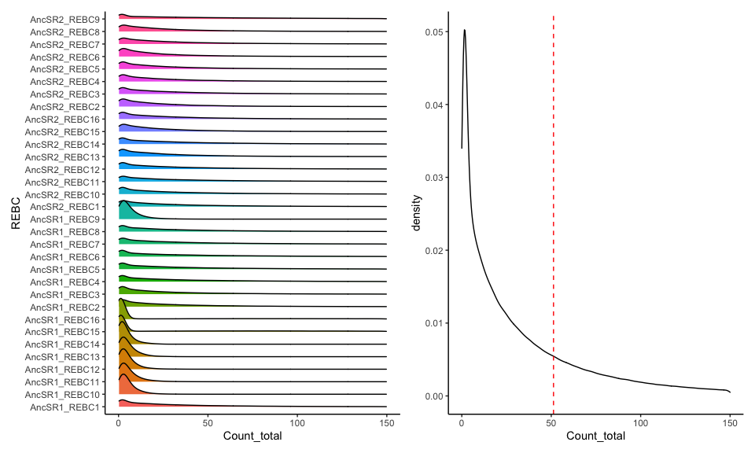
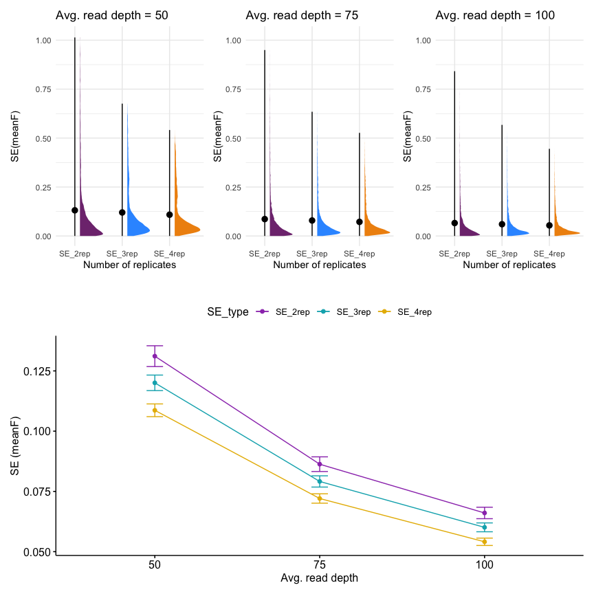
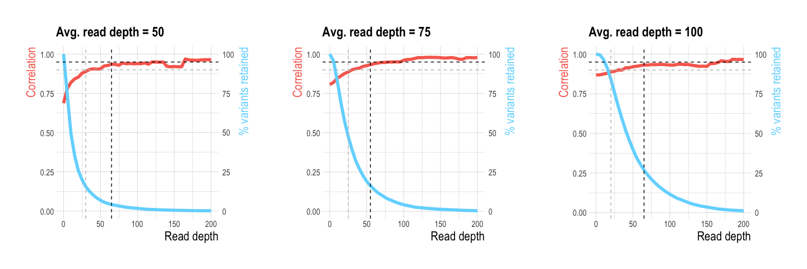
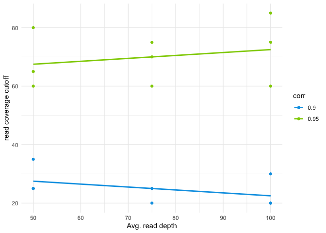
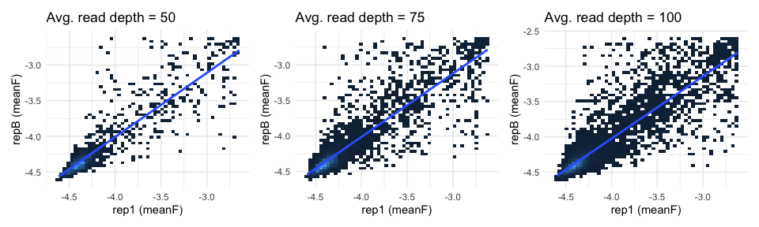

Simulation of Sorted Libraries
================
Santiago Herrera
8/13/2022

Estimating the parameters for simulating datasets
-------------------------------------------------

The idea here is to simulate replicates of binned-sorted data, **by bootstraping reads based on the observed proportions per variant per REBC per bin**, to get an idea of 1) the ideal number of replicates to reduce estimation error, 2) the ideal average read coverage per variant to reduce estimation error, and 3) the ideal read coverage cutoff for a variant to be included in the analysis.

First, let's explore the experimental dataset (`DMS_meanF_rep1.csv`)

``` r
# Import meanF dataset for replicate 1
data <- read.csv("DMS_meanF_rep1.csv",h=T)
```

First, let's take a look at the observed distribution of reads per REBC and overall. The X-axis is truncated to 150 reads to ease visualization.

``` r
p1 <- data %>%
  ggplot(aes(x = Count_total, fill = REBC, y =REBC)) + 
  geom_density_ridges() + guides(fill="none") + theme_classic() + xlim(0,150)

mean_r <- data %>% summarise(m = mean(Count_total)) # mean of the read coverage across libraries
p2 <- data %>%
  ggplot(aes(x = Count_total)) + 
  geom_density() + guides(fill="none") + theme_classic() + xlim(0,150) + 
  geom_vline(data=mean_r,aes(xintercept = m),linetype="dashed",color="red")

p1 + p2
```



The distribution of read coverage is very skewed, with many variants having ~low read coverage, and a few having very high coverage. To correctly simulate the sorting replicates, we need to select a distribution that best fits the data, to use the parameters in downstream simulations.

We will fit three distributions that could fit the data based on the figure in the right above: Weibull, lognormal and exponential.

``` r
# Use maximum likelihood to find the distribution that better fits the the read distribution data
fit.weibull <- fitdist(data$Count_total, "weibull")
fit.lnorm <- fitdist(data$Count_total, "lnorm")
fit.exp <- fitdist(data$Count_total, "exp")
```

``` r
matrix(c(fit.weibull$aic,fit.lnorm$aic,fit.exp$aic),nrow=3,ncol=1,byrow = T,
       dimnames=list(c("weibull","lnorm","exp"),c("AIC"))) # lnorm fits the data better based on AIC --> use this to simulate data
```

    ##              AIC
    ## weibull 18841780
    ## lnorm   18778422
    ## exp     19490497

``` r
summary(fit.lnorm)
```

    ## Fitting of the distribution ' lnorm ' by maximum likelihood 
    ## Parameters : 
    ##         estimate   Std. Error
    ## meanlog 2.858643 0.0011494108
    ## sdlog   1.614847 0.0008127548
    ## Loglikelihood:  -9389209   AIC:  18778422   BIC:  18778447 
    ## Correlation matrix:
    ##               meanlog         sdlog
    ## meanlog  1.000000e+00 -1.305047e-09
    ## sdlog   -1.305047e-09  1.000000e+00

We can use the fitted parameters of each distribution to compare a simulated distribution to the actual one. Note that although log-normal fits better (based on AIC) the weibull distribution also has a good fit.


We will use different parameters of the log-normal distribution to simulated datasets: 1) a distribution with mean read coverage (RC) = 25, 2) a distribution with mean read coverage = 50 (similar to the observed data - see dashed red line in the plot above), and 3) a distribution with mean read coverage = 75. All distributions will have the same standard deviation as the empirical dataset (sd = 110).

Simulating datasets of FACS-seq
-------------------------------

To sample from a log-normal distributions with a defined mean and sd, the main function `simulate_new_data` calls the function `solve_for_log_normal_parameters` which takes as imput the desired mean and variance of the distribution and solves for the meanlog and meansd of the log-normal distribution. The main function can also simulate data under the Weibull distribution.

#### Simulated dataset A

``` r
#GLOBAL VARIABLES
RC <- 50 # Read coverage threshold to include variants
simA <- 50 # avg read depth to simulate
simB <- 75
simC <- 100

# Simulate four replicates sampling from a log-normal distribtion and using the proportions of reads per bin per variant for variants with readCount >= RC.
sim_data_A_rep1 <- simulate_new_data(data,simA,110,RC,"lognormal")
sim_data_A_rep2 <- simulate_new_data(data,simA,110,RC,"lognormal")
sim_data_A_rep3 <- simulate_new_data(data,simA,110,RC,"lognormal")
sim_data_A_rep4 <- simulate_new_data(data,simA,110,RC,"lognormal")

# Compute Standard Error (SE) for each variant across replicates
se_df <- inner_join(sim_data_A_rep1,sim_data_A_rep2,by=c("AA_var","REBC")) %>%
  inner_join(sim_data_A_rep3,by=c("AA_var","REBC")) %>% inner_join(sim_data_A_rep4,by=c("AA_var","REBC")) %>%
  dplyr::select(.,AA_var,REBC,meanF.x,meanF.y,meanF.x.x,meanF.y.y) %>%
  rowwise() %>% 
  mutate(SE_2rep = sd(c_across(meanF.x:meanF.y),na.rm = T)/sqrt(2)) %>% # standard error of 2 replicates
  mutate(SE_3rep = sd(c_across(meanF.x:meanF.x.x),na.rm = T)/sqrt(3)) %>% # standard error of 3 replicates
  mutate(SE_4rep = sd(c_across(meanF.x:meanF.y.y),na.rm = T)/sqrt(4)) # standard error of 4 replicates

#plot SE as a function of number of replicates
simA_se <- plot_SE_reps(se_df,"boxplot", paste("Avg. read depth = ",simA,sep = ""))
```

#### Simulated dataset B

``` r
# Simulate four replicates sampling from a log-normal distribtion and using the proportions of reads per bin per variant for variants with readCount >= RC.
sim_data_B_rep1 <- simulate_new_data(data,simB,110,RC,"lognormal")
sim_data_B_rep2 <- simulate_new_data(data,simB,110,RC,"lognormal")
sim_data_B_rep3 <- simulate_new_data(data,simB,110,RC,"lognormal")
sim_data_B_rep4 <- simulate_new_data(data,simB,110,RC,"lognormal")

# Standard Error of replicates
se_df2 <- inner_join(sim_data_B_rep1,sim_data_B_rep2,by=c("AA_var","REBC")) %>%
  inner_join(sim_data_B_rep3,by=c("AA_var","REBC")) %>% inner_join(sim_data_B_rep4,by=c("AA_var","REBC")) %>%
  dplyr::select(.,AA_var,REBC,meanF.x,meanF.y,meanF.x.x,meanF.y.y) %>%
  rowwise() %>% 
  mutate(SE_2rep = sd(c_across(meanF.x:meanF.y),na.rm = T)/sqrt(2)) %>% # standard error of 2 replicates
  mutate(SE_3rep = sd(c_across(meanF.x:meanF.x.x),na.rm = T)/sqrt(3)) %>% # standard error of 3 replicates
  mutate(SE_4rep = sd(c_across(meanF.x:meanF.y.y),na.rm = T)/sqrt(4)) # standard error of 4 replicates

#plot SE as a function of number of replicates
simB_se <- plot_SE_reps(se_df2,"boxplot", paste("Avg. read depth = ",simB,sep = ""))
```

#### Simulated dataset C

``` r
# Simulate four replicates sampling from a log-normal distribtion and using the proportions of reads per bin per variant for variants with readCount >= RC.
sim_data_C_rep1 <- simulate_new_data(data,simC,110,RC,"lognormal")
sim_data_C_rep2 <- simulate_new_data(data,simC,110,RC,"lognormal")
sim_data_C_rep3 <- simulate_new_data(data,simC,110,RC,"lognormal")
sim_data_C_rep4 <- simulate_new_data(data,simC,110,RC,"lognormal")

# Standard Error of replicates
se_df3 <- inner_join(sim_data_C_rep1,sim_data_C_rep2,by=c("AA_var","REBC")) %>%
  inner_join(sim_data_C_rep3,by=c("AA_var","REBC")) %>% inner_join(sim_data_C_rep4,by=c("AA_var","REBC")) %>%
  dplyr::select(.,AA_var,REBC,meanF.x,meanF.y,meanF.x.x,meanF.y.y) %>%
  rowwise() %>% 
  mutate(SE_2rep = sd(c_across(meanF.x:meanF.y),na.rm = T)/sqrt(2)) %>% # standard error of 2 replicates
  mutate(SE_3rep = sd(c_across(meanF.x:meanF.x.x),na.rm = T)/sqrt(3)) %>% # standard error of 3 replicates
  mutate(SE_4rep = sd(c_across(meanF.x:meanF.y.y),na.rm = T)/sqrt(4)) # standard error of 4 replicates

#plot SE as a function of number of replicates
simC_se <- plot_SE_reps(se_df3,"boxplot", paste("Avg. read depth = ",simC,sep = ""))
```

We can use one of the replicates from each simulation to confirm that the simulated read coverage has a log-normal distribution with the expected mean

``` r
rep1_A <- sim_data_A_rep1 %>% mutate(AvgReadDepth = simA)
rep1_B <- sim_data_B_rep1 %>% mutate(AvgReadDepth = simB)
rep1_C <- sim_data_C_rep1 %>% mutate(AvgReadDepth = simC)

mean_by_rep <- rbind(rep1_A,rep1_B,rep1_C) %>% group_by(AvgReadDepth) %>% summarise(m = mean(newCount_total))
rbind(rep1_A,rep1_B,rep1_C) %>%
  ggplot(aes(x = newCount_total, fill = as.factor(AvgReadDepth))) +
  geom_density(alpha=0.4,size=1) + xlim(c(0,500)) + 
  scale_fill_brewer(type="qual", palette = "Dark2",name="Avg Read Depth") + 
  geom_vline(data=mean_by_rep, aes(xintercept = m,color=as.factor(AvgReadDepth)), linetype="dashed",size=0.7) +
  scale_color_brewer(type="qual", palette = "Dark2",name="Avg Read Depth") +
  xlab("Read depth") +
  theme_minimal() 
```


Now we can see the interaction between average read coverage and number of replicates. As expected, with higher average read coverage, the mean SE across variants (and REBCs) goes down, and with more replicates the range of the SE is reduced. 
We can also see the correlations between replicates. Coefficients are estimated including *ALL* variants, making evident the effect of sampling noise (read depth) on the strength of correlation.

    ##            rho 1_2   rho 1_3   rho 1_4
    ## RC = 50  0.6745484 0.6857003 0.6829748
    ## RC = 75  0.7954491 0.7986650 0.8056921
    ## RC = 100 0.8658699 0.8633429 0.8701361

Finally, we can ask how does the correlation between two replicates changes as a function of read depth. There is a tradeoff because the higher the read depth per variant, the less variants will be retained in the dataset, thus we would like to find a value of read depth for which the correlation is high and that also retains as many variants as possible.

``` r
# Optimal read depth for simA
opt_rc_A12 <- optimal_read_cutoff(sim_data_A_rep1,sim_data_A_rep2,from=0,to=200)
opt_rc_A13 <- optimal_read_cutoff(sim_data_A_rep1,sim_data_A_rep3,from=0,to=200)
opt_rc_A14 <- optimal_read_cutoff(sim_data_A_rep1,sim_data_A_rep4,from=0,to=200)

# Optimal read depth for simB
opt_rc_B12 <- optimal_read_cutoff(sim_data_B_rep1,sim_data_B_rep2,from=0,to=200)
opt_rc_B13 <- optimal_read_cutoff(sim_data_B_rep1,sim_data_B_rep3,from=0,to=200)
opt_rc_B14 <- optimal_read_cutoff(sim_data_B_rep1,sim_data_B_rep4,from=0,to=200)

# Optimal read depth for simC
opt_rc_C12 <- optimal_read_cutoff(sim_data_C_rep1,sim_data_C_rep2,from=0,to=200)
opt_rc_C13 <- optimal_read_cutoff(sim_data_C_rep1,sim_data_C_rep3,from=0,to=200)
opt_rc_C14 <- optimal_read_cutoff(sim_data_C_rep1,sim_data_C_rep4,from=0,to=200)
```


The "optimal" read count cutoff as a function of the average read depth to achieve a correlation of 0.9 or 0.95. Each point is a pairwise correlation amongst replicates per simulation.

``` r
r <- data.frame('sim'=rep(c(simA,simB,simC,simA,simB,simC),each=3),
                'read_cutoff'=c(opt_rc_A12[[2]],opt_rc_A13[[2]],opt_rc_A14[[2]], #optmal rc for 0.9
                                opt_rc_B12[[2]],opt_rc_B13[[2]],opt_rc_B14[[2]],
                                opt_rc_C12[[2]],opt_rc_C13[[2]],opt_rc_C14[[2]],
                                opt_rc_A12[[3]],opt_rc_A13[[3]],opt_rc_A14[[3]], #optmal rc for 0.95
                                opt_rc_B12[[3]],opt_rc_B13[[3]],opt_rc_B14[[3]],
                                opt_rc_C12[[3]],opt_rc_C13[[3]],opt_rc_C14[[3]]),
                'corr'=rep(c("0.9","0.95"),each=9))
ggplot(r,aes(x=sim,y=read_cutoff,color=corr)) + geom_point() +
  geom_smooth(method="lm",se=F) + xlab("Avg. read depth") + ylab("read coverage cutoff") + 
  theme_minimal() + scale_color_manual(values = c("#00a1e5","#8fce00"))
```



We can check how does the correlations look like after filtering the variants given the "optimal" read depth for a correlation coefficient of 0.9 (from the plots above). 
