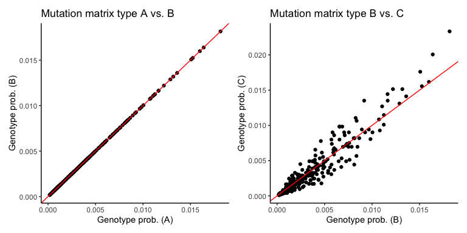
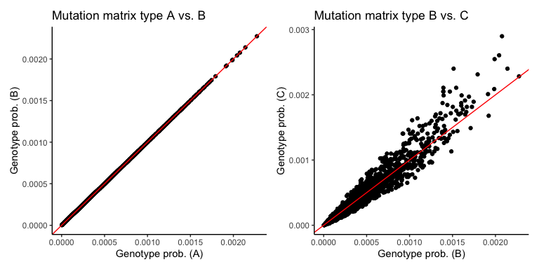
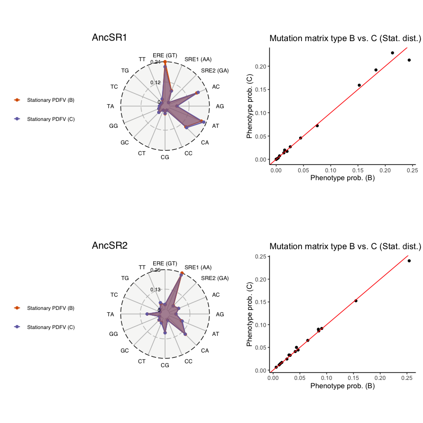
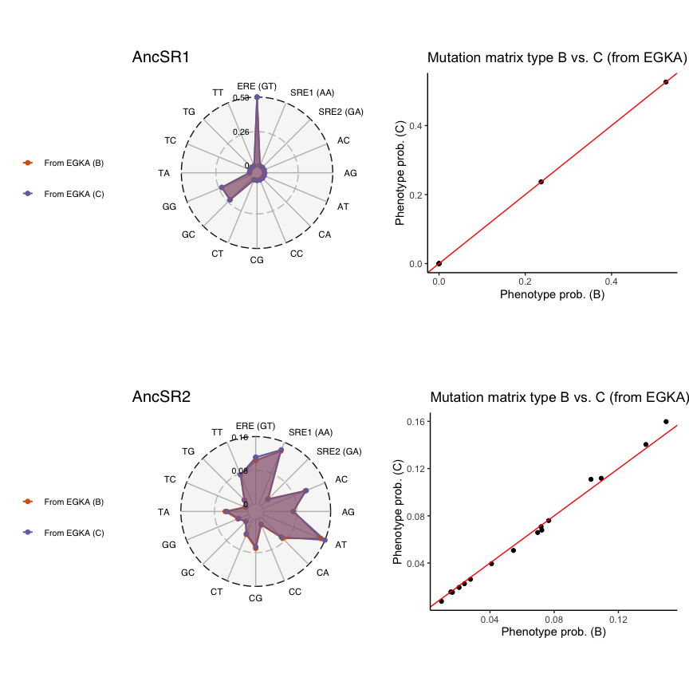
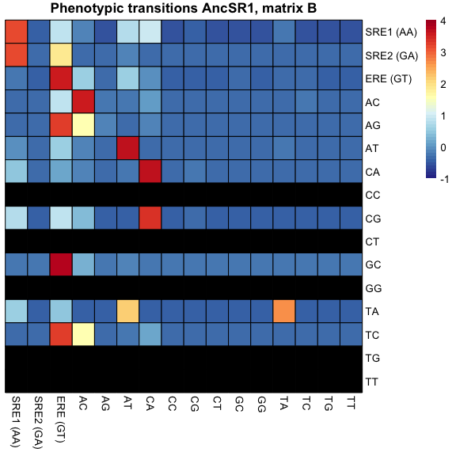
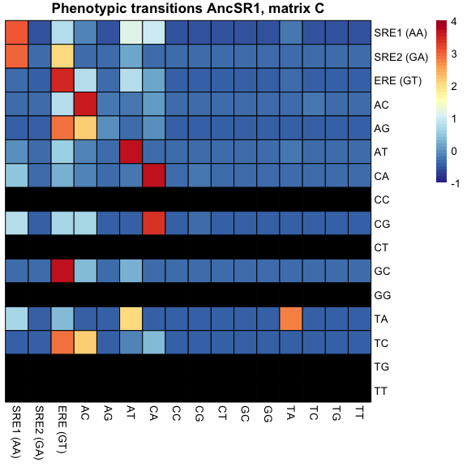
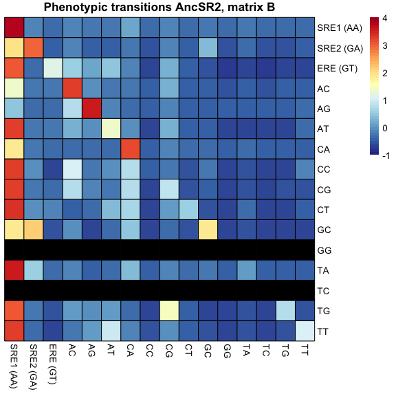

Testing alternative mutation matrices
================
Santiago Herrera
2023-08-23

## Transition probability matrices: Comparing mutation matrices

We are modeling the evolution between DBD variant genotypes as a markov process with transition probabilities of the form

*P*(*i*, *j*)∝*ρ*<sub>*i**j*</sub> × *P*<sub>fix</sub>(*j*)

where *ρ*<sub>*i**j*</sub> represents the mutation rate from genotype *i* to *j*. This rate can be specified in multiple ways but we will compare the transition matrices *P* generated via two specifications:

-   All single-step amino acid mutations to functional genotypes given the genetic code are accessible, with probability equal to the fraction of codons from amino acid *i* that can access amino acid *j* via single nucleotide mutations (mutational propensity: matrix type A/B).
-   All single-step amino acid mutations to functional genotypes given the genetic code are accessible, with probability proportional to the number of nucleotide changes that can encode each amino acid change (codon bias: matrix type C) - accounting for all the possible synonymous backgrounds.

*Note:* *P*<sub>fix</sub>(*j*) are the same across all matrices, because it only depends on the imposed fitness function, which is the same in all cases. Any differences in *P*(*i*, *j*) is therefore due to differences in the mutation rates.

## Reading in data

*Note:* The file `matrix_comparison.RData` was produced by running the R script `matrix_comparison.R` in the Midway3 computing cluster.

``` r
load("./matrix_comparison.RData") # loading the matrices
source("../MC_MutSel_functions.R") # loading functions
```

``` r
## GLOBAL PARAMETERS ##
# Phenotypes of reference wild-type ancestral genotypes:
AncSR1_ERE_ref <- meanF_data %>% filter(AA_var == "EGKA" & REBC == "AncSR1_REBC3") %>% pull(avg_meanF)
AncSR2_SRE_ref <- meanF_data %>% filter(AA_var == "GSKV" & REBC == "AncSR2_REBC1") %>% pull(avg_meanF)
PATH_LENGTH = 3 # path length (neighborhood size) to find mutational trajectoties
N_CORES=detectCores()-1 # number of cores for parallel processing
REF_GENOTYPE = "EGKA" # reference genotype
```

## Discrete Markov chains: Mutational propensity vs. Codon bias

Mutational propensities are a convenient way of modeling the mutation process at the amino acid level. However, in reality, we know that the mutation process occurs at the nucleotide level (between codons). Thus, the key question is whether the mutational propensity accurately captures the nature of the mutation process. We have generated *P* matrices under each specification of the mutation rate for a scenario of purifying selection+drift.

### Matrix correlations

As a first analysis, we will determine how correlated is the structure of the transition matrices. We will use the inner product correlation between two matrices to determine how colinear are their structures; and their similarity (SSE).

``` r
# Generated P matrices for drift scenario under three approaches:
# A - Mutation as fraction of codons. Using original functions (see 'MutSel_matricesA.R' script. This is a "positive" control)
# B - Mutation as fraction of codons. Using new functions (see 'matrix_comparison.R'. Should be exactly the same as A)
# C - Mutation as number of mut. paths. Using new functions (compare how similar is it to A/B)

inner_product_matrix_cor <- function(matA,matB){
  # Calculate the inner product using the trace of the product of A and the transpose of B (tr(A.B^T))
  inner_product <- sum(diag(matA %*% t(matB)))

  # Calculate the norms of the matrices
  normA <- sqrt(sum(matA^2))
  normB <- sqrt(sum(matB^2))

  # Calculate the correlation using the inner product and matrix norms
  cor <- inner_product / (normA * normB)
  return(cor)
}

SSE_for_matrices <- function(matA, matB){
  #element-wise SE --> SSE
  SSE <- sum((matA - matB)^2)
  return(SSE)
}

# Correlations
print(paste("Correlation between matrix A and B for AncSR1 bg:",inner_product_matrix_cor(M_drift_sr1_A,M_drift_sr1_B)))
```

    ## [1] "Correlation between matrix A and B for AncSR1 bg: 1"

``` r
print(paste("Correlation between matrix B and C for AncSR1 bg:",inner_product_matrix_cor(M_drift_sr1_B,M_drift_sr1_C)))
```

    ## [1] "Correlation between matrix B and C for AncSR1 bg: 0.981637550441515"

``` r
print(paste("Correlation between matrix A and B for AncSR2 bg:",inner_product_matrix_cor(M_drift_sr2_A,M_drift_sr2_B)))
```

    ## [1] "Correlation between matrix A and B for AncSR2 bg: 1"

``` r
print(paste("Correlation between matrix B and C for AncSR2 bg:",inner_product_matrix_cor(M_drift_sr2_B,M_drift_sr2_C)))
```

    ## [1] "Correlation between matrix B and C for AncSR2 bg: 0.97425783999587"

``` r
# Difference (SSE)
print(paste("SSE between matrix A and B for AncSR1 bg:",SSE_for_matrices(M_drift_sr1_A,M_drift_sr1_B)))
```

    ## [1] "SSE between matrix A and B for AncSR1 bg: 0"

``` r
print(paste("SSE between matrix B and C for AncSR1 bg:",SSE_for_matrices(M_drift_sr1_B,M_drift_sr1_C)))
```

    ## [1] "SSE between matrix B and C for AncSR1 bg: 3.6660708007818"

``` r
print(paste("SSE between matrix A and B for AncSR2 bg:",SSE_for_matrices(M_drift_sr2_A,M_drift_sr2_B)))
```

    ## [1] "SSE between matrix A and B for AncSR2 bg: 0"

``` r
print(paste("SSE between matrix B and C for AncSR2 bg:",SSE_for_matrices(M_drift_sr2_B,M_drift_sr2_C)))
```

    ## [1] "SSE between matrix B and C for AncSR2 bg: 24.1668594329626"

As expected, matrices A and B are exactly the same (cor = 1; SSE = 0). Matrices B and C are highly colinear (cor &gt;= 0.97), but not exactly the same (3 &lt; SSE &lt; 25), suggesting that mutational propensities and codon bias capture the same general trend about the mutation process, but each contains distinct information. Let's see whether these differences affect the evolutionary inferences on the GP maps.

### Stationary distribution of genotypes

To further compare the type A/B and type C matrices we can take advantage of the stationary distribution of discrete markov chains. The transition matrices of Markov chains describe the probabilities of change between every state of the system at each step - the probability distribution of the states evolves over time (*X*<sub>*t*</sub>). The stationary distribution of a Markov chain describes the distribution of states after suficiently long time has passed (*t* → ∞) such that *X*<sub>*t*</sub> does noth change any longer (i.e., the system has reached an equilibrium). Based on this, if mutational propensities and codon bias are capturing essentially the same information, they should have the same stationary distribution of amino acid variants.

``` r
## Stationary distributions
# AncSR1
typeA_sr1 <- extract_main_ntwrk(net_sr1,M_drift_sr1_A) # create square matrix. Main component of genotype network
typeA_sr1_statdist <- stationary_dist(typeA_sr1) # compute stationary distribution of genotypes in the main network component

typeB_sr1 <- extract_main_ntwrk(net_sr1,M_drift_sr1_B)
typeB_sr1_statdist <- stationary_dist(typeB_sr1)

typeC_sr1 <- extract_main_ntwrk(net_sr1,M_drift_sr1_C)
typeC_sr1_statdist <- stationary_dist(typeC_sr1)

# AncSR2
typeA_sr2 <- extract_main_ntwrk(net_sr2,M_drift_sr2_A)
typeA_sr2_statdist <- stationary_dist(typeA_sr2)

typeB_sr2 <- extract_main_ntwrk(net_sr2,M_drift_sr2_B)
typeB_sr2_statdist <- stationary_dist(typeB_sr2)

typeC_sr2 <- extract_main_ntwrk(net_sr2,M_drift_sr2_C)
typeC_sr2_statdist <- stationary_dist(typeC_sr2)


# CORRELATIONS and SSE BETWEEN STATIONARY DISTS. OF GENOTYPES 
# AncSR1
print(paste("Correlation between stat. dists. between A and B for AncSR1 bg:",cor(typeA_sr1_statdist,typeB_sr1_statdist)))
```

    ## [1] "Correlation between stat. dists. between A and B for AncSR1 bg: 1"

``` r
print(paste("Correlation between stat. dists. between B and C for AncSR1 bg:",cor(typeB_sr1_statdist,typeC_sr1_statdist)))
```

    ## [1] "Correlation between stat. dists. between B and C for AncSR1 bg: 0.954834378006883"

``` r
print(paste("SSE between stat. dists. between A and B for AncSR1 bg:",sum((typeA_sr1_statdist-typeB_sr1_statdist)^2)))
```

    ## [1] "SSE between stat. dists. between A and B for AncSR1 bg: 0"

``` r
print(paste("SSE between stat. dists. between B and C for AncSR1 bg:",sum((typeB_sr1_statdist-typeC_sr1_statdist)^2)))
```

    ## [1] "SSE between stat. dists. between B and C for AncSR1 bg: 0.000372285380505169"

``` r
ab_statdist <- data.frame(X=typeA_sr1_statdist,Y=typeB_sr1_statdist) %>% ggplot(aes(x=X,y=Y)) + geom_point(fill="black") + 
  geom_abline(slope = 1,intercept = 0,col="red") + theme_classic() + xlab("Genotype prob. (A)") + ylab("Genotype prob. (B)") + 
  ggtitle("Mutation matrix type A vs. B")
bc_statdist <- data.frame(X=typeB_sr1_statdist,Y=typeC_sr1_statdist) %>% ggplot(aes(x=X,y=Y)) + geom_point(fill="black") + 
  geom_abline(slope = 1,intercept = 0,col="red") + theme_classic() + xlab("Genotype prob. (B)") + ylab("Genotype prob. (C)") + 
  ggtitle("Mutation matrix type B vs. C")

ab_statdist + bc_statdist
```



``` r
# AncSR2
print(paste("Correlation between stat. dists. between A and B for AncSR2 bg:",cor(typeA_sr2_statdist,typeB_sr2_statdist)))
```

    ## [1] "Correlation between stat. dists. between A and B for AncSR2 bg: 1"

``` r
print(paste("Correlation between stat. dists. between B and C for AncSR2 bg:",cor(typeB_sr2_statdist,typeC_sr2_statdist)))
```

    ## [1] "Correlation between stat. dists. between B and C for AncSR2 bg: 0.968897247355983"

``` r
print(paste("SSE between stat. dists. between A and B for AncSR2 bg:",sum((typeA_sr2_statdist-typeB_sr2_statdist)^2)))
```

    ## [1] "SSE between stat. dists. between A and B for AncSR2 bg: 0"

``` r
print(paste("SSE between stat. dists. between B and C for AncSR2 bg:",sum((typeB_sr2_statdist-typeC_sr2_statdist)^2)))
```

    ## [1] "SSE between stat. dists. between B and C for AncSR2 bg: 2.48078155759098e-05"

``` r
ab_statdist <- data.frame(X=typeA_sr2_statdist,Y=typeB_sr2_statdist) %>% ggplot(aes(x=X,y=Y)) + geom_point(fill="black") + 
  geom_abline(slope = 1,intercept = 0,col="red") + theme_classic() + xlab("Genotype prob. (A)") + ylab("Genotype prob. (B)") + 
  ggtitle("Mutation matrix type A vs. B")
bc_statdist <- data.frame(X=typeB_sr2_statdist,Y=typeC_sr2_statdist) %>% ggplot(aes(x=X,y=Y)) + geom_point(fill="black") + 
  geom_abline(slope = 1,intercept = 0,col="red") + theme_classic() + xlab("Genotype prob. (B)") + ylab("Genotype prob. (C)") + 
  ggtitle("Mutation matrix type B vs. C")

ab_statdist + bc_statdist
```



The stationary distributions of genotype variants for the main network components in each background is highly correlated and highly simialr between the two mutation rate specifications (cor &gt;= 0.95; SSE =&lt; 10^-3). However, they are not exactly the same, so next we will evaluate how do these differences affect the inferred *phenotypic* evolutionary outcomes.

## Evolution of phenotypes

Here we will compare the probability of evolving each phenotypic outcome under each transition matrix. First, we can compute the probability distribution of functional variation (PDFV) at equilibrium, that is, the PDFV inferred from the stationary distribution of genotypes.

``` r
cols <- RColorBrewer::brewer.pal(8, name="Dark2")
############################
# STATIONARY PDFV
# AncSR1
typeB_sr1_pdfv <- get_PDFV_v2(typeB_sr1_statdist,Bg = "AncSR1",model = "Stationary PDFV (B)",type="simulated mc")
typeC_sr1_pdfv <- get_PDFV_v2(typeC_sr1_statdist,Bg = "AncSR1",model = "Stationary PDFV (C)",type="simulated mc")

print(paste("Correlation of the prob. of phenotypic outcomes at equilibrium for AncSR1 bg:",
            inner_join(typeB_sr1_pdfv,typeC_sr1_pdfv,by="RE") %>% with(cor(Norm_F_prob.x,Norm_F_prob.y)))) # correlation
```

    ## [1] "Correlation of the prob. of phenotypic outcomes at equilibrium for AncSR1 bg: 0.99375901070937"

``` r
print(paste("SSE of the prob. of phenotypic outcomes at equilibrium for AncSR1 bg:",
            inner_join(typeB_sr1_pdfv,typeC_sr1_pdfv,by="RE") %>% with(sum((Norm_F_prob.x-Norm_F_prob.y)^2)))) # SSE
```

    ## [1] "SSE of the prob. of phenotypic outcomes at equilibrium for AncSR1 bg: 0.00134960046067692"

``` r
a <- inner_join(typeB_sr1_pdfv,typeC_sr1_pdfv,by="RE") %>% ggplot(aes(x=Norm_F_prob.x,y=Norm_F_prob.y)) + geom_point(fill="black") +
  geom_abline(slope = 1,intercept = 0,col="red") + theme_classic() + xlab("Phenotype prob. (B)") + ylab("Phenotype prob. (C)") + 
  ggtitle("Mutation matrix type B vs. C (Stat. dist.)")
b <- circular_PDFV_v2(list(typeB_sr1_pdfv,typeC_sr1_pdfv),cols = cols[2:3],title = "AncSR1")

# AncSR2
typeB_sr2_pdfv <- get_PDFV_v2(typeB_sr2_statdist,Bg = "AncSR2",model = "Stationary PDFV (B)",type="simulated mc")
typeC_sr2_pdfv <- get_PDFV_v2(typeC_sr2_statdist,Bg = "AncSR2",model = "Stationary PDFV (C)",type="simulated mc")

print(paste("Correlation of the prob. of phenotypic outcomes at equilibrium for AncSR2 bg:",
            inner_join(typeB_sr2_pdfv,typeC_sr2_pdfv,by="RE") %>% with(cor(Norm_F_prob.x,Norm_F_prob.y)))) # correlation
```

    ## [1] "Correlation of the prob. of phenotypic outcomes at equilibrium for AncSR2 bg: 0.998688672405487"

``` r
print(paste("SSE of the prob. of phenotypic outcomes at equilibrium for AncSR2 bg:",
            inner_join(typeB_sr2_pdfv,typeC_sr2_pdfv,by="RE") %>% with(sum((Norm_F_prob.x-Norm_F_prob.y)^2)))) # SSE
```

    ## [1] "SSE of the prob. of phenotypic outcomes at equilibrium for AncSR2 bg: 0.000286299136059083"

``` r
c <- inner_join(typeB_sr2_pdfv,typeC_sr2_pdfv,by="RE") %>% ggplot(aes(x=Norm_F_prob.x,y=Norm_F_prob.y)) + geom_point(fill="black") +
  geom_abline(slope = 1,intercept = 0,col="red") + theme_classic() + xlab("Phenotype prob. (B)") + ylab("Phenotype prob. (C)") + 
  ggtitle("Mutation matrix type B vs. C (Stat. dist.)")
d <- circular_PDFV_v2(list(typeB_sr2_pdfv,typeC_sr2_pdfv),cols = cols[2:3],title = "AncSR2")

(b + a) / (d + c)
```



We can see that the probabilities of evolving each phenotypic at equilibrium are highly correlated and almost identical.

Now, let's compare the probabilities of evolving each phenotypic outcome from EGKA after 3 mutation steps.

``` r
############################
# PDFV FROM MARKOV CHAINS
# run a discrete Markov chain from REF_GENOTYPE of length 'PATH_LENGTH'
mc_Drift_ref_genotype_sr1_typeB <- simulate_markov_chain(REF_GENOTYPE,typeB_sr1,n_steps = PATH_LENGTH)
mc_Drift_ref_genotype_sr1_typeC <- simulate_markov_chain(REF_GENOTYPE,typeC_sr1,n_steps = PATH_LENGTH)

mc_Drift_ref_genotype_sr2_typeB <- simulate_markov_chain(REF_GENOTYPE,typeB_sr2,n_steps = PATH_LENGTH)
mc_Drift_ref_genotype_sr2_typeC <- simulate_markov_chain(REF_GENOTYPE,typeC_sr2,n_steps = PATH_LENGTH)

# Compute the PDFV from the Markov chains
# AncSR1
pdfv_Drift_ref_genotype_sr1_typeB <- get_PDFV_v2(mc_Drift_ref_genotype_sr1_typeB,Bg = "AncSR1",
                                                 model = "From EGKA (B)",specific = F,type="simulated mc")
pdfv_Drift_ref_genotype_sr1_typeC <- get_PDFV_v2(mc_Drift_ref_genotype_sr1_typeC,Bg = "AncSR1",
                                                  model = "From EGKA (C)",specific = F,type="simulated mc")
print(paste("Correlation of the prob. of phenotypic outcomes from EGKA for AncSR1 bg:",
            inner_join(pdfv_Drift_ref_genotype_sr1_typeB,pdfv_Drift_ref_genotype_sr1_typeC,by="RE") %>% with(cor(Norm_F_prob.x,Norm_F_prob.y)))) # correlation
```

    ## [1] "Correlation of the prob. of phenotypic outcomes from EGKA for AncSR1 bg: 1"

``` r
print(paste("SSE of the prob. of phenotypic outcomes from EGKA for AncSR1 bg:",
            inner_join(pdfv_Drift_ref_genotype_sr1_typeB,pdfv_Drift_ref_genotype_sr1_typeC,by="RE") %>% with(sum((Norm_F_prob.x-Norm_F_prob.y)^2)))) #SSE
```

    ## [1] "SSE of the prob. of phenotypic outcomes from EGKA for AncSR1 bg: 1.54074395550979e-33"

``` r
e <- inner_join(pdfv_Drift_ref_genotype_sr1_typeB,pdfv_Drift_ref_genotype_sr1_typeC,by="RE") %>% 
  ggplot(aes(x=Norm_F_prob.x,y=Norm_F_prob.y)) + geom_point(fill="black") + geom_abline(slope = 1,intercept = 0,col="red") + 
  theme_classic() + xlab("Phenotype prob. (B)") + ylab("Phenotype prob. (C)") + 
  ggtitle("Mutation matrix type B vs. C (from EGKA)")
f <- circular_PDFV_v2(list(pdfv_Drift_ref_genotype_sr1_typeB,pdfv_Drift_ref_genotype_sr1_typeC),cols = cols[2:3],title = "AncSR1")

# AncSR2
pdfv_Drift_ref_genotype_sr2_typeB <- get_PDFV_v2(mc_Drift_ref_genotype_sr2_typeB,Bg = "AncSR2",
                                                 model = "From EGKA (B)",specific = F,type="simulated mc")
pdfv_Drift_ref_genotype_sr2_typeC <- get_PDFV_v2(mc_Drift_ref_genotype_sr2_typeC,Bg = "AncSR2",
                                                  model = "From EGKA (C)",specific = F,type="simulated mc")
print(paste("Correlation of the prob. of phenotypic outcomes from EGKA for AncSR2 bg:",
            inner_join(pdfv_Drift_ref_genotype_sr2_typeB,pdfv_Drift_ref_genotype_sr2_typeC,by="RE") %>% with(cor(Norm_F_prob.x,Norm_F_prob.y)))) # correlation
```

    ## [1] "Correlation of the prob. of phenotypic outcomes from EGKA for AncSR2 bg: 0.998099982439449"

``` r
print(paste("SSE of the prob. of phenotypic outcomes from EGKA for AncSR2 bg:",
            inner_join(pdfv_Drift_ref_genotype_sr2_typeB,pdfv_Drift_ref_genotype_sr2_typeC,by="RE") %>% with(sum((Norm_F_prob.x-Norm_F_prob.y)^2)))) #SSE
```

    ## [1] "SSE of the prob. of phenotypic outcomes from EGKA for AncSR2 bg: 0.000248715939056408"

``` r
g <- inner_join(pdfv_Drift_ref_genotype_sr2_typeB,pdfv_Drift_ref_genotype_sr2_typeC,by="RE") %>% 
  ggplot(aes(x=Norm_F_prob.x,y=Norm_F_prob.y)) + geom_point(fill="black") + geom_abline(slope = 1,intercept = 0,col="red") + 
  theme_classic() + xlab("Phenotype prob. (B)") + ylab("Phenotype prob. (C)") + 
  ggtitle("Mutation matrix type B vs. C (from EGKA)")
h <- circular_PDFV_v2(list(pdfv_Drift_ref_genotype_sr2_typeB,pdfv_Drift_ref_genotype_sr2_typeC),cols = cols[2:3],title = "AncSR2")

(f + e) / (h + g)
```



We can see that the probabilities of evolving each phenotypic after 3 amino acid mutation steps from EGKA are highly correlated and almost identical.

Finally, let's see how similar are the phenotypic transition probabilities - the probability of evolving a given RE specificity given that evolution begins from certain RE specific phenotype.

``` r
############################
# PROBABILITY OF PHENOTYPIC TRANSITIONS
# from = rows; to = cols
pheno_transition_sr1_spec_B <- phenotypic_transitions(from=REs[[1]],to=REs[[1]],tr_mat=typeB_sr1,bg = "AncSR1",n_steps = PATH_LENGTH,specific = T)
pheno_transition_sr1_spec_C <- phenotypic_transitions(from=REs[[1]],to=REs[[1]],tr_mat=typeC_sr1,bg = "AncSR1",n_steps = PATH_LENGTH,specific = T)

pheno_transition_sr2_spec_B <- phenotypic_transitions(from=REs[[1]],to=REs[[1]],tr_mat=typeB_sr2,bg = "AncSR2",n_steps = PATH_LENGTH,specific = T)
pheno_transition_sr2_spec_C <- phenotypic_transitions(from=REs[[1]],to=REs[[1]],tr_mat=typeC_sr2,bg = "AncSR2",n_steps = PATH_LENGTH,specific = T)

# scaled probabilities
pheno_transition_sr1_spec_scaled_B <- t(apply(pheno_transition_sr1_spec_B,1,scale)); colnames(pheno_transition_sr1_spec_scaled_B) <- REs[[1]]
pheno_transition_sr1_spec_scaled_C <- t(apply(pheno_transition_sr1_spec_C,1,scale)); colnames(pheno_transition_sr1_spec_scaled_C) <- REs[[1]]

pheno_transition_sr2_spec_scaled_B <- t(apply(pheno_transition_sr2_spec_B,1,scale)); colnames(pheno_transition_sr2_spec_scaled_B) <- REs[[1]]
pheno_transition_sr2_spec_scaled_C <- t(apply(pheno_transition_sr2_spec_C,1,scale)); colnames(pheno_transition_sr2_spec_scaled_C) <- REs[[1]]

# matrix correlations
print(paste("Correlation for phenotypic transitions between B and C for AncSR1 bg:",
            inner_product_matrix_cor(na.omit(pheno_transition_sr1_spec_scaled_B),na.omit(pheno_transition_sr1_spec_scaled_C))))
```

    ## [1] "Correlation for phenotypic transitions between B and C for AncSR1 bg: 0.994062719998468"

``` r
print(paste("Correlation for phenotypic transitions between B and C for AncSR2 bg:",
            inner_product_matrix_cor(na.omit(pheno_transition_sr2_spec_scaled_B),na.omit(pheno_transition_sr2_spec_scaled_C))))
```

    ## [1] "Correlation for phenotypic transitions between B and C for AncSR2 bg: 0.998735401174108"

``` r
print(paste("SSE for phenotypic transitions between B and C for AncSR1 bg:",
            SSE_for_matrices(na.omit(pheno_transition_sr1_spec_scaled_B),na.omit(pheno_transition_sr1_spec_scaled_C))))
```

    ## [1] "SSE for phenotypic transitions between B and C for AncSR1 bg: 1.95930240050555"

``` r
print(paste("SSE for phenotypic transitions between B and C for AncSR2 bg:",
            SSE_for_matrices(na.omit(pheno_transition_sr2_spec_scaled_B),na.omit(pheno_transition_sr2_spec_scaled_C))))
```

    ## [1] "SSE for phenotypic transitions between B and C for AncSR2 bg: 0.531131506874762"

``` r
# Heatmaps
breaksList <- seq(-1,4,0.1)
# AncSR1
pheatmap(pheno_transition_sr1_spec_scaled_B,cluster_rows = F,cluster_cols = F,na_col = "black",
         border_color = "black",
         color = colorRampPalette(rev(RColorBrewer::brewer.pal(n = 11, name = "RdYlBu")))(length(breaksList)), 
         breaks = breaksList, legend_labels = seq(-1,4,0.2),main = "Phenotypic transitions AncSR1, matrix B")
```



``` r
pheatmap(pheno_transition_sr1_spec_scaled_C,cluster_rows = F,cluster_cols = F,na_col = "black",
         border_color = "black",
         color = colorRampPalette(rev(RColorBrewer::brewer.pal(n = 11, name = "RdYlBu")))(length(breaksList)), 
         breaks = breaksList, legend_labels = seq(-1,4,0.2),main = "Phenotypic transitions AncSR1, matrix C")
```



``` r
# AncSR2
pheatmap(pheno_transition_sr2_spec_scaled_B,cluster_rows = F,cluster_cols = F,na_col = "black",
         border_color = "black",
         color = colorRampPalette(rev(RColorBrewer::brewer.pal(n = 11, name = "RdYlBu")))(length(breaksList)), 
         breaks = breaksList, legend_labels = seq(-1,4,0.2),main = "Phenotypic transitions AncSR2, matrix B")
```



``` r
pheatmap(pheno_transition_sr2_spec_scaled_C,cluster_rows = F,cluster_cols = F,na_col = "black",
         border_color = "black",
         color = colorRampPalette(rev(RColorBrewer::brewer.pal(n = 11, name = "RdYlBu")))(length(breaksList)), 
         breaks = breaksList, legend_labels = seq(-1,4,0.2),main = "Phenotypic transitions AncSR2, matrix C")
```


Overall, these results show that the evolutionary processes modeled on the empirical GP maps using either type of specification of the mutaton rates (i.e., mutational propensity or codon bias) result in the same outcomes.
